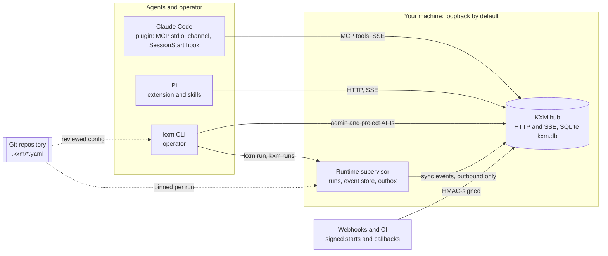

# KXM

[](https://github.com/kontextmind/kxm/actions/workflows/ci.yml)
[](https://www.npmjs.com/package/@kontextmind/kxm)
[](https://nodejs.org/)
[](LICENSE)

**KXM gives coding agents (Claude Code, Pi and other harnesses) a durable, authenticated message and workflow plane, so they can delegate bounded work to each other and prove who answered, without sharing one giant context.**

KXM runs on your machine: one `kxm` CLI, a local [hub](docs/glossary.md#hub) for messages and webhook workflows, and a local [Runtime](docs/glossary.md#runtime) for workflow runs. Your project is reviewable YAML in Git, every agent keeps its own context and its own safety controls, and the docs say plainly what KXM does not guarantee ([Status and limits](#status-and-limits)).

## What makes KXM different

- **Durable messages, not chat.** Every request is a SQLite record that moves from `queued` to `delivered` to `replied`, survives hub and agent restarts, and deduplicates retries by idempotency key. Agents authenticate with a project token and see only their own project's peers. [Message peer agents](docs/guides/peer-messaging.md)
- **Provenance you can check.** A quorum gate counts only replies the hub itself routed, from distinct eligible peers, for the exact run, stage and attempt. Text a coordinator writes never counts. It proves who answered, not that the answer is right. [Peer provenance and quorum gates](docs/guides/provenance-gates.md)
- **Workflows that release the turn.** Signed Jira, GitHub or generic webhooks start durable runs. A coordinator can park a stage, give up its turn, and resume only when a signed CI, review or merge callback arrives. [Run webhook workflows](docs/guides/webhook-workflows.md)
- **Local-first and reviewable.** The project lives in `.kxm/*.yaml`. `kxm trust diff` lists every permission expansion, and `kxm trust check` fails on any expansion beyond the base revision. `kxm run` executes workflows in an event-sourced Runtime that works with the hub down and ends each drive with a receipt it verifies. [Architecture](docs/concepts/architecture.md)
- **Native harnesses, fail-closed auth, honest cost.** Before a live run dispatches, KXM checks that the harness hosts the model, refuses a vendor's model routed through Pi when that vendor ships its own harness, and runs only admitted routes. A logged-out harness stops the run instead of billing another provider, and cost is recorded as metered, unmetered or unknown. [Harness routing](docs/reference/harness-routing.md)
- **Context that ranks, learning that only proposes.** Context packets are ranked deterministically for the role and task and filled to a token budget, and they carry the selected evidence itself. Journals and run records feed `kxm improve`, whose candidates stay proposals: readiness never authorizes, and nothing changes until a person merges a reviewed Git change. [Context and memory](docs/guides/context-and-memory.md) · [Continuous improvement](docs/guides/continuous-improvement.md)
- **One plane for every harness.** A Claude Code plugin (MCP tools, pushed channel, a read-only SessionStart brief), a Pi extension with the same tools, portable Agent Skills, and the `kxm` CLI all work against the same hub. [Claude Code plugin](plugins/kxm/README.md) · [Agent skills](docs/guides/agent-skills.md)

## How it fits together

Claude Code, Pi and the operator CLI talk to one hub on your machine, while the Runtime executes workflow runs locally and syncs their summaries to the hub.



- The **hub** authenticates agents, stores messages and webhook workflow runs, and pushes events. It routes work but never runs a model or merges agent contexts, and it refuses to listen beyond loopback without a token.
- The **Runtime supervisor** owns the runs `kxm run` creates, as an append-only event log per project. It listens only on `127.0.0.1` and pushes sync-safe events to the hub whenever it can reach one. [Architecture](docs/concepts/architecture.md) explains each component and lifecycle.

## Feature tour

| Capability | Learn more |
|---|---|
| **Peer messaging**: discover peers, send, await, fan out to one to three peers, cancel and reply | [Message peer agents](docs/guides/peer-messaging.md) |
| **Claude Code plugin**: 19 MCP tools, pushed channel or pull mode, and a SessionStart brief | [Claude Code plugin](plugins/kxm/README.md) |
| **Supervised Pi workers**: restarts, model fallbacks, tool allowlists and one Pi session per workflow run | [Run supervised Pi workers](docs/guides/pi-workers.md) |
| **Webhook workflows**: signed starts, ordered stages, checkpoints, durable waits and signed callbacks | [Run webhook workflows](docs/guides/webhook-workflows.md) |
| **Provenance and quorum gates**: hub-verified peer evidence, with an admin-only degradation path | [Peer provenance and quorum gates](docs/guides/provenance-gates.md) |
| **Local Runtime runs**: `kxm.workflow.v1` steps and gates, `kxm run`, simulated or live drives, verified receipts, cancel and recovery | [Run your first workflow](docs/start/first-workflow.md) · [Workflow definition reference](docs/reference/workflow-definitions.md) |
| **Trust review**: permission diffs for changes to the project definition in `.kxm/` | [Reviewed Git configuration](docs/concepts/architecture.md#configuration-is-reviewed-git-yaml) · [`kxm trust`](docs/reference/cli-reference.md#kxm-trust) |
| **Harness routing and admission**: `kxm harness`, `kxm models` and `kxm routes` | [Harness routing](docs/reference/harness-routing.md) |
| **Context and memory**: role-aware packets, recall, temporal state, episodes, a compiled wiki, and Git memory projected into `AGENTS.md`, `CLAUDE.md` and `GEMINI.md` | [Context and memory](docs/guides/context-and-memory.md) |
| **Continuous improvement**: journals, retrospectives, improvement reports and coded-repeat candidates | [Continuous improvement](docs/guides/continuous-improvement.md) |
| **Governed skills**: candidates, recorded evaluations, promotion or rejection, hash pinning | [Governed skills](docs/guides/governed-skills.md) |
| **Agent Skills**: a portable `SKILL.md` suite that covers every `kxm` command | [Agent skills](docs/guides/agent-skills.md) |
| **Live dashboard**: `kxm dash` screens for agents, tasks, workflows, plans, inbox, processes and spend | [Monitor KXM](docs/operations/monitoring.md) |
| **Backup and restore**: the six state roots, `kxm backup` and `kxm restore`, and what each one covers | [Back up and restore KXM](docs/operations/backup-and-restore.md) |
| **Runtime sync and leases**: the outbox, refused-event recovery and fenced leases | [Runtime sync](docs/operations/runtime-sync.md) |
| **Hosted deployment**: supervision, and a pattern for one hub and Runtime per tenant behind an authenticating proxy | [Deploy KXM](docs/operations/deploy.md) |
| **Browser automation**: Steel sessions, Playwright and human takeover skills | [Browser automation](docs/guides/browser-automation.md) |
| **Everything else**: tasks, goals, suggestions, SSH workers, Studio layouts and shell completion | [KXM CLI reference](docs/reference/cli-reference.md) |

## Quick start: Claude Code

<a id="set-up-a-new-project-with-claude-code"></a>

You need Node.js 22.19 or newer on the 22.x line, or Node.js 24 or newer, plus Git and Claude Code. These steps connect a Claude Code session in one of your repositories to a hub on the same machine.

1. Install the CLI and initialize KXM in your repository. `kxm init` writes no ignore rules, so add them, then review and commit `.kxm/`:

   ```bash
   npm install --global --omit=peer @kontextmind/kxm
   cd <your-repo>
   kxm init
   printf '%s\n' '.kxm/state/' '.kxm/logs/' '.kxm/backups/' >> .gitignore
   ```

2. In a second terminal, in the same repository, start the hub with a token for this project. Pick any `<hub-project>` key, for example the repository name:

   ```bash
   PROJECT_TOKEN="$(openssl rand -hex 32)"  # keep a copy in your password manager
   export KXM_PROJECT_TOKENS="{\"<hub-project>\":\"$PROJECT_TOKEN\"}"
   kxm hub start  # runs in the foreground; keep this terminal open
   ```

   > [!IMPORTANT]
   > `KXM_PROJECT_TOKENS` replaces the hub's saved token map. If this hub already serves other projects, list every one of them. The [Claude Code quick start](docs/start/quickstart-claude-code.md) has a command that merges the map for you.

3. Back in the first terminal, bind this machine to the hub and check it:

   ```bash
   kxm hub bind http://127.0.0.1:7331
   kxm hub view
   ```

   Expected output:

   ```text
   bound hub http://127.0.0.1:7331 · loopback · health=on
   hub health=true ready=true · loopback hub
   ```

4. Install the plugin. In Claude Code:

   ```text
   /plugin marketplace add kontextmind/kxm
   /plugin install kxm@kxm
   /reload-plugins
   ```

   When Claude Code asks for the plugin options, set `project` to `<hub-project>` and leave `auth_token` blank. On the machine that runs the hub, a blank token uses the project token the hub saved for `<hub-project>`, and only that one. On another machine, enter the project token at `/plugin configure kxm@kxm`. Never enter the hub admin token.

5. Ask Claude to call `kxm_list`. It lists this session as an agent in `<hub-project>`.

Next, [run your first workflow](docs/start/first-workflow.md). The full [Claude Code quick start](docs/start/quickstart-claude-code.md) also shows how to <a id="add-claude-code-to-an-existing-kxm-project"></a>[add Claude Code to an existing KXM project](docs/start/quickstart-claude-code.md#add-claude-code-to-an-existing-project) and how to <a id="update-an-existing-install"></a>[update the CLI and the plugin](docs/start/quickstart-claude-code.md#update-kxm-and-the-plugin).

## Quick start: Pi

These steps add a Pi agent to the same hub and project. Install the CLI and the Pi package, which provides the KXM extension and skills:

```bash
npm install --global --omit=peer @kontextmind/kxm
pi install git:github.com/kontextmind/kxm@main
cd <your-repo>
kxm init  # skip if .kxm/project.yaml already exists
```

Start and bind the hub as in steps 2 and 3 above, then start Pi as an agent of `<hub-project>`. Give it the project token (`PROJECT_TOKEN` from step 2), never the admin token:

```bash
export KXM_PROJECT=<hub-project>
export KXM_AUTH_TOKEN="replace-with-the-project-token"
export KXM_AGENT_NAME=planner
export KXM_AGENT_PURPOSE="Plans work and coordinates handoffs"
pi
```

In Pi:

```text
/kxm hub
```

Pi reports the hub's health, its own agent name and how many agents are online, for example `kxm hub view: health=ok; planner; 2 online agent(s)`. Start a second agent the same way under another `KXM_AGENT_NAME`, and ask one to send the other a request. [Quick start: Pi](docs/start/quickstart-pi.md) walks through it, including mixed Pi and Claude Code pools.

<details><summary>PowerShell</summary>

```powershell
# Step 1: ignore runtime state
Add-Content .gitignore ".kxm/state/", ".kxm/logs/", ".kxm/backups/"
# Step 2: start the hub with a token for this project
$ProjectToken = [Convert]::ToHexString([Security.Cryptography.RandomNumberGenerator]::GetBytes(32)).ToLower()
$env:KXM_PROJECT_TOKENS = @{ "<hub-project>" = $ProjectToken } | ConvertTo-Json -Compress
kxm hub start
# Pi: start an agent with the project token
$env:KXM_PROJECT = "<hub-project>"
$env:KXM_AUTH_TOKEN = "replace-with-the-project-token"
$env:KXM_AGENT_NAME = "planner"
pi
```

</details>

## Documentation

The [documentation index](docs/README.md) groups every page by what you want to do:

- [Start here](docs/README.md#start-here): install, the quick starts, your first workflow and the glossary.
- [Guides](docs/README.md#guides): peer messaging, Pi workers, webhook workflows, provenance gates, context and memory, skills and improvement.
- [Reference](docs/README.md#reference): the CLI, configuration files, harness routing, tools, HTTP API and workflow definitions.
- [Concepts](docs/README.md#concepts): architecture, the trust model, data and storage, decisions and contracts.
- [Operations](docs/README.md#operations): deploy, monitor, back up and restore, upgrade, Runtime sync and troubleshooting.
- [Contributing](docs/README.md#contributing): development, CI and release, writing docs and the test matrix.

## Status and limits

KXM is under active development and is published to npm as [`@kontextmind/kxm`](https://www.npmjs.com/package/@kontextmind/kxm); the [changelog](CHANGELOG.md) records what changed. It is built for one workstation or one trusted team host, with these deliberate limits, which [Architecture](docs/concepts/architecture.md#limits-and-trade-offs) and the [trust model](docs/concepts/trust-model.md) cover in detail:

- **Single node.** One hub process owns one SQLite database. There is no clustering, replication or failover.
- **At-least-once.** Messages survive restarts and retries deduplicate by idempotency key, but work can run more than once. Make external side effects idempotent.
- **Not a sandbox.** KXM does not contain what an agent's tools can do. Use separate worktrees or a single writer, and separate OS accounts for agents you do not trust.
- **Provenance, not truth.** A quorum shows which agents answered through the hub under one project credential. It does not prove correctness, model independence or human approval.

## Contributing, security and license

- **Contributing:** read [CONTRIBUTING.md](CONTRIBUTING.md), [Develop KXM](docs/contributing/development.md) and the [code of conduct](CODE_OF_CONDUCT.md), and run `npm ci` and `npm run verify` before you open a pull request.
- **Security:** report a suspected vulnerability privately, as [SECURITY.md](SECURITY.md) describes.
- **License:** [MIT](LICENSE) © KontextMind contributors.
