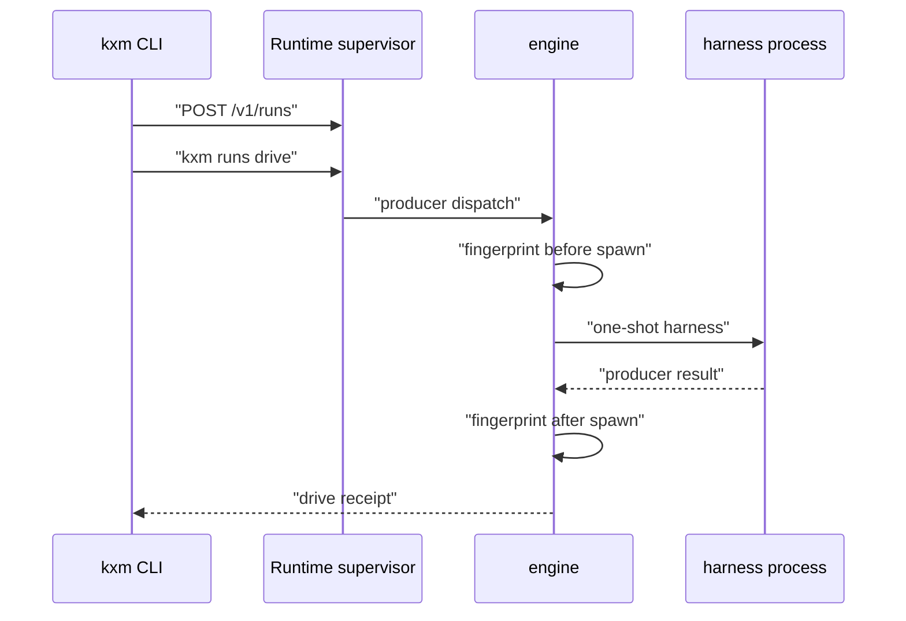

# Agent path

Read from `plugins/kxm/src/cli/project.ts`, `plugins/kxm/src/engine.ts`,
`plugins/kxm/src/worktree-witness.ts`, and `plugins/kxm/src/oneshot-producer.ts`.

`kxm run` resolves the project from the current directory and posts
`POST /v1/runs` to the Runtime supervisor (`cmdKxmRun`). The response names
`kxm runs drive <runId> --wait` as the next step. Drive posts
`POST /v1/runs/<runId>/drive` and later reads the drive receipt. The
supervisor's producer is the one-shot producer registered from
`plugins/kxm/src/oneshot-producer.ts`. Around a live spawn, the engine takes
a checkout fingerprint, invokes the producer, then fingerprints again
(`captureWorktreeWitness` and `applyAuthoringWitness`). A write step that
does not change the tree cannot stay `passed`. A read-only step that changes
the tree cannot stay `passed`.

## Related

- [Platform](platform.md)
- [First workflow](../start/first-workflow.md)
