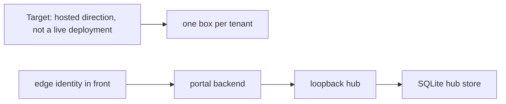

# Hosted direction

Target. This page is a direction, not a live deployment.

Read from `plans/plan-per-tenant-hosting.md`. `plans/plan-greenfield-infra.md`
is not in this checkout.

## Per-tenant hosting plan

`plans/plan-per-tenant-hosting.md` frontmatter says `status: "draft"` and
`blocked_by: []`.

The file's own summary says it is the rationale and boundary for hosting KXM
beside the portal: one tenant per box, Authentik at the edge, existing
static-token auth unchanged, hub state stays SQLite, and the portal backend
is the hosted client of the loopback hub. It says delivery order lives only
in the implementation tracker and that this file keeps no schedule.

The four decisions in that file, in its words:

1. Tenancy is the machine.
2. Auth stays exactly as it is. Hosting is additive.
3. Authentik owns the browser. The portal backend is the hub's client.
4. No PostgreSQL for the hub. If one is ever needed, one database per hub.

The file says none of the delivery is scheduled there. The ordered queue is
the tracker's Still open section. The tracker records S0 through S4 as
delivered and S5 as still open on interactive login. That disagreement is a
roadmap question. The tracker wins.

## Greenfield infra plan

`plans/plan-greenfield-infra.md` is not observed from this checkout. Its
`status` and `blocked_by` are not observed from this checkout.

The tracker names that file. The sentences that can be repeated without a
hostname, an account name, or a secret are: a first move is recorded as
installed, Postgres and Temporal are described as loopback only, KXM does not
write those stores, Redis Streams, NATS, raw WebSockets, and the A2A Python
SDK stay backlog, there is no S3, and the SQLite write path is unchanged.

## Related

- [Roadmap](../roadmap/dashboard.md)
- [SQLite ADR](../adr/ADR-0003-sqlite-only-store.md)
