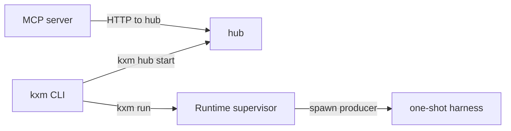

# Platform

Read from `plugins/kxm/src/cli.ts`, `plugins/kxm/src/runtime-supervisor.ts`,
`scripts/kxm-hub.mjs`, `plugins/kxm/src/hub.ts`, `plugins/kxm/src/mcp-server.ts`,
and `plugins/kxm/src/oneshot-producer.ts`.

KXM on this checkout is local-first. The `kxm` CLI is the operator entry
(`plugins/kxm/src/cli.ts`, launched through `scripts/kxm.mjs`). The hub is an
HTTP server started by `scripts/kxm-hub.mjs`, which loads
`plugins/kxm/dist/server.js`. `createHub` defaults the listener to
`127.0.0.1` and port `7331` (`plugins/kxm/src/hub.ts`, `DEFAULT_PORT` in
`plugins/kxm/src/protocol.ts`). The Runtime supervisor
(`plugins/kxm/src/runtime-supervisor.ts`) listens on `127.0.0.1`. Its port
defaults to `0`, so the kernel picks an ephemeral port unless a port is
requested. The MCP server (`plugins/kxm/src/mcp-server.ts`) uses
`StdioServerTransport`. It has no TCP listener. It calls the hub at
`KXM_SERVER_URL` or `http://127.0.0.1:7331`. One-shot harness calls are
spawned by the producer registered in `plugins/kxm/src/oneshot-producer.ts`.
That child process is not a listener.

## Listeners

| Route | Listener |
| --- | --- |
| Hub HTTP | `127.0.0.1:7331` unless host or port is overridden |
| Supervisor HTTP | `127.0.0.1` and an ephemeral port when the requested port is `0` |
| MCP | stdio, no TCP port |
| CLI and one-shot harness | no listener |
| Studio, when served | `127.0.0.1:4242` from `createStudioServer` in `plugins/kxm/src/studio-layout.ts` |
| Antigravity OAuth callback | loopback port `51121` only during login (`plugins/kxm/src/providers/antigravity/auth/oauth.ts`) |

## Related

- [Surfaces](inventory.md)
- [Agent path](agent-path.md)
