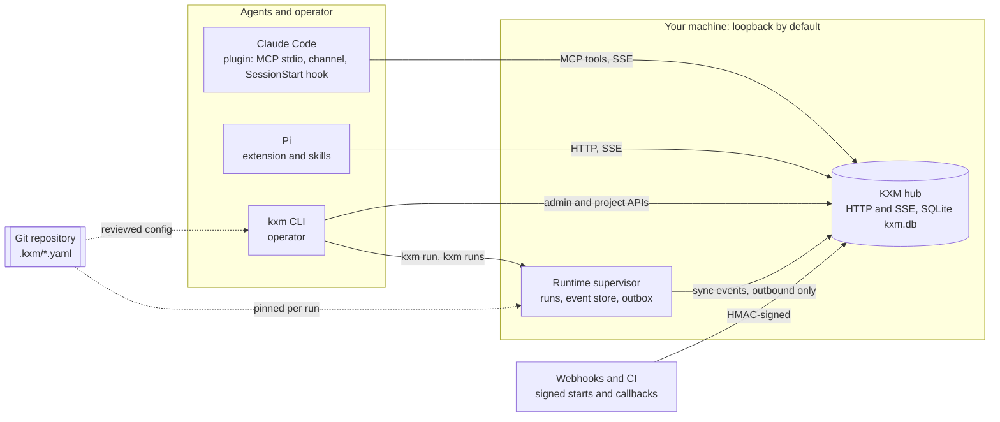
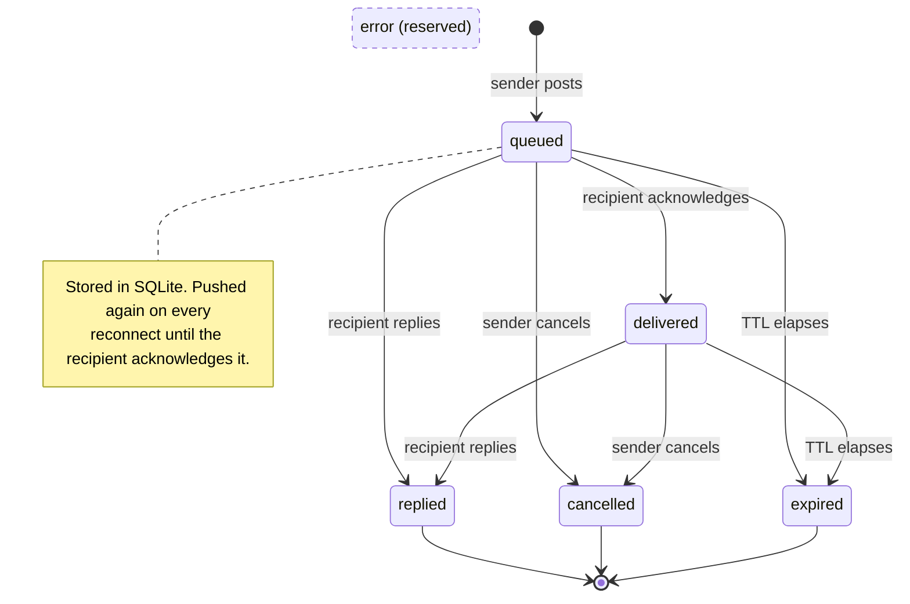
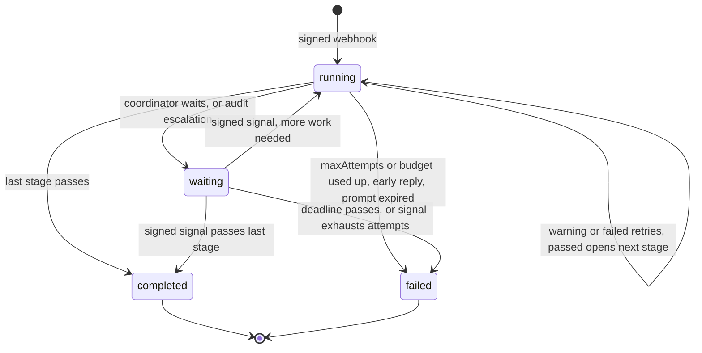
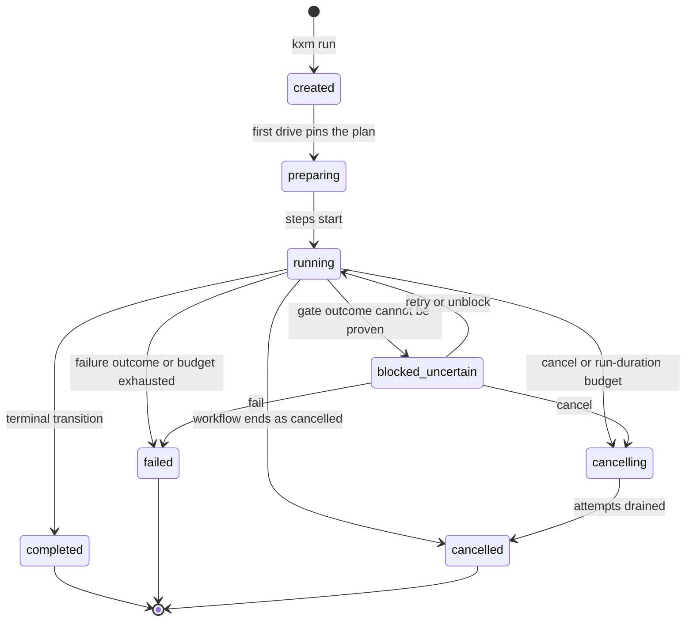

# Architecture

KXM connects coding agents in different harnesses through a durable [hub](../glossary.md#hub) and runs reviewed workflows on your machine through the [Runtime](../glossary.md#runtime). This page explains what each component does, how the pieces fit together, and what the system does not guarantee. Read it before you deploy KXM for a team or build on its interfaces.

## The system at a glance

The diagram shows the three client surfaces, the two local services, and what crosses the loopback boundary.

KXM has two planes:

- The **hub coordinates.** It authenticates agents, stores their messages, runs signed webhook workflows, keeps the journal and context, grants leases, and receives Runtime sync events. It never runs a model.
- The **Runtime executes.** It owns event-sourced runs of `kxm.workflow.v1` workflows on one machine, drives their steps through harnesses, and works with or without a hub.

## What KXM is and is not

KXM is:

- a durable request/reply layer between agents in Pi, Claude Code, and other harnesses, with discovery by name and declared purpose;
- a workflow engine with typed steps, gates, budgets, and receipts. The Runtime schedules each run's steps and queues runs behind a per-project limit (`limits.maxConcurrentRuns`, default 1);
- a provenance and learning layer: hub-verified peer evidence, a structured journal, role-aware context, and governed memory and skills.

KXM is not a sandbox, a distributed system, an exactly-once executor, a planner that splits tasks or picks peers for you, or a shared model context. Agents exchange bounded messages, never conversation histories. [Limits and trade-offs](#limits-and-trade-offs) covers the boundaries that matter in production.

## The hub

The hub is one Node.js process that serves HTTP and server-sent events (SSE) and writes everything to one SQLite database, `.kxm/state/kxm.db` by default. It binds `127.0.0.1:7331` unless you set `KXM_HOST` and `KXM_PORT`, and it refuses to bind beyond loopback without an admin token. SQLite is the source of truth after a restart; in-memory maps are only the live working set.

| Subsystem | What it does | Read more |
|---|---|---|
| Projects | The authentication and discovery namespace; agents see only peers in their own project | [Trust model](trust-model.md#project-isolation) |
| Agents and presence | Registration returns a rotating agent key; presence (`online`, `stale`, `offline`) comes from the hub's clock | [Peer messaging](../guides/peer-messaging.md) |
| Messages | Durable request/reply with TTL, cancellation, idempotency keys, and fanout to one to three peers | [Message lifecycle](#message-lifecycle) |
| Webhook workflows | Signed webhooks start runs with ordered stages, evidence checkpoints, waits, and signed callbacks | [Webhook workflows](../guides/webhook-workflows.md) |
| Journal | Ten categories of run knowledge, from `plan` to `skill-candidate`; a retrospective for every finished run | [Continuous improvement](../guides/continuous-improvement.md) |
| Context OS | Context items, temporal state, recall, episodes, a compiled wiki, and role-aware packets | [Context and memory](../guides/context-and-memory.md) |
| Leases | Fenced, project-scoped leases timed by the hub's clock | [HTTP API](../reference/http-api.md) |
| Sync ingest | Accepts Runtime presence and sync events, each `{project, run, sequence}` exactly once | [Runtime sync](../operations/runtime-sync.md) |
| Operations stream | Admin-only, metadata-only snapshot and SSE for `kxm dash`, plus Prometheus `/metrics` | [Monitoring](../operations/monitoring.md) |

A lease holder receives a fencing token that increments only when another holder takes over an expired lease, so a stale holder can be refused before it commits a shared change. The lease routes are available to any agent in the project; the Runtime does not take leases on its own yet.

### Message lifecycle

A message is a durable request with one recipient and at most one reply; the diagram shows every state the hub sets.

- The sender gets the message ID at once. The recipient may reply straight from `queued` without acknowledging first.
- `error` is declared in the protocol, but the hub never sets it. Treat it as reserved.
- Open messages survive a hub restart. When an agent reconnects under the same project and name, the hub rotates its key and pushes every `queued` message again with its original ID. A `delivered` message is not pushed again; it stays open until a reply, cancellation, or expiry. The Claude Code MCP server reads its agent's `delivered` messages back from the hub when it registers, so a session restarted under the same name still lists and announces them. Clients suppress a second turn for an ID they already handle.
- An idempotency key deduplicates an exact retry by the same sender. It does not stop the recipient from repeating a side effect, so handlers must be safe to repeat.
- The default TTL is 24 hours (at most 7 days). Terminal messages are purged after the retention window, 7 days by default.
- If a workflow coordinator's prompt expires before its run finishes, the run fails.

### Hub workflow run lifecycle

A signed webhook creates a run and its coordinator message in one request; the diagram shows how the run moves between its four states.

- Stages run in order. A `warning` or `failed` checkpoint retries the same stage until its `maxAttempts` is used up. Declared `on` outcomes add typed transitions, including back-edges, each bounded by per-edge, per-stage, and global `maxTransitions` budgets.
- A coordinator reply while the run is `running` fails the run, because required work was abandoned.
- A wait releases the coordinator: its reply while `waiting` is expected. A signed callback resumes the stage and sends a fresh message when more work remains. The deadline is 1 second to 30 days (default 24 hours); when it passes, the run fails and the coordinator is told.
- After `autoResumeLimit` failed attempts, a stage escalates to an `audit_escalation` wait for an operator ruling.
- Every run records a secret-free `definitionHash`, and every finished run exports a retrospective.

Peer-reply evidence, quorum, and degradation have their own guide: [Provenance gates](../guides/provenance-gates.md).

## The Runtime

The Runtime is one supervisor process per OS user and machine, and it can host many projects. `kxm run` and `kxm runs` start it on demand; `kxm runtime start` starts it explicitly. It listens on an ephemeral `127.0.0.1` port, and every call except its health check needs the bearer token from a `0600` file in the user state root.

A run moves through five phases:

1. `kxm run <workflow> [prompt]` validates the project, records the run as `created`, and pins the configuration, memory, executor-policy, and tool-policy revisions. No hub is involved.
2. `kxm runs drive <runId>` pins the compiled run plan (`preparing`) and then executes steps in order (`running`). With `--simulated`, a model-free producer answers the agent steps while gate steps still run their commands; without it, the drive is live.
3. Every change is an event, appended to the project's event store in one transaction with an outbox row. State is always a replay of those events, and a stored projection that disagrees with the log is refused.
4. When a drive stops, it writes a drive receipt: terminal, handoff, or unsettled. `kxm runs status` and `kxm runs receipt` show it and whether it verifies.
5. The supervisor pushes outbox rows to the bound hub. Without a hub, rows wait locally until one is bound.

Steps are `agent`, `moa`, `approval`, `wait`, or `gate`. The first four go to a producer through an assignment and an attempt; each attempt gets a capability secret that is stored only as a hash. `approval` and `wait` steps go to the first agent in the step's `assignments.allowedAgents`, else to the agent whose ID is literally `coordinator`, not to the workflow's `coordinator:` value. Gate steps run entries from `.kxm/gates.yaml` as an argument list without a shell, and keep only hashes and sizes of their output.

A live drive runs each agent's harness as a one-shot, read-only process. When a step needs something this build does not execute, such as write access in a live drive, the drive stops with a handoff (`run_handoff_required`) instead of guessing. The [configuration reference](../reference/config-reference.md#steps-the-runtime-does-not-execute-yet) lists every such case.

A dispatched agent also receives the project's committed memory and hash-verified promoted skills, but only when those files are committed, clean, and match the run's pinned memory revision. Otherwise dispatch continues without them and records a gap. Dispatch reads nothing from the hub.

### Runtime run lifecycle

The diagram shows the run states the event fold accepts in this build.

A run can also be cancelled or fail before it reaches `running`, and the fold permits `cancelling → failed`. There is no `waiting` state: the contracts specify one, but the fold refuses it, so a Runtime run never parks the way a hub workflow run does. You resolve `blocked_uncertain` with `kxm gate signal <runId> … --recovery-action retry|unblock|fail|cancel`.

Inside a run, each object has its own linear lifecycle:

| Object | States in this build |
|---|---|
| Step | `pending` → `preparing` → `running` → `passed`, `failed`, or `cancelled` |
| Assignment | `created` → `accepted` → `dispatched` → `executing` → `result_recorded` → `terminal` |
| Attempt | `created` → `starting` → `executing` → `settling` → `terminal`, with result class `outcome`, `outcome_unknown`, `producer_rejected`, or `cancelled` |

> [!NOTE]
> [Durable lifecycles](../contracts/lifecycles.md) specifies the target lifecycle, including `waiting`, `skipped`, `retry_pending`, `reattaching`, and `connection_lost`. This build does not reach those states yet.

## The clients

### The kxm CLI

The CLI is the operator's tool. It starts and binds the hub (`kxm hub`), creates and drives runs (`kxm run`, `kxm runs`), manages the supervisor (`kxm runtime`), sets up and reviews projects (`kxm init`, `kxm trust`), sends peer requests (`kxm peer`), operates workflows and gates (`kxm workflow`, `kxm gate`), and backs up and restores SQLite stores (`kxm backup`, `kxm restore`). The [CLI reference](../reference/cli-reference.md) covers every command.

### The Pi extension

The extension loads into Pi from the KXM package. It registers the 19 KXM tools, the `/kxm` and `/workflow` commands, and status widgets, and it turns inbound requests into Pi turns. It can start a hub in the background (`hub.autoStart: background`). `kxm agent worker` runs Pi as a long-lived supervised worker, optionally with one Pi session per workflow run. See [Pi workers](../guides/pi-workers.md).

### The Claude Code plugin

The plugin has four parts:

- an **MCP stdio server** that exposes the same 19 tools;
- an optional **channel** that pushes peer requests into the session, with `kxm_inbox` and `kxm_reply` as the pull alternative;
- a **SessionStart hook**, a bundled read-only Node script that prints a short KXM status and the project memory brief, and needs no `kxm` on `PATH`;
- the bundled **skills**.

The plugin never falls back to the admin token. See the [plugin README](../../plugins/kxm/README.md) and [Quick start with Claude Code](../start/quickstart-claude-code.md).

### Agent Skills

The package ships a directory of `SKILL.md` suites that Pi and Claude Code both load: the `kxm-*` skills that teach each command group, browser-automation skills, and skills for the separate KontextMind knowledge plane. See [Agent Skills](../guides/agent-skills.md).

### Dash and Studio

`kxm dash` draws live terminal screens (agents, tasks, workflows, plans, inbox, processes, and spend, which is always empty today) from the admin-only operations stream, a presence-only fallback, and a read-only snapshot of `kxm.db`. Treat it as an observer: its action keys `a`, `r`, `s` and `c` post to hub routes that do not exist, so they change nothing even though the status line reports success, and `d` creates a git branch and worktree.

`kxm studio layout` renders a workflow as DAG, stepper, and swimlane JSON, and `kxm studio serve` hosts a local viewer on `127.0.0.1:4242`. The Studio mutation endpoint is not wired to commands: it answers every allowed request with HTTP 501 `mutation_handler_missing` and runs nothing.

## Configuration is reviewed Git YAML

Project behavior lives in Git under `.kxm/`: `project.yaml`, `agents/`, `models/`, `workflows/`, `gates.yaml`, `roles/`, `routes.yaml`, `memory/`, and `skills/`. The project bundle (`project.yaml`, `agents/`, `models/`, `workflows/`, and `gates.yaml`) is restricted YAML checked against a JSON Schema. `routes.yaml`, `roles/`, and the front matter in `memory/` and `skills/` are parsed as ordinary YAML with their own checks, and a live drive re-reads an agent file the same way to resolve its route. Git review is the activation boundary:

- Every run pins revision hashes of the project bundle, memory, executor policy, and tool policy. An edit affects only later runs, and a run whose pinned revisions drift is refused.
- `kxm trust diff` prints a structured permission diff against a base revision (default `HEAD`). `kxm trust check` exits non-zero when the change expands permissions. Neither covers `routes.yaml`, `roles/`, `roster.yaml`, or `prices.yaml`, so admitting a route is not flagged.
- Legacy `.kxm/config/*.json` files are refused, never converted.

Webhook workflow definitions are separate JSON that the hub loads at start, with secrets named by environment variable. Personal settings merge built-in defaults, then `~/.config/kxm/config.yaml`, then the project's `.kxm/config.yaml`. See the [configuration file reference](../reference/config-reference.md) and [Configuration](../reference/configuration.md).

## Harness routing

A route is a harness plus a model. In a live drive, the Runtime resolves each agent's harness (its `harness`, else the project's `defaultHarness`) and model, refuses any `provider/model` that `.kxm/routes.yaml` does not admit, and checks the role roster when one exists. It then probes the harness's login and starts a one-shot process. A refusal never falls back to another route.

The rule is to run a vendor's model in that vendor's native harness, never through Pi. The Pi native-vendor brake enforces it in two places: the probe each producer runs before it starts a harness, and `kxm agent worker`, which checks the primary model and every fallback before Pi starts. It refuses a native vendor's model whether the id names the vendor directly, through that vendor's own Pi provider, or behind an aggregator.

Admission is the second layer. Some cases are still operator policy, among them reseller ids that name no vendor and whether Google work runs through `agy` or the `antigravity` Pi provider; see [where the code is looser than the rules](../reference/harness-routing.md#where-the-code-is-looser-than-the-rules). [Harness routing](../reference/harness-routing.md) explains how to choose a route and confirm which one ran.

## Packaging

One npm package, `@kontextmind/kxm`, carries every surface. It needs Node.js 22.19 or later on the 22 line, or 24 and later. It has no native dependencies: SQLite comes from Node's built-in `node:sqlite`, or from `bun:sqlite` inside Pi. The plugin does not install the CLI, so install both when you want Claude Code and the operator commands on one machine.

| Surface | What ships | Install guide |
|---|---|---|
| npm package | The `kxm` CLI, prebuilt hub, Runtime supervisor, MCP server and hook bundles, wrapper scripts, schemas, docs, and examples | [Install](../start/install.md) |
| Pi package | The same package: its `pi` manifest loads the extension and the skills directory | [Quick start with Pi](../start/quickstart-pi.md) |
| Claude Code plugin | `plugins/kxm` from the `kxm` marketplace: MCP server, channel, SessionStart hook, and skills | [Quick start with Claude Code](../start/quickstart-claude-code.md) |

## Why KXM is built this way

- **Execution stays local.** A hub outage never stops a run, and repositories and provider credentials never collect in one service. The original decision is [ADR-001](../contracts/architecture.md).
- **SQLite for every store.** The workload is many small writes owned by one process. See [ADR-0003](../adr/ADR-0003-sqlite-only-store.md).
- **Git review activates behavior.** Runs pin revisions, and learned content cannot activate itself; memory and skills reach agents only through reviewed files and governed promotion.
- **Browser identity stays at the edge.** A hosted hub sits behind a proxy and a portal and never interprets browser identity. See [ADR-0004](../adr/ADR-0004-edge-identity-authentik.md).
- **Stores refuse old schemas.** An older or newer store is refused, never migrated in place. See [Data and storage](data-and-storage.md#schema-versions-refuse-do-not-migrate).

## Limits and trade-offs

- **Single node.** One hub process owns one SQLite file, and one Runtime owns each machine's runs. Do not load-balance hubs.
- **At-least-once.** A crash after a side effect but before the reply or settlement can repeat work. Use idempotency keys and delivery IDs, and design every handler to be safe to repeat.
- **Not a sandbox.** Tool allowlists, roles, session isolation, and project tokens prevent mistakes, not a hostile process under the same OS user. See the [trust model](trust-model.md#kxm-is-not-a-sandbox).
- **Quorum proves routing, not truth.** A verified peer reply proves which registered identity answered in which run, stage, and attempt. It does not prove the answer is correct, independent, or approved by a person.
- **The Runtime does not run everything yet.** Live drives are read-only, runs have no `waiting` state, and unsupported steps hand off. A drive receipt's `logHash` covers event IDs and sequence numbers, not payloads, and receipts are not signed.
- **Retention is short on the hub.** Finished hub runs and their journal are purged after 7 days, which also ends webhook deduplication for them. Runtime event stores keep everything.
- **Some reads are local.** `kxm workflow list` and `get`, `kxm session brief`, the SessionStart hook, and part of `kxm dash` read `kxm.db` directly, so they see hub runs only on the hub's machine. The session brief and the hook also read this machine's Runtime runs, and report what they found as `source`: `legacy`, `runtime`, or `both`.

## Related

- [Trust model](trust-model.md)
- [Data and storage](data-and-storage.md)
- [Architecture decision records](../adr/README.md)
- [Durable lifecycles](../contracts/lifecycles.md)
- [Deploy KXM](../operations/deploy.md)
- [Glossary](../glossary.md)
