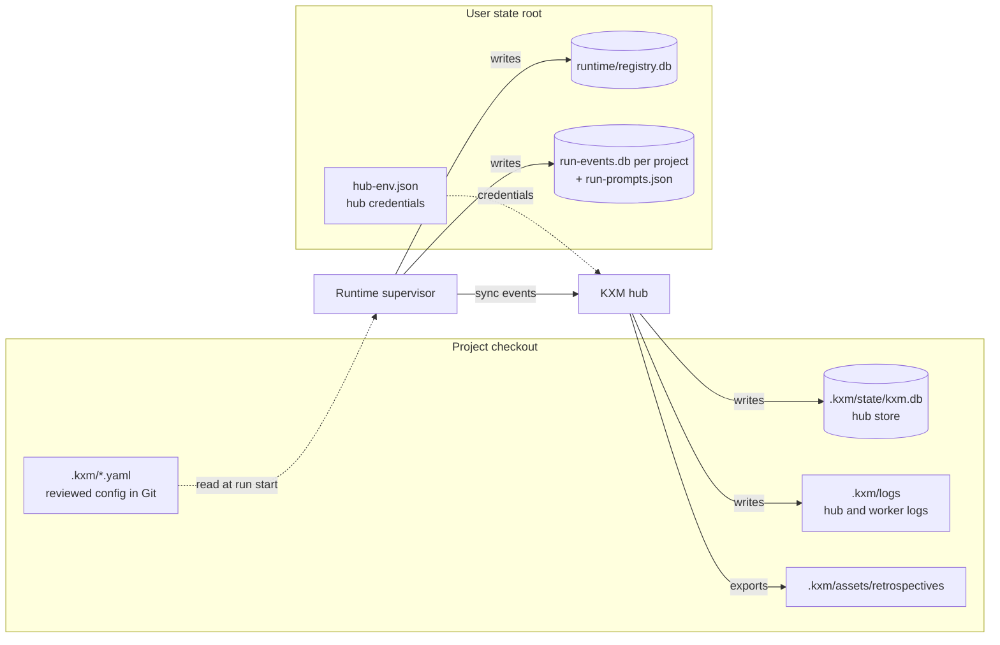

# Data and storage

KXM keeps its state in a few SQLite databases and a handful of files, split between your project checkout and a per-user state root. This page explains what each store holds, where it lives, what is kept as a hash instead of as content, how long data stays, and why KXM refuses old stores instead of migrating them. Read it before you back up, wipe, or audit a KXM installation.

## Where data lives

The diagram shows which process owns each store and which root it lives under.



KXM uses three locations:

- **The project workspace**, `.kxm/` at the project root. Reviewed configuration is tracked in Git. `state/`, `logs/`, and `assets/` hold what the hub and workers write. `KXM_WORKSPACE_DIR`, `KXM_STATE_DIR`, `KXM_LOGS_DIR`, `KXM_ASSETS_DIR`, and `KXM_DATA_PATH` move those parts; configuration always stays under `<project root>/.kxm/`.
- **The user state root**, for machine-level state that must never be committed.
- **The user configuration directory**, `KXM_USER_CONFIG_DIR` (default `~/.config/kxm`), for personal `config.yaml`, global roles and workflows, and the local session token.

The user state root is `KXM_STATE_HOME` when set; it must be an absolute path. Otherwise it depends on the operating system:

| Operating system | User state root |
|---|---|
| macOS | `~/Library/Application Support/KXM` |
| Linux | `$XDG_STATE_HOME/kxm`, default `~/.local/state/kxm` |
| Windows | `%LOCALAPPDATA%\KXM` |

The hub writes its database under the workspace of the directory it starts in. Start it from the project root so that `kxm.db` lands in that project's `.kxm/state/`.

## The hub store

The hub store is `.kxm/state/kxm.db` (or `KXM_DATA_PATH`). Like every KXM store, it records its schema version and refuses any other; see [Schema versions: refuse, do not migrate](#schema-versions-refuse-do-not-migrate). It has ten `STRICT` tables:

| Table | What it holds | Sensitive content |
|---|---|---|
| `agents` | Agent ID, name, purpose, project, model, host label, timestamps, and the current agent key | Agent keys in plain text |
| `messages` | Each request and reply with routing metadata and any workflow context | Request and reply bodies, as sent |
| `consumer_cursors`, `agent_sequences` | Each agent's delivery position and next message sequence | None |
| `workflow_runs` | Hub workflow runs: stages, evidence, waits, signal receipts, transitions, verified peer snapshots, hashes | Evidence strings |
| `workflow_journal` | Journal entries with category, area, stage, and attempt | Summaries, details, and evidence |
| `context_items` | Context items and state proposals with provenance and validity | Summaries, pattern-redacted |
| `leases` | Fenced leases with holder and fencing token | None |
| `sync_events` | Runtime events the hub accepted, once per project, run, and sequence | Sync-safe summaries |
| `runtime_presence` | Runtime heartbeats per project | Host label |

A coordinator message holds the rendered workflow prompt, which can include fields from the webhook payload. The raw webhook body is not stored; the run keeps only its SHA-256.

Some readers open `kxm.db` directly and read-only: `kxm workflow list` and `get`, `kxm session brief`, the Claude Code SessionStart hook, and parts of `kxm dash`. They see hub runs only on the hub's machine. The session brief and the hook also open this machine's Runtime stores read-only, and report what they found as `source`: `runtime` or `both` when a Runtime store exists, otherwise `legacy`.

## The Runtime stores

The Runtime keeps a registry for the machine and one event store for each project, all under `runtime/` in the user state root.

The **registry** is `runtime/registry.db`. Its `supervisor` table holds one row: the Runtime ID, process ID, port, a hash of the supervisor token, heartbeat, and state. Its `projects` table records each project's ID, canonical root path, project key, and home Runtime.

Each **event store** is `runtime/projects/<key>/run-events.db`. The key is the first 24 hex characters of the SHA-256 of the canonical project root. The store has 14 `STRICT` tables:

| Tables | What they hold |
|---|---|
| `runs`, `events`, `commands` | Each run with pinned revisions and a prompt hash; the append-only event log; idempotent command results |
| `run_plans`, `run_state` | The pinned compiled plan; the materialized projection |
| `attempt_capabilities` | Attempt bindings and the hash of each capability secret |
| `gate_attempts`, `gate_observations`, `gate_evidence` | Gate identity, process outcome with output hashes and sizes, and settled evidence |
| `drive_receipts` | The final receipt of each drive |
| `coordinators`, `intake_messages`, `project_controls` | Intake bindings, idempotent intake, and the project pause switch |
| `outbox` | One sync row per event, with its acknowledgement or refusal |

Gate rows are checked again every time the Runtime folds a run: their content hashes must recompute and match the events that name them, or the run is refused with a `gate_evidence_*` code such as `gate_evidence_hash_mismatch` or `gate_evidence_orphan`. A gate command that never starts fails its run with the reason `gate_start_failed`.

Next to each event store, `run-events.db.run-prompts.json` (`0600`) holds the **full prompt text** of every run. The `runs` table keeps only its hash, so the sidecar is the one place a prompt survives. Event payloads, command results, and run plans can also contain instructions, summaries, and evidence.

Every event commits in the same transaction as its outbox row. The supervisor pushes those rows to the bound hub, and a row the hub durably refuses stays parked until you run `kxm runtime sync-retry`. See [Runtime sync](../operations/runtime-sync.md).

## Other files

| File | What it holds | Notes |
|---|---|---|
| `hub-env.json` (state root) | The raw admin token and project-token map | Written `0600` through a temporary file; the hub's primary credential file |
| `hub-binding.json` (state root) | This machine's hub URL and when it was bound | No credential |
| `runtime/supervisor.token` (state root) | The raw supervisor token | `0600`; the registry stores only its hash |
| `runtime/logs/kxm-runtime.jsonl` (state root) | The supervisor's structured log, including sync state changes | Rotates at 2 MiB |
| `session.token` (user configuration directory) | An unsigned local session token with a tool policy | `0600`; 24-hour default lifetime |
| `.kxm/state/hub.pid`, `hub.stop` | Hub process claim and stop request | Process control only; let `kxm hub stop` manage them |
| `.kxm/state/pi-sessions/<worker>/` | Pi conversation history for a supervised worker | At most `KXM_WORKER_MAX_RUN_SESSIONS` (default 128) run histories per worker |
| `.kxm/logs/kxm-hub.jsonl` | The hub's structured log, without message bodies | Rotates at 10 MiB and keeps three rotated files |
| `.kxm/logs/pi-agent-<worker>.log` | Raw Pi standard output and error | Can contain model and tool output verbatim |
| `.kxm/logs/telemetry.jsonl` | Result envelopes from gate commands | Read by `kxm improve` |
| `.kxm/assets/retrospectives/<runId>.json`, `.md` | Exported retrospectives of finished hub runs | `0600`; no message bodies |

Every SQLite database also has `-wal` and `-shm` sidecars while in use. The write-ahead log can hold copies of any recent row, so treat it as sensitively as the database.

## What is stored, hashed, or never kept

**Stored as sent**, without encryption and without general redaction:

- message request and reply bodies, and rendered workflow prompts;
- workflow evidence and journal entries;
- agent keys, and the admin and project tokens in `hub-env.json`;
- Runtime prompts, event payloads, command results, and run plans;
- Pi session histories and raw Pi logs.

**Kept only as a hash:**

- the raw webhook body (`payloadHash`);
- the request and reply behind each verified peer snapshot, which therefore survives message purging;
- the Runtime prompt, in the event store's `runs` table (the sidecar keeps the text);
- attempt capability secrets and, in the registry, the supervisor token;
- gate command standard output and error, with their sizes;
- the workflow definition (`definitionHash`, computed without its secrets), and the reproduction oracle and plan hash of a hub run.

**Never persisted:** webhook signatures, which are checked and discarded, and workflow secrets, which stay in the environment variables that `secretEnv` and `signalSecretEnv` name.

## Redaction

KXM redacts with known credential patterns, such as API keys, bearer tokens, and named token variables. It applies them to:

- the hub's structured log, which also redacts by key name;
- context item summaries and source references;
- retrospectives, ranked improvement signals, and some diagnostics;
- every Runtime event before it enters the outbox, together with the allowlist transform described in the [trust model](trust-model.md#redaction-and-what-stays-local).

Nothing redacts messages, hub workflow runs, the journal, or the Runtime's own stores at write time. Pattern redaction also misses unfamiliar secret formats, and its rule for 64-character hex strings masks ordinary SHA-256 digests too. Keep credentials out of prompts and evidence.

## Retention

| Data | How long it stays |
|---|---|
| Terminal messages (`replied`, `cancelled`, `expired`) | `KXM_MESSAGE_RETENTION_MS` after they end; default 7 days |
| Finished hub workflow runs and their journal | 7 days after their last update; not configurable |
| Journal entries whose run is gone | 7 days |
| Superseded, rejected, or expired context items | 7 days after they end |
| Expired leases | 7 days past their deadline, so a fencing token never restarts |
| Agents, cursors, sequences, sync events, Runtime presence | Kept |
| Runtime registry and event stores | Kept; the event log is append-only |
| Retrospectives | Kept; purging a run does not remove them |

Purging a hub run also ends webhook delivery deduplication for it and removes the episodes derived from its journal. Purging superseded state limits `--as-of` queries to roughly the last 7 days.

## Schema versions: refuse, do not migrate

Each database records its schema version in SQLite's `user_version`. When a process opens a store:

- a newer store fails with `runtime_schema_newer`;
- an older store fails with `runtime_schema_outdated`;
- a store with tables but no version fails with `runtime_schema_shape_invalid`.

KXM never upgrades a store in place, because the code would otherwise have to keep working against schema shapes it no longer tests. To cross a store version, stop the owner, back up if you need the history, delete the store with its `-wal` and `-shm` files, and let the owner recreate it: `kxm hub start` for `kxm.db`, and the Runtime for the registry and event stores. `kxm init` rebuilds no database. Legacy `.kxm/config/*.json` files are refused the same way.

Every store opens in WAL mode with a 5-second busy timeout, `synchronous=NORMAL`, and foreign keys on. A database or sidecar that is a symbolic link is refused. [ADR-0003](../adr/ADR-0003-sqlite-only-store.md) records why SQLite is the only store.

## Reset a store

> [!CAUTION]
> Deleting a store erases its history for good. Back it up first if you might need it. `kxm backup` copies the hub store and the Runtime stores in the user state root, for every project on the machine.

Stop every writer first, then delete each database together with its sidecars:

```bash
kxm hub stop
kxm runtime stop
```

- Hub messages, workflow runs, and context: `.kxm/state/kxm.db`, `kxm.db-wal`, and `kxm.db-shm`.
- Runtime runs for one project: `runtime/projects/<key>/` in the user state root, including `run-events.db`, its sidecars, and `run-events.db.run-prompts.json`.
- Runtime registration: `runtime/registry.db` and its sidecars. Deleting it alone leaves event stores that nothing points to.
- Hub credentials: `hub-env.json`, only when you intend to rotate them. The next `kxm hub start` generates a new admin token, and every client that used the old one fails until you reconfigure it.

Never delete a live database, and never delete only the main file while its `-wal` remains. [Back up and restore](../operations/backup-and-restore.md) covers `kxm backup` and `kxm restore`, and [Upgrade KXM](../operations/upgrade.md) covers version changes.

## Related

- [Trust model](trust-model.md)
- [Architecture](architecture.md)
- [Back up and restore](../operations/backup-and-restore.md)
- [Configuration file reference](../reference/config-reference.md#workspace-layout-tracked-ignored-and-state)
- [ADR-0003: SQLite as the only store](../adr/ADR-0003-sqlite-only-store.md)
