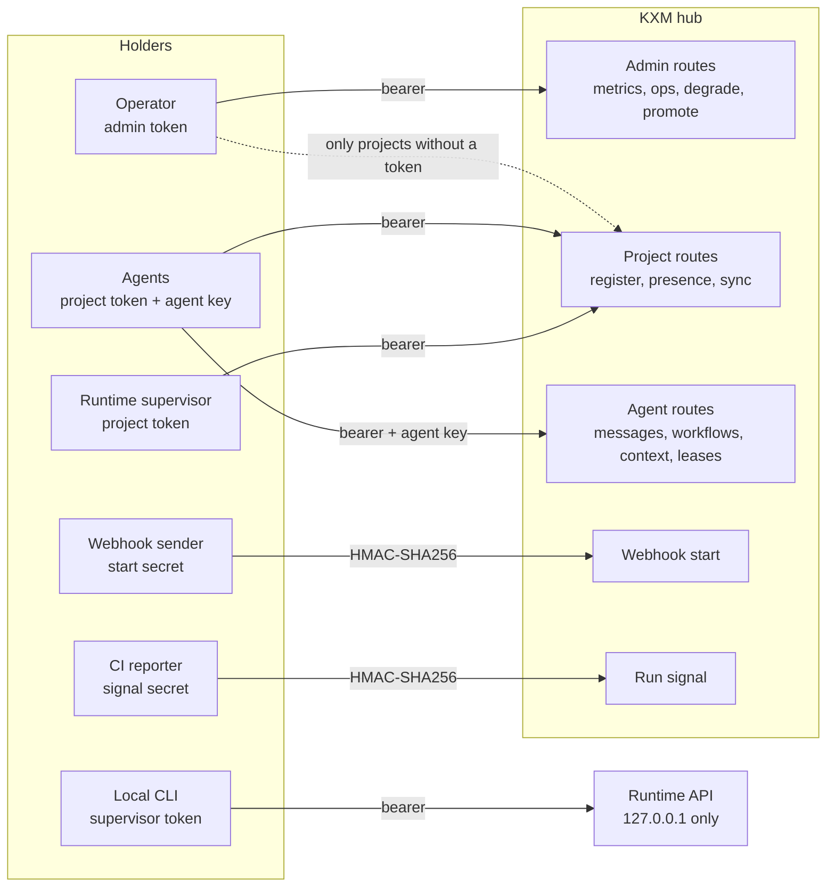

# Trust model

KXM decides who may do what with a small set of credentials, each scoped to one job. This page explains which credential proves what, who should hold it, and where each boundary stops, including the things KXM deliberately does not protect against. It is for operators who deploy a hub and for anyone reviewing KXM's security.

## Who can reach what

The diagram shows each credential holder and the only endpoints that credential opens.

`/health` and `/ready` need no credential and are not rate limited. Everything else on the hub needs one of the credentials below.

## Credentials

| Credential | Holder | Where it lives | What it opens |
|---|---|---|---|
| Admin token (`KXM_AUTH_TOKEN`) | The hub and a trusted operator terminal | The environment, else `hub-env.json` (`0600`) in the user state root | Admin routes; agent routes only for projects that have no project token |
| Project token (`KXM_PROJECT_TOKENS` entry) | Agents and the Runtime for that project | The hub's environment or `hub-env.json`; clients pass it as `KXM_AUTH_TOKEN` | Registration, Runtime presence, and sync events in that one project |
| Agent key | The hub and one registered client | Issued at registration, rotated at every reconnect, stored in `kxm.db` | Identity routes: messages, events, workflows, context, leases |
| Workflow start secret | The hub and the webhook sender | The variable named by the definition's `secretEnv` | Starting runs of that one definition |
| Workflow signal secret | The hub and the callback sender | The variable named by `signalSecretEnv`; falls back to the start secret | Signals for runs of that definition |
| Runtime supervisor token | The Runtime and local CLI processes | `runtime/supervisor.token` (`0600`); the registry keeps only its hash | The Runtime API on `127.0.0.1` |
| Session token | Local KXM tools | `session.token` (`0600`) in the user configuration directory, or `KXM_SESSION_TOKEN` | Local tool-policy checks and Studio mutation requests; never sent to the hub |
| Attempt capability | The Runtime, for one attempt | Only its SHA-256 hash is stored | Settling that one attempt; revoked on cancel |

`kxm hub start` generates an admin token (`kxm_admin_…`) when none exists and saves it, so a hub started that way always requires authentication. Give agents only their project token. Never give the admin token to an agent, a callback sender, or a dashboard that a project token can serve.

### How clients choose a token

- **Claude Code plugin.** The MCP server uses the plugin's `auth_token` setting, else the project token the hub saved for this project. It never falls back to the saved admin token; without a project token, its tools report that and do nothing.
- **SessionStart hook.** It reads local state read-only. It mints no token, writes no file, and never prints a token.
- **Pi extension.** It uses `KXM_AUTH_TOKEN`, else the token from a hub it auto-started, else the saved admin token. When your project has its own project token, set `KXM_AUTH_TOKEN` to it for Pi, because the hub rejects the admin token for that project.
- **CLI and Runtime supervisor.** Operator tools use `KXM_AUTH_TOKEN`, else the saved project token, else the saved admin token.

## Project isolation

A project is the unit of isolation on a hub:

- Every agent route checks the caller's project token and agent key together.
- A message can target only an agent in the sender's project.
- A context request outside the agent's project fails with `context_isolation_violation`.
- A webhook run belongs to the project named in its definition, not to the caller.
- The Runtime keeps a separate event store for every project.

A project listed in `KXM_PROJECT_TOKENS` accepts only its own token on agent routes. A project missing from the map falls back to the admin token, so the admin token can register agents under any unlisted project name. List every project you run so the admin token stops working on agent routes.

Isolation is logical. All projects on one hub share one process, one SQLite file, one log, and one in-memory rate limiter. Run a separate hub for teams that must not trust each other.

## What provenance proves

In a hub workflow, a coordinator can ask peers for evidence. The hub stamps each request with the run, stage, requirement, and attempt. At a checkpoint it re-reads its own records, verifies every cited message, and counts unique producer identities toward the quorum. The coordinator never counts as a producer.

A verified quorum proves that the hub observed durable replies from the configured producer identities for this exact run, stage, requirement, and attempt. It does not prove:

- that any reply is correct or true;
- which model produced it, or that producers reasoned independently;
- that producers did not collude;
- that a person approved the result.

Every holder of one project token is inside the same provenance domain, because a project-token holder can register a new agent or reclaim an offline agent's name and durable ID. Issue a separate project token per trust domain. Degrading a quorum needs the admin token, must be allowed by the stage's policy, applies to one attempt, and is journaled. See [Provenance gates](../guides/provenance-gates.md).

## Context authority

Context carries an authority level, and each origin can grant at most a fixed ceiling. The hub enforces the ceiling when it parses an item, and deriving new content from an item never raises its authority.

| Origin | Highest authority it can grant |
|---|---|
| `human`, `workflow` | `policy` |
| `git` | `instruction` |
| `peer`, `tool`, `external`, `derived` | `evidence` |

- A state proposal made with an agent key is **peer** origin, so it is capped at `evidence`.
- A **human**-origin proposal needs a configured admin token, with no loopback exception.
- `proposedBy` must name the authenticated caller, or the hub refuses the proposal.
- Promoting a proposal to current state needs a configured admin token and a promoter other than the author.
- Context items cannot carry control-plane fields such as `permissions`, `tools`, or `token`.
- A Runtime-dispatched agent receives memory and promoted skills only when they are committed, clean, and match the run's pinned memory revision.

See [Context and memory](../guides/context-and-memory.md).

## Tool policy is a guardrail

Every call to one of the 19 KXM agent tools checks a tool policy first, whether it comes from Claude Code, Pi, or a matching CLI command such as `kxm peer send`. The check reads `KXM_ATTEMPT_TOKEN`, then `KXM_SESSION_TOKEN`, then the session token on disk. `kxm session brief` and `kxm auth token --issue` write that disk token with an operator preset and a 24-hour lifetime.

These tokens are unsigned JSON, so any local process can write one. Tool policy keeps a well-behaved agent inside its role; it does not stop a hostile one. An expired disk token denies every KXM agent tool until you run `kxm auth token --issue`.

## Redaction and what stays local

- The hub's structured log omits prompt and reply bodies and redacts values by key name and by known credential patterns.
- The operations stream and `kxm dash` carry metadata only, never bodies.
- The Runtime-to-hub sync builds a new event from an allowlist. Raw prompts, raw logs, diffs, environment values, and absolute paths never leave the machine that way. Registered secrets and credential shapes are replaced, and unknown fields are dropped.
- Provider credentials never reach the hub, because the hub never runs an agent.

Redaction is pattern-based and best effort. Message bodies, workflow evidence, the journal, and Runtime prompts and event payloads are stored as sent. [Data and storage](data-and-storage.md) lists what each store keeps.

## Network exposure

- The hub binds `127.0.0.1` by default and refuses to bind beyond loopback without an admin token. Started directly on loopback without a token, it prints `auth=none` and trusts every local caller.
- The Runtime supervisor binds `127.0.0.1` only. Its health check answers a nonce with a keyed proof, so a client can tell the real supervisor from a process that took over a stale port.
- `kxm studio serve` binds `127.0.0.1` by default and allows any browser origin. Keep it on loopback.
- The hub's rate limit is per agent ID or remote address and lives in memory. It is a courtesy limit, not abuse protection.
- Webhook signatures are HMAC-SHA256 over the raw body with no timestamp window. A replayed delivery is deduplicated by its delivery ID, not rejected, until its run is purged after 7 days.
- Binding a machine to a remote hub (`kxm hub bind`) requires a credential for that hub.

For a hosted hub, KXM uses one tenant per box. Browsers authenticate at an HTTPS proxy with Authentik, a portal backend calls the loopback hub and Runtime with machine credentials, and no hub port is public. The hub never reads browser identity headers. See [Deploy KXM](../operations/deploy.md) and [ADR-0004](../adr/ADR-0004-edge-identity-authentik.md).

## KXM is not a sandbox

> [!WARNING]
> KXM does not isolate processes that run as the same OS user. A shell-capable agent can read any file that account can read, including hub state, tokens, and Pi session files.

- `KXM_WORKER_TOOLS` limits which tools a Pi worker may call, not which paths it may touch.
- Role descriptions and prompt instructions document intent; they do not remove shell, edit, or write tools.
- Workflow session isolation keeps model contexts apart; it is not a security boundary.
- Peer output stays untrusted even when the peer is authenticated.

When an agent is outside your trust boundary, run it under a separate OS account or container, give it a read-only worktree, and withhold shell and write tools.

## Related

- [Architecture](architecture.md)
- [Data and storage](data-and-storage.md)
- [Security policy](../../SECURITY.md)
- [Provenance gates](../guides/provenance-gates.md)
- [Deploy KXM](../operations/deploy.md)
- [ADR-0004: Edge identity with Authentik](../adr/ADR-0004-edge-identity-authentik.md)
