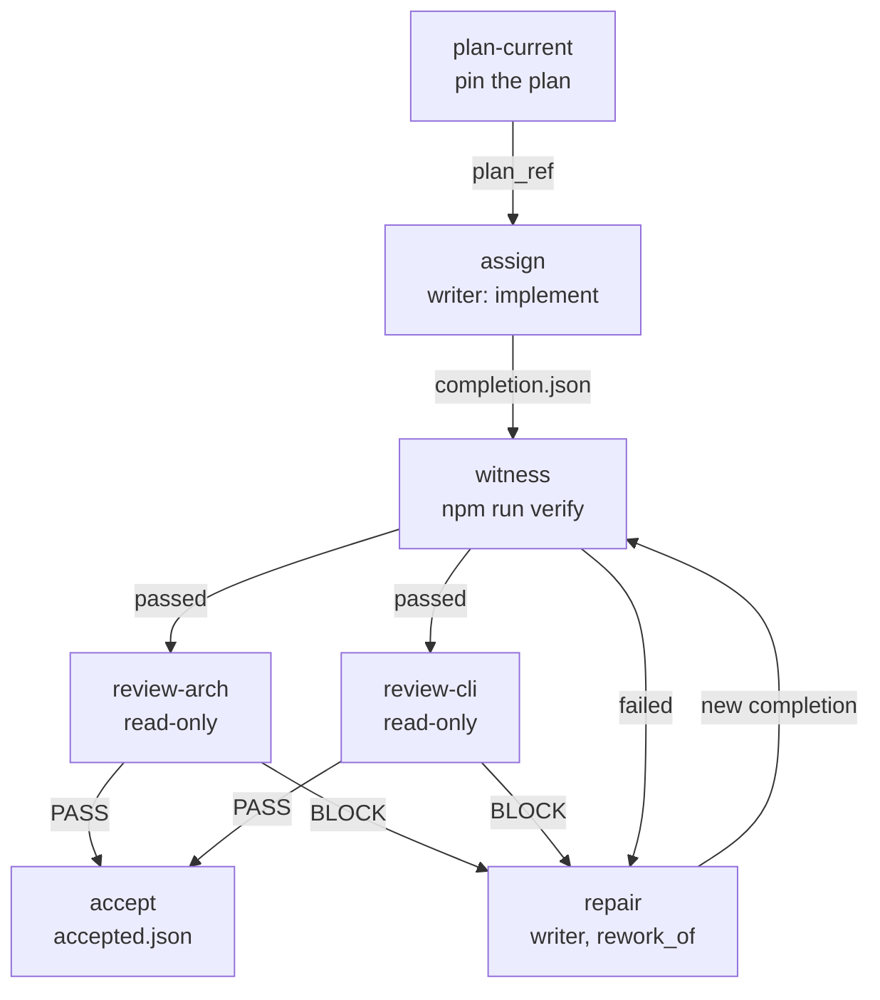

# Assignment runner

The assignment runner, `scripts/assignment-run.mjs`, is how maintainers delegate
one unit of work on the KXM repository to a coding agent and accept the result
with proof: a bound manifest, a deterministic witness, and two independent
critics. This guide covers the loop, the files it writes, and the checks it
refuses to skip. It is maintainer tooling (tracked internally as issue 127), not
a KXM product feature.

> [!IMPORTANT]
> The runner is not the Runtime workflow engine (`kxm run`), not a supervised
> worker (`kxm agent worker`), and not a product dispatch adapter. Its
> `accepted.json` is a developer record. It is not human approval, hub peer
> evidence, CI success, or a merge.

## Before you begin

- A clean control checkout of this repository whose `HEAD` is an ancestor of
  `origin/main`. The runner loads `.kxm/roster.yaml` only from there.
- A separate worktree for the writer. `just worktree <unit>` creates one from
  `origin/main`.
- [`just`](https://github.com/casey/just), plus the harness CLIs the roster
  admits, installed and logged in. `node scripts/kxm.mjs harness list` shows
  which are.
- A task directory whose final path segment equals the task ID. Every path you
  pass to the runner must be absolute.

## Roles and routes

The trusted roster policy in [`.kxm/roster.yaml`](../../.kxm/roster.yaml)
(`kxm.developer-roster.v1`) admits each route for specific roles and
permissions:

| Role | Admitted route (harness / model) | Vendor | Permission |
|---|---|---|---|
| `writer` | `grok` / `grok-4.6`; relief: `pi` / `openrouter/qwen/qwen3-coder-plus` | `xai`; `alibaba` | `edit` |
| `planner` | `claude` / `fable` | `anthropic` | `read-only` |
| `reviewer-arch` | `claude` / `fable` | `anthropic` | `read-only` |
| `reviewer-cli` | `codex` / `gpt-5.6-sol` | `openai` | `read-only` |

The policy itself enforces three rules. Critics are read-only. The two
designated critics have different vendors. No admitted writer shares a vendor
with a critic. A route outside the lineup, or a permission above its ceiling,
fails closed with `route_invalid`.

Each assignment has a kind, and the kind fixes its role:

| Kind | Role | Base | Witness |
|---|---|---|---|
| `plan` | `planner` | Clean | `verify` or `validate-ci` |
| `implement` | `writer` | Clean | `verify` only |
| `repair` | `writer` | Clean | `verify` only |
| `review-arch` | `reviewer-arch` | Clean or staged | `verify` or `validate-ci` |
| `review-cli` | `reviewer-cli` | Clean or staged | `verify` or `validate-ci` |

A clean base means `HEAD`, the index and the worktree are identical. Only
reviews may target a staged index.

## The loop

A unit moves from a pinned plan through one writer, a fixed witness and two
critics to acceptance; a critic's `BLOCK` or a failed witness sends it back
through a repair.



Use this slim loop for daily work and for docs. The 13-step `fix` workflow in
`examples/project/` is a product fixture, not the developer loop.

> [!NOTE]
> These recipes never load a `.env` file from the working directory. An
> unreviewed file could otherwise set `NODE_OPTIONS` and run code before the
> runner validates anything. To use one, pass it explicitly:
> `just --dotenv-path /abs/.env assign /abs/manifest.json`.

### 1. Pin the current plan

Every writer assignment binds to the current plan. Stamp the pointer, or advance
it with a generation check:

```bash
just plan-current /abs/task-dir /abs/plan.md <sha256> <base-commit> <expected-generation>
```

The runner writes `plan-current.json` (`kxm.plan-pointer.v1`) in the task
directory. It does not copy the plan. When the pointer advances, the previous
plan and pointer move to `plan-history/generation-<n>.md` and `.json`. A stale
`<expected-generation>` fails with `history_conflict`.

A `plan` or review assignment may instead use a `bootstrap` plan reference with
a reason, but only while no pointer exists.

### 2. Dispatch the writer

Write a closed `kxm.assignment.v1` manifest. Unknown keys are refused.

`/abs/tasks/fix-improve-sources/asg-writer-1.json`:

```json
{
  "schema": "kxm.assignment.v1",
  "task_id": "fix-improve-sources",
  "assignment_id": "asg-writer-1",
  "kind": "implement",
  "harness": "grok",
  "model": "grok-4.6",
  "effort": "medium",
  "permission": "edit",
  "cwd": "/abs/kxm-fix-improve-sources",
  "task_dir": "/abs/tasks/fix-improve-sources",
  "base": { "kind": "clean", "commit": "<40-hex HEAD of cwd>" },
  "plan_ref": { "kind": "current", "path": "/abs/plan.md", "sha256": "<64-hex>" },
  "inputs": [],
  "contract": {
    "boundary": "plugins/kxm/src/improve-sources.ts and its test only",
    "deliverables": ["The fix and one focused test"],
    "witness": { "id": "verify" },
    "deferred": []
  },
  "output_dir": "/abs/tasks/fix-improve-sources/asg-writer-1"
}
```

Optional keys are `rework_of`, `timeout_ms` and `max_turns`. Each `inputs`
entry is `{ "path", "sha256" }`, and the runner checks the hash. Dispatch it:

```bash
just assign /abs/tasks/fix-improve-sources/asg-writer-1.json
```

The runner validates the manifest, the route and the base, writes
`pre-dispatch.json` before it spawns the harness, and records `completion.json`
(`kxm.assignment-completion.v1`) or `refusal.json` when the harness exits.

### 3. Run the witness

Stage everything the writer produced, including rebuilt `dist` and other
generated files, then run the witness:

```bash
git -C /abs/kxm-fix-improve-sources add -A
just witness /abs/tasks/fix-improve-sources/asg-writer-1
```

The witness refuses with `dirty_baseline` while anything is unstaged or
untracked. It re-runs the gate named in the manifest's `contract.witness.id`
without a shell: `npm run verify` for `verify`, `npm run validate:ci` for
`validate-ci`. Writers always use `verify`. The receipt binds `HEAD` and the
staged index tree. If the gate leaves the worktree or index different from
before, for example an unstaged rebuild, the witness fails with
`candidate_changed`.

Each run writes an immutable receipt (`kxm.assignment-witness.v1`) and moves
the latest pointer:

- `witness/history/<receipt-id>.json`, where the ID is `w-<UTC timestamp>`;
- `witness/history/<receipt-id>/<gate>.log`, the captured gate output;
- `witness/latest.json` (`kxm.assignment-witness-latest.v1`), which names the
  newest receipt and its sha256.

Acceptance reads only the receipt `latest.json` points to, and requires
`result: "passed"`.

### 4. Dispatch both critics

Dispatch one `review-arch` and one `review-cli` assignment against the
witnessed tree: either the staged index (`base.kind: "staged"` with its
`index_tree`) or, after you commit it, a clean base. Each critic writes `completion.json` with a
`critic` verdict of `PASS` or `BLOCK` and the `judged_tree` it reviewed.

### 5. Accept

Commit the exact witnessed tree, then bind the commit and both `PASS` records:

```bash
just accept /abs/tasks/fix-improve-sources <commit-sha> \
  /abs/tasks/fix-improve-sources/asg-writer-1 \
  /abs/tasks/fix-improve-sources/asg-review-arch-1 \
  /abs/tasks/fix-improve-sources/asg-review-cli-1
```

To record an observed pull request or CI run, call the script directly, since
the recipe does not pass those flags:

```bash
node scripts/assignment-run.mjs accept \
  --task-dir /abs/tasks/fix-improve-sources \
  --commit <commit-sha> \
  --record-dir /abs/tasks/fix-improve-sources/asg-writer-1 \
  --critic /abs/tasks/fix-improve-sources/asg-review-arch-1 \
  --critic /abs/tasks/fix-improve-sources/asg-review-cli-1 \
  --observed-pr <pr-id> \
  --observed-ci <ci-id>
```

`accept` prints JSON and takes no `--json` flag. It checks, in order, that:

1. the trusted roster policy loads and validates, before anything is written;
2. the commit exists and its tree equals the witnessed tree;
3. the writer record matches the latest passed witness receipt;
4. exactly the two designated critics are present, on their admitted routes;
5. both critics judged the accepted tree and returned `PASS`;
6. no unresolved `BLOCK` for that tree remains in the task directory;
7. the writer and both critics come from three different vendors.

It then writes `accepted.json` (`kxm.task-accepted.v1`). The file is immutable;
a second accept in the same task directory fails with `accepted_exists`.

## Repair after a BLOCK or a failed witness

The runner never schedules a repair or fails over to another model on its own.
You decide, then dispatch:

1. Write a new manifest with `"kind": "repair"` and `"rework_of"` set to the
   assignment ID it reworks. The runner checks that the earlier assignment has a
   `completion.json` in the same task directory, with the same task ID.
2. Dispatch it with `just assign`, then run `just witness` on the new record.
3. Dispatch fresh critics against the new tree, and accept.

A `BLOCK` stops acceptance only for the tree it judged. A repair that changes
the tree leaves the old `BLOCK` behind. If a critic re-reviews the same tree,
give its new assignment a `rework_of` chain back to the `BLOCK` review; only
then is that `BLOCK` resolved.

## Records in the task directory

```text
<task-dir>/
├── plan-current.json        # current plan pointer (kxm.plan-pointer.v1)
├── plan-history/            # superseded plans and pointers, by generation
├── accepted.json            # acceptance record (kxm.task-accepted.v1), immutable
└── <assignment-id>/         # one record directory per assignment
    ├── manifest.json        # the bound manifest
    ├── prompt.md            # the rendered prompt
    ├── output-schema.json   # the structured-output schema given to the harness
    ├── pre-dispatch.json    # written before spawn (kxm.assignment-dispatch.v1)
    ├── completion.json      # kxm.assignment-completion.v1, or refusal.json
    ├── routing-record.json  # read by kxm routing report
    ├── telemetry.jsonl      # usage, latency and cost
    ├── runner-errors.jsonl  # bounded failure codes
    ├── witness/             # latest.json and history/<receipt-id>.json
    ├── attribution/         # latest.json and history/, private notes
    └── cost-observation.json  # imported, cost-only
```

The harness output files (`completion.json`, `routing-record.json`,
`telemetry.jsonl`) land in the manifest's `output_dir`, which is usually the
record directory. `completion.json` and `accepted.json` have closed schemas: do
not add fields to them.

## Notes, costs and reports

Record friction or a model regression as a private note, without touching any
completion:

```bash
just attribute /abs/task-dir /abs/record-dir <class> /abs/note.txt
```

The class is `orchestration`, `model`, `environment` or `unclassified`. Each
note is a hash-linked entry under the record's `attribution/`. Notes never grant
tools, waive a witness, or count as approval.

Import a cost observation for a run whose native telemetry was not captured,
such as a subscription session:

```bash
just observe-cost /abs/task-dir /abs/observation.json
```

The record (`kxm.cost-observation.v1`) is cost-only. It cannot mint witness
proof or authorize acceptance.

Summarize a task's attempts, rework and spend:

```bash
just change-report /abs/task-dir
```

The report (`kxm.change-report.v1`) keeps provider-reported spend, list-price
estimates, unmetered usage and unknown cost apart. A missing value stays
missing: it is never counted as zero. Failed and interrupted attempts are
listed, and nothing is ranked.

## Recover an incomplete record

If the harness finished but the runner failed to write the routing record or
the telemetry line, the witness refuses the record with `recording_unresolved`.
Rebuild both from `completion.json`, then re-run the witness. There is no recipe
for this step, so call the script directly:

```bash
node scripts/assignment-run.mjs observe --record-dir /abs/tasks/fix-improve-sources/asg-writer-1
```

It writes `recording-resolved.json` in the record directory. It never changes
`completion.json`.

## Transport-only recipes

`just impl|plan|review-arch|review-cli` and `just dispatch` send one
`kxm.harness-request.v1` envelope through `scripts/harness-run.mjs` and print a
`kxm.harness-result.v2` envelope. They are harness transport only. They mint no
assignment, witness or acceptance proof, so their output cannot be accepted.

## Failure codes

The runner fails closed with a bounded code from `RUNNER_CODES`. The common
ones:

| Code | Trigger | Fix |
|---|---|---|
| `route_invalid` | Route not in the role's lineup, permission above its ceiling, or the roster policy cannot load | Run from a clean control checkout on `origin/main`; check the lineup |
| `base_invalid` | `base.commit` is not `HEAD`, the tree is dirty, or a writer targets a staged index | Commit or stash elsewhere; writers need a clean base |
| `plan_ref_invalid` | The plan hash or path does not match `plan-current.json` | Advance the pointer with `just plan-current` |
| `rework_invalid` | `rework_of` names no completed assignment in this task | Point it at an existing record directory's assignment ID |
| `witness_failed` | The fixed gate exited non-zero | Fix the failures and run a repair |
| `dirty_baseline` | Unstaged or untracked changes when the witness starts | Stage the candidate with `git add -A`, then re-witness |
| `candidate_changed` | The gate left the index or worktree different, or another process changed it | Stage generated files; keep other writers out of the worktree |
| `commit_tree_mismatch` | The commit's tree is not the witnessed tree | Commit exactly the witnessed tree |
| `critic_invalid` | A critic is missing, duplicated, on the wrong route, or shares a vendor | Dispatch the two designated critics |
| `critic_block` | An unresolved `BLOCK` exists for the accepted tree | Repair, or resolve it through a `rework_of` chain |
| `accepted_exists` | `accepted.json` already exists | Use a new task directory for new work |

## Test coverage is thin

The runner's own suites were removed with an earlier refactor. Today the tests
cover the edges only:

- `test/core/harness-run.test.ts` pins every `just` recipe body that calls the
  runner, and checks that every `just <verb>` in this guide is a real recipe.
- `test/core/roster-policy.test.ts` covers the roster validator.
- `test/core/policy-draft.test.ts` covers the passive policy-draft schemas.

No test runs `run`, `witness` or `accept` end to end. Treat changes to
`scripts/assignment-run.mjs` as high risk, and check them by running a real
unit through the loop.

## Related

- [Develop KXM](development.md): the commit gate the witness runs
- [CI and release](ci-and-release.md): what runs after you push
- [Harness routing](../reference/harness-routing.md): harness and model pairing
- [Configuration reference](../reference/config-reference.md#kxmrosteryaml-kxmdeveloper-rosterv1): the roster file
