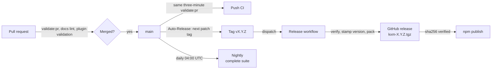

# CI and release

Every pull request and every push to `main` that changes code runs a
three-minute merge-safety gate, the complete suite with coverage floors runs
nightly, every merge to `main` cuts a patch release, and every release is
verified before it reaches npm. This
page explains which checks run where, how a merge becomes a published version,
and which smoke tests stay manual. It is for contributors and maintainers.

## The pipeline at a glance

A merged pull request flows through CI, an automatic tag, a verified GitHub
release and an npm publish; the nightly job adds the slower suites.



All workflows live in `.github/workflows/`. Linux jobs run on the organization's
ARC runner scale set. Validate also runs two Windows legs on GitHub-hosted
`windows-latest`. `test/core/ci-contract.test.ts` pins the runner selectors, job
names, coverage floors and release triggers. Change a workflow and that test
together.

## What runs where

| Trigger | Workflow (job) | What it runs |
|---|---|---|
| Before you push | Local | `npm run verify` |
| Pull request and push to `main` | `ci.yml` (Validate, two Node legs) | `validate:pr`, the three-minute gate; skipped for documentation-only changes |
| Pull request and push | `ci.yml` (Docs lint) | `lint:docs` and `check:versions`, always |
| Pull request and push | `ci.yml` (Plugin validation) | `claude plugin validate --strict` on the marketplace and the plugin; skipped for documentation-only changes |
| Daily at 04:00 UTC, or manual | `nightly.yml` | `test:coverage:complete`, `check`, `check:generated`, `npm pack --dry-run` |
| Merged pull request | `auto-release.yml` | Tags the merge commit and dispatches `release.yml` |
| Tag push or dispatch | `release.yml` | Verifies, packs and publishes (see [Release flow](#release-flow)) |
| Manual only | `smoke.yml` | Real Pi smoke, currently disabled (see [Smoke tests](#smoke-tests)) |

The npm scripts behind those rows:

| Script | Composition |
|---|---|
| `verify` | `npm test` (core and package unit tests), `check`, `check:generated` |
| `validate:pr` | `build`, `typecheck`, a compact contract and smoke set of nine `test/core` files, `check:versions`, and the generated-`dist` check |
| `validate:ci` | `test:coverage` (core and package tests, 91/80/92 floors), `check`, `npm pack --dry-run`; not run by CI today, available locally |
| `test:coverage:complete` | Core, simulation and package tests with 93/80/93 floors |
| `check` | `typecheck`, `lint:docs`, `check:versions` |

Three differences matter when a check fails on one side only:

- CI runs a compact contract and smoke set, not the core suite. The full core
  suite and the package unit tests under `packages/core/*/tests` run in your
  local `npm run verify`; run it before every push.
- Coverage and `test/simulations` run only in the nightly complete suite, never
  on a pull request or a push to `main`.
- A regression the compact set misses can reach `main` and show up in the
  nightly run, so treat a nightly failure as a release blocker.

### Validate matrix and required checks

The Validate job runs on Node 22.19.0 and Node 24, on Linux and Windows. Linux
uses the ARC scale set `kontextmind-doks` with a three-minute job timeout.
Windows uses GitHub-hosted `windows-latest` with a fifteen-minute timeout so
`npm ci` can finish. The branch ruleset requires the job names
`Validate (linux, Node 22.19.0)` and `Validate (linux, Node 24)` only; the
Windows names are reported but not required, so a Windows-only failure does not
block merge. Renaming a required Linux job or the matrix means updating the
ruleset in the same change. A newer push cancels an older pull request run;
runs on `main` are never cancelled.

### CI jobs stay queued while a runner is online

Every Linux workflow targets the ARC runner scale set `kontextmind-doks`. That
name is the scale set, not a custom label on a repository runner. The scale set
belongs to the selected-repository runner group `KontextMind DOKS ARC`, which
must allow this public repository. The legacy repository runner `km-gh-rn01`
must not carry the `kontextmind-doks` label; adding it bypasses ARC and
serializes the build queue.

Check GitHub routing first:

```bash
gh api repos/kontextmind/kxm/actions/runners \
  --jq '.runners[] | {name, status, busy, labels: [.labels[].name]}'
gh api orgs/kontextmind/actions/runner-groups \
  --jq '.runner_groups[] | select(.name == "KontextMind DOKS ARC") |
    {name, visibility, allows_public_repositories}'
```

Then check ARC in the cluster:

```bash
kubectl -n arc-runners get autoscalingrunnerset kontextmind-doks
kubectl -n arc-runners get ephemeralrunners,pods
```

The capacity policy keeps one warm runner, bursts to four, and requests three
CPUs per runner so the node-pool autoscaler adds capacity instead of packing
CPU-bound jobs onto busy nodes. If jobs stay queued while the listener is
assigned zero jobs, check the runner group's selected repository and public
repository access. If ARC has pending pods, check node capacity and the cluster
autoscaler. Do not relabel `km-gh-rn01` or push an empty commit as a routing
workaround.

> [!NOTE]
> Windows Validate uses GitHub-hosted `windows-latest`, not a self-hosted
> homelab runner and not the ARC scale set. Do not add a `kontextmind-doks`
> label to a Windows runner. Nightly complete coverage and release stay on
> Linux. Windows-specific fixtures (for example the `pi.cmd` worker launch in
> `test/core/worker.test.ts`) also run in the hosted Windows Validate legs.

### The docs-only classifier

The first job, Classify changes, lists the changed paths and sets `code=false`
when every path matches `*.md`, `docs/*`, `.kxm/assets/*`, `LICENSE`, the issue
and PR templates, or `dependabot.yml`. Validate and Plugin validation read it:
for a documentation-only change they report success without checking out the
code, so the required job names still pass. Docs lint always runs.
`ci-contract.test.ts` pins this behavior.

> [!WARNING]
> Several tests and code paths read documentation files by path. A pull request
> that only moves or renames a pinned doc is classified documentation-only, so
> CI does not run the tests that would catch the broken path; the next code
> change fails instead. For any docs move, update the pinned readers in the same
> pull request (see [Pinned paths](writing-docs.md#pinned-paths)) and run
> `npm run verify` locally before you push.

## Release flow

KXM releases a patch version for every merged pull request. No one bumps
versions by hand.

1. **Auto-Release** (`auto-release.yml`) runs when a pull request to `main` is
   merged. It finds the newest `vX.Y.Z` tag, adds one to the patch number, tags
   the merge commit, and dispatches the Release workflow for that tag.
2. **Release** (`release.yml`) checks out the tag, and takes its release helper
   scripts from `main`. It runs `npm run check:generated` against the tagged
   tree, stamps the tag's version into every version surface, runs
   `npm run validate:ci`, and packs `kxm-<version>.tgz`. The step summary records
   the tarball's sha256.
3. `scripts/kxm-release-github.mjs` creates a draft GitHub release, uploads the
   tarball, and checks the digest GitHub reports against the local one. The
   workflow then publishes the draft.
4. **Publish npm** runs in the protected `npm-publish` environment. It skips a
   version already on npm. Otherwise `scripts/kxm-publish-npm.mjs` confirms the
   GitHub release is published, downloads the asset, verifies its sha256
   against the release digest, and runs `npm publish` on that exact file.

Every step is idempotent. Rerunning the Release workflow for a tag that is
already published or already on npm reports it and changes nothing.

### Skip a release

Auto-Release skips a merge when the pull request has the `no-release` label, or
when its head branch starts with `chore/release-`.

### Versions

The version in the repository's `package.json` stays at its base value. The
release job stamps the tag's version into the package, the lockfile, the plugin
package and manifest, the marketplace entry, the MCP server constant, and every
workspace package, in the runner's workspace only. The stamp is never committed
back.

- Do not edit version fields in a pull request. `npm run check:versions` fails
  when any surface differs from the root `package.json`.
- Auto-Release only increments the patch number. For a minor or major release,
  push a `vX.Y.0` tag yourself; `release.yml` also runs on tag pushes, and
  later merges continue from that tag.
- `scripts/kxm-bump-version.mjs` and `scripts/check-versions.mjs` read the same
  package list from `scripts/package-surfaces.mjs`, so the gate and the writer
  cannot disagree.

### Changelog

Add user-visible changes to `CHANGELOG.md` under `## Unreleased`, in the same
pull request. Keep an entry to a few lines and link the doc page that explains
the behavior. Add an `### Upgrade note` when an operator must act.

No release step moves those entries into a dated section. Auto-Release tags a
patch for each merged pull request, but nothing cuts the changelog, so
everything released since its newest dated section is still listed under
`## Unreleased`.

## Smoke tests

Smoke tests prove what unit tests cannot: that the packed artifact installs,
and that real harnesses complete a turn.

| Smoke | How to run | What it proves |
|---|---|---|
| Packed install | Part of the core suite: `test/core/package-install.test.ts` | The packed CLI and hub run from a clean local and global install |
| Real Pi smoke | `KXM_SMOKE=1 KXM_SMOKE_MODELS=<model-a>,<model-b> node scripts/smoke-multi-pi.mjs` | Two supervised Pi workers discover each other, exchange requests and replies, and recover across a restart |
| Container install | `just docker-install-smoke` | The tarball installs into a fresh container with a fresh Pi, and two providers complete a live turn |

The real Pi smoke calls paid models, so it never runs by default. Its workflow,
`smoke.yml`, is manual and stays skipped until the repository variable
`KXM_SMOKE_RUNNER` names a runner with Pi credentials. Both smoke models run as
long-lived Pi workers, so each must pass the Pi native-vendor brake: pick two
non-native routes such as
`openrouter/qwen/qwen3-coder-plus,openrouter/z-ai/glm-5.3-flash`, never `xai/…`
or `anthropic/…`. The container smoke needs
Docker, a `pass-cli` session and a local Pi model store. It keeps secrets in a
mode-600 file inside a temporary directory; set `KXM_SMOKE_VAULT` to read keys
from your own vault.

### Manual checks before announcing a release

Automation cannot prove that a harness UI renders correctly. Before you
announce a release:

1. Install the published version:
   `npm install --global --omit=peer @kontextmind/kxm@<version>`.
2. Connect two current Pi sessions, run `/kxm hub`, and complete one inbound
   round trip.
3. Install the marketplace plugin in a clean Claude Code profile and confirm
   that `kxm_list` answers.
4. Check pushed channel delivery only when the target Claude Code version
   supports channels.

If a behavior can only be checked by hand, add it to this list rather than
implying automated coverage.

## Related

- [Develop KXM](development.md): the local gate and generated artifacts
- [Test matrix](test-matrix.md): which test proves which behavior
- [Write KXM documentation](writing-docs.md): doc gates and pinned paths
- [Upgrade KXM](../operations/upgrade.md): the operator side of a new version
