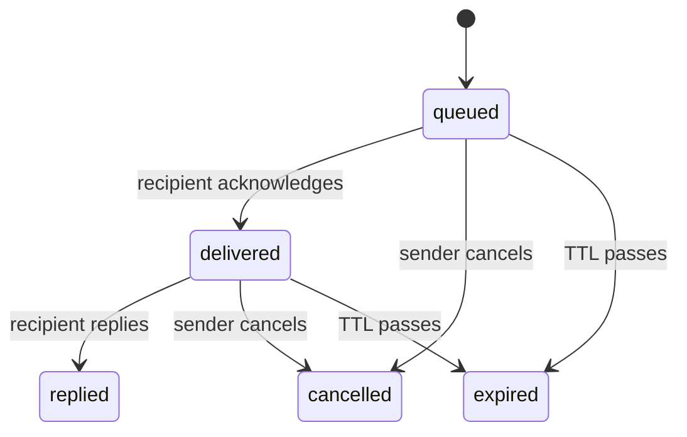

# Write KXM documentation

Write a docs page that matches the rest of the KXM documentation and passes the
doc gates on the first try. This guide covers where a page goes, the page
template, the style rules, diagrams, and the checks that run on every pull
request.

## Before you begin

- Read the [glossary](../glossary.md). The normative vocabulary is
  [Canonical terminology](../contracts/terminology.md).
- Run `npm ci` in your checkout so `markdownlint-cli2` is installed.
- Confirm every command you document against the code. Run
  `node scripts/kxm.mjs <group> <command> --help` and check that the `Usage:`
  line names the full command path: an unknown subcommand prints the group's
  help instead.

## Choose where the page goes

| Directory | Holds | Page type |
|---|---|---|
| `docs/start/` | Install and first-run tutorials | Tutorial |
| `docs/guides/` | Task-focused guides for one feature | How-to |
| `docs/reference/` | Commands, tools, endpoints, configuration | Reference |
| `docs/concepts/` | How KXM works and why | Explanation |
| `docs/operations/` | Deploy, monitor, back up, upgrade, troubleshoot | How-to; the troubleshooting page is reference |
| `docs/contributing/` | Development, CI, tests, this guide | How-to or reference |
| `docs/contracts/` | Normative target contracts | Reference |
| `docs/adr/` | Architecture decision records | Explanation |
| `docs/kb/`, `docs/prompts/`, `docs/templates/` | Short answers, prompt templates, artifact templates | Frontmatter pages |

Everything under `docs/` ships in the npm package, so write for readers outside
this repository. Add every new page to [the docs index](../README.md).

## Choose the page type

Each page is one type. When a page needs two, split it.

| Type | Shape |
|---|---|
| Tutorial | Numbered steps on a single path, no options, and a verification step at the end |
| How-to | Goal-titled; options allowed; assumes the reader knows the concepts |
| Reference | No "Before you begin"; tables grouped by object; each entry is name, type, default, effect |
| Explanation | Few or no commands; a diagram first; "Why" and "Trade-offs" sections |

## Start from the page template

Copy this skeleton for human-facing pages. The `kxm.doc.v1` files in
`docs/templates/` are for machine-consumed artifacts, not for docs pages.

````markdown
# <Task- or topic-named title in sentence case>

<One paragraph, at most 3 sentences: what this page helps you do, who it is for,
and the outcome. Link the key concept on first mention, for example [hub](../glossary.md#hub).>

## Before you begin

- <Installed tools and minimum versions, for example the `kxm` CLI>
- <Running services, for example a hub started with `kxm hub start`>
- <Credentials or permissions, for example the project token, never the admin token>

## <Step or topic 1: imperative verb for how-tos>

<Short explanation, at most 80 words per paragraph.>

```bash
kxm <command> --flag value
```

<details><summary>PowerShell</summary>

```powershell
$env:KXM_EXAMPLE = "value"
kxm <command> --flag value
```

</details>

Expected output:

```text
<exact, trimmed output>
```

> [!NOTE]
> <Context that helps but is not required.>

## <Step or topic 2>

…

## Troubleshooting

| Symptom | Cause | Fix |
|---|---|---|

## Next steps

- <Next task>: [Page](…)
- <Deeper concept>: [Page](…)
- <Exact reference>: [Page](…)
````

## Follow the style rules

### Voice

- Write in the second person ("you"), present tense and active voice.
- Use the imperative for steps: "Start the hub", not "You should start the hub".
- Stay formal: no contractions. Use American spelling.

### Titles and headings

- One H1 per page, in sentence case, matching its entry in the docs index.
- Task titles start with a verb: "Back up and restore the hub".
- Do not skip heading levels, and do not use bold lines as headings.
- Keep version numbers out of headings.

### Openings and endings

- Open with one paragraph of at most three sentences: what, who, and outcome.
  Never start with "This document describes".
- Every tutorial and how-to has a "Before you begin" list.
- End tutorials and how-tos with "Next steps", and reference and explanation
  pages with "Related". Nothing comes after it.

### Code blocks

- Tag every fence with its language. Shell commands are `bash`, never `text`.
- Show Bash first. Add PowerShell only where it differs, in a second block or a
  `<details><summary>PowerShell</summary>` block.
- Keep commands and output in separate blocks. Introduce output with
  "Expected output:" and a `text` fence.
- Write one command per line with no `$` prompt. Use `#` comments for context.
- Write placeholders as `<lower-kebab>`. Write secrets as `replace-with-…`, and
  never pass a secret as a command-line argument.
- Show `kxm …` in user docs. Show `node scripts/kxm.mjs …` only in contributing
  docs.
- Put chat and slash commands in a `text` fence introduced by "In Claude Code:"
  or "In Pi:".
- Name a configuration file on the line above its block, for example
  "`.kxm/workflows/review.yaml`:".

### Tables, lists and length

- Use tables for enumerable facts: flags, variables, fields, error codes,
  endpoints. Keep to four columns and 25 words per cell.
- Move anything longer into prose under its own subheading.
- Use numbered lists for ordered steps and bullets for unordered sets.
- Never put a blank line inside a table. GitHub stops the table there, and the
  linter does not notice.
- Keep paragraphs under 80 words and sections under about 400 words. Split a
  page over about 2,500 words unless it is a pure reference table.

### Callouts

Use GitHub alerts only, at most one per screen, never stacked:

| Alert | Use it for |
|---|---|
| `> [!NOTE]` | Context that helps but is not required |
| `> [!TIP]` | A shortcut |
| `> [!IMPORTANT]` | A prerequisite or status that silently breaks things if ignored |
| `> [!WARNING]` | Security or data-loss risk |
| `> [!CAUTION]` | An irreversible action |

### Links

- Use relative links, and link the first mention of a glossary term.
- Do not link from `docs/` into `plans/`. It is internal and is not in the npm
  package.
- Do not cite source line numbers such as `hub.ts:1432`. Link a file, or name a
  symbol.
- Mention test paths only in contributing docs.

### Status, versions and honesty

- Describe current behavior. No release numbers such as "0.4.x" in prose;
  changes belong in `CHANGELOG.md`.
- Planned behavior appears only in `contracts/` and `adr/`, marked with
  `> [!IMPORTANT]` and the word "Planned:".
- Cite a schema version only in a reference page that names the constant it
  comes from.
- Say what is not guaranteed wherever a reader could over-read a feature: KXM
  is single-node and at-least-once, is not a sandbox, and a quorum proves who
  answered, not that the answer is true.

### Terminology

Follow the [glossary](../glossary.md). The rules that come up most:

- The product is **KXM**. KontextMind is the organization and the separate
  knowledge plane. Retired product names fail a test (see
  [Retired names](#retired-names)).
- Put tool, command, file and field names in code font.
- Qualify overloaded words: a **gate command**, an **evidence gate**, a
  **witness gate**; a **hub workflow run** versus a **Runtime run**; a
  **session manifest** versus a **Pi session**; a **suite skill** versus a
  **governed skill**.
- Keep internal jargon, such as issue numbers, phase names, tracking labels and
  model nicknames, out of every page outside `docs/contributing/`.

### Frontmatter

Only pages in `kb/`, `prompts/`, `templates/` and `adr/` carry `kxm.doc.v1`
YAML frontmatter. Human-facing guides have none. No JSON Schema for `kxm.doc.v1`
exists yet, so nothing validates those fields: keep them consistent with the
neighboring files.

## Draw diagrams

A diagram earns its place when it shows a topology, an interaction or a
lifecycle that prose would need several paragraphs for.

- Use Mermaid only: `flowchart LR` for topology, `sequenceDiagram` for
  interactions, `stateDiagram-v2` for lifecycles.
- Keep to about 12 nodes and label every edge.
- Precede each diagram with a one-sentence summary for screen readers and
  raw-Markdown readers.
- Check every node and edge against the code before you draw it.
- Do not add ASCII diagrams. Replace one when you edit its page.

For example, a simplified lifecycle with its summary sentence:

A message is queued, delivered to its recipient, then settled by a reply,
a cancellation or its expiry.



## Pass the doc gates

Every check below except the link check runs on every pull request, including
documentation-only ones. Run them locally first.

### Markdown lint

```bash
npm run lint:docs
# Or lint the files you changed (the config's globs are still applied).
npx --no-install markdownlint-cli2 docs/guides/my-page.md
```

`.markdownlint-cli2.jsonc` covers the root `*.md` files, `docs/`, `.kxm/`,
`plans/`, `plugins/` and `.github/`. It turns off line length (MD013), table
column style (MD060), single H1 (MD025, because frontmatter carries a `title`)
and inline HTML (MD033). The linter does not catch a table split by a blank
line, a dead link, or a PowerShell-only example, so check those yourself.

### Retired names

`test/core/docs-copy.test.ts` fails when a scanned file contains a retired
product name, a retired command, a retired doc path, or a bare binary name from
the old packaging. The exact list is the `FORBIDDEN` array in that test.

It scans `README.md`, `AGENTS.md`, `CLAUDE.md`, everything under `docs/` and
`.claude/`, every `README.md` under `plugins/`, and every Markdown file a bundled
skill ships. It does not scan `CONTRIBUTING.md`, `SECURITY.md` or the READMEs
under `.kxm/`, so take extra care there.

### Pinned paths

Some documents are read by tests or code at a fixed path. Renaming one, or
removing the text a test expects, breaks the build. Update the reader in the
same pull request.

| Document | Read by | What must stay true |
|---|---|---|
| `docs/guides/provenance-gates.md` | `test/core/examples.test.ts` | The file exists and keeps the project-token JSON and the three `--name … --project provenance-demo` commands |
| `docs/contributing/assignment-runner.md`, `docs/contracts/routing.md`, `docs/operations/troubleshooting.md`, `docs/reference/workflow-catalog.md` | `test/core/harness-run.test.ts` | Each file exists, and every `just <verb>` it shows is a recipe in `justfile` |
| `docs/guides/browser-automation.md` | `plugins/kxm/src/modes.ts` | The `browser` mode loads it as a context file at run time; a rename drops it silently |
| `docs/reference/workflow-catalog.md` | `plugins/kxm/src/init-guide-setup.ts`, `plugins/kxm/src/cli/system.ts` | Interactive `kxm init` prints this path; the code transcribes its catalog |
| `docs/contributing/tui-components.md` | `packages/core/tui/README.md` | The package README links it |
| `docs/contracts/validation.md` | `schemas/README.md` | The schemas README links it |
| `docs/contracts/synchronization.md` | `plugins/kxm/src/sync-transform.ts` | A code comment cites it |
| `plugins/kxm/README.md` | `test/core/claude-plugin-docs.test.ts` | Its tool table lists every tool the MCP server publishes |
| `README.md` | `test/core/docs-copy.test.ts`, the npm `files` list | Stays at the repository root |
| `AGENTS.md`, `SECURITY.md` | `plugins/kxm/src/modes.ts` | Mode context files; they stay at the repository root |

### Documented `just` recipes

For the four documents in the `harness-run.test.ts` row above, the test reads
every `just <verb>` written in inline code or at the start of a fenced line. A
verb that is not a `justfile` recipe fails the test. Name a recipe that does not
exist only in prose, never in command form.

### Check links

No CI job checks links yet. Before you open a pull request, run this check on
the files you changed; it prints each relative link whose target is missing:

```bash
node --input-type=module -e '
import { existsSync, readFileSync } from "node:fs";
import { dirname, resolve } from "node:path";
let bad = 0;
for (const file of process.argv.slice(1)) {
  const text = readFileSync(file, "utf8").replace(/```[\s\S]*?```/g, "");
  for (const [, link] of text.matchAll(/\]\(([^)\s#]+)(?:#[^)\s]*)?\)/g)) {
    if (/^[a-z]+:/.test(link) || existsSync(resolve(dirname(file), link))) continue;
    console.log(`${file}: ${link}`);
    bad += 1;
  }
}
process.exitCode = bad ? 1 : 0;
' docs/guides/my-page.md
```

It does not check `#anchor` fragments. Open the rendered page on GitHub and
follow each anchor link once.

## Checklist before you open a pull request

1. The page has one H1, an opening paragraph, "Before you begin" where it
   applies, and ends with "Next steps" or "Related".
2. Every command was run, or checked with `node scripts/kxm.mjs <group> <command> --help`.
3. Every code fence has a language, and Bash comes before PowerShell.
4. No table has a blank line inside it, and no cell runs past 25 words.
5. The page is in [the docs index](../README.md), and pages that should point
   to it do.
6. `npm run lint:docs` passes and the link check prints nothing.
7. If you moved or renamed a doc, you updated every reader in
   [Pinned paths](#pinned-paths) and ran `npm run test:core`.

## Next steps

- Set up a checkout and run the full gate: [Develop KXM](development.md)
- See which CI jobs run on a docs-only change: [CI and release](ci-and-release.md)
- Look up a term: [Glossary](../glossary.md)
