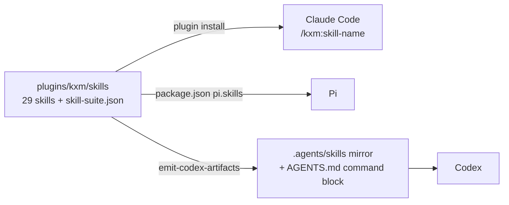

# Agent skills

KXM ships a suite of Agent Skills that teach a coding agent how to use the `kxm` CLI and the `kxm_*` tools safely: which command owns a task, which verbs exist, and which steps belong to a person. This page is for anyone running KXM from Claude Code, Pi or Codex, and for contributors who edit the skills. Skills document the CLI; they grant no permission, admit no writer and replace no trusted `.kxm/roster.yaml` policy.

Governed skills that your own runs produce are a separate lifecycle; see [Governed skills](governed-skills.md).

## Before you begin

- KXM installed in your harness: the Claude Code plugin or the Pi package. See [Install](../start/install.md).
- The `kxm` CLI on your `PATH`, because the skills teach CLI commands.

## How harnesses load the suite

All 29 skills live in `plugins/kxm/skills/` and are declared in `plugins/kxm/skill-suite.json`. The flowchart shows how each harness finds them.



| Harness | How it loads the skills | Status |
|---|---|---|
| Claude Code | The installed plugin loads `plugins/kxm/skills`. The model picks a skill by its description, or you invoke one as `/kxm:<name>` | Verified |
| Pi | `pi install` reads the `pi` section of the package manifest: `"pi": {"skills": ["./plugins/kxm/skills"]}` | Verified |
| Codex | Reads the `.agents/skills/` mirror and the `AGENTS.md` command block in the KXM repository checkout. KXM does not install skills into other projects | Verified in the KXM repository |
| Kimi, Copilot, OpenCode and other `.agents/skills` readers | Not tested | Unverified |

In Claude Code:

```text
/kxm:kxm-project-setup
```

## Start with the router

The `kxm` skill is the entry point. It owns no command. It maps a request to the skill that owns it, lists which skill covers each `kxm_*` tool, and carries the rules every skill shares:

- Agent-command surfaces (`kxm peer`, `kxm workflow`, `kxm context` and the MCP and Pi tools) fail closed with `tool_policy_denied` when the attempt or session policy does not grant the tool. Other CLI mutations are not policy-gated and need explicit authorization.
- Never put credentials in peer messages; verify peer output before acting on it; keep one writer per checkout.
- Credentials, starting and binding the hub, plugin configuration, and committing `.kxm` permission changes are the user's actions.
- Teach only verbs and options that `kxm <group> <verb> --help` prints. An unknown subcommand prints the group's help and exits 0, so confirm a verb by its `Usage:` line.

## KXM command skills

Every top-level `kxm` command is owned by exactly one skill. A skill can own several commands.

| Skill | Commands owned | Use it to |
|---|---|---|
| `kxm` | none | Pick the right skill or `kxm_*` tool and follow the shared safety rules |
| `kxm-project-setup` | `init`, `trust`, `config`, `completion` | Set up a repository, review permission changes, configure, and run a first workflow |
| `kxm-harness-auth` | `harness`, `auth`, `update`, `runtime`, `agent`, `models`, `routes`, `ssh` | Check harness auth, update, run the Runtime supervisor, refresh models, admit routes, use SSH and Pi workers |
| `kxm-hub-ops` | `hub`, `backup`, `restore`, `tenant` | Start, inspect, bind and stop the hub, read tenant status, back up and restore |
| `kxm-session` | `session`, `dash`, `studio` | Read session and hub status and open dashboard or studio screens |
| `kxm-peer` | `peer` | Delegate to, fan out to, await and answer other agents |
| `kxm-workflow` | `workflow`, `gate` | Record journal entries, pass checkpoints and wait on signed callbacks |
| `kxm-definitions` | `role` | Inspect or edit roles and model rosters without granting writer admission |
| `kxm-runs` | `run`, `runs`, `lane`, `assign` | Create, drive, inspect and cancel runs, manage worktree lanes, smoke-test a workflow, or call the assignment runner |
| `kxm-context-memory` | `context`, `memory`, `explain` | Recall what the project knows, explain a context footprint, record memory candidates |
| `kxm-skill-lifecycle` | `skills` | Turn a repeated practice into a governed skill candidate |
| `kxm-routing-improve` | `routing`, `improve` | Find what KXM learned and what repeats, and read recorded route spend |
| `kxm-tasks` | `suggest`, `goal`, `task` | Pick a workflow and plan work as goals and tasks |

Tools map the same way: peer tools to `kxm-peer`, workflow tools to `kxm-workflow`, `kxm_context`, `kxm_recall`, `kxm_state`, `kxm_episode` and `kxm_promote` to `kxm-context-memory`, and `kxm_improvement_report` to `kxm-routing-improve`. The full tool list is in [MCP and Pi tools](../reference/tools.md).

## Browser automation skills

These skills drive a remote Steel browser that you host. They own no `kxm` command. See [Browser automation](browser-automation.md) and [ADR-0002](../adr/ADR-0002-browser-automation-steel-doks.md).

| Skill | Use it to |
|---|---|
| `kxm-browser-session` | Start, attach to, inspect and release a remote Steel browser session |
| `kxm-browser-takeover` | Hand a session to a human for MFA, login, CAPTCHA or sensitive consent, then resume |
| `kxm-browser-auth` | Use stored credentials and authenticated browser profiles safely |
| `kxm-browser-explore` | Explore a site, inspect its DOM and map a user flow with `agent-browser` |
| `kxm-browser-verify` | Reproduce a UI bug, gather evidence and write a durable Playwright test |
| `kxm-browser-diagnostics` | Diagnose Steel connectivity, CDP errors and timeouts, and clean up orphaned sessions |
| `kxm-browser-annotate` | Capture page sections, attach structured annotations and hand the changes to an agent |

## KontextMind knowledge-plane skills

Nine skills teach KontextMind, a separate product with its own `kontext` CLI, server and `km_` tools. They are not KXM and never use the `kxm_*` tools. Each description starts with "KontextMind knowledge plane only, the separate kontext CLI and km_ tools, not KXM" and says to use it only when the user names KontextMind, the `kontext` CLI or a `km_` tool, so a KXM request never loads them. `plugins/kxm/skills/SUITE.md` introduces them and `plugins/kxm/skills/hints.json` holds their slash hints.

| Skill | Use it to |
|---|---|
| `kxm-mind` | Route a KontextMind request to the matching knowledge-plane skill |
| `kxm-query` | Search and read a mind with provenance |
| `kxm-harvest` | Draft redacted session learnings into a mind |
| `kxm-triage` | Work the KontextMind review queue |
| `kxm-work` | Read or update tracker work state and handoffs |
| `kxm-insights` | List or dismiss insights |
| `kxm-projects` | Manage mind repositories and members |
| `kxm-protocol` | Explain KontextMind contracts, trailers, trust modes and authorization |
| `kxm-mind-setup` | Connect a machine to a KontextMind server with the `kontext` CLI |

`kxm-mind-setup` was named `kxm-setup` before; the old name has no alias. `kxm-protocol` points to KontextMind's own documentation, which lives outside this repository.

## Bundled, governed and repo-local skills

| Kind | Where it lives | Who changes it |
|---|---|---|
| Suite skill | `plugins/kxm/skills/`, shipped with the plugin and package | KXM maintainers, in Git |
| Governed skill | `.kxm/skills/` in your repository | Your runs propose it; a reviewer promotes it. See [Governed skills](governed-skills.md) |
| Repo-local skill | `.agents/skills/` in a repository, outside the suite | That repository's maintainers. Example: [Repository work delivery](../contributing/repo-work-delivery.md) |

Telemetry never promotes a skill of any kind.

## Write skill descriptions

The description decides when a harness loads a skill, so every skill in the suite follows these rules:

- Say what the skill does and when to use it, key use case first, in at most 1,024 characters.
- Write a single line that parses as strict YAML. An unquoted value cannot contain `': '` anywhere.
- Do not add `allowed-tools`.
- Do not use retired product names, `pi-extensions` or `mcp__`.
- Do not teach `--issue` on token commands. `kxm session brief` saves a 24-hour operator session token, so it is never an agent step; name it only under an `## Operator steps` heading.
- Knowledge-plane skills keep the KontextMind opening and closing sentences described above.

## Maintain the suite

Contributors edit skills in `plugins/kxm/skills/`, the only source of truth.

1. Declare every skill directory in `plugins/kxm/skill-suite.json` with `name`, `path`, `ownedCommands` and a 10 to 200 character `intent`.
2. When you add a top-level command, give it to exactly one skill.
3. Regenerate the Codex mirror with `scripts/emit-codex-artifacts.mjs`. It replaces the suite's directories in `.agents/skills/`, leaves unrelated skills alone, and fails closed on a missing, symlinked or malformed manifest.

CI checks that every command has one owner, every skill directory is declared, every description parses as strict YAML within the length limit, the knowledge-plane skills stay separate, taught verbs exist, and the mirror matches. See [Development](../contributing/development.md) for how to run those checks.

## Next steps

- Install the plugin or package: [Install](../start/install.md)
- Govern skills your runs produce: [Governed skills](governed-skills.md)
- Plugin settings, channels and tools: [KXM plugin for Claude Code](../../plugins/kxm/README.md)
- Every command a skill teaches: [CLI reference](../reference/cli-reference.md)
