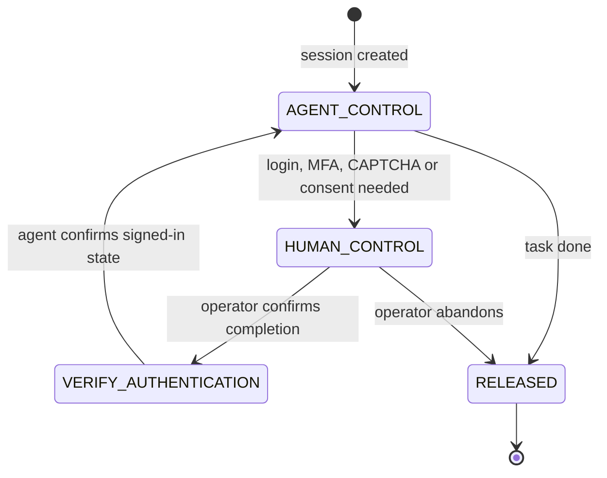

# Browser automation

Give agents a real browser without giving them your desktop: KXM's browser skills drive a remote [Steel](https://github.com/steel-dev/steel-browser) browser that you host, explore pages with `agent-browser`, verify fixes with Playwright, and hand control to a person for login, MFA or consent. This page is for developers and operators. The `browser` mode names this page as its context file (`kxm explain --mode browser` counts it), so it stays short and procedure-first.

## Before you begin

- A Steel deployment you operate, reachable over HTTPS, and its API key. [ADR-0002](../adr/ADR-0002-browser-automation-steel-doks.md) describes the reference deployment on Kubernetes.
- `curl` and `jq`. Optionally `agent-browser` for exploration and Playwright for tests.
- A secret manager for the API key. The bundled skills use `pass-cli`.
- The `kxm-browser-*` skills from the plugin or Pi package. See [Agent skills](agent-skills.md#browser-automation-skills).

## Components

| Component | Role |
|---|---|
| Steel | Runs isolated Chromium sessions and exposes a REST API, a CDP WebSocket and a session viewer |
| `agent-browser` | Fast, token-efficient exploration: accessibility snapshots, navigation, DOM inspection |
| Playwright | Assertions, bug reproductions, visual proof and permanent regression tests |
| Secret manager | The only place the Steel API key and site credentials live |
| Human operator | Completes MFA, CAPTCHA, SSO or consent in the session viewer |

## Configure the Steel endpoint

The KXM browser library reads these variables, and the shell procedure below uses the same names so both agree.

| Variable | Default | Effect |
|---|---|---|
| `STEEL_API_URL` | A KontextMind-operated deployment | Base URL of your Steel API. Always set it |
| `STEEL_UI_URL` | `$STEEL_API_URL/ui` | Base URL of the session viewer |
| `STEEL_API_KEY` | A `pass-cli` lookup | The API key. When unset, the library runs a `pass-cli` lookup of a fixed KontextMind vault item |
| `USE_PASS_CLI` | enabled | Set to `false` to disable that `pass-cli` fallback |

> [!WARNING]
> Set `STEEL_API_URL` and `STEEL_API_KEY` explicitly. Without them the library falls back to KontextMind's own deployment and vault item, which are not yours to use.

```bash
export STEEL_API_URL="https://steel.example.com"
# Read the key from your secret manager; <vault> and <item> are yours.
export STEEL_API_KEY="$(pass-cli item view --vault-name '<vault>' --item-title '<item>' --field STEEL_API_KEY)"
export USE_PASS_CLI=false
```

| Endpoint | Purpose |
|---|---|
| `POST /v1/sessions` | Create a session; body `{"timeout": <ms>}` |
| `GET /v1/sessions/<id>` | Inspect one session; `GET /v1/sessions` lists them all |
| `POST /v1/sessions/<id>/release` | Release a session |
| `POST /v1/scrape`, `POST /v1/screenshot` | One-shot page fetch or screenshot without a session |
| `wss://<steel-host>/v1/devtools?sessionId=<id>&apiKey=<key>` | CDP endpoint for `agent-browser` and Playwright |
| `$STEEL_UI_URL?sessionId=<id>` | Session viewer for human takeover |

The CDP URL carries the API key in its query string. Treat it as a secret: never paste it into chat, a prompt, an issue or a log.

## Run a browser task

1. Define a helper that sends the key as a header read from standard input, so it never appears in a process list:

   ```bash
   steel() {  # usage: steel METHOD PATH [JSON-BODY]
     local args=(-sS -X "$1" "$STEEL_API_URL$2" -H @- -H 'Content-Type: application/json')
     if [ -n "${3:-}" ]; then args+=(-d "$3"); fi
     printf 'x-steel-api-key: %s\n' "$STEEL_API_KEY" | curl "${args[@]}"
   }
   ```

2. Create a session. Use one session per task; 300,000 ms (5 minutes) is the default. Your Steel deployment sets the maximum; the skills assume 30 minutes.

   ```bash
   SESSION_ID=$(steel POST /v1/sessions '{"timeout": 300000}' | jq -r .id)
   echo "Session: $SESSION_ID"
   ```

3. Attach one automation client over CDP: `chromium.connectOverCDP(<cdp-url>)` in Playwright, or `agent-browser --cdp "<cdp-url>"`. Check the session's state with `steel GET "/v1/sessions/$SESSION_ID"`.
4. For a quick fetch that needs no session, scrape instead:

   ```bash
   steel POST /v1/scrape '{"url": "https://example.com"}'
   ```

5. Release the session when the task ends, even when it failed. Disconnecting a client does not release the session; it stays open for a human until it is released or times out.

   ```bash
   steel POST "/v1/sessions/$SESSION_ID/release"
   ```

<details><summary>PowerShell</summary>

```powershell
$headers = @{ "x-steel-api-key" = $env:STEEL_API_KEY }
$session = Invoke-RestMethod -Method Post -Uri "$env:STEEL_API_URL/v1/sessions" -Headers $headers -ContentType "application/json" -Body '{"timeout": 300000}'
Invoke-RestMethod -Method Post -Uri "$env:STEEL_API_URL/v1/sessions/$($session.id)/release" -Headers $headers
```

</details>

## Hand control to a human

When a site asks for MFA, a CAPTCHA, SSO or sensitive consent, the agent stops and a person takes over. The diagram shows who controls the session in each state.



1. **Pause.** The agent stops all automated input and says why it needs a person.
2. **Share the viewer link.** It gives the operator `$STEEL_UI_URL?sessionId=<id>`, never the CDP URL.
3. **Operator acts.** The operator opens the viewer, completes the step, and confirms in the terminal, for example `auth complete`.
4. **Verify, then resume.** The agent inspects the page, confirms the signed-in state, refreshes its DOM snapshot, and only then continues.

The KXM browser library tracks these states in the process that owns the session. Steel itself does not know them; in a shell-driven task they are a protocol the agent announces. Only one controller, agent or human, acts at a time.

## Control cost and resources

- **Timeouts.** Sessions end on their own when the timeout expires. Set a longer timeout at creation when a person will need time for a login step.
- **Orphan sweeps.** List sessions with `steel GET /v1/sessions` and release any you do not track. The library flags untracked sessions older than 10 minutes, and tracked ones idle that long unless a human holds them.
- **Shared memory.** Give Chromium a large `/dev/shm`, or tabs crash. On Kubernetes, mount a memory-backed `emptyDir` there; the reference deployment uses 2 GiB.
- **No shared profiles.** Concurrent sessions must not write to the same browser profile.

## Troubleshooting

| Symptom | Cause | Fix |
|---|---|---|
| `401` or `403` from Steel | Missing or wrong API key | Re-export `STEEL_API_KEY` from your secret manager |
| Requests go to an unexpected host | `STEEL_API_URL` is unset | Export it before starting the agent |
| Playwright opens a local browser | The client did not attach over CDP | Use `connectOverCDP` with the session's CDP URL |
| Signed-in state is gone | The session expired or was released | Create a new session and repeat the takeover |
| The viewer shows the page but clicks do nothing | The viewer is a screencast, and some capture modes do not forward clicks | Use the DevTools inspector at `$STEEL_API_URL/v1/devtools/inspector.html`, with the agent paused |

## Knowledge base

- [How are credentials retrieved without exposing them to the model?](../kb/how-credentials-retrieved-safely.md)
- [How do I capture a UI section and annotate changes for an agent?](../kb/how-to-capture-and-annotate-section.md)
- [How do I connect Playwright to the existing Steel session?](../kb/how-to-connect-playwright-to-steel.md)
- [How do I recover an expired session or remove an orphaned browser?](../kb/how-to-recover-expired-session-or-orphan.md)
- [How does an agent resume after MFA?](../kb/how-to-resume-after-mfa.md)
- [How do I take over a browser session to log in?](../kb/how-to-take-over-session.md)
- [Why did authentication disappear?](../kb/why-authentication-disappeared.md)
- [Why did automation open a different browser?](../kb/why-automation-opened-different-browser.md)
- [Why can I view a session but not control it?](../kb/why-session-viewer-cannot-control.md)

## Prompt templates

- [Starting browser work](../prompts/browser-start.md)
- [Exploring an application](../prompts/browser-explore.md)
- [Requesting human takeover](../prompts/browser-takeover.md)
- [Diagnosing and recovering a failed session](../prompts/browser-diagnose-recover.md)
- [Reproducing a UI bug and writing a Playwright test](../prompts/browser-repro-fix.md)
- [Capturing UI section annotations](../prompts/browser-annotate-feedback.md)

## Next steps

- The seven browser skills: [Agent skills](agent-skills.md#browser-automation-skills)
- Why Steel, and the reference deployment: [ADR-0002](../adr/ADR-0002-browser-automation-steel-doks.md)
- Estimate the `browser` mode's prompt footprint: [`kxm explain`](../reference/cli-reference.md#kxm-explain)
