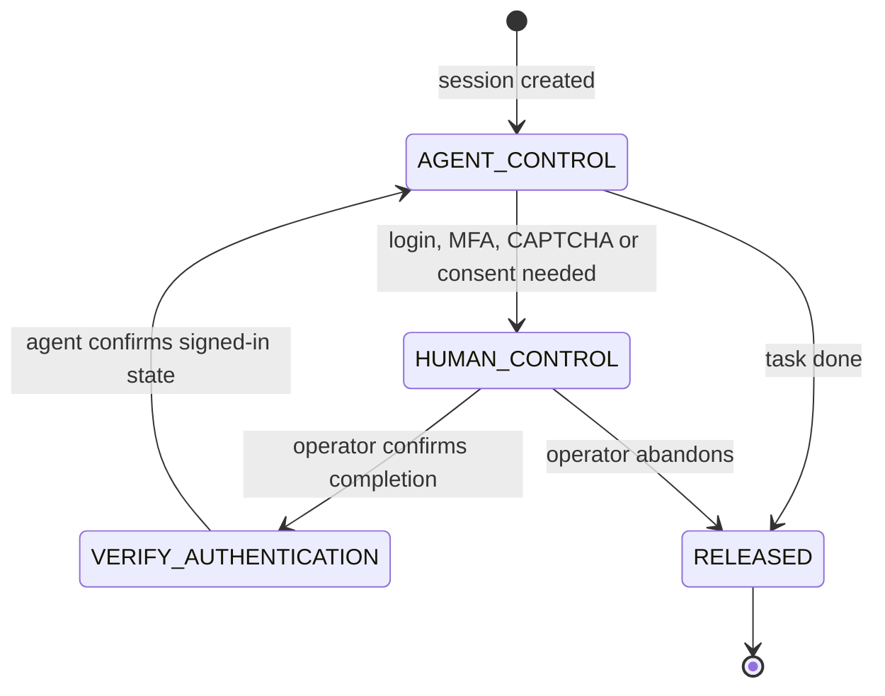

# Browser automation

Give agents a real browser without giving them your desktop. Playwright testing and verification use [Obscura](https://github.com/h4ckf0r0day/obscura) by default. Steel remains for human takeover, MFA, and the live session viewer. Explore pages with `agent-browser`, and hand a Steel session to a person for login, MFA, or consent. This page is for developers and operators. The `browser` mode names this page as its context file (`kxm explain --mode browser` counts it), so it stays short and procedure-first.

## Before you begin

- For Playwright: Node, and `node scripts/obscura.mjs` (it downloads pinned Obscura v0.2.3). [ADR-0005](../adr/ADR-0005-obscura-default-playwright.md) records that default.
- For takeover: a Steel deployment you operate, reachable over HTTPS, and its API key. [ADR-0002](../adr/ADR-0002-browser-automation-steel-doks.md) describes the reference deployment on Kubernetes.
- `curl` and `jq`. Optionally `agent-browser` for exploration. Playwright tests use Obscura; do not run `playwright install`.
- A secret manager for the API key. The bundled skills use `pass-cli`.
- A Steel deployment you operate, reachable over HTTPS, and an Authentik app password when that host is behind forward auth. [ADR-0002](../adr/ADR-0002-browser-automation-steel-doks.md) describes the reference deployment on Kubernetes.
- `curl` and `jq`. Optionally `agent-browser` for exploration and Playwright for tests.
- A secret manager for the app password and site credentials. The bundled skills use `pass-cli`.
- The `kxm-browser-*` skills from the plugin or Pi package. See [Agent skills](agent-skills.md#browser-automation-skills).

## Components

| Component | Role |
|---|---|
| Obscura | Default headless browser for Playwright (`chromium.connectOverCDP`) |
| Steel | Isolated Chromium sessions, a REST API, a CDP WebSocket, and a session viewer for takeover |
| `agent-browser` | Fast, token-efficient exploration: accessibility snapshots, navigation, DOM inspection |
| Playwright | Assertions, bug reproductions, visual proof and permanent regression tests |
| Secret manager | The only place the Steel API key and site credentials live |
| Human operator | Completes MFA, CAPTCHA, SSO or consent in the Steel session viewer |

## Run Playwright on Obscura

`resolveBrowserCdpEndpoint()` returns the Obscura URL unless `KXM_BROWSER=steel`. The launcher and the settings are in [How do I connect Playwright to Obscura?](../kb/how-to-connect-playwright-to-obscura.md) and [Browser settings](../reference/configuration.md#browser-automation).

```bash
node scripts/obscura.mjs --ensure
npm run e2e
```

Set `video: "off"` in Playwright. Obscura does not record video. Connect with the worker-scoped `browser` fixture and `chromium.connectOverCDP()`. `chromium.connect` and `use.connectOptions` are not supported.
| Secret manager | The only place the Authentik app password and site credentials live |
| Human operator | Completes MFA, CAPTCHA, SSO or consent in the session viewer |

## Configure the Steel endpoint

The KXM browser library reads these variables, and the shell procedure below uses the same names so both agree.

KontextMind's Steel hosts (`steel.kontextmind.com` and `steel.theneuro.me`, including the `wss://` CDP endpoint) sit behind Authentik forward auth at the reverse proxy. Steel itself does not check an API key. Unauthenticated requests receive a 302 redirect to the Authentik login at `id.kxmd.dev`. Authentik accepts an app password only as `Authorization: Basic`. A Bearer token is refused.

| Variable | Default | Effect |
|---|---|---|
| `STEEL_API_URL` | A KontextMind-operated deployment | Base URL of your Steel API. Always set it |
| `STEEL_UI_URL` | `$STEEL_API_URL/ui` | Base URL of the session viewer |
| `STEEL_AUTH_HEADER` | unset | Full `Authorization` value. Wins over the other auth variables |
| `STEEL_AUTH_BASIC` | unset | `base64(user:token)`, with or without a leading `Basic` prefix. Sent as `Authorization: Basic` |
| `STEEL_AUTH_USER` | unset | Authentik username, for example `svc-steel`. Used with `STEEL_AUTH_TOKEN` |
| `STEEL_AUTH_TOKEN` | unset | Authentik app password. Used with `STEEL_AUTH_USER` |
| `STEEL_API_KEY` | A `pass-cli` lookup | Deprecated. Sent as `x-steel-api-key` and as `?apiKey=` on the CDP URL, which the proxy still accepts as a temporary shim. The library warns once on stderr |
| `USE_PASS_CLI` | enabled | Set to `false` to disable the legacy `STEEL_API_KEY` `pass-cli` fallback |

Set one Authentik credential. Precedence is `STEEL_AUTH_HEADER`, then `STEEL_AUTH_BASIC`, then `STEEL_AUTH_USER` together with `STEEL_AUTH_TOKEN`. If only one of the user or token pair is set, configuration fails instead of falling back to the legacy key. When any of those are set, the legacy key is not sent and is not placed in a URL. The `pass-cli` fallback looks up `STEEL_API_KEY` only.

> [!WARNING]
> Set `STEEL_API_URL` and an Authentik credential explicitly. Without them the library falls back to KontextMind's own deployment and vault item, which are not yours to use. Never put the credential in a URL, a prompt, or a log.

```bash
export STEEL_API_URL="https://steel.example.com"
# Read the app password from your secret manager; <vault> and <item> are yours.
export STEEL_AUTH_USER="svc-steel"
export STEEL_AUTH_TOKEN="$(pass-cli item view --vault-name '<vault>' --item-title '<item>' --field password)"
export USE_PASS_CLI=false
```

`STEEL_AUTH_BASIC` is the same pair already encoded: `printf '%s:%s' "$STEEL_AUTH_USER" "$STEEL_AUTH_TOKEN" | base64 | tr -d '\n'`. Prefer the user and token pair, or the pre-encoded value, and keep them in the environment of the process that calls Steel.

| Endpoint | Purpose |
|---|---|
| `POST /v1/sessions` | Create a session; body `{"timeout": <ms>}` |
| `GET /v1/sessions/<id>` | Inspect one session; `GET /v1/sessions` lists them all |
| `POST /v1/sessions/<id>/release` | Release a session |
| `POST /v1/scrape`, `POST /v1/screenshot` | One-shot page fetch or screenshot without a session |
| `wss://<steel-host>/v1/devtools?sessionId=<id>` | CDP endpoint. Send `Authorization` on the WebSocket handshake; do not add the credential to this URL |
| `$STEEL_UI_URL?sessionId=<id>` | Session viewer for human takeover |

## Run a browser task

1. Define a helper that sends `Authorization` on stdin, so the secret never appears in a process list:

   ```bash
   steel() {  # usage: steel METHOD PATH [JSON-BODY]
     local basic
     local args=(-sS -X "$1" "$STEEL_API_URL$2" -H @- -H 'Content-Type: application/json')
     if [ -n "${3:-}" ]; then args+=(-d "$3"); fi
     basic="$(printf '%s:%s' "$STEEL_AUTH_USER" "$STEEL_AUTH_TOKEN" | base64 | tr -d '\n')"
     printf 'Authorization: Basic %s\n' "$basic" | curl "${args[@]}"
   }
   ```

2. Create a session. Use one session per task; 300,000 ms (5 minutes) is the default. Your Steel deployment sets the maximum; the skills assume 30 minutes.

   ```bash
   SESSION_ID=$(steel POST /v1/sessions '{"timeout": 300000}' | jq -r .id)
   echo "Session: $SESSION_ID"
   ```

3. For exploration, attach `agent-browser --cdp "<cdp-url>"`. Playwright tests use Obscura. Set `KXM_BROWSER=steel` and `chromium.connectOverCDP(<cdp-url>)` only when the test must drive this takeover session. Check the session's state with `steel GET "/v1/sessions/$SESSION_ID"`.
4. Attach Playwright over CDP. Build the URL with `formatCDPConnect()` and pass the headers on the handshake. `agent-browser --cdp` accepts a URL only and does not send that header, so use Playwright against an Authentik-protected host. Check the session's state with `steel GET "/v1/sessions/$SESSION_ID"`.

   ```typescript
   import { chromium } from "playwright";
   import { formatCDPConnect, resolveSteelConfig } from "@kontextmind/kxm/runtime";

   const { url, headers } = formatCDPConnect(
     { id: sessionId, websocketUrl: "" },
     resolveSteelConfig(),
   );
   const browser = await chromium.connectOverCDP(url, { headers });
   ```

5. For a quick fetch that needs no session, scrape instead:

   ```bash
   steel POST /v1/scrape '{"url": "https://example.com"}'
   ```

6. Release the session when the task ends, even when it failed. Disconnecting a client does not release the session; it stays open for a human until it is released or times out.

   ```bash
   steel POST "/v1/sessions/$SESSION_ID/release"
   ```

<details><summary>PowerShell</summary>

```powershell
$pair = "{0}:{1}" -f $env:STEEL_AUTH_USER, $env:STEEL_AUTH_TOKEN
$basic = [Convert]::ToBase64String([Text.Encoding]::UTF8.GetBytes($pair))
$headers = @{ Authorization = "Basic $basic" }
$session = Invoke-RestMethod -Method Post -Uri "$env:STEEL_API_URL/v1/sessions" -Headers $headers -ContentType "application/json" -Body '{"timeout": 300000}'
Invoke-RestMethod -Method Post -Uri "$env:STEEL_API_URL/v1/sessions/$($session.id)/release" -Headers $headers
```

</details>

## Hand control to a human

When a site asks for MFA, a CAPTCHA, SSO or sensitive consent, the agent stops and a person takes over. The diagram shows who controls the session in each state.


```mermaid
stateDiagram-v2
  [*] --> AGENT_CONTROL: session created
  AGENT_CONTROL --> HUMAN_CONTROL: login, MFA, CAPTCHA or consent needed
  HUMAN_CONTROL --> VERIFY_AUTHENTICATION: operator confirms completion
  VERIFY_AUTHENTICATION --> AGENT_CONTROL: agent confirms signed-in state
  AGENT_CONTROL --> RELEASED: task done
  HUMAN_CONTROL --> RELEASED: operator abandons
  RELEASED --> [*]
```

1. **Pause.** The agent stops all automated input and says why it needs a person.
2. **Share the viewer link.** It gives the operator `$STEEL_UI_URL?sessionId=<id>`, never the CDP URL.
3. **Operator acts.** The operator opens the viewer, completes the step, and confirms in the terminal, for example `auth complete`.
4. **Verify, then resume.** The agent inspects the page, confirms the signed-in state, refreshes its DOM snapshot, and only then continues.

The KXM browser library tracks these states in the process that owns the session. Steel itself does not know them; in a shell-driven task they are a protocol the agent announces. Only one controller, agent or human, acts at a time.

## Control cost and resources

- **Timeouts.** Sessions end on their own when the timeout expires. Set a longer timeout at creation when a person will need time for a login step.
- **Orphan sweeps.** List sessions with `steel GET /v1/sessions` and release any you do not track. The library flags untracked sessions older than 10 minutes, and tracked ones idle that long unless a human holds them.
- **Shared memory.** Give Chromium a large `/dev/shm`, or tabs crash. On Kubernetes, mount a memory-backed `emptyDir` there; the reference deployment uses 2 GiB.
- **No shared profiles.** Concurrent sessions must not write to the same browser profile.

## Troubleshooting

| Symptom | Cause | Fix |
|---|---|---|
| `302` to `id.kxmd.dev` | The request had no Authentik app password | Export `STEEL_AUTH_USER` and `STEEL_AUTH_TOKEN`, or `STEEL_AUTH_BASIC`. A Bearer token is not accepted |
| `401` or `403` | Wrong app password, or a legacy key the shim rejected | Re-export the Authentik credential from your secret manager. Re-export `STEEL_API_KEY` only when that is the credential you still use |
| Requests go to an unexpected host | `STEEL_API_URL` is unset | Export it before starting the agent |
| Playwright opens a local browser | The client called `chromium.launch()` or `chromium.connect()` | Use the worker-scoped fixture and `connectOverCDP` against Obscura |
| `Access to private/internal IP address` | Obscura was started without `--allow-private-network` | Run `node scripts/obscura.mjs`, which passes that flag |
| Playwright opens a local browser | The client did not attach over CDP | Use `connectOverCDP(url, { headers })` with the headers from `formatCDPConnect()` |
| Signed-in state is gone | The session expired or was released | Create a new session and repeat the takeover |
| The viewer shows the page but clicks do nothing | The viewer is a screencast, and some capture modes do not forward clicks | Use the DevTools inspector at `$STEEL_API_URL/v1/devtools/inspector.html`, with the agent paused |

## Knowledge base

- [How are credentials retrieved without exposing them to the model?](../kb/how-credentials-retrieved-safely.md)
- [How do I capture a UI section and annotate changes for an agent?](../kb/how-to-capture-and-annotate-section.md)
- [How do I connect Playwright to Obscura?](../kb/how-to-connect-playwright-to-obscura.md)
- [How do I connect Playwright to the existing Steel session?](../kb/how-to-connect-playwright-to-steel.md)
- [How do I recover an expired session or remove an orphaned browser?](../kb/how-to-recover-expired-session-or-orphan.md)
- [How does an agent resume after MFA?](../kb/how-to-resume-after-mfa.md)
- [How do I take over a browser session to log in?](../kb/how-to-take-over-session.md)
- [Why did authentication disappear?](../kb/why-authentication-disappeared.md)
- [Why did automation open a different browser?](../kb/why-automation-opened-different-browser.md)
- [Why can I view a session but not control it?](../kb/why-session-viewer-cannot-control.md)

## Prompt templates

- [Starting browser work](../prompts/browser-start.md)
- [Exploring an application](../prompts/browser-explore.md)
- [Requesting human takeover](../prompts/browser-takeover.md)
- [Diagnosing and recovering a failed session](../prompts/browser-diagnose-recover.md)
- [Reproducing a UI bug and writing a Playwright test](../prompts/browser-repro-fix.md)
- [Capturing UI section annotations](../prompts/browser-annotate-feedback.md)

## Next steps

- The seven browser skills: [Agent skills](agent-skills.md#browser-automation-skills)
- Why Obscura is the Playwright default: [ADR-0005](../adr/ADR-0005-obscura-default-playwright.md)
- Why Steel, and the reference deployment: [ADR-0002](../adr/ADR-0002-browser-automation-steel-doks.md)
- Estimate the `browser` mode's prompt footprint: [`kxm explain`](../reference/cli-reference.md#kxm-explain)
