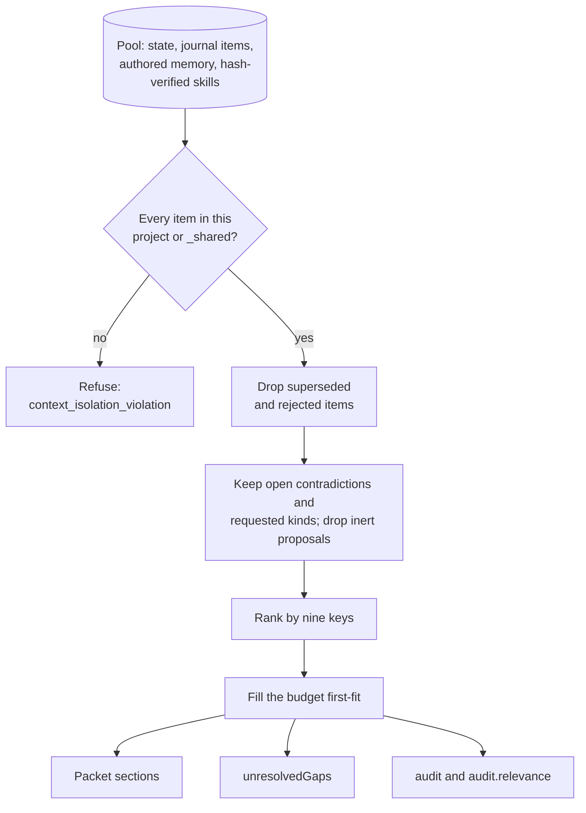
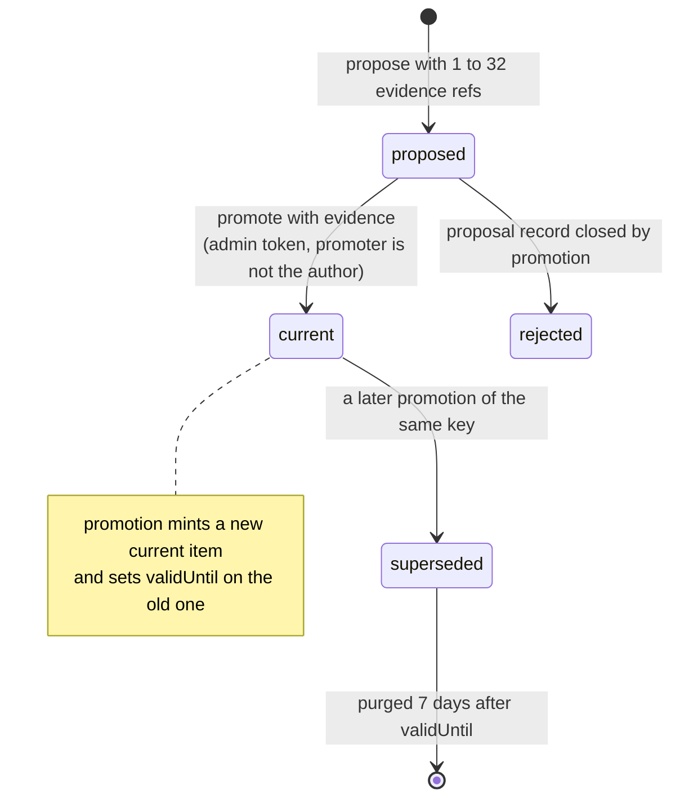
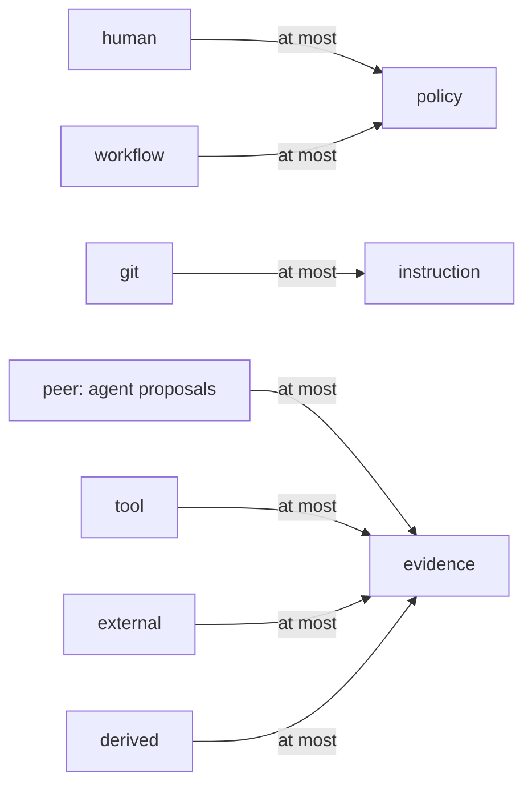

# Context and memory

KXM gives every agent the same deterministic answer to "what does this project know?": a token-budgeted context packet assembled from durable records, temporal state that only changes through evidence-bound promotion, and memory authored in Git. This page is for operators and agent authors. After reading it you can assemble and inspect packets, promote state, write memory, and predict exactly what a Runtime agent receives.

What sets this apart:

- **Deterministic.** No model, clock or randomness takes part in selection, so the same records and request always give the same packet.
- **Provenance-bound.** Every item records where it came from, and its origin caps its authority. Summarizing an item never raises that authority.
- **Isolated.** A packet never mixes projects. A foreign item in the pool is refused, not filtered.
- **Auditable without leaking.** Audits and logs carry ids, counts and scores, never task text or item bodies.
- **Git is the authority for memory.** Agents propose memory and state; people promote them.

## Before you begin

- The `kxm` CLI. See [Install](../start/install.md).
- A running [hub](../glossary.md#hub) for the `kxm context` commands. `kxm memory` and `kxm skills` need no hub.
- The hub admin token in `KXM_AUTH_TOKEN`. `kxm context` authenticates as the control plane. Agents use their own project credentials through tools instead, never the admin token.

```bash
# Load the admin token from your secret manager; never commit it.
export KXM_AUTH_TOKEN="replace-with-admin-token"
```

<details><summary>PowerShell</summary>

```powershell
$env:KXM_AUTH_TOKEN = "replace-with-admin-token"
```

</details>

## Where context comes from

| Source | Stored in | Written by | Becomes |
|---|---|---|---|
| Temporal state | Hub SQLite | Agents propose; operators promote | `state` items |
| Workflow [journal](../glossary.md#journal) | Hub SQLite | Coordinators and the hub | `knowledge`, `evidence` or `skill` items |
| Authored memory | `.kxm/memory/*.md` in Git | People, through a reviewed PR | `knowledge` items |
| Promoted skills | `.kxm/skills/promoted/` in Git | `kxm skills promote`, then a PR | `skill` items |

The journal only exists for hub workflow runs. Runs started with `kxm run` have no journal; see [Continuous improvement](continuous-improvement.md).

## Context items

A context item is one record in the pool. It has a `kind` (`evidence`, `state`, `episode`, `knowledge` or `skill`), a project, a summary of at most 4,000 characters with secrets redacted, immutable provenance, an authority, a confidence (`verified`, `probable` or `uncertain`) and optional lifecycle fields: `status`, `stateKey` and a validity window.

Authority is ordered `policy` > `instruction` > `evidence` > `hypothesis`. The origin in `provenance.sourceType` sets the ceiling. An item that claims more authority than its origin allows is refused with `context_authority_violation`. An item that carries a control-plane field such as `permissions`, `tools`, `token` or `apiKey` is refused the same way: context informs agents, it never grants them anything.

Journal entries enter the pool as items with evidence authority and `probable` confidence:

| Journal category | Item kind |
|---|---|
| `plan`, `decision`, `lesson` | `knowledge` |
| `skill-candidate` | `skill`, status `proposed`, never selected |
| All other categories | `evidence` |

Limits: 256 items per packet, a task of at most 2,000 characters, a budget of 512 to 200,000 tokens, and a derivation lineage of at most 64 ancestors.

## Role policies

The requesting role decides which kinds a packet prefers and its default budget.

| Role | Kinds, in priority order | Journal categories read | Default budget |
|---|---|---|---:|
| `repro` | episode, knowledge, evidence | error, lesson, observation, contradiction | 8,000 |
| `planner` | state, knowledge, evidence | plan, decision, contradiction, observation, hypothesis, experiment | 16,000 |
| `critic` | knowledge, evidence, episode | contradiction, error, lesson, experiment | 12,000 |
| `implementer` | knowledge, state, skill, episode, evidence | plan, decision, lesson, state-change | 16,000 |
| `verifier` | evidence, knowledge, episode | plan, error, lesson, contradiction | 8,000 |
| Any other name | knowledge, evidence | lesson, observation | 32,000 |

Only `implementer` asks for the `skill` kind, so only that role receives promoted skills unless a request passes `--kinds` or `includeKinds`.

## Assemble a context packet

Operators use `kxm context get`. Agents call the `kxm_context` tool, which fills in their project from their credentials.

```bash
kxm context get demo --role planner --task "Which branch do we release from?" --json \
  | jq -c '{state: [.packet.currentState[].summary], gaps: .packet.unresolvedGaps, relevance: .audit.relevance}'
```

Expected output:

```text
{"state":["Releases are cut from the main branch"],"gaps":[],"relevance":{"taskTokens":2,"matchedCandidates":1,"selected":[0.791]}}
```

The flowchart shows how the hub turns the pool into a packet.



### How candidates are ranked

An item is eligible when it is an open contradiction, or when it is a requested kind and not an inert proposal. Non-current state and proposed skills are inert, so proposals never consume budget. Eligible items are ordered by these keys, in order:

1. Open contradictions first.
2. The requested project before `_shared` defaults (operator-scope memory).
3. Task-matched items (sharing at least one word with the task) before unmatched ones.
4. The role's kind priority.
5. BM25 relevance of the item's summary and state key to the task. Tokens are lowercased and Unicode-normalized, a fixed English stopword list is dropped, and plurals are folded.
6. Confidence.
7. Authority.
8. Recency, newest first, from the item's own timestamps.
9. Id, by code unit.

### Budget and gaps

The budget is filled first-fit: an item that does not fit is skipped, and smaller items keep filling the space. Tokens are estimated at four characters each over the summary, id, kind and source reference. That estimate enforces the budget; it is not billing. `unresolvedGaps` reports what was left out:

| Gap | Meaning |
|---|---|
| `budget of <n> tokens reached; <m> candidates deferred` | Some eligible items did not fit |
| `budget of <n> tokens cannot fit any selected context` | Nothing fit |
| `context item limit reached; refine the task or kinds` | 256 items were selected |
| `no context records exist for this project yet` | The pool is empty |

### Packet sections and audit

Every selected item lands in exactly one section: `currentState`, `knowledge`, `evidence`, `episodes`, `skills` or `contradictions`. The `evidence` section holds journal errors, observations, hypotheses, experiments and state changes. The packet also carries `workingState`, `provenanceSummary` (counts by origin) and `estimatedTokens`.

The `audit` object lists `selectedIds`, `candidateCount`, `excludedSuperseded`, the budget and the gaps. `audit.relevance` holds numbers only: `taskTokens` (distinct task words), `matchedCandidates` (eligible items sharing a task word) and `selected` (each selected item's rounded score, in `selectedIds` order). The hub log records the size of the task, never its text.

## Recall records

Recall searches the live pool and returns metadata, never summaries. Operators use `kxm context recall`; agents call `kxm_recall`.

```bash
kxm context recall demo --query "release branch" --json | jq -c '.items[] | {kind, status, origin: .sourceType, relevance}'
```

Expected output:

```text
{"kind":"state","status":"current","origin":"peer","relevance":0.791}
```

Items whose summary or state key contains the whole query, ignoring case, come first. Items that share a word with the query follow, by BM25 relevance, then id. Items with neither are left out, and an empty query returns every item in id order. The default limit is 25 and the maximum is 100.

## Manage temporal state

Temporal state holds one authoritative value per key, such as `release.branch`, with its full history. Agents propose a value with the `kxm_promote` tool; despite its name, the tool only proposes. An operator promotes the proposal with evidence.

```json
{"key": "release.branch", "summary": "Releases are cut from the main branch", "authority": "evidence", "confidence": "verified", "evidenceRefs": ["pr:12"]}
```

The hub answers with a `proposalId`. Review the evidence, then promote it:

```bash
kxm context promote demo <proposal-id> --evidence review:pr-12 --json \
  | jq -c '.state | {status, authority, origin: .provenance.sourceType, evidenceRefs}'
```

Expected output:

```text
{"status":"current","authority":"evidence","origin":"peer","evidenceRefs":["pr:12","review:pr-12"]}
```

Read the value now, or as it was at an earlier time:

```bash
kxm context state demo release.branch --json | jq -c '.state | {summary, status, authority}'
kxm context state demo release.branch --as-of 2026-09-01T00:00:00Z --json
```

The state diagram shows the lifecycle, and the flowchart shows the highest authority each origin can grant.





The rules the hub enforces:

- **Origin follows the credential, never a name.** A proposal made with an agent key is `peer` origin and capped at `evidence`; claiming `instruction` or `policy` is refused with `context_authority_violation`. A proposal made with the admin token is `human` origin, which can claim up to `policy`, and needs a configured admin token.
- **`proposedBy` must name the caller**, or the hub refuses with `state_proposer_mismatch` and logs a security alert.
- **Promotion is control plane only.** It needs a configured `KXM_AUTH_TOKEN` with no loopback bypass; without one the hub answers 503 `admin_auth_not_configured`.
- **The author cannot promote.** `state_promotion_invalid` refuses it. `kxm context promote` promotes as `kxm-admin`, which is also the author of any proposal made with the admin token; the check separates agents from operators, not one operator from another.
- **Promotion keeps the origin.** A promoted agent proposal stays `peer` origin at `evidence` authority.
- **Contradictions stay visible.** Competing proposals for one key are open contradictions and appear in every packet's `contradictions` section. Two current values for one key make `kxm context state` answer 409 `state_contradiction`.

## Read episodes and explain an item

`kxm context episode <project>` (tool `kxm_episode`) returns journal errors, lessons, observations and experiments for the project's retained runs as full items, oldest first, at most 50. Add `--run <run-id>` to limit it to one run.

`kxm context explain <project> <item-id>` returns whether the item exists, its derivation lineage, its evidence references and the source of each ancestor. It is an operator query; there is no `kxm_explain` tool. `kxm explain` (without `context`) is a different command: it estimates a mode's prompt footprint.

## Compile the knowledge wiki

The wiki is a reviewable Markdown view of the pool, never the authoritative store.

```bash
# Preview the pages, then write them under the repository root.
kxm context wiki-compile demo
kxm context wiki-compile demo --out .
kxm context wiki-lint demo
```

Pages land under `.kxm/knowledge/wiki/`: one page per section (`architecture`, `decisions`, `incidents`, `patterns`), a temporal-state page that keeps superseded values visible, a contradictions page, a superseded-history page and `index.md`. Every claim links its record id and source. Compilation never resolves a contradiction. Output is deterministic except the timestamp in `index.md`, so diffs stay small. `wiki-lint` checks for broken references, orphan pages, stale state links and hidden contradictions, and exits 1 on an error.

## Author Git memory

Git memory is the durable, reviewed layer: facts a person has approved, versioned with the code. Each fact is a Markdown file with `kxm.memory.v1` front matter.

`.kxm/memory/test-runner.md`:

```yaml
---
schema: kxm.memory.v1
id: test-runner
scope: project            # agent, project, run or operator
kind: convention          # free-form label
summary: Run the test suite with npm test before every commit
provenance:
  sourceType: git
  sourceRef: docs/testing.md
authority: instruction    # instruction, evidence or promoted
confidence: verified
lifecycle: active         # only active facts are loaded
evidenceRefs: []
---
```

`instruction` and `promoted` authority become `instruction` in packets; `evidence` stays `evidence`. Operator-scope facts become `_shared` defaults. Control-plane fields are refused, and summaries are redacted. One malformed file stops the whole load, so validate before you commit.

The workflow:

1. Record a candidate. It lands in `.kxm/memory/candidates/cand_<scope>_<hex>.md` at `evidence` authority and is never loaded from there.

   ```bash
   kxm memory note "Use pnpm, not npm, in this repository" --kind convention
   ```

2. Promote it by pull request: move the file into `.kxm/memory/`, give it a stable id and the authority reviewers agree on, and merge.
3. Check what agents will see, then refresh the projection blocks:

   ```bash
   kxm memory brief
   kxm memory sync --dry-run
   kxm memory sync
   ```

`kxm memory sync` rewrites the block between `<!-- kxm:memory:start -->` and `<!-- kxm:memory:end -->` in `AGENTS.md`, `CLAUDE.md` and `GEMINI.md`. A missing file is created with a default header copied from the KXM repository's own instructions; replace that header before you commit.

| Where memory reaches agents | How |
|---|---|
| Any harness that reads `AGENTS.md`, `CLAUDE.md` or `GEMINI.md` | The projection block, after `kxm memory sync` and a commit |
| Claude Code with the KXM plugin | The SessionStart hook adds the same text `kxm memory brief` prints |
| Pi with the KXM extension | `/kxm memory` shows the brief |
| Runtime agent steps | Dispatch context, below |

## Context for Runtime agents

When `kxm run` dispatches an agent step, the Runtime adds project memory and promoted skills to the agent's prompt. It reads only local Git and the project tree, never the hub, so dispatch works with the hub down.

- **Sources.** Active `.kxm/memory/*.md` facts with `project` or `operator` scope, and promoted skills whose content hash verifies. Candidates are never read. `agent` and `run` scopes are skipped because nothing binds them to one agent or run.
- **Committed content only.** The memory and promoted-skill files must be tracked and clean at `HEAD`, and the memory revision (a hash over those files) must match the one the run pinned when it was created.
- **Selection.** The same arbiter picks items, with the step instructions and prompt as the task and a budget of 4,000 tokens. The role comes from the agent id: an exact role name, or a role followed by a hyphen (`critic-arch` is a critic); any other id is a custom role.
- **Rendering.** Items appear under **Environment & Memory**: shared defaults, then at most five project items, then **Active Skills**. A skill is delivered as its name, description and pinned hash reference, not its full `SKILL.md`.

When something is withheld, the step still runs without it and a gap is recorded in the packet's `budget.unresolvedGaps` and the `dispatch_context_assembled` log event, never in the prompt:

| Gap | Meaning |
|---|---|
| `dispatch_context_withheld:uncommitted` | A memory or promoted-skill file is modified, untracked or ignored |
| `dispatch_context_withheld:git_unavailable` | `git status` failed or took longer than 5 seconds |
| `dispatch_context_withheld:memory_revision_drift` | Memory or skills changed since the run pinned its revision |
| `dispatch_context_memory_unreadable` | A memory file does not parse |
| `dispatch_context_memory_rejected:<id>` | One fact could not become a context item |
| `dispatch_context_skill_unverified:<id>` | A promoted skill does not match its hash |
| `dispatch_context_skills_unreadable` | The promoted skills could not be listed |
| `dispatch_context_render_deferred:<n>` | More project items were selected than the prompt renders |
| `dispatch_context_not_loaded` | Context could not be loaded before this step |
| `dispatch_context_failed` | Loading or assembly failed unexpectedly |

A project with no memory and no promoted skill dispatches exactly as before.

## Limits and known issues

- **Hub packets miss authored memory with the default layout.** The hub looks for `.kxm/memory` two directories above its database file. With the default `.kxm/state/kxm.db` that resolves inside `.kxm/`, so `kxm context get` returns no memory facts. Runtime dispatch context reads memory correctly.
- **The `episodes` section is usually empty.** No record in the hub pool has the `episode` kind today. Use `kxm context episode` for episodic records.
- **`--run` and `--stage` do not filter.** They are recorded in the audit only.
- **History is short.** The hub purges superseded state and closed proposals 7 days after they end, so `--as-of` only reaches back that far. Terminal runs and their journal are purged on the same schedule.
- **The wiki compiles every retained journal entry**, not only reviewed ones. Its index links the temporal-state page at the wrong path, and `wiki-lint` can report a false `stale_state_link` on that page when a superseded value sits close to the Current heading.

## Troubleshooting

| Symptom | Cause | Fix |
|---|---|---|
| `kxm context` answers 401 `invalid_auth` | `KXM_AUTH_TOKEN` is unset or wrong | Export the hub admin token |
| Promotion answers 503 `admin_auth_not_configured` | The hub started without `KXM_AUTH_TOKEN` | Restart the hub with an admin token |
| Promotion answers `state_promotion_invalid` | The promoter is the proposal's author | Promote as a different identity |
| A proposal answers `context_authority_violation` | An agent claimed `instruction` or `policy` | Propose at `evidence` or `hypothesis` |
| An agent request answers `context_isolation_violation` | It named a project other than its own | Use the agent's own project |
| `kxm context state` answers 409 `state_contradiction` | Two current values exist for one key | Promote one value with evidence |
| A Runtime step lacks expected memory | A dispatch gap withheld it | Commit the memory files and start a new run |

## Next steps

- Turn run evidence into ranked improvements: [Continuous improvement](continuous-improvement.md)
- Govern reusable procedures: [Governed skills](governed-skills.md)
- Understand who may do what: [Trust model](../concepts/trust-model.md)
- Every flag and output key: [CLI reference](../reference/cli-reference.md#kxm-context) and [MCP and Pi tools](../reference/tools.md)
