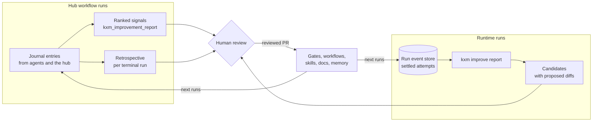

# Continuous improvement

KXM turns every run into structured evidence, ranks what keeps going wrong across runs, and proposes fixes that a person reviews and applies through Git. This page is for leads and workflow owners who want workflows to get more reliable and cheaper over time. It covers capture, ranked signals, retrospectives, coded-repeat candidates, and the safeguards that keep learning from turning into unreviewed policy.

What sets this apart:

- **Disagreement is preserved.** Contradictions stay open until evidence resolves them; nothing flattens them into one answer.
- **Everything is a proposal.** Signals, retrospectives and candidates never change a gate, workflow, permission or skill on their own.
- **Ranking is deterministic and redacted.** The same journal gives the same order, and merge keys never carry raw summary text.

## Before you begin

- The `kxm` CLI and a running [hub](../glossary.md#hub).
- For journal capture: a hub workflow run started by a signed webhook or `kxm workflow start`. See [Webhook workflows](webhook-workflows.md).
- For coded repeats: Runtime runs created with `kxm run` in a KXM project.

> [!IMPORTANT]
> The journal loop covers hub webhook runs only. Runtime runs (`kxm run`) have no journal: `kxm_workflow_record` answers `workflow_not_found` for a Runtime run id. Runtime learning comes from `kxm improve`, which reads settled attempts instead.

## The learning loop

The flowchart shows the two loops and where a person decides.



## Capture: record journal entries

Record entries while the run happens, not only at the end. Only the run's assigned coordinator can write its journal. Agents call `kxm_workflow_record`. The `kxm workflow record` CLI does the same from a shell; it connects as `KXM_AGENT_NAME` (default `cli-<pid>`), so it succeeds only under the coordinator's identity.

| Category | Record it when |
|---|---|
| `plan` | You decide how the work will run and who owns it, before implementation |
| `decision` | You pick an option; name the alternatives and why |
| `contradiction` | Agents, tests, docs or observed behavior disagree |
| `error` | A stage, tool, gate, integration or assumption fails |
| `lesson` | Evidence supports a reusable conclusion (evidence required) |
| `observation` | Something notable happened, without a causal claim |
| `hypothesis` | You make a falsifiable claim; keep it when it is disproved |
| `experiment` | You try something; record the outcome, including failure |
| `state-change` | An authoritative project fact changed |
| `skill-candidate` | A procedure worked and is backed by run or receipt evidence (evidence required) |

Each entry has an area (`harness`, `gates`, `implementation`, `workflow`, `documentation`, `security` or `other`), a severity (`info`, `warning` or `error`), a summary of at most 1,000 characters, optional details, up to 32 evidence strings and up to 16 related entries from the same run.

Pass `stageId` (`--stage-id` on the CLI) to bind an entry to a stage. The hub, never the caller, derives the attempt: the current attempt for an in-progress or waiting stage, the last attempt consumed for a finished stage, and none for a stage that has not run. When the stage declares an area, `area` may be omitted.

```bash
kxm workflow record <run-id> lesson "A flaky test hid a race in the cache" \
  --stage-id verify --severity warning --evidence https://ci.example.com/run/42
```

| Refusal | Cause |
|---|---|
| `invalid_improvement_area` | No `area`, and no `stageId` whose stage declares one |
| `invalid_journal_relation` | The `stageId` or a related entry is not part of this run |
| `journal_evidence_required` | A `lesson` or `skill-candidate` without evidence |
| `workflow_forbidden` | The caller is not the run's coordinator |
| `workflow_not_found` | The id is not a hub workflow run, for example a `kxm run` id |

### Entries KXM writes for you

You do not need to record these; each is bound to its stage and attempt where one applies:

- The hub records checkpoint warnings and failures, typed stage transitions, transition-budget exhaustion, external-wait timeouts, coordinator prompt expiry, premature coordinator settlement, and degraded-quorum approvals and their use.
- The Pi extension records failed tool results and failed turns while a webhook workflow is active, as an allowlisted diagnostic class rather than tool output.
- A supervised Pi worker records the reason each time it recovers.

Agents still record semantic failures: a false assumption, a rejected design, a flaky result or an integration mismatch.

Never put secrets or unneeded prompt text in the journal. Cite durable references instead: test names, commits, pull requests, check runs, issues or documentation paths. Adding a lowercase `class:<name>` to an entry's evidence lets identical failures merge across runs.

### Governed promotion of journal entries

`skill-candidate`, `hypothesis` and `experiment` entries start `proposed`. A hub administrator decides them once, append-only, through `POST /v1/journal/<entry-id>/promotion` with `to` (`approved`, `rejected` or `quarantined`), at least one evidence reference and a reason. The decider is recorded as `kxm-admin` and can never be the entry's author, and a decided entry never reopens. This changes the entry's learning state only; it never changes a gate, a workflow or a permission. See [HTTP API](../reference/http-api.md).

## Signals: rank what recurs across runs

`kxm_improvement_report` answers for the agent's project with three fields: `reports`, per-area counts with each area's ten most severe errors, contradictions, lessons and skill candidates; `signals`, the top 20 recurring problems; and `entries`, the number of journal entries read. Review the top signals weekly.

Only errors, open contradictions (not yet answered by a related decision or lesson), lessons, and skill candidates still `proposed` count. Entries merge into one signal when they share a key, tried in this order:

1. An evidence class, `class:<name>`, within the same category.
2. For errors, the workflow definition and stage.
3. The summary after redaction and normalization: ids, timestamps, hex strings and numbers are folded, so the same failure in two runs keys the same.

Each signal keeps up to 16 run ids and entry ids and a redacted summary of its latest entry. It is scored as:

```text
priority = frequency × severity weight × workflow cost × confidence
```

| Factor | Meaning |
|---|---|
| Frequency | Distinct runs, counted over the runs the hub still retains |
| Severity weight | 3 for `error`, 2 for `warning`, 1 for `info`, from the most severe entry |
| Workflow cost | Mean run attempts (stage attempts plus transitions) over known runs; 1 with `costBasis: "unknown"`. Not dollars |
| Confidence | 0.5 plus half the share of the signal's entries that cite evidence |

Security signals (area `security`, or class `invalid_auth`, `invalid_identity` or `signal_mismatch`) rank ahead of every priority. Other ties break on frequency, then key, never on insertion order. There is no data-loss override, because no deterministic data-loss marker exists; review data-loss risk by hand.

> [!NOTE]
> The hub purges terminal runs and their journal 7 days after they end, so frequency only counts recent runs. Export accepted decisions and lessons to version-controlled docs or [Git memory](context-and-memory.md#author-git-memory) if they must outlive that window.

## Retrospectives: one run, reviewed

When a hub run completes or fails, the hub writes a bounded retrospective to `.kxm/assets/retrospectives/<run-id>.json` and `<run-id>.md`. It writes them again when a journal entry arrives or a promotion is decided after the run ended. Regenerate one from the local store, or from an offline snapshot:

```bash
kxm workflow export <run-id>
kxm workflow export <run-id> --input snapshot.json
```

A retrospective holds the stage timeline, counts by category, area and class, open contradictions, decisions, and the last 500 redacted entries. Two fields drive review:

- `recurringErrorClasses` counts `error` entries only, by evidence class.
- `proposedImprovements` holds up to 12 of the run's error and lesson entries, merged and ranked like the signals above, each with a success measure that names its signal key.

Runs with peer-evidence policies add a metadata-only `evidenceAudit`: configured and effective producer minimums, eligible producers, verified message and producer ids, request and reply hashes, and admin degradation approvals. It never copies message bodies, and its hashes are provenance, not proof that a peer was right. Every file stays `reviewDecision: "proposed"`; export never edits a workflow or weakens a gate.

## Coded repeats (`kxm improve`)

`kxm improve` (the same as `kxm improve report`) finds Runtime agent steps that a script, test or workflow `gate` could do as well as a model. It proposes; it never applies.

```bash
kxm improve report --dry-run
```

Expected output, in a directory that is not a KXM project:

```text
Sources:
  telemetry /work/demo/.kxm/logs/telemetry.jsonl (exists=false, records=0, duplicatesDropped=0)
Runtime store not read: no KXM project at /work/demo
```

### Sources

Inside a KXM project the command reads the project's Runtime event store, `<state>/runtime/projects/<key>/run-events.db`, then `.kxm/logs/telemetry.jsonl`. The key comes from the checkout's real path, so each checkout and worktree has its own store. The store is opened read-only for one query; `kxm improve` never creates, writes or migrates it. A telemetry record whose `attemptId` the store already supplied is dropped. `--file <path>` reads only that file.

The output starts with a `sources` block: each source's path, whether it exists, and its `records`, `skippedInvalid`, `excludedSimulated`, `undecided` and `duplicatesDropped` counts. An unreadable store stops the command with `improve_source_unreadable` and exit 1.

### Groups and outcomes

Records group by workflow, step, agent role and ask. The ask digest covers the workflow, step, step kind, agent, instructions, outcomes and required evidence keys, so one step keeps one digest across runs. No prompt text is read or stored.

Outcomes are resolved from the event log when the report runs and never written back. A back edge is `blocked`; a producer error, an undeclared outcome or a failing terminal is `failed`; a later entry into the same step makes an attempt `reworked`; a completed run makes it `accepted`; a failed run makes it `failed`. Cancelled and still-running runs stay undecided and are left out of the pass rate. Simulated attempts are excluded and counted.

### Candidacy

A group becomes a coded-repeat candidate only when all three hold:

- The same objective was decided in at least 2 runs (`askRecurrence`).
- At least 0.75 of its decided attempts were accepted (`verifyPassRate`). An attempt superseded by a retry of the same step never counts as a pass.
- Its step writes no repository (`writesRepository`).

A group that passes the rate but misses reports `excludedReason`: `writes-repository` or `ask-not-repeated`. `weightedRecurrence` weighs each record by `2^(-age / improvement.telemetryHalfLifeDays)`, 14 days by default. It orders rows and never decides candidacy.

### Outputs and promotion readiness

Each candidate is a `kxm.candidate.v1` JSON file plus a proposed diff under `.kxm/candidates/` (or `--out-dir`), and the report is saved under `.kxm/assets/improvements/`. `--dry-run` writes neither. The step and role names pick the template: a verify, gate, test, check or lint step proposes a `.kxm/gates.yaml` command; a plan, review or repro step proposes a governed skill; any other step proposes a `kind: gate` step that runs `scripts/<step>.mjs`, which you write. Diffs contain placeholder hunks.

`promotion[]` reports readiness under `improvement.promotionPolicy` (see [Configuration file reference](../reference/config-reference.md)):

| Policy | Ready for review when |
|---|---|
| `manual_pr` (default) | Always; you review and apply the diff in a PR |
| `critic_quorum` | Two distinct critic receipts are cited; `kxm improve` cites none, so never |
| `auto_threshold` | Distinct runs, accepted share and mean recorded cost reach `improvement.autoThreshold`; a group with no recorded cost is never ready |

No policy authorizes anything. Every policy ends at an operator PR, activation is a reviewed Git change for future runs, and telemetry cannot grant a tool or skip a gate.

`kxm routing report` reads the same sources to compare verified completion, cost and rework per model route. Use it next to `kxm improve` when a repeat is also expensive. See [Harness routing](../reference/harness-routing.md).

## Review cadence

- **Per run.** Read the retrospective. Group contributing causes, then name an owner and a measurable success condition for each proposed improvement.
- **Weekly.** Call `kxm_improvement_report` and `kxm improve report`. Check that each merge groups entries that belong together, and pick a few items to trial.
- **Per release.** For each chosen improvement:
  1. State the problem and link its evidence.
  2. Name what it changes: harness, gates, implementation guidance, workflow, docs or security policy.
  3. Define the expected outcome and a leading indicator.
  4. Add or update tests before you change enforcement.
  5. Trial it on a bounded workflow or repository.
  6. Compare failure rate, cycle time, manual intervention and escaped defects with the baseline.
  7. Adopt, revise or roll it back, and record the decision in a later run's journal.

## Governance safeguards

- Journal content is evidence, not executable policy.
- Candidates are proposals. Readiness never authorizes, and no `improvement.*` value activates anything.
- An agent may propose a gate change but cannot silently weaken a required gate.
- A peer-quorum reduction must be declared by policy and approved by an administrator for the current attempt, and it is recorded as degraded, not as normal success.
- Contradictions stay open until evidence resolves them; synthesis must not erase minority risks.
- Changes to permissions, secrets, merge policy or external side effects need human or repository-authorized approval.
- Reports are project-scoped. Protect the hub database: the journal can reveal sensitive engineering context.

## Troubleshooting

| Symptom | Cause | Fix |
|---|---|---|
| `kxm_workflow_record` answers `workflow_not_found` | The id belongs to a `kxm run` Runtime run | Use `kxm improve` for Runtime learning |
| `kxm improve` reads 0 records | Not inside a KXM project, no settled Runtime attempts, or only simulated drives | Check the `sources` block and `excludedSimulated` |
| `kxm improve` exits 1 with `improve_source_unreadable` | The event store is locked or damaged | Retry, then inspect the path it names |
| A signal merges unrelated entries | They share a summary shape or a class | Add distinct `class:<name>` evidence |
| A recurring problem vanished from signals | Its runs were purged after 7 days, or its entry was decided | Export lessons to Git before the window closes |

## Next steps

- Promote a working procedure into a reusable skill: [Governed skills](governed-skills.md)
- Keep durable lessons where agents read them: [Context and memory](context-and-memory.md)
- Require independent evidence before a stage passes: [Provenance gates](provenance-gates.md)
- Every flag and output key: [CLI reference](../reference/cli-reference.md)
