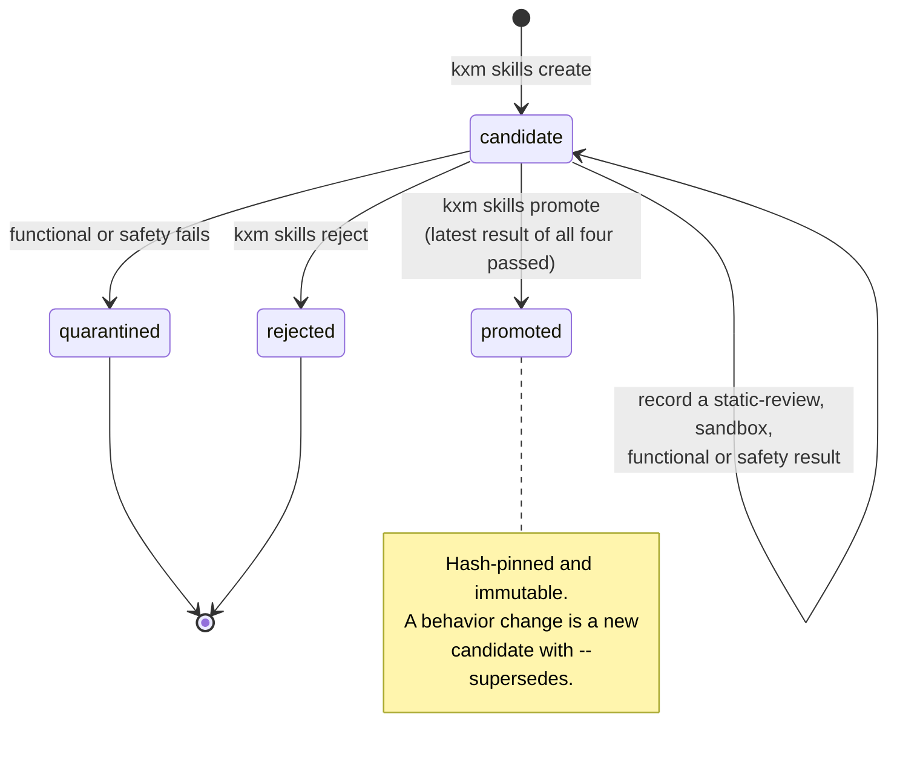

# Governed skills

Turn a procedure that worked in a run into a reusable skill your agents can rely on, without letting run-time experience rewrite agent behavior on its own. You submit a candidate, record the results of four protected evaluations, and promote it through a reviewed pull request. Promoted skills are hash-pinned and immutable, and they inform agents but never grant a tool or a permission.

This page covers the `kxm skills` lifecycle. The skills that ship with the plugin are a different thing; see [Agent skills](agent-skills.md).

## Before you begin

- The `kxm` CLI. Run the commands from the repository root: skills live in `.kxm/skills/` under `KXM_WORKDIR` or the current directory. No hub is needed.
- At least one source for the candidate: a workflow run id, a journal entry id or an evidence receipt.
- Two identities: the author who creates the candidate, and a different person who decides its promotion.

## The lifecycle

A candidate stays a candidate while evaluations are recorded, and leaves that state only by promotion, quarantine or rejection.



Evaluations can be recorded in any order, and a later result for the same kind replaces the earlier one. A failed `static-review` or `sandbox` result leaves the candidate in place so you can fix and re-evaluate. A failed `functional` or `safety` result quarantines it at once.

## Where skills live

| Path under `.kxm/skills/` | Holds |
|---|---|
| `candidates/<id>/` | `SKILL.md` and `metadata.json` for each candidate |
| `promoted/<id>/` | Copies of promoted candidates |
| `quarantineds/<id>/` | Quarantined candidates (the code spells this directory name with a trailing `s`) |
| `rejected/<id>/` | Rejected candidates |
| `history/<id>.jsonl` | Append-only audit trail: creation, evaluations and decisions, the last 500 records |
| `patches/<id>.patch` | The diff that promotion emits for review |

Skill ids are content-addressed: `<slug>.<first 12 hex characters of the content hash>`. Changed behavior means changed content, which means a new id. Submitting identical content again is refused.

## Create a candidate

Write the procedure as a Markdown file. KXM adds `name` and `description` front matter when the file has none.

`flaky.md`:

```markdown
# Triage a flaky test

1. Re-run the failing test three times in isolation.
2. Record each result as journal evidence.
```

```bash
kxm skills create --file flaky.md --name "Triage flaky test" \
  --description "Isolate and classify a flaky test before changing code" \
  --created-by agent-a --harness pi --models openrouter/qwen/qwen3-coder-plus \
  --journal journal_abc
```

Expected output:

```text
created skill candidate triage-flaky-test.7f0864c17a97
```

The candidate must cite at least one source (`--run`, `--journal` or `--receipt`), name its harness, and list 1 to 16 compatible models. Names are at most 64 characters and content at most 32,000. Secrets are redacted from the content and description before anything is written.

## Record evaluations

Each evaluation records a verdict that you or your evaluator produced. KXM does not run the skill, and it provides no sandbox; `sandbox` names the check you performed, it does not create one.

```bash
kxm skills evaluate triage-flaky-test.7f0864c17a97 --kind static-review --evaluator review-checklist-v1
kxm skills evaluate triage-flaky-test.7f0864c17a97 --kind sandbox --evaluator scratch-repo-v1
kxm skills evaluate triage-flaky-test.7f0864c17a97 --kind functional --evaluator flaky-suite-v2 --score 0.92
kxm skills evaluate triage-flaky-test.7f0864c17a97 --kind safety --evaluator safety-review-v1
```

Add `--fail` to record a failure, and `--details` for up to 2,000 characters of redacted notes. A failed `functional` or `safety` evaluation prints `(candidate quarantined)` and records the quarantine decision under the evaluator's name. The `optimization` kind is refused: optimization evaluations are disabled and the CLI has no switch to enable them.

## Promote through Git

Promotion needs the latest result of all four kinds to be a pass, at least one durable evidence reference, a decider who is not the author, and content that still matches its hash. Preview it first:

```bash
kxm skills promote triage-flaky-test.7f0864c17a97 --decided-by reviewer-b --evidence review:pr-31 --dry-run
```

Expected output:

```text
dry run: promote skill triage-flaky-test.7f0864c17a97
  would write /work/demo/.kxm/skills/promoted/triage-flaky-test.7f0864c17a97/SKILL.md
  would write /work/demo/.kxm/skills/promoted/triage-flaky-test.7f0864c17a97/metadata.json
  would write /work/demo/.kxm/skills/patches/triage-flaky-test.7f0864c17a97.patch
  would write /work/demo/.kxm/skills/history/triage-flaky-test.7f0864c17a97.jsonl
```

Run it without `--dry-run`, then land the result through review:

1. Open a pull request with the new `promoted/<id>/` directory. `patches/<id>.patch` is a new-file diff of exactly those two files, for reviewers who prefer a patch.
2. Remove the candidate copy in the same pull request. Promotion copies the candidate; it does not move it, so `kxm skills list --state candidate` still shows it.
3. Merge. From then on the skill is immutable.

> [!IMPORTANT]
> Promotion writes into your working tree immediately. A hub started from this checkout can serve the promoted skill in `kxm context get` packets as soon as the files exist and verify. Runtime agents receive it only after the files are committed and clean. See [Context for Runtime agents](context-and-memory.md#context-for-runtime-agents).

## Reject a candidate

```bash
kxm skills reject bump-deps.489552361ce3 --decided-by reviewer-b --reason "Duplicates an existing gate"
```

Rejection moves the candidate to `rejected/` and keeps its history for future learning. It works on candidates only: a quarantined skill cannot be rejected from the CLI, so quarantine is terminal there. Remove a quarantined directory by pull request if you no longer want it.

## Verify integrity

`kxm skills verify` recomputes the content hash and checks that the front matter has a `name` and a `description`. It checks promoted skills by default; pass `--state` for another state.

```bash
kxm skills verify triage-flaky-test.7f0864c17a97
```

Expected output:

```text
skill triage-flaky-test.7f0864c17a97 integrity verified
```

An out-of-band edit fails with `content does not match its pinned hash; promoted skills are immutable and require a new candidate/eval cycle`. The hub and the Runtime run the same check. The hub leaves a failing skill out of packets; the Runtime leaves it out and records a `dispatch_context_skill_unverified:<id>` gap.

## Supersede a promoted skill

To change a promoted skill, create a new candidate from the edited content with `--supersedes <old-id>`, and take it through the whole lifecycle. The link is recorded in the new candidate's metadata and history. Nothing retires the old skill automatically: remove its `promoted/` directory in the pull request that adds the new one.

## How promoted skills reach agents

- **Hub packets.** Each promoted skill that verifies becomes a `skill` item at `instruction` authority and `verified` confidence. Its summary is `<name>: <description>` and its source is `skill:<id>@<sha256>`. Only roles that request the `skill` kind receive it, which by default means `implementer`.
- **Runtime dispatch.** The same item, only when the promoted files are committed and clean, listed under **Active Skills** in the agent's prompt.
- **What is delivered.** The name, description and pinned hash reference, not the full `SKILL.md` body.

Skill text may shape behavior. It never grants a tool, a permission or an approval.

## Other sources of candidates

- A journal `skill-candidate` entry records that a procedure worked. Its own approval lifecycle is separate: approving the entry does not create a governed skill. See [Continuous improvement](continuous-improvement.md#governed-promotion-of-journal-entries).
- `kxm improve` can propose a governed skill for a repeated planning, review or repro step. Its diff is a starting point; submit the result with `kxm skills create`.

## Troubleshooting

| Message | Cause | Fix |
|---|---|---|
| `a skill candidate must reference at least one source run, journal entry, or evidence receipt` | No `--run`, `--journal` or `--receipt` | Cite the run or entry the skill came from |
| `identical candidate <id> already exists` | The same content was submitted before | Change the content, or use the existing id |
| `promotion requires passing <kinds> evaluations` | A kind has no result, or its latest result failed | Record passing evaluations for the listed kinds |
| `the author of a skill candidate cannot promote it` | `--decided-by` equals `--created-by` | Have a different person decide |
| `skill <id> not found in candidate` | The skill is quarantined, rejected or already removed | Check `kxm skills list --state <state>` |
| `optimization evaluations are disabled` | `--kind optimization` | Use one of the four protected kinds |

## Next steps

- See how skills sit beside memory and state in a packet: [Context and memory](context-and-memory.md)
- Find which steps keep repeating: [Continuous improvement](continuous-improvement.md#coded-repeats-kxm-improve)
- The skills that ship with KXM: [Agent skills](agent-skills.md)
- Every flag: [CLI reference](../reference/cli-reference.md)
