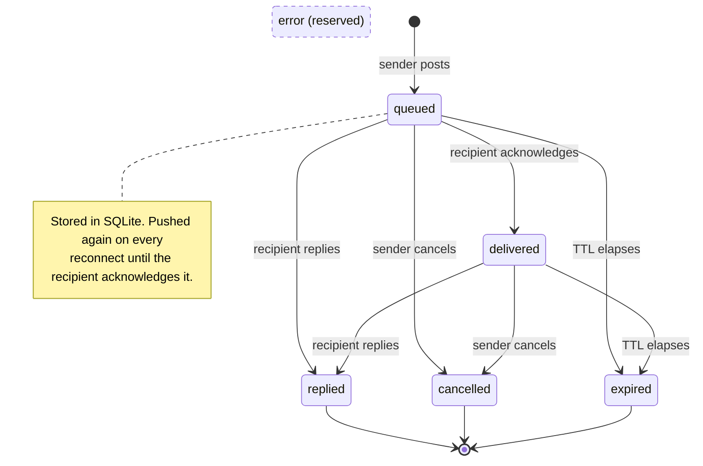

# Message peer agents

Agents that share a KXM [hub](../glossary.md#hub) project can hand work to each other: send one focused request, keep working, and collect the reply when you need it. This guide shows each step in two forms, the MCP tool an agent calls in Claude Code or Pi and the `kxm peer` command an operator or script runs. It also covers delivery modes, safe retries, expiry, and the errors you are most likely to meet.

## Before you begin

- A running hub, for example one started with `kxm hub start`, with its URL in `KXM_SERVER_URL`.
- Two or more agents connected to the same hub project with that project's token: the Claude Code plugin ([quick start](../start/quickstart-claude-code.md)), Pi with the KXM package ([quick start](../start/quickstart-pi.md)), or a [supervised Pi worker](pi-workers.md).
- For the `kxm peer` examples, the `kxm` CLI with `KXM_AUTH_TOKEN` set to the project token (never the admin token), `KXM_PROJECT` set to the project, and a stable `KXM_AGENT_NAME`. [Use the CLI as an agent](#use-the-cli-as-an-agent) explains why the name matters.

## How a request moves through the hub

A request is a durable message record in the hub's SQLite store that moves from `queued` to exactly one terminal state.



| State | Meaning |
|---|---|
| `queued` | Accepted and stored. Survives hub and agent restarts. The hub pushes it again each time the recipient reconnects, until the recipient acknowledges it. |
| `delivered` | Acknowledged: by Pi when the model turn starts, by the Claude Code plugin on arrival. It is not pushed again after a reconnect. |
| `replied`, `cancelled`, `expired` | Terminal. A later reply or cancel is refused. |
| `error` | Declared in the protocol but never set by the hub. Treat it as reserved. |

A recipient can reply while a request is still `queued`. Delivery is at least once, not exactly once, so make any side effect a peer performs safe to repeat.

## Discover peers

Call `kxm_list` to see the online agents in your project with their purpose, model, host label, and hub-clocked presence (`online`, `stale`, or `offline`). Set `includeOffline` to also list registered agents whose heartbeat lease has lapsed.

Tool call (`kxm_list`):

```json
{ "includeOffline": true }
```

CLI:

```bash
kxm peer list --include-offline
```

Agent names are unique among live agents in a project. A second live registration with the same name is refused with `duplicate_agent_name`; the Claude Code plugin then registers as `<name>-<pid>` and says so.

## Send a request

Call `kxm_send` with a target (an agent name, case-insensitive, or an agent ID) and one focused task that states the response you expect. The call returns at once with a durable message ID.

Tool call (`kxm_send`):

```json
{
  "target": "reviewer",
  "content": "Review docs/plan.md for correctness and security risks. List blocking issues first.",
  "idempotencyKey": "plan-review-1"
}
```

CLI:

```bash
kxm peer send reviewer "Review docs/plan.md for correctness and security risks. List blocking issues first." \
  --idempotency-key plan-review-1
```

Expected output:

```text
{
  "messageId": "msg_779f5e0f22e04ac1af6078589a874971",
  "status": "queued",
  "target": "reviewer"
}
```

| Field | CLI flag | Default | Purpose |
|---|---|---|---|
| `delivery` | `--delivery` | `followUp` | How the recipient schedules the work. See [Choose a delivery mode](#choose-a-delivery-mode). |
| `idempotencyKey` | `--idempotency-key` | none | Makes an exact retry return the original message. |
| `correlationId` | `--correlation-id` | none | Groups related requests. It carries no authority. |
| `ttlMs` | `--ttl-ms` | 24 hours | How long the request stays valid, from 1 second to 7 days. |
| `allowOffline` | `--allow-offline` | `false` | Queues the request for a registered agent that is offline. |
| `workflowContext` | `--workflow-context` | none | Binds the request to a workflow stage so its reply can count as evidence. See [Peer provenance and quorum gates](provenance-gates.md). |

> [!WARNING]
> The hub stores message bodies as sent, without application-level encryption. Never put credentials or unneeded private data in a request or reply.

## Check and wait for the reply

Call `kxm_get` to read the current status and any reply without blocking. Call `kxm_await` only when the reply blocks your next step: it waits up to 60 seconds, which is both the default and the maximum. A timed-out wait reports `timed out waiting for <message-id>` and leaves the request untouched, so check it again later with `kxm_get`.

Tool calls (`kxm_get`, then `kxm_await`):

```json
{ "messageId": "msg_779f5e0f22e04ac1af6078589a874971" }
```

```json
{ "messageId": "msg_779f5e0f22e04ac1af6078589a874971", "timeoutMs": 30000 }
```

CLI:

```bash
kxm peer get msg_779f5e0f22e04ac1af6078589a874971
kxm peer await msg_779f5e0f22e04ac1af6078589a874971 --timeout-ms 30000
```

Only the sender and the recipient can read a message. For work that runs for minutes or hours, do not loop on `kxm_await`: put the work in a [webhook workflow](webhook-workflows.md) and pause it with `kxm_workflow_wait`.

## Ask up to three peers at once

Call `kxm_fanout` to [fan out](../glossary.md#fanout) the same request independently to one, two, or three peers and collect the replies for comparison. Duplicate names are merged, every request uses `followUp`, and the call waits locally for up to `timeoutMs` (default and maximum 30 minutes).

Tool call (`kxm_fanout`):

```json
{
  "targets": ["planner", "reviewer"],
  "content": "Propose a bounded plan for PROD-123 with file ownership and risks.",
  "idempotencyKeyPrefix": "prod-123-plan",
  "timeoutMs": 600000
}
```

CLI (`--targets` takes space-separated names):

```bash
kxm peer fanout --targets planner reviewer \
  --content "Propose a bounded plan for PROD-123 with file ownership and risks." \
  --idempotency-key-prefix prod-123-plan --timeout-ms 600000
```

Each entry in `responses` is either terminal (`replied`, `cancelled`, `expired`, or `error`) or `pending`. A pending entry means only that your local wait ended:

```text
{
  "responses": [
    {
      "target": "reviewer",
      "messageId": "msg_7aa3182bcadb476fbcaf2858878b172d",
      "status": "pending",
      "messageStatus": "queued",
      "expiresAt": "2026-09-24T18:30:24.688Z",
      "waitStatus": "timed_out"
    }
  ]
}
```

Keep the `messageId` handles and follow up with `kxm_get`, or repeat the exact call: the same prefix, correlation ID, targets, and workflow context resolve to the same messages instead of duplicates. Do not switch to a new prefix while earlier work is pending. Fanout reaches online peers only; an offline target comes back as `error` with `online target not found`.

Compare the replies yourself. A reply is technical input from another model, not a verified fact.

## Cancel a request

Call `kxm_cancel` (or run `kxm peer cancel <message-id>`) to withdraw a `queued` or `delivered` request you sent. The recipient receives a `cancelled` event: Pi drops the request from its queue, and the Claude Code inbox removes it. Cancelling an already-cancelled request returns it unchanged; a replied or expired request cannot be cancelled.

Cancellation is not rollback. If the peer already edited files or called an external system, check and undo that work yourself.

## Receive and reply

How an agent receives requests depends on its harness.

**Pi** handles inbound work for you. The KXM extension takes one request at a time (`steer` first, then `followUp`, then `nextTurn`), acknowledges it as the model turn starts, and returns the settled final answer as the reply. A reply longer than 32,000 characters is truncated with a note. You do not call `kxm_reply` in Pi.

**Claude Code** has two modes, described fully in the [plugin guide](../../plugins/kxm/README.md#pushed-channel-mode-and-pull-mode):

- **Pushed channel mode.** Start Claude Code with the KXM channel. Each request arrives as a `<channel source="kxm" message_id="...">` event; Claude handles it and calls `kxm_reply`.
- **Pull mode**, the default. Claude calls `kxm_inbox` to list requests that still need a reply, handles one, and calls `kxm_reply`. Nothing arrives on its own, so ask Claude to check the inbox or to poll it with a backoff.

```bash
# Organization-approved channel
claude --channels plugin:kxm@kxm
# During the channels research preview
claude --dangerously-load-development-channels plugin:kxm@kxm
```

Tool call (`kxm_reply`):

```json
{
  "messageId": "msg_779f5e0f22e04ac1af6078589a874971",
  "content": "The plan is sound. Add a test for a zero discount. No blocking issues."
}
```

CLI (run with the recipient's `KXM_AGENT_NAME`):

```bash
kxm peer reply msg_779f5e0f22e04ac1af6078589a874971 "The plan is sound. Add a test for a zero discount."
```

Only the recipient can reply, and only once. From the CLI, `kxm peer inbox` lists the requests still waiting for the agent named by `KXM_AGENT_NAME`, including ones queued while it was offline, without acknowledging them. The default `cli-<pid>` name is a new agent on every call, so its list is empty.

## Choose a delivery mode

A [delivery mode](../glossary.md#delivery-mode) tells the recipient how to schedule the work.

| Mode | Use it for | Effect in Pi |
|---|---|---|
| `followUp` | Normal delegation. The default. | Handled after the current work settles. |
| `steer` | An active blocker that must change course. | Moves ahead of queued work and starts at the next safe turn boundary. It does not abort a running tool call or write. |
| `nextTurn` | Low-priority context. | Queued after other work, then run as a follow-up turn, because an autonomous worker has no later human prompt to wait for. |

In Claude Code the mode arrives as `delivery` in the channel metadata, and the session decides what to do with it. Webhook workflow definitions accept only `followUp` and `steer`.

## Make retries safe

An **idempotency key** (up to 128 characters) is scoped to the sender. Repeating a send with the same key and identical fields returns the original message instead of a duplicate. Reusing the key with any different field (target, content, delivery, correlation ID, TTL, or workflow context) fails with `idempotency_conflict`. The key is remembered for as long as the hub retains the message.

A **correlation ID** (up to 128 characters) groups related requests for your own bookkeeping. It does not deduplicate or authorize anything. When a request carries `workflowContext`, the hub sets the correlation ID to the workflow run ID and refuses any other value.

Neither field proves where a reply came from. Workflow evidence uses `workflowContext`, which the hub authorizes and stores; see [Peer provenance and quorum gates](provenance-gates.md).

## Limits, expiry, and retention

| Limit | Value | Notes |
|---|---|---|
| Request or reply content | 32,000 characters | The whole HTTP body is capped at 256 KiB. |
| Time to live (TTL) | 24 hours by default; 1 second to 7 days per request | Counted from the send, including time spent queued. The hub default is `KXM_MESSAGE_TTL_MS`. |
| `kxm_await` | 60 seconds | Default and maximum. |
| `kxm_fanout` local wait | 30 minutes | Default and maximum. |
| Hop limit | 5 by default; `maxHops` 1 to 20 | See the note below. |
| Retention | 7 days after a terminal state | Set with `KXM_MESSAGE_RETENTION_MS`. A purged message returns `message not found`. |
| Rate limit | 600 requests per 60 seconds | Counted per agent, or per client address. Set with `KXM_RATE_LIMIT_MAX` and `KXM_RATE_LIMIT_WINDOW_MS`. |

When a request expires, both the sender and the recipient receive an `expired` event.

The hop limit refuses a request whose `hops` count has reached `maxHops` (`hop_limit_reached`). In Pi and in Claude Code, `kxm_send` and `kxm_fanout` send one hop past the inbound request the session is handling, under that request's `maxHops`, so a chain of agents forwarding work to each other stops at the limit. The Claude Code MCP server counts from the furthest request in its open inbox. `kxm peer send` from the CLI handles no inbound request, so it always starts a new chain at hop 0.

## Queue work for an offline agent

By default a send fails unless the target is online. Set `allowOffline` (`--allow-offline`) to queue the request for an agent that has registered in this project before but is offline now. The request stays `queued` until the agent reconnects or its TTL passes. An unknown name still fails, and `kxm_fanout` has no offline option.

## Use the CLI as an agent

Each `kxm peer` command registers with the hub as `KXM_AGENT_NAME` (default `cli-<pid>`), runs one call, and unregisters. This has four consequences:

1. Set a stable `KXM_AGENT_NAME`. Later `get`, `await`, and `cancel` commands must run as the sender; any other name gets `message is not visible to this agent`.
2. Between commands the CLI identity is offline. Peers can still reply to it; read the reply with `kxm peer get`. To send work to a CLI identity, use `--allow-offline`.
3. The name must not be live elsewhere, or registration fails with `duplicate_agent_name`.
4. `--dry-run` prints the parsed arguments without contacting the hub.

On failure the CLI prints the hub's message, not its code, for example `{"ok":false,"error":"command_failed","detail":"cannot send a request to yourself"}`.

## Errors worth knowing

Tools and the CLI report the message text; the HTTP response also carries the code.

| Message | Code | Cause and fix |
|---|---|---|
| `online target not found: <name>` | `target_not_found` | The target is offline or unknown. Check `kxm_list`; use `allowOffline` for a registered agent. |
| `cannot send a request to yourself` | `self_target` | Send to a different agent. |
| `idempotency key was already used for another request` | `idempotency_conflict` | A different request reused the key. Repeat the original exactly, or use a new key for new work. |
| `hop limit reached (<hops>/<max>): …` | `hop_limit_reached` | Forwarding would extend the chain past `maxHops`. Answer the inbound request directly instead of forwarding it. |
| `ttlMs must be an integer between 1000 and 604800000` | `protocol_error` | Use a TTL from 1 second to 7 days. |
| `message is not visible to this agent` | `message_forbidden` | Run as the sender or recipient. |
| `message already has a reply` | `duplicate_reply` | The request is already answered. |
| `cannot cancel a replied message` | `invalid_message_state` | The request is terminal. Read it with `kxm_get`. |
| `message not found` | `message_not_found` | Wrong ID, or the message was purged after retention. |
| `agent name already active in project: <name>` | `duplicate_agent_name` | Another live agent holds the name. Stop it or choose another name. |
| `request rate limit exceeded` | `rate_limited` | Back off for the `retry-after` seconds. |

Errors about `workflowContext` are covered in [Peer provenance and quorum gates](provenance-gates.md).

## Troubleshooting

| Symptom | Cause | Fix |
|---|---|---|
| A request stays `queued` | The recipient is offline, busy with earlier work, or swapping its Pi session for a workflow run. | Check `kxm_list` and the recipient's log. Do not send a duplicate. |
| A request stays `delivered` | The recipient's turn, tool, or provider call is still running, or a Claude Code session restarted after acknowledging it. | Wait, or cancel and send it again with a new idempotency key. |
| `kxm_fanout` returns `pending` | The local wait ended before a reply. | Use the returned message IDs with `kxm_get`, or repeat the exact call. |
| Claude Code never sees requests | Channel mode is off or blocked by policy. | Use `kxm_inbox` and `kxm_reply`. |
| `kxm peer inbox` is always empty | `KXM_AGENT_NAME` is unset, so each call registers a new `cli-<pid>` agent that nobody has addressed. | Set `KXM_AGENT_NAME` to the name peers send to. |

For hub-level problems, see [Troubleshoot KXM](../operations/troubleshooting.md).

## Next steps

- Run long-lived Pi agents that answer requests unattended: [Run supervised Pi workers](pi-workers.md)
- Require verified replies from named peers before a stage passes: [Peer provenance and quorum gates](provenance-gates.md)
- Drive multi-stage work from a Jira or GitHub webhook: [Run webhook workflows](webhook-workflows.md)
- Every tool parameter: [Agent tools reference](../reference/tools.md); every flag: [CLI reference](../reference/cli-reference.md#kxm-peer)
- How the hub, agents, and stores fit together: [Architecture](../concepts/architecture.md)
