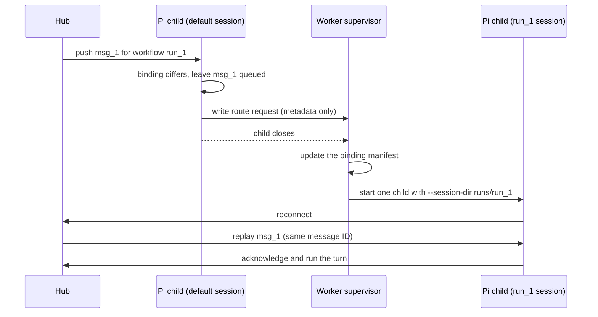

# Run supervised Pi workers

A [worker](../glossary.md#worker) is a long-lived Pi process that stays connected to the KXM hub and answers peer requests and workflow prompts without anyone at the keyboard. `kxm agent worker` starts Pi in headless RPC mode under a small supervisor that restarts it, rotates to fallback models, and can keep each workflow run in its own Pi session. This guide covers starting a worker, choosing models and tools, session isolation, recovery, settings, and stale-worker problems.

## Before you begin

- The `kxm` CLI, and Pi with the KXM package installed: see [Install KXM](../start/install.md) and the [Pi quick start](../start/quickstart-pi.md). Put `pi` on `PATH` or set `KXM_PI_COMMAND`.
- A running hub and its URL in `KXM_SERVER_URL`.
- The hub project's token, which the worker uses as `KXM_AUTH_TOKEN`. Never give a worker the admin token.
- A checkout of the repository the worker should work in. The worker runs Pi in `KXM_WORKDIR`, or the current directory.
- A model route that Pi may run. See [Choose models and fallbacks](#choose-models-and-fallbacks).

## What the worker does

The supervisor launches `pi --mode rpc` with the KXM extension, keeps its input open, and captures its output. The hub stays the only durable queue:

- The extension takes one request at a time and acknowledges it only when the model turn starts, so waiting work stays `queued` on the hub and survives a restart.
- When the turn settles, the extension returns the final answer as the reply. See [Message peer agents](peer-messaging.md) for the message lifecycle.
- If Pi exits, the supervisor restarts it with exponential backoff from 1 second to 30 seconds. The backoff resets after a child has run for a minute.
- A PID claim in `.kxm/state` stops a second supervisor for the same project and agent name.

The worker does not read models, tools, roles, or ownership from any project file. Pass them as flags or environment variables. Run the worker itself under your service manager (systemd, launchd, or similar) for start at boot, resource limits, and log collection.

## Start a worker

Set the hub connection and project token, then start one worker per agent name.

```bash
export KXM_SERVER_URL=http://127.0.0.1:7331
export KXM_AUTH_TOKEN="replace-with-the-project-token"
export KXM_WORKDIR=~/work/product
kxm agent worker --name reviewer --project product \
  --model <pi-model> --tools read,grep,find,ls \
  --session-isolation workflow
```

<details><summary>PowerShell</summary>

```powershell
$env:KXM_SERVER_URL = "http://127.0.0.1:7331"
$env:KXM_AUTH_TOKEN = "replace-with-the-project-token"
$env:KXM_WORKDIR = "$HOME\work\product"
kxm agent worker --name reviewer --project product `
  --model <pi-model> --tools read,grep,find,ls `
  --session-isolation workflow
```

</details>

The command runs in the foreground until it is stopped. Add `--dry-run` to check the settings without starting anything:

```bash
kxm agent worker --name reviewer --project product --tools read,grep,find,ls --session-isolation workflow --dry-run
```

Expected output:

```text
would start worker
```

> [!IMPORTANT]
> Set `KXM_AUTH_TOKEN` to the project token in the worker's environment. When it is unset, the Pi extension falls back to the hub credential persisted on this machine, which is the admin token for a hub that `kxm hub start` or Pi auto-start created.

| Flag | Environment variable | Effect |
|---|---|---|
| `--name` | `KXM_AGENT_NAME` | Agent name on the hub. Required. |
| `--project` | `KXM_PROJECT` | Hub project. Required. |
| `--model` | `KXM_WORKER_MODEL` | Primary model. Pi's default when unset. |
| `--fallback-models` | `KXM_WORKER_FALLBACK_MODELS` | Up to eight comma-separated fallbacks. Requires a primary model. |
| `--tools` | `KXM_WORKER_TOOLS` | Comma-separated Pi tool allowlist. |
| `--session-isolation` | `KXM_WORKER_SESSION_ISOLATION` | `workflow` or `off` (the default). |
| `--fresh-start` | `KXM_WORKER_INITIAL_CONTINUE=false` | Skip resuming the previous Pi session on first start only. |
| `--no-continue` | `KXM_WORKER_CONTINUE=false` | Never resume a previous Pi session. |

## Choose models and fallbacks

`--model` selects the primary Pi model. `--fallback-models` lists up to eight more, tried in order when a provider fails for good. Pi finishes its own transient retries first; then the supervisor closes the session cleanly and restarts on the next model, resuming the same Pi session so completed tool and peer results are kept.

When no unused fallback remains, the worker waits `KXM_WORKER_PROVIDER_RETRY_MS` (60 seconds by default) and tries the last model again. It does not return to the primary model until you restart the worker.

> [!IMPORTANT]
> A worker refuses to start on a model whose vendor has its own native harness. Before Pi starts, the worker runs `--model` and every `--fallback-models` entry through the Pi native-vendor brake, and exits 1 with `pi_native_impersonation_blocked` on the first one it refuses: a native provider (`xai/…`), that vendor's own Pi provider (`openai-codex/…`, `kimi-coding/…`), or an aggregator path to it (`openrouter/x-ai/…`). `--dry-run` does not run this check.

Pick every model with [Harness routing](../reference/harness-routing.md), for example `openrouter/qwen/qwen3-coder-plus` with the fallback `openrouter/z-ai/glm-5.3-flash`. The brake cannot check a worker started without `--model`, which runs Pi's default model, or a bare model id that lets Pi choose the provider, so name the provider.

An agent name is only a label. To use a native-harness model as a peer, connect that harness to the hub under the agent name instead, for example the Claude Code plugin with the name `reviewer-claude`.

## Restrict tools

`--tools` passes an allowlist to Pi. It limits which tools the model can call, not which files those tools can reach: a worker that keeps `write`, `edit`, or a shell tool can change anything its operating-system user can.

- **Read-only reviewer:** `--tools read,grep,find,ls`. A reviewer does not need any `kxm_*` tool to answer; the extension returns its final answer as the reply.
- **Coordinator of a [webhook workflow](webhook-workflows.md):** add the hub tools the workflow needs, for example `kxm_list`, `kxm_send`, `kxm_fanout`, `kxm_get`, `kxm_await`, `kxm_workflow_get`, `kxm_workflow_checkpoint`, `kxm_workflow_wait`, `kxm_workflow_record`, and `kxm_improvement_report`, plus only the edit and shell tools its stages require.

```bash
kxm agent worker --name coordinator --project product \
  --model <pi-model> --fallback-models <fallback-model> \
  --tools read,grep,find,ls,edit,write,bash,kxm_send,kxm_fanout,kxm_get,kxm_await,kxm_workflow_get,kxm_workflow_checkpoint,kxm_workflow_wait,kxm_workflow_record \
  --session-isolation workflow
```

For stronger boundaries, give each worker its own operating-system user, a read-only worktree, or a container. `KXM_WORKER_EXTENSION_PATHS` and `KXM_WORKER_SKILL_PATHS` load exact extension and skill files instead of Pi's discovery; treat those paths as executable code with the worker's credentials, and never derive them from a webhook or workflow payload.

## Isolate sessions per workflow run

With `--session-isolation workflow`, one worker keeps a stable default Pi session for ordinary work and a separate Pi session for each hub workflow run, so unrelated histories never mix in one context window.

| Message | Pi session |
|---|---|
| Ordinary peer or operator request | The default session |
| Root workflow prompt, signal resume, or wait timeout notice | That run's session |
| Peer request with an authorized `workflowContext` | That run's session |
| Request with only a `run_…` correlation ID | The default session. A correlation ID is not authorization. |

A switch never interrupts a turn and never runs two Pi processes at once. The next diagram shows a queued message for another run moving the worker to that run's session.



The route request holds identity, supervisor generation, child incarnation, source and destination bindings, the Pi session ID, the message ID, and a timestamp, never a message body. The supervisor rejects a malformed, stale, or wrong-owner request without changing scope, and refuses session directories that are links.

Session files live under `.kxm/state/pi-sessions/<worker-key>/default` and `.../runs/<run-id>`, and the active binding in `.kxm/state/worker-session-binding-<worker-key>.json`. After a restart the worker resumes the bound session only if it has Pi history. It keeps up to `KXM_WORKER_MAX_RUN_SESSIONS` run sessions (128 by default) and deletes the least recently used inactive ones beyond that. A corrupt manifest is quarantined with a `.corrupt-<timestamp>` suffix and replaced by the default binding.

Isolation is off by default for upgrade compatibility. The first start with `workflow` begins fresh scoped sessions; KXM does not copy the old shared history, because it cannot be attributed to one run safely.

> [!NOTE]
> Pi session files are a convenience, not the record. The hub's workflow run, journal, messages, workspace assets, and Git are the recovery authority. Automatic per-run sessions apply to supervised Pi workers only; for Claude Code, use a separate session or agent name per run.

Isolation keeps model context apart. It is not a sandbox: a shell-capable agent can still read files and environment values that its operating-system user can reach.

## How the worker recovers

| Failure | What the worker does |
|---|---|
| Pi exits or crashes | Restarts with backoff. Stops after `KXM_WORKER_MAX_RESTARTS` restarts when set. |
| Final provider failure | Leaves the request `delivered`, records bounded metadata, and restarts on the next fallback model. |
| A tool runs past `KXM_WORKER_TOOL_TIMEOUT_MS` | Stops the Pi process tree and resumes the request without changing model. |
| A delivered request does not start a turn within `KXM_WORKER_ACTIVATION_TIMEOUT_MS` | Requests a restart and keeps the hub claim. |
| Pi cannot resume a saved session | Retries once with a fresh session and writes a recovery envelope in `.kxm/state`. |
| A workflow run needs a fresh session | Sends Pi a recovery prompt to call `kxm_workflow_get` and continue the current stage without repeating completed work. |

The supervisor writes a structured lifecycle log to `.kxm/logs/kxm-worker-<worker-key>.jsonl` with bounded metadata only. Raw Pi output, which can contain model and tool output, goes to `.kxm/logs/pi-agent-<worker-key>.log`; protect it accordingly.

| Log event | Meaning | Action |
|---|---|---|
| `worker_session_routed` | Expected swap to another run's session | None, unless it repeats for one message |
| `worker_session_evicted` | An inactive run session was deleted at the limit | Keep workflow facts in the journal, assets, and Git |
| `worker_session_state_recovered` | A bad manifest was quarantined | Inspect the `.corrupt-*` file, the hub run, and disk health |
| `worker_session_request_rejected` | A route request failed identity or schema checks | Check for a version mismatch or a duplicate supervisor |
| `worker_continue_fallback` | Pi history could not resume; started fresh | Read the recovery journal and the message state |
| `worker_provider_failure` | A provider failed after Pi's own retries | Check the provider and fallback list |
| `worker_restart_limit_reached` | `KXM_WORKER_MAX_RESTARTS` was hit | Fix the cause, then start the worker again |

## Worker settings

These variables configure a worker; flags override them. The complete list, with limits, is in the [environment variable reference](../reference/configuration.md).

| Variable | Default | Effect |
|---|---|---|
| `KXM_WORKDIR` | Current directory | Repository Pi works in; `.kxm` paths resolve inside it. |
| `KXM_PI_COMMAND` | `pi` (`pi.cmd` on Windows) | Pi executable. |
| `KXM_WORKER_MAX_RUN_SESSIONS` | `128` | Run sessions kept per worker, 1 to 1024. |
| `KXM_WORKER_TOOL_TIMEOUT_MS` | `1860000` | Longest single tool call, 1 second to 24 hours; `0` disables. The default sits one minute above the longest hub wait. |
| `KXM_WORKER_ACTIVATION_TIMEOUT_MS` | `60000` | Time for a delivered request to start a turn, 1 second to 10 minutes. |
| `KXM_WORKER_PROVIDER_RETRY_MS` | `60000` | Wait after the last fallback fails, 1 second to 1 hour. |
| `KXM_WORKER_DRAIN_MS` | `15000` | Graceful stop window before the child is killed. |
| `KXM_WORKER_MAX_RESTARTS` | Unlimited | Restart ceiling. |
| `KXM_WORKER_EXTENSION_PATHS` | Pi discovery | Exact extension files, separated by `:` (`;` on Windows). |
| `KXM_WORKER_SKILL_PATHS` | Pi discovery | Exact skill files or directories, same separator. |
| `KXM_WORKER_LOG_PATH`, `KXM_AGENT_LOG_PATH` | `.kxm/logs/…` | Lifecycle log and raw Pi log locations. |

Variables such as `KXM_WORKER_IDENTITY_KEY` and `KXM_WORKER_GENERATION` are set by the supervisor for its child; do not set them yourself. Restart the worker after changing any setting.

## Stop a worker

Press Ctrl+C in the worker's terminal, or send it `SIGTERM`. The supervisor gives Pi `KXM_WORKER_DRAIN_MS` to finish, then stops it. `kxm hub stop` and `kxm session stop` stop every managed hub and worker process in the workspace, not one worker.

```bash
# Stops the hub and every worker managed from this workspace
kxm hub stop
```

## Troubleshooting

| Symptom | Cause | Fix |
|---|---|---|
| `KXM worker PID claim is stale at <path>` | A previous supervisor was killed without cleanup. | Run `kxm session status --json`; a claim with `"live": false` is stale. Confirm no matching worker is running, delete that file, and start again. |
| `KXM worker <project>/<name> is already managed by PID <pid>` | A supervisor for this agent is already running. | Use the running worker, or stop it first. |
| The worker exits with `worker requires --name and --project` | Name or project missing. | Pass `--name` and `--project`, or set `KXM_AGENT_NAME` and `KXM_PROJECT`. |
| `KXM_WORKER_FALLBACK_MODELS requires KXM_WORKER_MODEL` | Fallbacks without a primary model. | Add `--model`. |
| The worker exits 1 with `pi_native_impersonation_blocked: …` | `--model` or a fallback is a model whose vendor has its own harness. | Run that model in its native harness, or use an admitted Pi route such as `openrouter/qwen/qwen3-coder-plus`. |
| `kxm connection failed` in the Pi log, or Pi shows `hub:off` | Wrong URL, token, or project, or the name is live elsewhere (`duplicate_agent_name`). | Compare `KXM_SERVER_URL`, `KXM_AUTH_TOKEN`, and `KXM_PROJECT` with the hub; check `kxm peer list`. |
| Workflow runs share one conversation | Isolation is `off`, the default. | Restart with `--session-isolation workflow`. |
| A request stays `delivered` | A turn, tool, or provider call is still running, or the watchdogs are recovering it. | Read the lifecycle log. Do not send a duplicate. |

Never repair a live route by editing files in `.kxm/state`. Stop the worker first, keep the evidence, and recover from the hub's workflow state. More symptoms are in [Troubleshoot KXM](../operations/troubleshooting.md).

## Next steps

- Send work to your worker and read its replies: [Message peer agents](peer-messaging.md)
- Make a worker the coordinator of a signed webhook workflow: [Run webhook workflows](webhook-workflows.md)
- Require replies from named reviewer workers before a stage passes: [Peer provenance and quorum gates](provenance-gates.md)
- Pick allowed Pi routes: [Harness routing](../reference/harness-routing.md)
- Every flag: [CLI reference](../reference/cli-reference.md#kxm-agent-worker)
