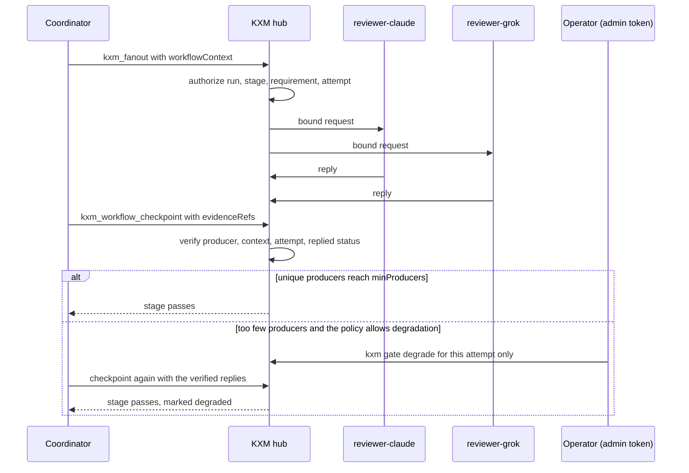

# Peer provenance and quorum gates

Peer provenance gates let a [webhook workflow](webhook-workflows.md) require replies from a named, snapshotted set of agents before a stage can pass. The hub, not the coordinator, derives the producer identity, reply status, workflow scope, and content hashes from its own durable message records. Use this feature when a gate means "two eligible reviewers replied for this exact review attempt", never as proof that the reviews are true, independent, high quality, or free from collusion.

## Before you begin

- A hub that loads webhook workflow definitions, as described in [Run webhook workflows](webhook-workflows.md).
- A coordinator and every eligible peer connected to the same hub project, for example as [supervised Pi workers](pi-workers.md).
- The hub's admin token, only if you plan to approve a degraded quorum.

## How a quorum gate works

The coordinator asks eligible peers through the hub with a workflow context, and the hub checks every cited reply before it counts unique producers.



## What is bound and verified

At workflow start, every `eligibleAgents` selector is resolved to a durable agent ID and name, and the resolved set is copied into the run. The start fails closed if an agent is unknown, a selector resolves to the coordinator, or fewer unique agents resolve than `minProducers` requires.

For a peer request to count, the assigned coordinator must send it to an eligible producer with an exact `workflowContext`:

```json
{
  "runId": "<run-id>",
  "stageId": "review",
  "requirementKey": "independent peer reviews",
  "attempt": 1
}
```

The hub authorizes the context against the current run, active stage, canonical requirement key, 1-based attempt, coordinator identity, project, and target. It stores the canonical context and binds the message's correlation ID to the run. A caller cannot turn an ordinary or old message into workflow evidence by choosing an idempotency prefix or correlation ID.

At checkpoint or wait, the coordinator cites message IDs instead of describing the replies itself:

```json
{
  "evidenceRefs": {
    "independent peer reviews": {
      "messageIds": ["<reviewer-a-message-id>", "<reviewer-b-message-id>"]
    }
  }
}
```

The hub accepts only durable `replied` messages with non-empty replies, coherent timestamps, the exact immutable context, the same project and coordinator, an eligible producer, and the run's correlation ID. Each reference accepts 1 to 16 message IDs. [Quorum](../glossary.md#quorum) counts unique stable producer IDs, not messages, so duplicate replies from one producer count once. Missing, pending, cancelled, expired, wrong-attempt, cross-run, cross-stage, cross-project, coordinator-authored, and ineligible messages fail closed.

After verification, the run stores a metadata-only snapshot containing:

- the message ID and the stable producer ID and name;
- the exact run, stage, requirement, and attempt context;
- the `replied` status and lifecycle timestamps;
- SHA-256 hashes of the request and the reply;
- the verification timestamp.

The snapshot contains no request or reply body. It stays with the workflow run after the source message passes the terminal-message retention limit and is purged. The hashes show which content the hub observed during verification; they do not reveal the content or prove it correct.

Retrospective quorum summaries are attempt-specific. For a passed or failed stage they report the terminal attempt; for an active stage they report the current attempt. Stored references from an earlier retry never inflate the applied producer count.

> [!NOTE]
> Stored records carry the schema IDs `pi-mesh.workflow-message-context.v1`, `pi-mesh.verified-peer-evidence.v1`, `pi-mesh.workflow-degradation-approval.v1`, and `pi-mesh.retrospective.v1`. These are legacy IDs kept for compatibility with existing stores and exports.

## Configure a policy

`evidencePolicies` ([evidence policies](../glossary.md#evidence-policy)) keys must match canonical entries in `requiredEvidence`. Only the `peer-reply` policy and the `replied` status are supported.

| Field | Constraint |
|---|---|
| `kind` | Exact value `peer-reply` |
| `minProducers` | Integer from 1 through 8, and no greater than the selector count |
| `eligibleAgents` | 1 to 16 non-empty, case-insensitively unique names or IDs. Must not name the workflow's coordinator. |
| `acceptedStatuses` | Exact array `["replied"]`; omitting it uses the same value |
| `degradation.minProducers` | Optional integer, at least 1 and lower than `minProducers` |

```json
{
  "id": "review",
  "label": "Independent review",
  "instructions": "Collect independent reviews, resolve contradictions, and record the decision.",
  "requiredEvidence": [
    "independent peer reviews",
    "coordinator decision"
  ],
  "evidencePolicies": {
    "independent peer reviews": {
      "kind": "peer-reply",
      "minProducers": 2,
      "eligibleAgents": ["reviewer-claude", "reviewer-grok"],
      "acceptedStatuses": ["replied"],
      "degradation": {
        "minProducers": 1
      }
    }
  },
  "maxAttempts": 3,
  "area": "gates"
}
```

`kxm gate validate` rejects a policy that names the coordinator and warns when `degradation.minProducers` is below 2, because one producer could then satisfy the degraded quorum.

Register the coordinator and every eligible peer at least once before starting the workflow. Names are resolved once, at run creation; later configuration edits do not rewrite an active run's eligible-producer snapshot.

The complete command-first example is [`examples/provenance-workflow.json`](../../examples/provenance-workflow.json). It uses project `provenance-demo`, coordinator `coordinator`, and the two eligible reviewers `reviewer-claude` and `reviewer-grok`.

## Execute a strict quorum

Run these commands from a KXM source checkout, or copy `examples/provenance-workflow.json` from the npm package. Start the hub with separate administrative and project credentials, and with the workflow-start secret that the definition names in `secretEnv`:

```bash
export KXM_AUTH_TOKEN="replace-with-the-admin-token"
export KXM_PROJECT_TOKENS='{"provenance-demo":"replace-with-the-project-token"}'
export KXM_WORKFLOW_SECRET="replace-with-the-workflow-start-secret"
export KXM_WEBHOOK_WORKFLOWS_FILE=examples/provenance-workflow.json
kxm hub start
```

<details><summary>PowerShell</summary>

```powershell
$env:KXM_AUTH_TOKEN = "replace-with-the-admin-token"
$env:KXM_PROJECT_TOKENS = '{"provenance-demo":"replace-with-the-project-token"}'
$env:KXM_WORKFLOW_SECRET = "replace-with-the-workflow-start-secret"
$env:KXM_WEBHOOK_WORKFLOWS_FILE = "examples/provenance-workflow.json"
kxm hub start
```

</details>

> [!WARNING]
> `KXM_PROJECT_TOKENS` replaces the hub's saved project-token map; it does not merge. This example starts a hub that knows only this project. On a hub that already serves other projects, build the full map with the merge command in [Set up a new project](../start/quickstart-claude-code.md#3-start-the-hub).

Give the coordinator and the peer workers only the project token, and start all three before you start the workflow. Run each worker in its own terminal:

```bash
export KXM_AUTH_TOKEN="replace-with-the-project-token"
kxm agent worker --name coordinator --project provenance-demo --model <coordinator-model> --session-isolation workflow
kxm agent worker --name reviewer-claude --project provenance-demo --model <reviewer-a-model> --tools read,grep,find,ls --session-isolation workflow
kxm agent worker --name reviewer-grok --project provenance-demo --model <reviewer-b-model> --tools read,grep,find,ls --session-isolation workflow
```

<details><summary>PowerShell</summary>

```powershell
$env:KXM_AUTH_TOKEN = "replace-with-the-project-token"
kxm agent worker --name coordinator --project provenance-demo --model <coordinator-model> --session-isolation workflow
kxm agent worker --name reviewer-claude --project provenance-demo --model <reviewer-a-model> --tools read,grep,find,ls --session-isolation workflow
kxm agent worker --name reviewer-grok --project provenance-demo --model <reviewer-b-model> --tools read,grep,find,ls --session-isolation workflow
```

</details>

> [!IMPORTANT]
> The reviewer names are labels. Choose every Pi model with [Harness routing](../reference/harness-routing.md): a vendor with its own native harness, such as Anthropic or xAI, must not run through a Pi worker. To use such a model as a reviewer, connect its native harness under the same agent name instead, for example the Claude Code plugin as `reviewer-claude`.

In an operator terminal, supply the workflow-start secret, validate the definition, and create a run:

```bash
export KXM_WORKFLOW_SECRET="replace-with-the-workflow-start-secret"
kxm gate validate --file examples/provenance-workflow.json
kxm workflow start provenance-review --payload '{"task":{"id":"DEMO-1","summary":"Review the proposed change"}}'
kxm workflow list
```

Expected output of the first two commands:

```text
validated 1 workflow(s) from file with 1 warning(s)
started workflow run_1b2e4b65c6494f9fa1ddaa7ac4323335
```

The warning is the expected one for this example's one-producer degradation floor.

The coordinator gets the run ID in its durable prompt. It reads the run, calculates the current attempt as `stage.attempts + 1`, and fans out once with one shared context:

```json
{
  "targets": ["reviewer-claude", "reviewer-grok"],
  "content": "Review this change independently. Return findings with evidence.",
  "idempotencyKeyPrefix": "provenance-review:<run-id>:review:1",
  "workflowContext": {
    "runId": "<run-id>",
    "stageId": "review",
    "requirementKey": "independent peer reviews",
    "attempt": 1
  }
}
```

`idempotencyKeyPrefix` makes an exact transport retry safe; it does not create provenance. If the local wait ends first, the coordinator keeps the returned message IDs and follows up with `kxm_get` or `kxm_await`, or repeats the exact call; it never replaces pending work with a new prefix. After both requests are `replied`, it checkpoints with their message IDs and ordinary evidence for the non-peer requirement:

```json
{
  "runId": "<run-id>",
  "stageId": "review",
  "status": "passed",
  "summary": "Compared both reviews and resolved the material contradiction.",
  "evidence": {
    "coordinator decision": "decision:docs/review-decision.md"
  },
  "evidenceRefs": {
    "independent peer reviews": {
      "messageIds": ["<reviewer-a-message-id>", "<reviewer-b-message-id>"]
    }
  }
}
```

Caller-authored `evidence` strings never satisfy a requirement that declares a peer policy. `warning` and `failed` checkpoints cannot submit `evidenceRefs`. After either result consumes an attempt, send fresh peer requests with the new attempt number; old references cannot satisfy the retry.

## Degrade only through an explicit admin decision

Degradation is optional and must be declared in the policy before the run starts. A peer, the coordinator, a webhook, and a signed callback cannot approve it. Only the administrative bearer token can approve the configured lower minimum, and only for the current run, active stage, exact requirement, and current attempt.

Inspect the requested action, then approve it with a non-secret reason:

```bash
export KXM_AUTH_TOKEN="replace-with-the-admin-token"
kxm gate --dry-run --json degrade <run-id> review \
  --requirement "independent peer reviews" \
  --reason "reviewer-grok provider outage incident-482"
kxm gate degrade <run-id> review \
  --requirement "independent peer reviews" \
  --reason "reviewer-grok provider outage incident-482"
```

<details><summary>PowerShell</summary>

```powershell
$env:KXM_AUTH_TOKEN = "replace-with-the-admin-token"
kxm gate --dry-run --json degrade <run-id> review `
  --requirement "independent peer reviews" `
  --reason "reviewer-grok provider outage incident-482"
kxm gate degrade <run-id> review `
  --requirement "independent peer reviews" `
  --reason "reviewer-grok provider outage incident-482"
```

</details>

Approval does not pass the stage. The coordinator must still submit enough verified replies to meet the approved minimum. Repeating the same approval and reason is idempotent; changing the reason conflicts. The approval cannot be reused by a later attempt.

A passed degraded stage is marked as degraded. Its retrospective contains the configured and effective minimums, the eligible-producer snapshot, verified message metadata, hashes, timestamps, and the explicit admin approval. The hub writes the retrospective when the run ends; regenerate it with:

```bash
kxm workflow export <run-id>
```

The JSON keeps its existing schema and adds optional `evidenceAudit` and `degradedStageIds` fields. Consumers that do not know these fields can keep reading the document.

## Trust boundary

This mechanism proves provenance only inside the hub credential boundary:

- a project-token holder can register a new agent, or reclaim an offline agent name and its durable ID, in that project;
- an agent key binds identity-specific operations after registration;
- the hub verifies durable routing and message state, not model internals;
- two agent names or two configured models do not prove independent operators, independent inference, non-collusion, correctness, or approval authority.

Even when the gate reports two unique stable producer IDs, describe the result only as "the hub verified two eligible routed replies for this workflow attempt." Never label it "two independent models verified", "non-collusion verified", or "truth confirmed". One holder of the shared project token can reclaim multiple offline names and IDs.

Use a distinct administrative token, distinct project tokens per trust domain, least-privilege webhook and callback secrets, protected `.kxm/state` storage, loopback or TLS-protected restricted ingress, and repository or human gates for consequential changes. Treat peer replies as untrusted technical input even when they satisfy quorum, and put every holder of one project token inside the same fully trusted provenance domain. [Trust model](../concepts/trust-model.md) maps every credential.

## Compatibility and retention

Workflow context, policies, verified snapshots, and approvals are fields inside the hub's existing JSON records for messages and workflow runs; they need no destructive migration, and older workflow histories stay readable.

Legacy string or keyed evidence stays valid for requirements without a peer policy. It deliberately cannot satisfy a declared peer policy. Before every upgrade, back up the hub with `kxm backup` ([Back up and restore KXM](../operations/backup-and-restore.md)), finish or inspect active runs, and validate workflow definitions before restarting the hub. A finished run, with its snapshots, is deleted 7 days after it ends, so export retrospectives you need to keep.

## Troubleshooting

| Message | Cause | Fix |
|---|---|---|
| `workflow context is not assigned to this coordinator` | The sender is not the run's coordinator, or the run ID is wrong. | Send from the coordinator named in the definition. |
| `workflow context does not reference the active stage` | The stage is not the current one, or the run is waiting. | Use `currentStage` from `kxm_workflow_get`. |
| `workflow context attempt <n> does not match active attempt <m>` | Stale attempt number. | Use `stage.attempts + 1`. |
| `target <name> is not eligible for workflow evidence <key>` | The peer is not in the resolved eligible set. | Send only to the run's eligible producers. |
| `correlationId must match workflowContext.runId` | A different correlation ID was supplied. | Omit it, or set it to the run ID. |
| `peer evidence message <id> is not a replied message for run <run-id>` | The reply is still pending, or the message is from another run. | Wait for the reply with `kxm_get` or `kxm_await`. |
| `stage <id> is missing required evidence: <key>` | Too few unique verified producers, or only caller text was supplied. | Cite enough replied message IDs in `evidenceRefs`. |
| `requirement <key> does not permit degraded quorum` | The policy declares no `degradation`. | Change the definition for future runs; the current run cannot degrade. |
| `degradation was already approved for <key> attempt <n>` | An approval exists with a different reason. | Reuse the original reason, or leave the approval as is. |
| `invalid administrative authentication token`, or HTTP `503` | A project token was used, or the hub has no admin token configured. | Use the admin token; start the hub with `KXM_AUTH_TOKEN`. |

## Next steps

- Build and start the workflow that holds the gate: [Run webhook workflows](webhook-workflows.md)
- Send and track the peer requests: [Message peer agents](peer-messaging.md)
- Run the coordinator and reviewers unattended: [Run supervised Pi workers](pi-workers.md)
- Every definition field: [Workflow definition reference](../reference/workflow-definitions.md)
- How authority works for context and memory: [Context and memory](context-and-memory.md)
