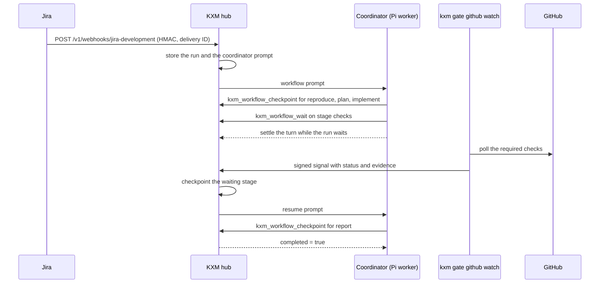

# Run webhook workflows

A webhook workflow turns a signed Jira, GitHub, or generic webhook into a durable, staged run on the KXM [hub](../glossary.md#hub). A long-lived [coordinator](../glossary.md#coordinator) agent works through the stages, proves each one with keyed evidence, and pauses for CI without holding a model turn open. This guide sets up the included Jira example end to end and explains definitions, checkpoints, waits, signals, and retrospectives.

> [!IMPORTANT]
> Hub webhook workflows are separate from Runtime runs. `kxm run` executes `kxm.workflow.v1` YAML files in `.kxm/workflows/` on the local Runtime; see [Run your first workflow](../start/first-workflow.md). A webhook workflow is a JSON definition that the hub loads from `KXM_WEBHOOK_WORKFLOWS_FILE`. Pointing that variable at a YAML workflow stops the hub from starting.

| | Hub webhook workflow | Runtime run |
|---|---|---|
| Defined in | A JSON array of definitions with ordered `stages` | `.kxm/workflows/<id>.yaml` with `steps` |
| Started by | A signed `POST /v1/webhooks/<id>`, or `kxm workflow start` | `kxm run <workflow>` |
| Executed by | A coordinator agent connected to the hub | The Runtime supervisor on your machine |
| Inspected with | `kxm workflow list`, `kxm workflow get`, `kxm_workflow_get` | `kxm runs status`, `kxm runs list` |

[Architecture](../concepts/architecture.md) explains how the two planes relate.

## Before you begin

- The `kxm` CLI, and Pi with the KXM package for the coordinator: see [Install KXM](../start/install.md).
- An admin token for the hub and a project token for the `product` project. See [Trust model](../concepts/trust-model.md) for which credential goes where.
- Two separate random secrets of at least 16 characters: one that starts workflows and one that signs callbacks.
- For a real Jira connection, the hub behind a TLS proxy that Jira can reach, with ingress restricted to Jira. See [Deploy KXM](../operations/deploy.md). A loopback hub is enough for the local test below.
- For the CI stage, a GitHub token that can read checks.

## How a webhook workflow runs

The sequence below shows one run of the Jira example, from the signed delivery to the final checkpoint.



The hub verifies the delivery's signature, refuses replays, deduplicates retries by delivery ID, and records the run before it answers. It keeps a SHA-256 hash of the payload and the rendered prompt, not the raw body, so keep prompt templates narrow.

## Copy the example definition

KXM ships a small, validated Jira definition at [`examples/webhook-workflows/jira-development.json`](../../examples/webhook-workflows/jira-development.json) and a matching test payload, `jira-issue-updated.json`. Copy both into your repository outside `.kxm`:

```bash
mkdir -p ops/kxm
# From a KXM source checkout, or from the npm package:
EXAMPLES="$(npm root -g)/@kontextmind/kxm/examples/webhook-workflows"
cp "$EXAMPLES/jira-development.json" ops/kxm/webhook-workflows.json
cp "$EXAMPLES/jira-issue-updated.json" ops/kxm/jira-issue-updated.json
```

> [!WARNING]
> Never put a definition in `.kxm/config/workflows/`. KXM treats JSON there as legacy state and refuses to load the whole project (`legacy_state_unsupported`).

The definition has five stages: `reproduce`, `plan`, `implement`, `checks`, and `report`. This excerpt shows its top level and the stage that waits for CI.

`ops/kxm/webhook-workflows.json` (excerpt):

```json
[
  {
    "id": "jira-development",
    "source": "jira",
    "project": "product",
    "target": "coordinator",
    "secretEnv": "JIRA_WEBHOOK_SECRET",
    "signalSecretEnv": "WORKFLOW_SIGNAL_SECRET",
    "event": "jira:issue_updated",
    "filter": { "path": "issue.fields.status.name", "equals": "In Progress" },
    "delivery": "followUp",
    "promptTemplate": "Jira issue {{issue.key}} moved to In Progress: {{issue.fields.summary}}. ...",
    "stages": [
      {
        "id": "checks",
        "label": "Pull request checks",
        "instructions": "Push the branch and open or update the pull request. Then call kxm_workflow_wait ...",
        "requiredEvidence": ["github.check:ci"],
        "maxAttempts": 3,
        "area": "gates"
      }
    ]
  }
]
```

## Write your own definition

A file holds a JSON array of definitions. The hub checks every limit below at start.

| Field | Meaning |
|---|---|
| `id` | Up to 64 characters; the last segment of the webhook URL. |
| `source` | `jira`, `github`, or `generic` (the default). A label on the run, and it decides which signatures the hub accepts: see [Signatures and delivery IDs](#signatures-and-delivery-ids). |
| `project`, `target` | Hub project, and the coordinator's agent name or ID. |
| `secretEnv` | Variable holding the start secret. `secret` takes a literal instead; prefer the variable. |
| `signalSecretEnv` | Variable holding the callback secret. Without it, callbacks use the start secret. |
| `event` | Optional. Must equal the `X-GitHub-Event` header, or the payload's `webhookEvent` or `event` field. |
| `filter` | Optional. `path` is a dotted payload path whose string value must equal `equals`. |
| `delivery` | `followUp` (the default) or `steer` for the coordinator prompt. |
| `ttlMs` | Coordinator prompt lifetime. Defaults to the hub message TTL (24 hours). |
| `promptTemplate` | Up to 20,000 characters. `{{dotted.path}}` inserts payload values; a missing value becomes empty. |
| `stages` | One to 32 ordered stages. |

Each stage has an `id`, a `label`, `instructions` (up to 4,000 characters), `requiredEvidence` (up to 32 keys), `maxAttempts` (1 to 20, default 3), and an optional `area` that files its automatic journal entries under `harness`, `gates`, `implementation`, `workflow`, `documentation`, `security`, or `other`. A stage may also declare `evidencePolicies`, which require verified replies from named peers; see [Peer provenance and quorum gates](provenance-gates.md). Typed transitions (`on`, `maxTransitions`), `autoResumeLimit`, and the `reproOracle` and `planHash` locks are described in [Workflow definition reference](../reference/workflow-definitions.md).

The hub appends the stages, their evidence keys, and the coordinator procedure to the rendered prompt, so the template only needs the task.

## Validate the definition

Set both secrets, then validate the file. Validation parses it exactly as the hub will and never prints a secret.

```bash
export JIRA_WEBHOOK_SECRET="replace-with-a-high-entropy-secret"
export WORKFLOW_SIGNAL_SECRET="replace-with-a-separate-callback-secret"
kxm gate validate --file ops/kxm/webhook-workflows.json
```

Expected output:

```text
validated 1 workflow(s) from file
```

## Start the hub with the definition

Start the hub in the same environment. It loads the definitions once, at start; restart it after every change.

```bash
export KXM_AUTH_TOKEN="replace-with-the-admin-token"
export KXM_PROJECT_TOKENS='{"product":"replace-with-the-project-token"}'
export KXM_WEBHOOK_WORKFLOWS_FILE=ops/kxm/webhook-workflows.json
kxm hub start
```

<details><summary>PowerShell</summary>

```powershell
$env:JIRA_WEBHOOK_SECRET = "replace-with-a-high-entropy-secret"
$env:WORKFLOW_SIGNAL_SECRET = "replace-with-a-separate-callback-secret"
$env:KXM_AUTH_TOKEN = "replace-with-the-admin-token"
$env:KXM_PROJECT_TOKENS = '{"product":"replace-with-the-project-token"}'
$env:KXM_WEBHOOK_WORKFLOWS_FILE = "ops/kxm/webhook-workflows.json"
kxm hub start
```

</details>

> [!WARNING]
> `KXM_PROJECT_TOKENS` replaces the hub's saved project-token map; it does not merge. This example starts a hub that knows only this project. On a hub that already serves other projects, build the full map with the merge command in [Set up a new project](../start/quickstart-claude-code.md#3-start-the-hub).

`KXM_WEBHOOK_WORKFLOWS` takes the JSON array inline instead. Setting both variables stops the hub from starting.

## Start the coordinator

The coordinator must have registered with the hub at least once before a webhook targets it. A delivery for a coordinator that never registered is refused with `409`, which makes Jira retry. A registered but offline coordinator is fine: the prompt waits for it in the queue.

In another terminal, start a [supervised Pi worker](pi-workers.md) as the coordinator, with the project token and the hub tools its stages need:

```bash
export KXM_SERVER_URL=http://127.0.0.1:7331
export KXM_AUTH_TOKEN="replace-with-the-project-token"
export KXM_WORKDIR=~/work/product
kxm agent worker --name coordinator --project product --model <pi-model> \
  --session-isolation workflow
```

`--session-isolation workflow` gives each run its own Pi session. Any connected harness can coordinate instead, such as Claude Code with the agent name `coordinator`.

## Send a test delivery

`kxm workflow start` signs a payload under the [KXM sender contract](#kxm-sender-contract) and posts it to the hub at `KXM_SERVER_URL`, as a provider would. It signs with `KXM_WORKFLOW_SECRET`, or with the definition's own start secret when `KXM_WEBHOOK_WORKFLOWS_FILE` is set in the same shell.

```bash
export KXM_SERVER_URL=http://127.0.0.1:7331
export KXM_WORKFLOW_SECRET="replace-with-a-high-entropy-secret"
kxm workflow start jira-development \
  --payload @ops/kxm/jira-issue-updated.json --delivery-id local-test-0001
```

Expected output:

```text
started workflow run_7c187d2a0fde408ea408f0d8c53201c8
```

Repeating the command with the same delivery ID and payload returns the same run ID; the same delivery ID with a different payload is refused with `409`. Inspect runs from the hub's workspace on the hub host; these commands read its local SQLite store:

```bash
kxm workflow list
kxm workflow get run_7c187d2a0fde408ea408f0d8c53201c8 --json
```

## Connect Jira

In Jira, create a webhook for the `jira:issue_updated` event that posts to `https://<kxm-host>/v1/webhooks/jira-development`, and set the same start secret.

### Signatures and delivery IDs

The hub accepts two ways to sign a start:

| Headers | Sent by | Accepted by |
|---|---|---|
| `x-kxm-signature`, `x-kxm-timestamp`, `x-kxm-delivery-id` | `kxm` and your own senders | Every definition. See [KXM sender contract](#kxm-sender-contract). |
| `X-Hub-Signature-256` or `X-Hub-Signature`, with `X-Atlassian-Webhook-Identifier` | Jira | A `jira` definition only. |
| `X-Hub-Signature-256` with `X-GitHub-Delivery` | GitHub | A `github` definition only. |

Jira and GitHub sign only the body, as `sha256=<hex>`; other algorithms are refused. Because the delivery ID is not signed, the body is the delivery's replay identity: a signed body starts at most one run, under one delivery ID.

| Response | Meaning |
|---|---|
| `202` | Run created and coordinator prompt queued. |
| `200` with `"duplicate": true` | The delivery ID and body were seen before. Only `runId` and `status` come back, never the run. |
| `204` | The event or filter did not match. Nothing was stored. |
| `401` | Missing, unsupported, or wrong signature, or a KXM signature outside its 300-second window. |
| `404` | No definition with that ID. |
| `409` `workflow_target_unavailable` | The coordinator has never registered. |
| `409` `webhook_delivery_conflict` | The delivery ID was already used with a different body. |
| `409` `webhook_payload_replayed` | A Jira or GitHub body already started a run under another delivery ID. |

Webhook authentication authorizes only workflow creation. The `report` stage updates Jira through the coordinator's own authorized Jira tool; never put Jira credentials in a definition or prompt.

## KXM sender contract

A body-only signature cannot tell a retry from a replay, so KXM's own senders sign more: `kxm workflow start`, `kxm gate signal`, `kxm gate github watch`, and [`examples/workflow-signal.ts`](../../examples/workflow-signal.ts). A start of a `generic` definition and every signal must use this contract; a body-only signature there is refused with `401 webhook_signature_missing`.

| Header | Value |
|---|---|
| `x-kxm-delivery-id` | Stable retry identifier, at most 128 characters |
| `x-kxm-timestamp` | Unix seconds at send time |
| `x-kxm-signature` | `sha256=` and the hex HMAC-SHA256 of the signed material, under the start or callback secret |

The signed material is seven newline-terminated fields followed by the exact body bytes. No field may contain a line break. `workflowWebhookHeaders` in `plugins/kxm/src/workflow.ts` builds all three headers.

```text
kxm-webhook-v1
start | signal
<x-kxm-timestamp>
<x-kxm-delivery-id>
<definition ID>
<run ID; empty for a start>
<signal key; empty for a start>
<body>
```

- A signature over any other timestamp, delivery ID, definition, run, signal key, or body is refused with `401 webhook_signature_invalid`, so a captured request cannot be replayed under a new delivery ID or against another run.
- An authentic signature whose timestamp is more than 300 seconds from the hub clock is refused with `401 webhook_timestamp_expired`. Sign at send time: a retry re-signs with a fresh timestamp and keeps the same delivery ID and body, which the hub answers as a duplicate.
- The signed kind keeps a start signature from ever verifying as a signal, even when both use the start secret.

## Follow the coordinator procedure

For every stage, the coordinator:

1. Calls `kxm_workflow_get` and works only on `currentStage`.
2. Records plans, decisions, contradictions, errors, and lessons with `kxm_workflow_record`, passing the `stageId`.
3. Gathers evidence for every `requiredEvidence` key.
4. For a stage with a peer policy, sends requests with `workflowContext` ([Peer provenance and quorum gates](provenance-gates.md)).
5. Calls `kxm_workflow_checkpoint`, or `kxm_workflow_wait` when an external system must finish the stage.
6. After a `warning` or `failed` result, corrects the problem and tries again until the stage passes or `maxAttempts` runs out.
7. Replies to the prompt only after a checkpoint reports `completed: true`, or right after entering a wait.

Replying while the run is `running` and stages remain fails the run and records a workflow error. Replying after a successful wait is expected: it releases the model turn, and the signed callback creates a fresh prompt later. If the prompt's TTL passes first, the run fails.

## Checkpoint a stage

A passing checkpoint needs a non-empty value for every required evidence key. Keys are matched after trimming, collapsing whitespace, and ignoring case; an extra key never stands in for a missing one.

Tool call (`kxm_workflow_checkpoint`):

```json
{
  "runId": "run_7c187d2a0fde408ea408f0d8c53201c8",
  "stageId": "reproduce",
  "status": "passed",
  "summary": "Reproduced with a failing test.",
  "evidence": { "reproduction": "test/checkout.test.ts fails: npm test -- checkout" }
}
```

The CLI twin is `kxm workflow checkpoint`, run under the coordinator's agent name.

Only the assigned coordinator can read, journal, checkpoint, or wait a run, and checkpoints and waits apply only to the active stage. A `warning` or `failed` checkpoint uses up an attempt and records an error; its evidence stays in the journal but does not count toward a later pass. Reaching `maxAttempts` fails the run. The hub enforces stage order and evidence keys; the agents stay responsible for the truth of what they submit.

## Wait for CI and other external work

A coordinator should not hold a model turn open while CI runs. On the active stage it calls `kxm_workflow_wait` with a stable signal key, a summary of the expected result, any evidence it already has, and an optional timeout from 1 second to 30 days (24 hours by default). The run and stage become `waiting`, and the coordinator settles its turn. If the deadline passes, the run fails and the coordinator receives a notice.

Tool call (`kxm_workflow_wait`):

```json
{
  "runId": "run_7c187d2a0fde408ea408f0d8c53201c8",
  "stageId": "checks",
  "signalKey": "github-pr-42-checks",
  "summary": "Waiting for the required GitHub checks on pull request 42",
  "timeoutMs": 3600000
}
```

Store the run ID and signal key where the external system can find them, such as pull-request metadata; they are not secrets.

The external system reports back with a signed signal to `POST /v1/webhooks/<definition-id>/runs/<run-id>/signals/<signal-key>`. The body is `{"status": "passed" | "warning" | "failed", "summary": "...", "evidence": {...}}`, signed with the callback secret under the [KXM sender contract](#kxm-sender-contract), bound to the route's run ID and signal key, with a stable delivery ID.

- `passed` applies the evidence rule to the saved and new evidence together, then advances or completes the run.
- `warning` or `failed` uses up an attempt, records an error, and sends the coordinator a correction prompt while attempts remain.
- The same delivery ID and body returns the original receipt; the same delivery ID with a different signal or body is refused with `409`.
- Optional `workflow.run`, `workflow.stage`, and `workflow.signal` evidence values must match the route, or the hub refuses the signal with `409`.

The run, receipt, journal entry, and resume prompt commit in one transaction. The response carries only status flags, never the run or its evidence.

## Send a signal from the CLI

`kxm gate signal` signs and posts a signal. It needs `KXM_WORKFLOW_ID` and the callback secret, either through the active definition file or `KXM_WORKFLOW_SIGNAL_SECRET`. Evidence is `key=value` pairs.

```bash
export KXM_WORKFLOW_ID=jira-development
export KXM_WORKFLOW_SIGNAL_SECRET="replace-with-a-separate-callback-secret"
kxm gate signal run_7c187d2a0fde408ea408f0d8c53201c8 github-pr-42-checks passed \
  "All required checks passed" "github.check:ci=https://github.example/org/repo/actions/runs/123" \
  --delivery-id github-check-run-123-attempt-1
```

Expected output:

```text
posted signed signal
```

> [!NOTE]
> Hub and Runtime run IDs share the `run_<32-hex>` shape. Inside a KXM project, `kxm gate signal` and `kxm workflow wait` send a run to the Runtime supervisor only when the project's Runtime store holds that run; a hub run goes to the hub. Check with `--dry-run`: the hub path prints `would post signed signal`, the Runtime path `would post signal to KXM run`.

For your own adapters, [`examples/workflow-signal.ts`](../../examples/workflow-signal.ts) shows the same signed request in about 60 lines.

## Watch GitHub checks

`kxm gate github watch` polls a pull request's check runs and posts the signal for you. It reads the token from `GITHUB_TOKEN` or `GH_TOKEN`, and the workflow ID and callback secret as `kxm gate signal` does.

```bash
export GITHUB_TOKEN="replace-with-a-checks-read-token"
kxm gate github watch --run-id run_7c187d2a0fde408ea408f0d8c53201c8 --stage-id checks \
  --signal-key github-pr-42-checks --repo org/repo --pr 42 --required ci
```

- It reports each required check as evidence `github.check:<name>`, so `--required ci` satisfies the `github.check:ci` requirement. Without `--required`, every check counts.
- `failure`, `cancelled`, `timed_out`, `action_required`, `stale`, and `startup_failure` fail the stage. Only `success` passes; a `neutral` or `skipped` check keeps the watcher waiting.
- It polls every 15 seconds for up to 30 minutes (`--interval-ms`, `--timeout-ms`). On timeout it posts a signed `failed` signal with summary `github_watch_timeout` and exits `4`. It never invents a pass.
- Each invocation uses a new delivery ID that includes the head commit, and its own retries reuse it. After a failure, start a new wait and a new watcher. Pass `--delivery-id` only when an outside supervisor must retry the same callback. Without a token it exits with `github_auth_unavailable`.

## Keep a journal and export retrospectives

The coordinator records knowledge with `kxm_workflow_record` in ten categories: `plan`, `decision`, `contradiction`, `error`, `lesson`, `observation`, `hypothesis`, `experiment`, `state-change`, and `skill-candidate`. Lessons and skill candidates require evidence. Passing `stageId` binds the entry to that stage and its current attempt. The hub adds its own error entries for failed checkpoints and signals, timeouts, and early settlement.

When a run completes or fails, the hub writes a proposed retrospective to `.kxm/assets/retrospectives/<run-id>.json` and `.md`. Regenerate it with `kxm workflow export <run-id>`, and summarize learning across runs with `kxm_improvement_report`. [Continuous improvement](continuous-improvement.md) describes the review loop.

> [!CAUTION]
> The hub deletes a finished run and its journal 7 days after it ends. Export anything you want to keep before then. Signal deduplication for that run ends at the same time.

## Degrade a peer quorum

If a stage's peer policy declares a lower `degradation.minProducers`, an operator holding the admin token can approve that lower minimum for the current attempt only with `kxm gate degrade`. Coordinators, peers, and callback secrets cannot. See [Peer provenance and quorum gates](provenance-gates.md#degrade-only-through-an-explicit-admin-decision).

## Security notes

- The start secret authorizes creating runs; the callback secret authorizes only checkpointing a waiting run with a matching signal key. Keep them separate with `signalSecretEnv`.
- A KXM signature covers the timestamp, delivery ID, definition, run, and signal key, and expires after 300 seconds, so a captured request cannot be replayed under a new delivery ID or against another run. Jira and GitHub sign only the body: a captured provider delivery re-sent under its own delivery ID only returns the duplicate, and a body starts at most one run. Terminate TLS and restrict ingress anyway.
- Repository rules, human approvals, and harness permissions stay in charge of pushing, merging, and changing Jira.

## Troubleshooting

| Symptom | Cause | Fix |
|---|---|---|
| The hub does not start: `Unexpected token` or `must be a JSON array` | `KXM_WEBHOOK_WORKFLOWS_FILE` points at YAML or a single object. | Point it at a JSON array such as the example. |
| `workflow.secret must be a string` | The variable named by `secretEnv` or `signalSecretEnv` is not set. | Export it in the hub's environment. |
| Jira retries and the hub returns `409` | The coordinator never registered. | Start the coordinator once, then redeliver. |
| `kxm workflow start` prints `started workflow accepted` and no run appears | The event or filter did not match (`204`). | Check the payload's event and filter path. |
| `stage <id> is missing required evidence: <key>` | A required key is missing or empty. | Supply every key from `kxm_workflow_get`. |
| `stage <id> is not currently active` or `workflow is waiting` | Wrong stage, or the stage is paused for a signal. | Use `currentStage`; send the signal instead of a checkpoint. |
| The run fails right after the coordinator replies | It settled before the last checkpoint. | Checkpoint every stage, or wait, before replying. |
| `kxm gate signal` prints `signed signal failed` | Wrong signal key, run not waiting, a delivery-ID conflict, or a clock more than 300 seconds off. | Compare the run's `waiting.signalKey`; use a new delivery ID for a new result; check the sender's clock. |
| A custom sender gets `401 webhook_signature_missing` | It sends only `X-Hub-Signature-256` to a `generic` definition or a signal. | Sign with the [KXM sender contract](#kxm-sender-contract). |

## Next steps

- Make the coordinator long-lived and unattended: [Run supervised Pi workers](pi-workers.md)
- Require verified replies from named reviewers before a stage passes: [Peer provenance and quorum gates](provenance-gates.md)
- Turn journals into improvements: [Continuous improvement](continuous-improvement.md)
- Every definition field: [Workflow definition reference](../reference/workflow-definitions.md); every route: [Hub HTTP API reference](../reference/http-api.md)
- The Runtime alternative: [Run your first workflow](../start/first-workflow.md)
