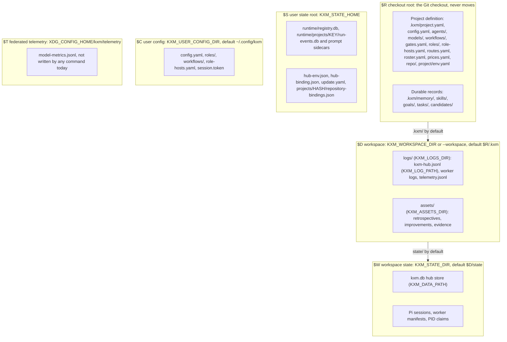

# Back up and restore KXM

Protect every piece of KXM state, not only the hub database, and bring it back after a disk loss, a bad change, or a move to a new host. This page is for operators. You learn which six roots hold state, what `kxm backup` and `kxm restore` do and do not cover, and a stopped-state procedure for the rest.

## Before you begin

- The `kxm` CLI and the project checkout, on the machine that runs the hub and the [Runtime](../glossary.md#runtime).
- Permission to stop the hub, the Runtime supervisor, and anything that restarts them.
- Protected, preferably encrypted, backup storage. Backups contain message bodies, prompts and, if you include them, credentials.

## Know where state lives

KXM spreads state over six roots. Some of them move with environment variables, and a backup that assumes one location silently misses another. The following diagram shows each root, what it holds, and the variable that moves it.



| Root | Default | Moved by |
|---|---|---|
| `$R` checkout | The Git checkout | Nothing. `.kxm/` definition files always stay here |
| `$D` workspace | `$R/.kxm` | `KXM_WORKSPACE_DIR` or `--workspace`, relative to `KXM_WORKDIR` or the current directory |
| `$W` workspace state | `$D/state` | `KXM_STATE_DIR`; `KXM_DATA_PATH` moves only `kxm.db` |
| `$S` user state root | `~/.local/state/kxm` (Linux, honoring `XDG_STATE_HOME`), `~/Library/Application Support/KXM` (macOS), `%LOCALAPPDATA%\KXM` (Windows) | `KXM_STATE_HOME`, which must be absolute |
| `$C` user config | `~/.config/kxm` | `KXM_USER_CONFIG_DIR` |
| `$T` federated telemetry | `~/.config/kxm/telemetry` | `XDG_CONFIG_HOME` |

Three override rules catch people out:

- `--workspace` derives `config/`, `logs/`, `assets/` and `state/` from one directory and ignores the per-directory variables. Without it, `KXM_CONFIG_DIR`, `KXM_LOGS_DIR`, `KXM_ASSETS_DIR` and `KXM_STATE_DIR` each move only their own target. `KXM_STATE_DIR=/srv/state` alone leaves `$D` at `$R/.kxm`.
- A relative `KXM_STATE_HOME` fails with `local_state_root_not_absolute`. A relative `XDG_STATE_HOME` or `LOCALAPPDATA` base is ignored without an error, and the platform default is used.
- `KXM_WORKER_LOG_PATH` and `KXM_AGENT_LOG_PATH` move worker logs out of `$D/logs`.

Record every override with the backup. A restore that lands where the running service does not look is not a restore.

## Know what each backup covers

`kxm backup` protects SQLite stores it can find from the current directory. Everything else needs the stopped-state copy described below.

> [!WARNING]
> `kxm backup` does not back up the Runtime. It looks for Runtime stores under `.kxm/runtime/` in the checkout, but the Runtime writes them under the user state root (`$S/runtime/registry.db` and `$S/runtime/projects/<key>/run-events.db`). In practice a backup holds only the hub store. Back up the Runtime stores and their prompt sidecars by hand, stopped, as shown in [Back up everything else](#back-up-everything-else).

| Path | Holds | In `kxm backup` |
|---|---|---|
| `$W/kxm.db` | Hub store: agents, messages, workflow runs, journals, context items, leases, synced run facts | Yes, at `<current directory>/.kxm/state/kxm.db` only |
| `$S/runtime/registry.db` | Runtime registry: projects, their roots, the supervisor identity and claim | No |
| `$S/runtime/projects/<key>/run-events.db` | Event-sourced runs, drive receipts, gate evidence, the sync outbox | No |
| `$S/runtime/projects/<key>/run-events.db.run-prompts.json` | Run prompt text; restoring a store without it loses every prompt | No |
| `$S/projects/<hash>/repository-bindings.json`, `$S/update.yaml` | Member repository paths; updater settings | No |
| `$S/hub-env.json`, `$S/hub-binding.json`, `$C/session.token` | Credentials and the machine's hub binding | No; prefer regenerating secrets to copying them |
| `$R/.kxm/` definition files and durable records | Project, roles, routes, prices, roster, memory, skills, goals, tasks, candidates | No; commit them to Git or copy the checkout |
| Each member repository's `.kxm/repo/*.yaml` | Member definition and environment | No; they live in the member's own checkout |
| `$W/worker-*.json`, `$W/pi-sessions/` | Worker routing and recovery manifests; Pi model history | No; manifests are required for resumable workers, Pi history is optional |
| `$D/assets/`, `$D/logs/` | Retrospectives and evidence; logs and local usage accounting (`telemetry.jsonl`) | No |
| `$C` | User-level roles, workflows and settings | No |

A restore without `roster.yaml`, `routes.yaml` or `prices.yaml` comes back healthy but with different admission and cost behavior, so treat them as part of the backup even though they are plain files. `kxm improve report --out-dir` can write candidates outside `$R/.kxm/candidates/`; include that directory if you use it.

These files are disposable and need no backup: `hub.pid`, `hub.stop`, `worker-*.pid`, `session-brief.json`, `update-check.json`, `runtime/supervisor.token`, `runtime/supervisor.error`.

## Back up the hub store with `kxm backup`

Run it from the checkout root. It resolves stores from the current directory and ignores `--workspace`, `KXM_WORKDIR`, `KXM_STATE_DIR` and `KXM_DATA_PATH`, so a relocated hub database is not found.

Preview first. A dry run lists what it would write, opens no store and writes nothing:

```bash
cd /srv/kxm/product
kxm backup --dry-run
```

Expected output:

```text
dry run: back up 1 store(s) to /srv/kxm/product/.kxm/backups/backup-2026-09-23T18-29-09-107Z (sources are not opened, so their WAL is not checkpointed)
  would write /srv/kxm/product/.kxm/backups/backup-2026-09-23T18-29-09-107Z/kxm.db
  would write /srv/kxm/product/.kxm/backups/backup-2026-09-23T18-29-09-107Z/manifest.json
```

Then write the backup outside the checkout:

```bash
kxm backup --out /backups/kxm/2026-09-23/hub
```

Expected output:

```text
Created SQLite backup with 1 store(s):
  - hub-store: /srv/kxm/product/.kxm/state/kxm.db -> kxm.db (schema v5, 110592 bytes, sha256 sha256:86549...)
Manifest: /backups/kxm/2026-09-23/hub/manifest.json
```

For each store, `kxm backup` checkpoints the write-ahead log, runs `PRAGMA integrity_check`, copies the database with `VACUUM INTO`, checks the copy's integrity, sets mode `0600`, and records its schema version and SHA-256 in `manifest.json` (`kxm.backup-manifest.v1`). `VACUUM INTO` reads one consistent snapshot, so the hub can keep running during this step.

> [!NOTE]
> Without `--out`, backups go to `.kxm/backups/` inside the checkout. Keep that directory out of Git, or always pass `--out`.

It fails with `backup_no_stores` when `.kxm/state/kxm.db` does not exist under the current directory, and with `database_corrupted` when an integrity check fails.

## Back up everything else

Copy the remaining state with both services stopped. SQLite runs in write-ahead-log mode, so a plain copy of a live database can miss committed data.

1. Stop the Runtime, then the hub, and confirm both are down:

   ```bash
   kxm runtime stop
   kxm hub stop
   kxm runtime status   # expect "runtime supervisor is not running" and exit status 1
   kxm hub view         # expect "hub health=false ready=false" and exit status 1
   ```

2. Keep them down until the copy finishes. Pause your service manager's restart policy, Pi sessions with `hub.autoStart: background`, and anything that runs Runtime commands, because `kxm run`, `kxm runs list` and similar commands start the supervisor on demand.
3. Copy the hub store and the user state root:

   ```bash
   S="${KXM_STATE_HOME:-$HOME/.local/state/kxm}"   # macOS: "$HOME/Library/Application Support/KXM"
   B=/backups/kxm/2026-09-23
   mkdir -p "$B"
   kxm backup --out "$B/hub"
   tar -C "$S" --exclude 'supervisor.token' --exclude 'hub-env.json' -czf "$B/user-state.tgz" .
   ```

   The archive holds `registry.db`, every project's `run-events.db` with any `-wal` and `-shm` files and its `.run-prompts.json` sidecar, the repository bindings, the hub binding and `update.yaml`. It leaves out the credential file; keep tokens in your secret store, or include `hub-env.json` and protect the archive as a secret.

   If `KXM_STATE_DIR` or `KXM_DATA_PATH` moved the hub database, `kxm backup` fails with `backup_no_stores`. With both services stopped, copy that database file and any `-wal` and `-shm` files instead.
4. Copy the other roots your recovery needs: the checkout's untracked `.kxm/` records, `$D/assets/`, `$W/worker-*.json` (and `$W/pi-sessions/` only if your policy keeps model history), and `$C`.
5. Record the KXM version (`kxm --version`), the configuration commit, the schema versions from `manifest.json`, and every override variable, next to the copy.
6. Start the hub, then the Runtime with `kxm runtime start`, and resume the paused restart policies.

Keep at least one previous backup, and bound retention: run events and prompt sidecars grow with every run.

## Restore with `kxm restore`

`kxm restore` overwrites the live database and deletes its `-wal` and `-shm` files, and it does not check whether the hub is running. Stop the hub and the Runtime first, and move the current state aside rather than deleting it.

Preview the restore. The dry run performs every check below and lists what it would overwrite:

```bash
cd /srv/kxm/product
kxm restore /backups/kxm/2026-09-23/hub/manifest.json --dry-run
```

Expected output:

```text
dry run: restore 1 store(s) from /backups/kxm/2026-09-23/hub/manifest.json; digests verified against the manifest
  would write /srv/kxm/product/.kxm/state/kxm.db
  would delete /srv/kxm/product/.kxm/state/kxm.db-wal
  would delete /srv/kxm/product/.kxm/state/kxm.db-shm
```

Then run it without `--dry-run`:

```bash
kxm restore /backups/kxm/2026-09-23/hub/manifest.json
```

Expected output:

```text
Restored 1 SQLite store(s) from /backups/kxm/2026-09-23/hub/manifest.json:
  - hub-store: -> /srv/kxm/product/.kxm/state/kxm.db (schema v5, integrity ok)
```

Before it overwrites anything, `kxm restore` checks that the manifest is a `kxm.backup-manifest.v1` document, that every listed file exists, that each file's SHA-256 matches the manifest, and that no store is newer than this build supports. The manifest's own `manifestSha256` is not checked.

It then checks each backup's integrity and schema version again, copies it into place with mode `0600`, and checks the result. Each store returns to its recorded path, rebased onto the current directory when the manifest came from another checkout.

### Restore ceilings

A backup newer than this build is refused with `runtime_schema_newer` before any file changes. KXM has no migrations: an older backup restores, but its store then refuses to open with `runtime_schema_outdated`. Restore an older backup with the release that wrote it; see [Upgrade KXM](upgrade.md#understand-schema-changes).

The ceilings come from `KXM_BACKUP_CEILINGS` in `plugins/kxm/src/database.ts` and match each store's own schema version:

| Store id | Highest schema version restored |
|---|---|
| `hub-store` | 5 |
| `registry` | 1 |
| `events:<key>` | 7 |
| `binding-store` | 1 (no current store uses it) |

### Restore the Runtime stores by hand

1. Stop the Runtime and the hub, as in the backup procedure.
2. Move `$S/runtime/registry.db` and `$S/runtime/projects/` aside.
3. Extract the archive into the user state root:

   ```bash
   S="${KXM_STATE_HOME:-$HOME/.local/state/kxm}"
   tar -C "$S" -xzf /backups/kxm/2026-09-23/user-state.tgz
   ```

   The archive also brings back the hub binding, `update.yaml` and repository bindings.
4. Keep the checkout at the same absolute path. The Runtime derives each project's store key from the canonical checkout path, so a checkout restored elsewhere does not find its runs.

## Verify the restore

1. Start the hub and check `/ready` and `kxm hub view`, including that the reported `loopback` or `remote` scope matches the environment.
2. Run `kxm runtime start`, then `kxm runtime status`, and wait for the sync state to return to `ok`.
3. Run `kxm runs list`, open one run with `kxm runs status <run-id>`, and confirm its prompt sidecar came back. A run store without its sidecar is a partial restore.
4. Send one test request between two agents.

Test a full restore on a spare machine before you rely on it, and repeat the test periodically.

## Troubleshooting

| Symptom | Cause | Fix |
|---|---|---|
| `backup_no_stores` | No `.kxm/state/kxm.db` under the current directory, or it was moved with `KXM_STATE_DIR` or `KXM_DATA_PATH` | Run from the checkout root; copy a relocated database with the stopped-state procedure |
| Runs are missing after a restore | `kxm backup` never contained the Runtime stores | Restore `$S/runtime/` from the stopped-state archive |
| `restore_manifest_digest_mismatch` | A backup file changed after the manifest was written | Use another backup; do not edit files in a backup set |
| `restore_file_missing` | A file listed in the manifest is not beside it | Copy the whole backup directory, not only `manifest.json` |
| `runtime_schema_mismatch` | A backup file's schema version differs from the one its manifest records | Use another backup set; never mix files between sets |
| `runtime_schema_newer` | The backup came from a newer release | Upgrade KXM first, then restore |
| The hub refuses to start with `runtime_schema_outdated` | The restored store is older than this build | Run the release that wrote it, or start fresh |

## Next steps

- Move to a new release safely: [Upgrade KXM](upgrade.md)
- What each store contains and how sensitive it is: [Data and storage](../concepts/data-and-storage.md)
- Watch the restored service: [Monitor KXM](monitoring.md)
- Exact flags and JSON fields: [CLI reference](../reference/cli-reference.md#kxm-backup)
