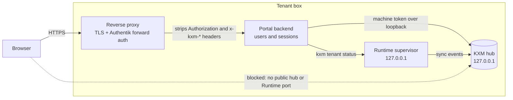

# Deploy KXM

Run one KXM [hub](../glossary.md#hub) and one [Runtime](../glossary.md#runtime) supervisor as a supervised service, on loopback or behind a trusted proxy. This page is for operators who take KXM past a single developer terminal. You end with a hub that restarts cleanly, clients bound to it with the right credential, and, for hosted use, one isolated box per tenant.

## Before you begin

- Install the `kxm` CLI on the host ([Install KXM](../start/install.md)) and run `kxm init` in the project checkout.
- Read the [trust model](../concepts/trust-model.md) if anyone other than you will hold a KXM credential.
- Have a service manager (systemd, launchd, or a Windows service wrapper) and a place to keep secrets outside Git.

## Know the deployment envelope

KXM is a single-node service. One Node.js process serves the hub over HTTP and server-sent events, and it is the only writer of one SQLite database. The Runtime supervisor is a second local process that owns run event stores and pushes summaries to the hub.

| KXM provides | KXM does not provide |
|---|---|
| Durable restart recovery of agents, messages and workflow runs | Clustering, leader election or shared-state failover |
| Project-scoped tokens and per-agent keys | Per-user identity, roles or an identity provider |
| Signed webhook workflows and callbacks | Exactly-once delivery (it is at-least-once) |
| Health, readiness, metrics and structured logs | TLS termination (the hub speaks plain HTTP) |
| Graceful shutdown and PID-claim recovery | Encryption at rest (SQLite files are plain) |

Do not put a load balancer in front of several hubs. Each hub has its own presence, queue and database, so agents on different hubs never see each other.

## Choose loopback or a network bind

The hub listens on `KXM_HOST`, which defaults to `127.0.0.1`, and on `KXM_PORT`, which defaults to `7331`. Keep loopback unless a client on another machine must reach the hub.

The hub process refuses a non-loopback bind without an admin token:

```text
KXM_AUTH_TOKEN is required when binding beyond localhost
```

`kxm hub start` always supplies an admin token, generating one if needed, so that check alone protects nothing. Before you bind anywhere else, put all of the following in place:

1. An admin token and a distinct project token for every project (see [Manage credentials](#manage-credentials)).
2. A TLS-terminating reverse proxy that is the only public listener.
3. Network restriction in front of the proxy: an IP allowlist or a VPN.
4. Buffering disabled, and read timeouts above 15 seconds, for the event streams `/v1/events` and `/v1/ops/events`. The hub sends a heartbeat every 15 seconds.
5. Encrypted storage for the state directory, because message bodies are stored as sent.

> [!WARNING]
> Never expose the hub port directly to the internet. The built-in rate limit keys on a client-supplied agent header or the socket address, which is the proxy's address behind a proxy, and it resets on restart. It is a courtesy limit, not abuse protection.

## Manage credentials

The hub checks two kinds of bearer token. Give each holder only the one it needs.

| Credential | Who holds it | What it opens |
|---|---|---|
| Admin token (`KXM_AUTH_TOKEN` on the hub) | The hub and the operator terminal | `/metrics`, `/v1/ops/*`, admin context calls, state promotion, quorum degradation, and any project missing from the project-token map |
| Project token (an entry in `KXM_PROJECT_TOKENS`) | Agents and the Runtime for that project | Registration, discovery, messaging, context, Runtime sync and assigned workflow operations for that project only |

List every project in `KXM_PROJECT_TOKENS`. A project that is not in the map falls back to the admin token, so an admin-token holder can register agents in any unlisted project name. Webhook start and signal secrets are separate HMAC secrets; see [Run webhook workflows](../guides/webhook-workflows.md).

### How the hub finds its token

`kxm hub start` resolves credentials in this order and never prints a token:

1. `KXM_AUTH_TOKEN` and `KXM_PROJECT_TOKENS` from the environment. Explicit values are also saved to the credential file so restarts keep them.
2. The credential file `hub-env.json` (schema `kxm.hub-env.v1`, mode `0600`) under the user state root. The root is `KXM_STATE_HOME`, or the platform default listed in [State outside the project](../reference/config-reference.md#state-outside-the-project).
3. A newly generated admin token, saved to that file. The hub therefore never starts without an admin token by accident.

Expected output on first start:

```text
kxm hub: using newly generated KXM_AUTH_TOKEN from /home/kxm/.local/state/kxm/hub-env.json
```

Operator clients on the same machine (`kxm dash`, the Runtime) read the same file. They use `KXM_AUTH_TOKEN` from their environment first, then the saved project token for their project, then the saved admin token. Agent clients (the Pi extension, the Claude Code MCP server, and the `kxm peer` and `kxm workflow` agent commands) never fall back to the admin token.

To rotate the admin token, restart the hub with a new `KXM_AUTH_TOKEN`; the hub saves it in place of the old one and keeps the saved project tokens. Rotate a project token by restarting with an updated full `KXM_PROJECT_TOKENS` map. Then restart every client that held the old value. Deleting `hub-env.json` also works, but it drops the saved project tokens too.

### Generate and inject tokens

Create tokens once, store them with your secret manager or in files readable only by the service account, and inject them through the environment. Never pass a token as a command-line argument.

```bash
umask 077
mkdir -p /etc/kxm
openssl rand -hex 32 > /etc/kxm/admin-token
# One entry per project the hub serves
node -e 'const t = () => require("node:crypto").randomBytes(32).toString("hex");
process.stdout.write(JSON.stringify({ product: t(), api: t() }))' > /etc/kxm/project-tokens.json
```

The map must list every project the hub serves.

`/etc/kxm/project-tokens.json`:

```json
{"product": "replace-with-product-token", "api": "replace-with-api-token"}
```

## Start the hub

`kxm hub start` runs in the foreground from the project checkout. It writes the PID claim `.kxm/state/hub.pid`, the database `.kxm/state/kxm.db`, and the log `.kxm/logs/kxm-hub.jsonl` unless you relocate them.

```bash
cd /srv/kxm/product
export KXM_HOST=127.0.0.1
export KXM_PORT=7331
export KXM_AUTH_TOKEN="$(cat /etc/kxm/admin-token)"
export KXM_PROJECT_TOKENS="$(cat /etc/kxm/project-tokens.json)"   # every project, not only this one
kxm hub start
```

<details><summary>PowerShell</summary>

```powershell
Set-Location C:\srv\kxm\product
$env:KXM_HOST = "127.0.0.1"
$env:KXM_PORT = "7331"
$env:KXM_AUTH_TOKEN = Get-Content C:\kxm\secrets\admin-token
$env:KXM_PROJECT_TOKENS = Get-Content C:\kxm\secrets\project-tokens.json -Raw
kxm hub start
```

</details>

> [!WARNING]
> `KXM_PROJECT_TOKENS` replaces the hub's saved project map instead of adding to it, and the hub saves the replacement. A one-project value silently removes every other project, and their agents then fail with `invalid_auth`. Always pass the full map. To add a project to a hub started by hand, use the merge command in [Start the hub](../start/quickstart-claude-code.md#3-start-the-hub) and [Give the project a token on the running hub](../start/quickstart-claude-code.md#give-the-project-a-token-on-the-running-hub).

Expected output:

```text
kxm hub listening at http://127.0.0.1:7331; storage=/srv/kxm/product/.kxm/state/kxm.db; auth=token
```

Confirm from another terminal:

```bash
kxm hub view
```

Expected output:

```text
hub health=true ready=true · loopback hub
```

## Bind clients to the hub

Clients pick their hub in this order: `KXM_SERVER_URL`, then the machine binding written by `kxm hub bind`, then `http://127.0.0.1:7331`. The binding lives in `hub-binding.json` under the user state root and is labelled `loopback` or `remote`.

```bash
# Same machine as the hub
kxm hub bind http://127.0.0.1:7331
```

Expected output:

```text
bound hub http://127.0.0.1:7331 · loopback · health=on
```

A remote URL puts a bearer token on the network, so `kxm hub bind` refuses it when this machine has no credential for the project:

```text
refusing to bind remote hub https://hub.example.com with no credential for project product; export KXM_AUTH_TOKEN (or point KXM_STATE_HOME at the hub-env record that already holds one), then re-run; the hub itself requires a token beyond loopback
```

Export the project token for this machine, then bind again. A successful remote bind ends with `· token leaves this machine`. Only `localhost`, names ending in `.localhost`, `::1` and `127.x.x.x` count as loopback; `0.0.0.0`, a LAN address or any other host name is remote. Remove a binding with `kxm hub unbind`.

## Supervise the hub and Runtime

### The hub

Run `kxm hub start` under your service manager with a stable working directory, secrets injected from protected files, restart on failure, and a stop timeout of at least 15 seconds. On `SIGTERM` the hub stops accepting connections, closes event streams, waits up to 5 seconds for active requests, and closes SQLite; its wrapper force-stops the server after 10 seconds.

Example `/etc/systemd/system/kxm.service` (illustrative, adjust paths and names):

```ini
[Unit]
Description=KXM hub
After=network.target

[Service]
User=kxm
WorkingDirectory=/srv/kxm/product
Environment=KXM_HOST=127.0.0.1
Environment=KXM_PORT=7331
Environment=KXM_STATE_HOME=/srv/kxm/state
# Lines KXM_AUTH_TOKEN=... and KXM_PROJECT_TOKENS='{...every project...}', mode 0600
EnvironmentFile=/etc/kxm/hub.env
# Path from: command -v kxm
ExecStart=/usr/local/bin/kxm hub start
Restart=on-failure
RestartSec=5
TimeoutStopSec=20

[Install]
WantedBy=multi-user.target
```

The PID claim prevents a second hub on the same state directory. A claim whose wrapper died is reclaimed on the next start, and an orphaned server child is stopped first. `kxm hub stop` also stops long-lived workers that recorded claims. Set `KXM_DAEMON=1` to stop mirroring log lines to stdout when your service manager already reads the log file.

The Pi extension starts a hub in the background when none is running (`hub.autoStart: background`). On a service host, set `hub.autoStart: off` in [personalization settings](../reference/config-reference.md#personalization-settings-kxmconfigv1) so only the service manager starts the hub.

### The Runtime supervisor

The supervisor is a singleton per user state root. It always detaches from the command that starts it and has no foreground mode, so a service manager cannot own its process directly. Runtime commands such as `kxm run`, `kxm runs list` and `kxm runs cancel` start it on demand.

1. Start it after the hub with `kxm runtime start`.
2. Check it from a timer with `kxm runtime status`, which exits `1` when it is not running.
3. Stop it before the hub with `kxm runtime stop`. The command returns once shutdown starts; running drives get up to `KXM_RUNTIME_STOP_GRACE_MS` (default 30 seconds, maximum 10 minutes) to finish.

> [!NOTE]
> The supervisor inherits the environment of the command that started it, including `KXM_SERVER_URL` and `KXM_AUTH_TOKEN`. After you change either, stop and start the supervisor. A `kxm hub bind` change is picked up on the next sync tick.

Long-lived Pi workers need one service unit each; see [Run supervised Pi workers](../guides/pi-workers.md).

## Host one tenant per box

For a hosted service, a tenant is a machine, not a row. Each box runs one hub, one Runtime supervisor and one state set, and a separate multi-user web application (the portal) is the only thing users reach. The hub has no tenant column and no user accounts, so do not serve unrelated teams from one hub: the admin token and the shared database collapse all isolation.

The following diagram shows that browsers stop at the portal, which calls the hub and Runtime over loopback.



Hold these invariants on every tenant box:

1. **A service account, not root.** Session isolation routes model context; it is not a sandbox against a hostile process under the same account. Give untrusted workers separate accounts or containers.
2. **Explicit, stable paths.** Set `KXM_WORKSPACE_DIR`, `KXM_STATE_DIR`, `KXM_DATA_PATH`, `KXM_LOG_PATH` and `KXM_STATE_HOME` instead of inheriting a home directory, and pin `KXM_HOST=127.0.0.1`. `kxm backup` ignores `KXM_STATE_DIR` and `KXM_DATA_PATH`, so on such a box it finds no hub store and fails with `backup_no_stores`; use the [stopped-state backup](backup-and-restore.md#back-up-everything-else) instead.
3. **Loopback listeners only.** Neither the hub nor the supervisor has a public port, and nothing is load-balanced across hubs.
4. **Edge authentication.** The proxy authenticates browsers (for example with Authentik forward auth) on the portal's routes only. The hub never interprets browser identity; see [ADR-0004](../adr/ADR-0004-edge-identity-authentik.md).
5. **Server-side machine credentials.** The portal backend keeps the hub credentials and calls the hub itself. `kxm tenant status`, which uses the admin token, gives it one labelled view of hub metadata and Runtime runs.
6. **One restart path.** Use the service manager and PID-claim recovery above. Do not add a second manager for the hub.

### Reverse-proxy contract

KXM ships no proxy configuration, because a generated file reads as authoritative while one missing directive can re-open header forgery. Whatever proxy you use, it must hold these properties:

- The hub and supervisor ports are not reachable from outside the box.
- The proxy strips client-supplied `Authorization`, `x-kxm-agent-id`, `x-kxm-agent-key`, `x-kxm-caller-id` and any identity or tenant headers before it adds its own validated values.
- The proxy never injects the hub admin token on a user's behalf. That makes every authenticated user a hub admin and destroys attribution.
- A browser never holds, echoes or is redirected with a hub bearer.
- If outside systems must deliver signed webhooks, forward only `POST /v1/webhooks/...` paths to the hub. They authenticate with their HMAC signature; the rest of `/v1/*` stays private.

Example (illustrative nginx shape; not generated, and not tested by KXM):

```nginx
server {
  listen 443 ssl;
  server_name kxm.example.com;

  location /outpost.goauthentik.io {
    proxy_pass http://127.0.0.1:9000/outpost.goauthentik.io;
    proxy_pass_request_body off;
    proxy_set_header Content-Length "";
  }

  location / {
    auth_request /outpost.goauthentik.io/auth/nginx;
    # Drop headers a browser could forge before they reach the portal.
    proxy_set_header Authorization "";
    proxy_set_header X-Kxm-Agent-Id "";
    proxy_set_header X-Kxm-Agent-Key "";
    proxy_set_header X-Kxm-Caller-Id "";
    # The portal backend, never the hub.
    proxy_pass http://127.0.0.1:8080;
  }
}
```

## Plan for scale

Measure concurrent agents, request rate, event-loop delay, database size, disk latency and reconnect frequency for your workload. Terminal messages are purged after `KXM_MESSAGE_RETENTION_MS` (7 days by default), and finished workflow runs and their journals after 7 days. Keep free disk space ahead of the database's growth, and include workflow data in privacy reviews: verified evidence snapshots stay in a run after its source messages are purged.

Durable transport does not make peer work exactly-once. Use idempotent tasks and stable idempotency keys, and keep important artifacts in Git or another system of record.

## Troubleshooting

| Symptom | Cause | Fix |
|---|---|---|
| `KXM_AUTH_TOKEN is required when binding beyond localhost` | The hub process was started directly with a non-loopback `KXM_HOST` and no admin token | Set `KXM_HOST=127.0.0.1`, or finish the network-bind checklist and set `KXM_AUTH_TOKEN` |
| `KXM hub is already managed by PID <pid>` | A live hub already owns this state directory | Run `kxm hub stop`, or use a different workspace |
| `hub_bind_unauthenticated` from `kxm hub bind` | Remote URL and no credential for the project | Export the project token, then bind again |
| Agents fail with `invalid_auth` after a restart | `KXM_PROJECT_TOKENS` changed or dropped a project | Pass the full map again and restart the hub |
| Event streams stall behind the proxy | Response buffering or a short read timeout | Disable buffering on `/v1/events` and `/v1/ops/events`; raise the read timeout |

See [Troubleshoot KXM](troubleshooting.md) for more.

## Next steps

- Watch the service: [Monitor KXM](monitoring.md)
- Protect its state: [Back up and restore KXM](backup-and-restore.md)
- Move to a new release: [Upgrade KXM](upgrade.md)
- Keep run facts flowing to the hub: [Operate Runtime sync and leases](runtime-sync.md)
- Understand who can do what: [Trust model](../concepts/trust-model.md)
- Every hub route: [Hub HTTP API reference](../reference/http-api.md)
