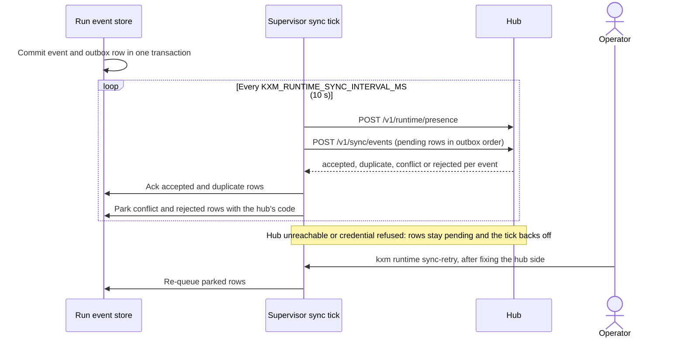

# Operate Runtime sync and leases

The [Runtime](../glossary.md#runtime) supervisor pushes a redacted summary of every run event to the [hub](../glossary.md#hub), so hub-side views such as `kxm tenant status` see runs from every machine. This page is for operators: it explains the sync loop, how to read its state, how to clear stalled or refused rows, and what the hub's fenced leases do and do not cover today.

## Before you begin

- A KXM project (`kxm init`) with at least one Runtime run, for example from `kxm run`.
- A hub for this machine: `kxm hub bind <url>`, or `KXM_SERVER_URL` in the environment that starts the supervisor.
- A credential the hub accepts for the project's `prj_*` id (see [Which hub and credential sync uses](#which-hub-and-credential-sync-uses)).

## How sync works

Sync is outbound only: the Runtime pushes, and the hub never calls the Runtime. The following diagram shows one event from commit to acknowledgement, and the operator step for a refused row.



### What an outbox row contains

Every committed Runtime event writes one outbox row in the same SQLite transaction, so an event is never committed without its row. The row holds a new `kxm.sync-event.v1` object built from the event, never the event itself:

- Only allowlisted fields are copied. Every other field is dropped and named in `redaction.fieldsOmitted`.
- Registered secret values (the hub token and the values of `KXM_*_TOKEN`, `KXM_*_KEY`, `*_API_KEY` and `*_SECRET` environment variables) and credential shapes are replaced with `[redacted]`.
- Absolute paths become `[path]`, control characters are removed, and text is bounded.
- The default sync policy allows prompt titles only, bounded result summaries, evidence references, artifact metadata and changed-file paths. It allows no raw logs, diffs or environment values.

The prompt text itself stays in the local `run-prompts.json` sidecar next to the run store.

### The sync tick

Every `KXM_RUNTIME_SYNC_INTERVAL_MS` (default 10 seconds, clamped to 250 ms to 60 seconds, read when the supervisor starts), the supervisor visits each project it owns:

1. It posts `POST /v1/runtime/presence` with its Runtime id and host label. The hub stamps the heartbeat with its own clock.
2. It posts pending rows to `POST /v1/sync/events` in outbox order, up to 32 rows or about 200 KB per request. The hub accepts at most 100 events and 256 KiB per request.
3. It acknowledges rows the hub accepted or already held, and parks rows the hub refused for good.

Local execution never waits on sync. With no hub bound, rows simply stay pending.

### How the hub decides

The hub accepts each event once, keyed by `{projectId, runId, sequence}`:

- The same bytes again are an idempotent `duplicate`.
- Out-of-order events are held. The per-run cursor is the gapless prefix, so a gap stays open until the missing event arrives.
- Different bytes under a used sequence, a project id already claimed by another hub project, a run homed on another Runtime, and an event pushed by a Runtime other than its home are refused and raise a `security_alert` in the hub log.
- An event that fails the sync schema is refused without an alert.

### Which hub and credential sync uses

- **Hub:** `KXM_SERVER_URL` from the supervisor's environment, else the `kxm hub bind` binding, which is re-read on every tick.
- **Project:** the `prj_*` id in `.kxm/project.yaml`, not the package or directory name. The hub pins a project id to the first hub project that claims it.
- **Credential:** `KXM_AUTH_TOKEN` from the supervisor's environment, else the project token saved under that `prj_*` id in `hub-env.json`, else the saved admin token. To use a project token, key its `KXM_PROJECT_TOKENS` entry by the `prj_*` id.

> [!IMPORTANT]
> The supervisor keeps the environment of the command that started it. After you change `KXM_SERVER_URL` or `KXM_AUTH_TOKEN`, run `kxm runtime stop` and `kxm runtime start`.

## Check sync status

`kxm runtime status` reads what the last tick saw from the supervisor's `GET /v1/sync/status`, a token-protected loopback endpoint:

```bash
kxm runtime status
```

Expected output:

```text
runtime supervisor running: rtm_74573b9df67705d8f6596518 pid 41437 on 127.0.0.1:50724
sync prj_a17d607765e144cd95b93a8715d360b6: ok (pending 0, acked 1, refused 0)
```

A hub that went away looks like this:

```text
sync prj_a17d607765e144cd95b93a8715d360b6: blocked (pending 0, acked 1, refused 0) — last error: fetch failed; next attempt 2026-09-23T18:41:31.675Z
```

| State | Meaning | Action |
|---|---|---|
| `ok` | Rows are being acknowledged | None |
| `no_hub` | No hub is bound or set; rows are kept locally by design | Bind a hub if you want hub-side views |
| `blocked` | Transport or credential failure; rows stay pending and the tick backs off, up to 5 minutes | Fix the cause; the next attempt resumes on its own |
| `refusing` | The hub durably refused rows, or answered without a result for some | Fix the hub side, then run `kxm runtime sync-retry` |

A project whose run store this release cannot open shows `blocked (its store is not readable by this build)` with the reason; see [Upgrade KXM](upgrade.md#understand-schema-changes). Right after the supervisor starts, the status can read `no project registered with this Runtime yet` until the first tick.

Add `--json` for the full record: `state`, the outbox counts with refusal codes and counts, `consecutiveFailures`, `storeReadable`, `hubUrl`, `lastCompletedAt`, `lastPushed`, `lastAcked`, `lastRefused`, `lastUnconfirmed`, `lastError` and `nextAttemptAt`.

The same changes appear once each in the Runtime log, `runtime/logs/kxm-runtime.jsonl` under the user state root:

```text
{"level":"warn","component":"runtime","event":"runtime_sync_stalled","projectId":"prj_a17d607765e144cd95b93a8715d360b6","state":"blocked","pending":0,"acked":1,"refused":0,"reason":"fetch failed","nextAttemptAt":"2026-09-23T18:41:31.675Z"}
```

## Clear a refused sync

A refused row leaves the pending queue with the hub's code, so it can neither block the rows behind it nor re-alert the hub on every tick. Refused rows are never deleted, and the Runtime never decides on its own that a refusal has become retryable.

| Code | Meaning | What to do |
|---|---|---|
| `sync_project_mismatch` | The hub already recorded this `prj_*` id under another hub project, usually from an older release that sent the package name | No command reassigns the claim; resolve it on the hub, then retry |
| `sync_home_runtime_mismatch` | The run is homed on a different Runtime, for example a run store copied to a second machine | Sync the run only from its home Runtime |
| `sync_runtime_mismatch` | The event names a different home Runtime than the one pushing it | Investigate the `security_alert`; do not retry blindly |
| `sync_sequence_reused` | The hub holds different bytes for the same run and sequence | Investigate the `security_alert`; a diverged copy of a run store is the usual cause |
| `sync_event_invalid` | The event failed the hub's sync schema, usually a release mismatch | Run the same release on the Runtime and the hub, then retry |
| `sync_row_too_large` | One row exceeds the hub's request size on its own | It will be refused again; keep it for diagnosis |
| `sync_row_unreadable` | The local outbox row is corrupt | Keep the store for diagnosis |

After the hub side is fixed, re-queue the parked rows from the project checkout:

```bash
kxm runtime sync-retry --dry-run
kxm runtime sync-retry
```

Expected output:

```text
re-queued 3 refused outbox rows for prj_a17d607765e144cd95b93a8715d360b6
```

The command needs a running supervisor and never starts one. It clears the backoff, so the rows go out on the next tick.

## See synced runs on the hub

The hub's admin `GET /v1/ops/snapshot?project=<prj-id>` adds `homeRuntimes`: each Runtime with its host label, heartbeat and presence lease (`heartbeatAt` plus the hub's stale window, on the hub clock), and its runs with bounded title and status, `lastSequence` and `pendingGap`. A Runtime whose lease lapses is marked `orphaned`. That is a view state only: nothing moves the runs elsewhere.

`kxm tenant status` shows hub metadata next to the authoritative local run state, labelled by source. Hub workflow runs and Runtime runs use separate id spaces, so a comparison without a shared id is reported as unverified, never as agreement.

The hub counts sync traffic in `kxm_sync_events_accepted_total`, `kxm_sync_events_duplicate_total`, `kxm_sync_events_refused_total`, `kxm_sync_conflicts_total` and `kxm_runtime_heartbeats_total`; see [Monitor KXM](monitoring.md#scrape-metrics).

## Use fenced leases

A [lease](../glossary.md#lease) lets one agent at a time act on a shared resource, such as a branch, and lets that resource refuse a holder whose time has run out.

### What the hub provides

- `POST /v1/leases/<resource>/acquire`, `/renew` and `/release`, authenticated as a registered agent with its project token and agent key. The hub prefixes the caller's project onto the resource name, so two projects that name the same branch never contend.
- A time-to-live of 5 seconds to 10 minutes (default 5 minutes), decided on the hub clock inside one store transaction, so a client with a skewed clock cannot extend its own lease.
- A fencing token that starts at 1, stays the same across renewals, and increments whenever an expired lease is taken again. Present it with every write to the shared resource so a late holder is refused.
- Clear refusals: `lease_held` (another live holder), `lease_expired` (re-acquire to continue), `lease_superseded` (your token is stale), all HTTP 409, and `lease_not_found` (HTTP 404).
- Expired rows kept for the 7-day run-retention window, so the next takeover increments past their token, then purged.
- Metrics `kxm_leases_granted_total`, `kxm_leases_refused_total` and `kxm_leases_released_total`, and log events `lease_acquired`, `lease_renewed`, `lease_released`, `lease_denied` and `lease_purged`.

The `HubClient` class in `@kontextmind/kxm/client` wraps the three routes as `acquireLease`, `renewLease` and `releaseLease`.

### What is not wired

> [!IMPORTANT]
> No `kxm` command or agent tool takes a lease, and the Runtime does not take one before an external effect such as a push, a pull request, a tracker issue or an outgoing webhook. Leases protect only the integrations that call the API themselves. The intended effect-and-recovery design is described in [Effects and recovery](../contracts/effects-and-recovery.md).

## Troubleshooting

| Symptom | Cause | Fix |
|---|---|---|
| State stays `no_hub` although a hub runs | The supervisor has no `KXM_SERVER_URL` and the machine is not bound | Run `kxm hub bind <url>` |
| `blocked` with `401 invalid_auth` | The hub does not accept the credential for the `prj_*` id | Add a project token keyed by the `prj_*` id, or export the right token and restart the supervisor |
| `blocked` with `fetch failed` | The hub is down or the URL is wrong | Start the hub, or fix the binding |
| `refusing` right after an upgrade | The Runtime and the hub run different releases | Upgrade both, then run `kxm runtime sync-retry` |
| `runtime_not_running` from `kxm runtime sync-retry` | The supervisor is stopped | Run `kxm runtime start` first |
| Runs appear as `orphaned` on the hub | That Runtime stopped sending presence | Start it, or accept that its runs are no longer live |

## Related

- Watch sync alongside the rest of the service: [Monitor KXM](monitoring.md)
- Where the outbox and run stores live: [Back up and restore KXM](backup-and-restore.md)
- The designed sync contract: [Synchronization](../contracts/synchronization.md)
- Hub routes for sync and leases: [Hub HTTP API reference](../reference/http-api.md)
