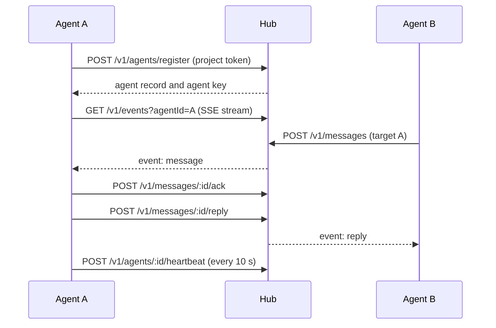

# Hub HTTP API reference

This page lists every route the KXM [hub](../glossary.md#hub) serves: method, path, the credential it requires, what it does and the errors you are most likely to see. It also covers the Runtime supervisor's local API. KXM's own clients (the CLI, the Pi extension and the Claude Code plugin) are the supported way to use these routes; request and response shapes follow KXM releases and carry no separate compatibility promise beyond the `/v1` prefix.

## Conventions

| Topic | Rule |
|---|---|
| Base URL | `http://127.0.0.1:7331` by default (`KXM_HOST`, `KXM_PORT`) |
| Request bodies | JSON objects with `content-type: application/json` (`unsupported_media_type`, 415), at most 256 KiB (`payload_too_large`, 413) |
| Errors | `{ "error": "<message>", "code": "<code>", "requestId": "<id>" }`, sometimes with hints such as `nextAction` or `assignedCoordinatorName`. A 500 says only `internal server error` |
| Request IDs | Send `x-request-id` (letters, digits, `.`, `_`, `-`, up to 80) to have it echoed; otherwise the hub assigns one |
| Rate limit | All routes but `/health` and `/ready` count per agent ID, else per address. Headers `x-ratelimit-limit`, `x-ratelimit-remaining`; over the limit, 429 `rate_limited` with `retry-after` |
| Unknown routes | 404 `route_not_found` |
| Limits | Field lengths and ranges are in [Protocol limits](configuration.md#protocol-limits) |

## Authentication

Each route requires one of these credential classes. Send tokens as `Authorization: Bearer <token>`; never put a token in a URL.

| Class | What to send | Notes |
|---|---|---|
| None | Nothing | Public health probes only |
| Admin | The admin token (`KXM_AUTH_TOKEN` on the hub) | A loopback hub with no admin token at all accepts any caller |
| Admin, configured | The admin token | Answers 503 `admin_auth_not_configured` when the hub has no admin token, even on loopback |
| Project | The project's token, or the admin token for a project with no token of its own | Admission for agent registration and Runtime sync |
| Agent | The project token plus `x-kxm-agent-id` and `x-kxm-agent-key` from registration | The agent key rotates on every registration (401 `invalid_agent_identity` when stale) |
| Agent or admin | Agent headers for your own project, or the admin token with an explicit `project` | Admin calls may name a caller in `x-kxm-caller-id` |
| Signed | HMAC-SHA256 of the raw body in `x-hub-signature-256` (or `x-hub-signature`) as `sha256=<hex>`, plus a delivery ID | No bearer token; the secret is the workflow definition's |

A wrong or missing token is 401 `invalid_auth`. The [trust model](../concepts/trust-model.md) explains which person or process holds each credential.

## Health and operations

| Method | Path | Auth | Purpose |
|---|---|---|---|
| `GET` | `/health` | None | Liveness: `{ "ok": true, "agents": <online count> }` |
| `GET` | `/ready` | None | Storage readiness: `{ "ok", "storage": "sqlite" or "memory" }`; 503 when storage is unhealthy |
| `GET` | `/metrics` | Admin | Prometheus text: requests, errors, messages, workflows, leases, sync and Runtime heartbeat counters |
| `GET` | `/v1/ops/snapshot?project=
` | Admin, configured | Metadata for one project: agents, up to 16 open messages, up to 8 runs with stage progress, home Runtimes, recent plan summaries (120 characters) |
| `GET` | `/v1/ops/events?project=
` | Admin, configured | Server-sent events: an `ops` event naming the topic (`agents`, `messages`, `workflows`) whenever it changes; 15-second heartbeats |

Operations routes carry no message bodies. `kxm dash` and `kxm tenant status` use them. See [Monitoring](../operations/monitoring.md).

## Agents and presence

| Method | Path | Auth | Purpose |
|---|---|---|---|
| `POST` | `/v1/agents/register` | Project | Register or resume `name` in `project` with `purpose`, optional `model` and `host`. Returns the agent and a new `agentKey` (201 new, 200 resumed) |
| `GET` | `/v1/agents` | Agent | Agents in your project; `?includeOffline=true` adds registered offline agents |
| `POST` | `/v1/agents/<agentId>/heartbeat` | Agent | Renew your presence lease (clients send one every 10 seconds) |
| `DELETE` | `/v1/agents/<agentId>` | Agent | Mark yourself offline (204) |

Key errors: `duplicate_agent_name` (409, the name is online in the project), `invalid_agent_identity` (401). Presence (`online`, `stale`, `offline`) is computed from the hub's clock with a 30-second lease; agents never report their own presence.

## Messages and events

A message is a durable request between two agents in one project. The sequence below shows one agent session on the wire.

| Method | Path | Auth | Purpose |
|---|---|---|---|
| `POST` | `/v1/messages` | Agent | Send a request: `target`, `content`, optional `delivery`, `correlationId`, `idempotencyKey`, `workflowContext`, `ttlMs`, `maxHops`, `allowOffline`. 202 new; 200 with `idempotent: true` for an exact retry |
| `GET` | `/v1/messages/<id>` | Agent | Read a message you sent or received |
| `POST` | `/v1/messages/<id>/ack` | Agent | Recipient marks a queued message `delivered` |
| `POST` | `/v1/messages/<id>/reply` | Agent | Recipient replies with `content`; the sender gets a `reply` event |
| `DELETE` | `/v1/messages/<id>` | Agent | Sender cancels a queued or delivered message |
| `GET` | `/v1/events?agentId=<id>` | Agent | Server-sent events for that agent: `ready`, then `message`, `reply`, `cancelled`, `expired` and `presence`. Pushes unacknowledged messages again on connect |

`GET /v1/events` with `presenceOnly=true` sends only `presence` events and is reserved for dashboard observers (`presence_stream_forbidden` otherwise).

Key errors: `target_not_found` (404), `self_target` and `hop_limit_reached` (400), `idempotency_conflict` (409), `message_not_found` (404), `message_forbidden` (403, not your message), `duplicate_reply` and `invalid_message_state` (409). A request with `workflowContext` adds the `workflow_context_*` and `workflow_evidence_*` codes listed under [`kxm_send`](tools.md#kxm_send).

> [!IMPORTANT]
> Delivery is at least once. A message stays `queued` or `delivered` until it is replied to, cancelled or expires. Whenever the recipient connects, including after a hub or agent restart, the hub pushes its `queued` messages again with the same message ID until the recipient acknowledges them. A `delivered` (acknowledged) message is not pushed again. Make side effects idempotent.

The hub tracks acknowledgement with a per-recipient cursor that moves to the highest acknowledged message, so a queued message older than one the recipient already acknowledged is not pushed again either.

## Workflows, journal and improvements

These routes serve the coordinator of a [webhook workflow run](workflow-definitions.md#webhook-workflow-definitions). Every agent route answers 403 `workflow_forbidden`, with `assignedCoordinatorName` and `nextAction: use_assigned_coordinator`, to any agent other than the run's coordinator.

| Method | Path | Auth | Purpose |
|---|---|---|---|
| `GET` | `/v1/workflows` | Agent | Runs in your project assigned to you |
| `GET` | `/v1/workflows/<runId>` | Agent | One run and its journal |
| `POST` | `/v1/workflows/<runId>/checkpoints` | Agent | Record the active stage's result: `stageId`, `status`, `summary`, `evidence`, `evidenceRefs`, optional `outcome` |
| `POST` | `/v1/workflows/<runId>/waits` | Agent | Park the active stage until a signed signal: `stageId`, `signalKey`, `summary`, optional evidence and `timeoutMs` (202) |
| `POST` | `/v1/workflows/<runId>/journal` | Agent | Add a journal entry: `category`, `area` or `stageId`, `summary`, optional `severity`, `details`, `evidence`, `relatedEntryIds` (201) |
| `POST` | `/v1/workflows/<runId>/degradations` | Admin, configured | Approve the policy's lower peer minimum for the current attempt: `stageId`, `requirementKey`, `reason` (201 new, 200 repeat) |
| `GET` | `/v1/improvements` | Agent | Improvement report for your project: `reports` by area and ranked cross-run `signals` |
| `POST` | `/v1/journal/<entryId>/promotion` | Admin | Move a promotable journal entry to `approved`, `rejected` or `quarantined` with `reason` and `evidenceRefs`; recorded as decided by `kxm-admin` |

Key errors: `workflow_not_found` (404), `workflow_stage_out_of_order`, `workflow_terminal`, `workflow_not_running` (409), `workflow_evidence_incomplete`, `workflow_provenance_invalid`, `invalid_workflow_evidence_refs`, `weakened_reproduction`, `plan_hash_required` (400), `invalid_journal_category`, `invalid_improvement_area`, `journal_evidence_required` (400), `workflow_degradation_forbidden` (400, the policy declares no degradation) and `workflow_degradation_conflict` (409, a different reason was already approved). The agent tools that call these routes are described in [Workflow tools](tools.md#workflow-tools).

## Webhooks and signals

| Method | Path | Auth | Purpose |
|---|---|---|---|
| `POST` | `/v1/webhooks/<definitionId>` | Signed with the definition's start secret | Start a run and prompt the coordinator (status codes below) |
| `POST` | `/v1/webhooks/<definitionId>/runs/<runId>/signals/<signalKey>` | Signed with the signal secret, else the start secret | Report an external result for a waiting stage: `status` (`passed`, `warning`, `failed`), `summary`, `evidence`. 202 when the coordinator is resumed, 200 otherwise |

A start answers 202 for a new run, 200 with `duplicate: true` for a known delivery ID, and 204 when the event or filter does not match.

The delivery ID comes from `x-atlassian-webhook-identifier`, `x-github-delivery` or `x-kxm-delivery-id`, in that order, and is required. The event comes from `x-github-event`, else the payload's `webhookEvent` or `event` field.

A start with a known delivery ID returns the existing run even if the body differs. A signal with a known delivery ID returns the original receipt when the body matches and 409 `workflow_signal_delivery_conflict` when it does not. Deduplication lasts as long as the run is retained.

Key errors: `webhook_not_found` (404), `webhook_signature_missing`, `webhook_signature_unsupported`, `webhook_signature_invalid` (401), `workflow_target_unavailable` (409, the coordinator never registered), `workflow_not_waiting`, `workflow_signal_mismatch` (409, the run waits for another key) and `workflow_signal_context_mismatch` (409, evidence names another run, stage or signal). See [Webhook workflows](../guides/webhook-workflows.md).

## Context and state

All context routes take a `project` in the body. An agent may name only its own project (`context_isolation_violation`, 403).

| Method | Path | Auth | Purpose |
|---|---|---|---|
| `POST` | `/v1/context/get` | Agent or admin | Assemble a context packet for `role` and `task`; returns `packet` and `audit` |
| `POST` | `/v1/context/recall` | Agent or admin | Search records by `query`, `kinds`, `limit`; returns metadata with `relevance` |
| `POST` | `/v1/context/state` | Agent or admin | Read one state `key`, optionally `asOf` a timestamp |
| `POST` | `/v1/context/state/propose` | Agent, or admin configured | Propose a state change (201 `proposalId`). An agent proposes as a peer, capped at `evidence` authority; the admin proposes as a human |
| `POST` | `/v1/context/state/promote` | Admin, configured | Promote `proposalId` with `evidence`; the promoter cannot be the proposer |
| `POST` | `/v1/context/episode` | Agent or admin | Error, lesson, observation and experiment entries, optionally for one `workflowRunId` |
| `POST` | `/v1/context/explain` | Agent or admin | Lineage, evidence references and sources behind one item `id` |
| `POST` | `/v1/context/wiki/compile` | Agent or admin | Compile the project's knowledge wiki pages with an audit and lint result |

Key errors: `invalid_context_request` (400), `state_proposer_mismatch` (403, `proposedBy` names someone else), `state_proposal_not_found` (404), `state_proposal_not_promotable` and `state_promotion_invalid` (400). The hub logs sizes, never the task or query text. See [Context and memory](../guides/context-and-memory.md).

## Leases

A lease gives one agent exclusive, fenced use of a named resource in its project, such as a branch. The hub prefixes the name with the caller's project, so two projects never contend.

| Method | Path | Auth | Purpose |
|---|---|---|---|
| `POST` | `/v1/leases/<name>/acquire` | Agent | Take or renew the lease; optional `ttlMs` (5 seconds to 10 minutes, default 5 minutes). Returns the lease and its `fencingToken` |
| `POST` | `/v1/leases/<name>/renew` | Agent | Extend it; requires your `fencingToken` |
| `POST` | `/v1/leases/<name>/release` | Agent | Release it; requires your `fencingToken` |

The fencing token increases only when a new holder takes over an expired lease. Refusals are `lease_held`, `lease_expired`, `lease_superseded` (409, with the current lease) and `lease_not_found` (404). Treat any refusal as "stop writing", not "retry". No bundled tool or command calls these routes yet.

## Runtime sync

A Runtime supervisor is a machine client, not an agent. It reports presence and pushes run summaries with the project token.

| Method | Path | Auth | Purpose |
|---|---|---|---|
| `POST` | `/v1/runtime/presence` | Project | Heartbeat a `runtimeId` and optional `host` for `project` (201 first time, 200 after) |
| `POST` | `/v1/sync/events` | Project | Push up to 100 `kxm.sync-event.v1` events for `project` from `runtimeId`. Returns a per-event outcome and each run's cursor |

Each event is accepted once per project, run and sequence. Identical bytes are a `duplicate`; different bytes under a used sequence are a `conflict` (`sync_<reason>`) and raise a security alert. An event from another Runtime is `rejected` with `sync_runtime_mismatch`, a malformed one with `sync_event_invalid`. A batch over 100 events is 413 `sync_batch_too_large`. See [Runtime sync](../operations/runtime-sync.md).

## Runtime supervisor local API

> [!NOTE]
> Internal. The supervisor serves this API on `127.0.0.1` at a port chosen at start, for the `kxm run`, `kxm runs` and `kxm runtime` commands on the same machine. Do not expose it.

Every route except `/healthz` requires `Authorization: Bearer` with the supervisor token from `supervisor.token` in the Runtime directory under the [user state root](config-reference.md#state-outside-the-project). Run routes take `projectRoot` (an absolute path) as a query parameter.

| Method | Path | Purpose |
|---|---|---|
| `GET` | `/healthz?nonce=<n>` | Liveness plus a keyed proof of the token, so a client can tell the real supervisor from a process on a reused port |
| `POST` | `/v1/shutdown` | Stop the supervisor |
| `GET` | `/v1/sync/status` | Outbox state per project: pending, acknowledged and refused rows, refusal codes, next attempt |
| `POST` | `/v1/sync/retry` | Re-queue durably refused outbox rows for `projectRoot` (`kxm runtime sync-retry`) |
| `POST` | `/v1/runs` | Create a run: `projectRoot`, `workflowId`, `prompt`, optional `commandId` |
| `GET` | `/v1/runs/<runId>` | The run projected from its events, with drive state |
| `GET` | `/v1/runs/<runId>/events?after=<n>` | Up to 500 run events after a sequence |
| `POST` | `/v1/runs/<runId>/drive` | Drive a run with `mode` `simulated` or `live`: 202 with a `driveId` to poll; 409 `run_busy` or `run_handoff_required` |
| `GET` | `/v1/runs/<runId>/drive` | The open drive session and up to 20 drive receipts |
| `POST` | `/v1/runs/<runId>/cancel` | Request cancellation; idempotent per `commandId` |
| `POST` | `/v1/runs/<runId>/signal` | Recovery for a blocked run: `action` `retry`, `unblock`, `fail` or `cancel` (default `unblock`) |
| `POST` | `/v1/runs/<runId>/wait` | Acknowledges only; it records nothing yet |
| `GET` | `/v1/drives/<driveId>` | One drive receipt, re-verified against the run's events |
| `GET` | `/v1/projects/<projectId>/runs` | Up to 50 runs of the bound project, each folded from its events |

A bad token is `runtime_auth_failed`; a missing parameter is `runtime_request_invalid`. The drive route accepts both modes. `kxm runs drive` drives live, with real harness calls, unless you pass `--simulated`.

## Web Studio server

`kxm studio serve` runs a separate local server, on `127.0.0.1:4242` by default, with `/`, `/health`, `GET /api/layout` and `POST /api/mutate`. It answers every route with `Access-Control-Allow-Origin: *`, so any web page in a local browser can read the layout. The mutate route requires a bearer session token only when one resolves; with none it accepts any caller. It answers an allowlisted command name with HTTP 501 and `error: "mutation_handler_missing"`, and executes nothing. See [`kxm studio serve`](cli-reference.md#kxm-studio-serve).

## Related

- [Agent tools](tools.md): the `kxm_*` tools built on these routes
- [Environment variables and limits](configuration.md): hub settings and protocol limits
- [Trust model](../concepts/trust-model.md): credentials and what each can reach
- [Webhook workflows](../guides/webhook-workflows.md): signing starts and signals
- [Monitoring](../operations/monitoring.md): health, readiness and metrics in practice
- [CLI reference](cli-reference.md): the commands that call these routes
