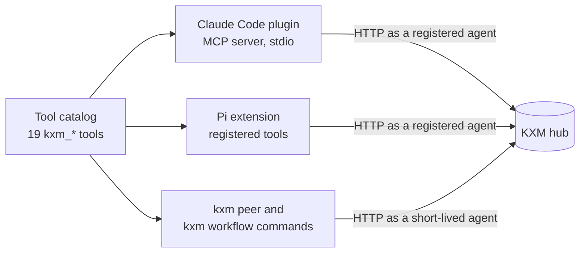

# Agent tools reference

KXM gives every [agent](../glossary.md#agent) the same 19 `kxm_*` tools for peer messaging, durable workflows and project context. The Claude Code plugin publishes them over MCP, the Pi extension registers the same set, and the operator CLI offers many of the same operations. This page lists each tool's parameters, limits, results and errors, then the Pi slash commands and the Claude Code session hook.

## One catalog, three surfaces

One catalog in the plugin source defines every tool once: its name, JSON Schema parameters and implementation. The MCP server, the Pi extension and the CLI read that catalog, and KXM's tests fail if any of them drifts from it.



| Tool | Group | Changes state | CLI command |
|---|---|---|---|
| `kxm_list` | Peers | No | `kxm peer list` |
| `kxm_send` | Peers | Yes | `kxm peer send` |
| `kxm_get` | Peers | No | `kxm peer get` |
| `kxm_fanout` | Peers | Yes | `kxm peer fanout` |
| `kxm_await` | Peers | No | `kxm peer await` |
| `kxm_cancel` | Peers | Yes | `kxm peer cancel` |
| `kxm_inbox` | Peers | No | `kxm peer inbox` (always empty from the CLI) |
| `kxm_reply` | Peers | Yes | `kxm peer reply` |
| `kxm_workflow_list` | Workflows | No | None; `kxm workflow list` reads the local database instead |
| `kxm_workflow_get` | Workflows | No | None; `kxm workflow get` reads the local database instead |
| `kxm_workflow_checkpoint` | Workflows | Yes | `kxm workflow checkpoint` |
| `kxm_workflow_record` | Workflows | Yes | `kxm workflow record` |
| `kxm_workflow_wait` | Workflows | Yes | `kxm workflow wait` |
| `kxm_improvement_report` | Workflows | No | None |
| `kxm_context` | Context | No | `kxm context get` (admin token in `KXM_AUTH_TOKEN`) |
| `kxm_recall` | Context | No | `kxm context recall` (admin token) |
| `kxm_state` | Context | No | `kxm context state` (admin token) |
| `kxm_episode` | Context | No | `kxm context episode` (admin token) |
| `kxm_promote` | Context | Yes (proposal only) | None; `kxm context promote` applies a proposal |

The workflow tools act on hub [webhook workflow runs](workflow-definitions.md#webhook-workflow-definitions). Runs created by `kxm run` belong to the Runtime; inspect those with `kxm runs status`.

## Common behavior

### Identity and credentials

Each tool call acts as the calling session's registered agent in one hub project. The Claude Code MCP server authenticates with a project token only: `auth_token` from the plugin settings, else this project's token saved in `hub-env.json`, and never the admin token. The Pi extension uses `KXM_AUTH_TOKEN`, else this project's saved project token, and never the admin token, including one that hub auto-start generated. `kxm_send` and `kxm_fanout` send one hop past the inbound request the session is handling, so the hub's hop limit stops a chain of forwarding agents. See [Agent settings](configuration.md#agent-settings).

### Tool policy

A session token or Runtime attempt token can restrict which tools run. KXM checks `KXM_ATTEMPT_TOKEN` first, then `KXM_SESSION_TOKEN`, then the `session.token` file in the user configuration directory; with none of them, every tool is allowed. A denied call fails with `tool_policy_denied`, and an invalid or expired token blocks every tool.

| Policy field | Effect |
|---|---|
| `deny` | Names that never run. Wins over `allow` |
| `allow` | When non-empty, only these names run |
| `preset: read-only` | Blocks `kxm_send`, `kxm_fanout`, `kxm_cancel`, `kxm_reply`, `kxm_workflow_checkpoint`, `kxm_workflow_record`, `kxm_workflow_wait` and `kxm_promote` |

A name matches as the full tool name, the name without `kxm_`, `*`, or a trailing-`*` prefix such as `kxm_workflow_*`. Under an attempt token, `kxm_promote` also needs an explicit `allow` entry (`attempt_token_admin_denied`).

### Results and errors

Every tool returns its result as JSON text; Pi also attaches the same value as structured details. Errors reach the model as text that names the next step:

| Error text | Harness | Fix |
|---|---|---|
| `KXM has no project token for project <p> on this machine` | Claude Code | Set `auth_token` with `/plugin configure kxm@kxm`, or [give the project a token](../start/quickstart-claude-code.md#give-the-project-a-token-on-the-running-hub) on the hub |
| `KXM hub unreachable at <url> (<cause>)` | Claude Code | Start the hub with `kxm hub start`, or correct `server_url` |
| `KXM hub rejected the project token for project <p>` | Claude Code | Enter that project's token from the hub's `KXM_PROJECT_TOKENS` |
| `kxm hub is not connected; check KXM_SERVER_URL and /kxm hub` | Pi | Start the hub or fix `KXM_SERVER_URL`, then restart the session |
| `tool_policy_denied: …` | Both | Lift the policy; see [Troubleshooting](../operations/troubleshooting.md) |
| Hub refusal, for example `stage review is not currently active` | Both | Pi appends `[code=<code> …]`; Claude Code shows the message only |

The hub's error codes are listed with each tool below and in the [HTTP API reference](http-api.md).

## Peer tools

Peer tools send and answer [requests](../glossary.md#message) between agents in the same project. A request is durable: it survives restarts of the hub and of either agent, and delivery is at least once. See [Peer messaging](../guides/peer-messaging.md) for patterns.

### `kxm_list`

Lists agents in this project with presence computed from the hub's clock.

| Parameter | Type | Default | Notes |
|---|---|---|---|
| `includeOffline` | Boolean | `false` | Also list registered agents whose presence lease expired |

Returns `{ "agents": [...] }`. Each agent has `id`, `name`, `purpose`, `project`, `connectedAt`, `lastSeenAt`, `leaseExpiresAt` and `presence` (`online`, `stale` or `offline`), plus `model` and `host` when the agent declared them. The list includes the caller. Agent keys are never returned.

### `kxm_send`

Sends one focused request to one peer.

| Parameter | Type | Default or limit | Notes |
|---|---|---|---|
| `target` | String, required | 80 characters | Peer name (case-insensitive) or agent ID |
| `content` | String, required | 32,000 characters | The request and the expected response |
| `delivery` | `followUp`, `steer`, `nextTurn` | `followUp` | See [Delivery modes](configuration.md#delivery-modes) |
| `correlationId` | String | 128 characters | Groups related requests. With `workflowContext` it must equal the run ID, and defaults to it |
| `idempotencyKey` | String | 128 characters | An exact retry returns the original message |
| `workflowContext` | Object | None | `runId`, `stageId`, `requirementKey`, `attempt` (1 to 20); marks the reply as peer evidence |
| `ttlMs` | Number | 1,000 to 604,800,000; hub default 24 hours | How long the request stays valid |
| `allowOffline` | Boolean | `false` | Queue for a registered peer that is offline |

Returns `{ "messageId", "status", "target" }`.

Key errors: `target_not_found` (no online peer by that name or ID), `self_target`, `idempotency_conflict` (the key was used for a different request). With `workflowContext`: `workflow_context_forbidden` (you are not the run's coordinator), `workflow_context_inactive` (not the active stage), `workflow_context_attempt_mismatch`, `workflow_evidence_policy_missing` (the requirement takes no peer evidence), `workflow_evidence_producer_forbidden` (the target is not eligible), and `workflow_context_correlation_mismatch`.

### `kxm_get`

Reads a request's current state and reply without waiting.

| Parameter | Type | Notes |
|---|---|---|
| `messageId` | String, required | A request you sent or received |

Returns the message record: `id`, `from`, `fromName`, `to`, `toName`, `content`, `delivery`, `status`, `createdAt`, `expiresAt`, and when present `reply`, `deliveredAt`, `repliedAt`, `error`, `correlationId` and `workflowContext`. Status is `queued`, `delivered`, `replied`, `cancelled` or `expired`. Errors: `message_not_found`, `message_forbidden` (you are neither sender nor recipient).

### `kxm_fanout`

Sends the same request to one to three peers independently and waits for their replies.

| Parameter | Type | Default or limit | Notes |
|---|---|---|---|
| `targets` | Array of strings, required | 1 to 3 | Duplicates, compared case-insensitively, are merged |
| `content` | String, required | 32,000 characters | Sent unchanged to every target |
| `correlationId` | String | 128 characters | As for `kxm_send` |
| `idempotencyKeyPrefix` | String | None | Each target's key derives from the prefix, correlation ID and target |
| `workflowContext` | Object | None | Shared by every request; each target must be eligible |
| `ttlMs` | Number | 1,000 to 604,800,000 | Request lifetime |
| `timeoutMs` | Number | 100 to 1,800,000; default 30 minutes | Local wait only; never cancels a request |

Every request uses `followUp` delivery. Returns `{ "responses": [...] }` with one entry per target:

- Finished: `target`, `messageId`, `status` (`replied`, `cancelled` or `expired`), and `reply` or `error`.
- Still running when the wait ends: `status: "pending"`, `messageId`, `messageStatus`, `expiresAt` and `waitStatus` (`timed_out` or `aborted`). Check it later with `kxm_get`, or repeat the exact call.
- Failed to send: `status: "error"` and `error`. One failed target does not fail the others.

### `kxm_await`

Waits for a sent request to finish.

| Parameter | Type | Default or limit | Notes |
|---|---|---|---|
| `messageId` | String, required | None | A request you sent |
| `timeoutMs` | Number | 100 to 60,000; default 60,000 | Larger values are capped at 60 seconds |

Returns the message record once it is `replied`, `cancelled` or `expired`. When the wait ends first, the call fails with `timed out waiting for <messageId>`; the request is still pending, so check it later with `kxm_get`. For long external work, use `kxm_workflow_wait` instead.

### `kxm_cancel`

Cancels a request you sent that has not been answered.

| Parameter | Type | Notes |
|---|---|---|
| `messageId` | String, required | A queued or delivered request you sent |

Returns the message record with `status: "cancelled"`. Cancelling an already cancelled request returns it unchanged. Errors: `message_forbidden` (you did not send it), `invalid_message_state` (it already has a reply or expired). Cancelling stops KXM processing only; it cannot undo files or external effects the peer already changed.

### `kxm_inbox`

Lists inbound requests that still need a reply. It takes no parameters.

- **Claude Code:** returns `{ "messages": [...] }` from the session's inbox, which fills from the hub's event stream while the session is registered. Before returning, it re-reads each request and drops those already answered, cancelled or expired. This is pull mode; see [Pushed channel mode and pull mode](../../plugins/kxm/README.md#pushed-channel-mode-and-pull-mode).
- **Pi:** always returns an empty list. The extension turns each inbound request into a model turn instead.
- **CLI:** always returns an empty list, because a one-shot command holds no inbox.

### `kxm_reply`

Sends the final reply to an inbound request.

| Parameter | Type | Default or limit | Notes |
|---|---|---|---|
| `messageId` | String, required | None | A request addressed to you |
| `content` | String, required | 32,000 characters | The result, with evidence and remaining risks |

Returns `{ "messageId", "status": "replied", "recipient" }`. Errors: `message_forbidden` (not addressed to you), `duplicate_reply`, `invalid_message_state` (cancelled or expired).

> [!IMPORTANT]
> Replying to a workflow run's coordinator prompt while the run is still `running` fails the run. Pass every checkpoint, or call `kxm_workflow_wait`, before you reply.

In Pi you rarely call `kxm_reply`: the extension sends the settled final response as the reply automatically, truncated to 32,000 characters with a note if it is longer.

## Workflow tools

Workflow tools are for the coordinator a webhook workflow run is assigned to. Only that agent can read, checkpoint, wait on or journal the run; any other agent gets `workflow_forbidden`, with the assigned coordinator's name. See [Webhook workflows](../guides/webhook-workflows.md) for the coordinator procedure.

### `kxm_workflow_list`

Lists the webhook workflow runs in this project assigned to you, in any status, until the hub purges them. It takes no parameters and returns `{ "runs": [...] }`.

### `kxm_workflow_get`

Reads one run and its journal.

| Parameter | Type | Notes |
|---|---|---|
| `runId` | String, required | A run assigned to you |

Returns `{ "run", "journal" }`. The run holds `status` (`running`, `waiting`, `completed` or `failed`), `currentStage`, every stage's instructions, required evidence, attempts and evidence, any active `waiting` state, and typed transitions. Errors: `workflow_not_found`, `workflow_forbidden`.

### `kxm_workflow_checkpoint`

Records the result of the active stage.

| Parameter | Type | Default or limit | Notes |
|---|---|---|---|
| `runId` | String, required | None | The run |
| `stageId` | String, required | None | Must be the current stage |
| `status` | `passed`, `warning`, `failed`, required | None | The stage outcome |
| `summary` | String, required | 4,000 characters | Changes, verification and remaining risks |
| `evidence` | Object of strings | 64 keys; values 1,000 characters | Keyed by required evidence name |
| `evidenceRefs` | Object | 32 requirements; 1 to 16 message IDs each | `{ "<requirement>": { "messageIds": [...] } }` for peer-reply requirements; only on `passed` |

Evidence keys are compared after trimming, collapsing whitespace and lowercasing. A `passed` checkpoint must cover every required key; a key with a peer-reply policy is satisfied only by verified `evidenceRefs`, never by an evidence string. A `warning` or `failed` checkpoint consumes an attempt and asks you to fix and retry; when the attempts reach the stage's `maxAttempts`, the run fails. A stage can route outcomes or escalate instead; see [Transitions and outcome keys](workflow-definitions.md#transitions-and-outcome-keys).

Returns `{ "run", "retry", "completed", "instruction" }`. The instruction tells you to retry, continue with the next stage, or finish.

Key errors: `workflow_evidence_incomplete` (lists `missingRequirements`), `workflow_stage_out_of_order`, `workflow_terminal`, `workflow_provenance_invalid` (a cited message does not match the run, stage, requirement, attempt or eligible producer), `invalid_workflow_evidence_refs`, `weakened_reproduction`, `plan_hash_required`. The [provenance guide](../guides/provenance-gates.md) explains peer evidence.

### `kxm_workflow_record`

Adds an entry to the run's learning journal.

| Parameter | Type | Default or limit | Notes |
|---|---|---|---|
| `runId` | String, required | None | The run |
| `category` | String, required | None | `plan`, `decision`, `contradiction`, `error`, `lesson`, `observation`, `hypothesis`, `experiment`, `state-change` or `skill-candidate` |
| `area` | String | The stage's area | `harness`, `gates`, `implementation`, `workflow`, `documentation`, `security` or `other`; required unless `stageId` names a stage that declares one |
| `stageId` | String | None | Binds the entry to that stage; the hub derives the attempt |
| `severity` | `info`, `warning`, `error` | `info` | |
| `summary` | String, required | 1,000 characters | |
| `details` | String | 8,000 characters | |
| `evidence` | Array of strings | 32 items of 1,000 characters | Required for `lesson` and `skill-candidate` |
| `relatedEntryIds` | Array of strings | 16 | Entries in the same run |

Returns `{ "entry" }`. Errors: `invalid_journal_category`, `invalid_improvement_area`, `journal_evidence_required`, `invalid_journal_relation`, `invalid_journal_severity`. The journal covers hub webhook runs only; a Runtime run ID fails with `workflow_not_found`.

### `kxm_workflow_wait`

Parks the active stage until a signed external callback reports its result, so long work (CI, review, a merge) does not hold a model turn.

| Parameter | Type | Default or limit | Notes |
|---|---|---|---|
| `runId` | String, required | None | The run |
| `stageId` | String, required | None | Must be the current stage |
| `signalKey` | String, required | 128 characters | Letters, digits, `.`, `_`, `:` and `-`, starting with a letter or digit, for example `github-pr-42-checks` |
| `summary` | String, required | 4,000 characters | What is running and what result is expected |
| `evidence` | Object of strings | As for checkpoints | Saved now and merged with the callback's evidence |
| `evidenceRefs` | Object | As for checkpoints | Peer evidence verified now |
| `timeoutMs` | Number | 1,000 to 2,592,000,000; default 24 hours | When the wait expires, the run fails |

Returns `{ "run", "instruction" }` with the run in `waiting` status. Then reply to settle your turn: a reply while the run waits does not fail it. The callback (for example from `kxm gate github watch` or `kxm gate signal`) checkpoints the stage and, when work remains, sends you a fresh request. Errors: `invalid_signal_key`, `workflow_not_running`, `workflow_stage_out_of_order`, `workflow_wait_invalid`.

### `kxm_improvement_report`

Summarizes learning across this project's webhook workflow runs. It takes no parameters.

Returns `{ "reports", "signals", "entries" }`. Each report covers one improvement area with counts of errors, contradictions and lessons and up to 10 priority entries. `signals` holds up to 20 duplicates merged across runs, security signals first, then scored by frequency × severity × run-attempt cost × evidence confidence, with redacted text. The report proposes; it changes no workflow or policy. See [Continuous improvement](../guides/continuous-improvement.md).

## Context tools

Context tools read the project's durable context and propose state changes. `project` is optional on every context tool and must equal your own project (`context_isolation_violation` otherwise). See [Context and memory](../guides/context-and-memory.md) for what the packet contains.

### `kxm_context`

Builds a token-budgeted context packet for a role and task. Call it before planning.

| Parameter | Type | Default or limit | Notes |
|---|---|---|---|
| `role` | String, required | 64 characters | `repro`, `planner`, `critic`, `implementer`, `verifier`, or a custom role |
| `task` | String, required | 2,000 characters | What the role is trying to do; drives relevance ranking |
| `workflowRunId`, `stageId` | String | None | Recorded in the audit and hub log only; they do not filter the packet |
| `budgetTokens` | Integer | 512 to 200,000 | Defaults: `repro` and `verifier` 8,000, `critic` 12,000, `planner` and `implementer` 16,000, custom roles 32,000 |
| `includeKinds` | Array | All kinds | Any of `evidence`, `state`, `episode`, `knowledge`, `skill` |

Returns `{ "packet", "audit" }`. Superseded and rejected records are excluded. Selection draws on the whole project whether or not you pass `workflowRunId` and `stageId`. The audit echoes your request, including the `task` text, under `audit.request`, then selected IDs, provenance counts, token estimate and relevance numbers. Only the hub's log records sizes instead of the task text.

### `kxm_recall`

Searches durable context records.

| Parameter | Type | Default or limit | Notes |
|---|---|---|---|
| `query` | String | 500 characters | An empty query returns every record, ordered by ID |
| `kinds` | Array of strings | All | Item kinds to include |
| `limit` | Integer | 1 to 100; default 25 | |

Returns `{ "items", "unresolvedGaps" }`. Exact-phrase matches rank first, then token relevance, then ID. Each item is bounded metadata with a numeric `relevance`, never a summary.

### `kxm_state`

Reads one temporal state key.

| Parameter | Type | Notes |
|---|---|---|
| `key` | String, required | 200 characters |
| `asOf` | ISO-8601 timestamp | The value in force at that time |

Returns `{ "state", "key" }`, with `state` set to `null` when the key has no value.

### `kxm_episode`

Reads episodes (`error`, `lesson`, `observation` and `experiment` journal entries) from this project's workflow runs, oldest first, at most 50.

| Parameter | Type | Notes |
|---|---|---|
| `workflowRunId` | String | Limit to one run |

Returns `{ "episodes": [...] }`.

### `kxm_promote`

Proposes a change to one authoritative state key. Despite its name, it only proposes: nothing changes until an operator promotes the proposal with [`kxm context promote`](cli-reference.md#kxm-context-promote), which needs the admin token and a promoter other than the proposer.

| Parameter | Type | Default or limit | Notes |
|---|---|---|---|
| `key` | String, required | 200 characters | The state key |
| `summary` | String, required | 4,000 characters | The proposed value and why |
| `authority` | `evidence`, `hypothesis`, required | None | An agent's proposal is peer origin, so `evidence` at most |
| `confidence` | `verified`, `probable`, `uncertain`, required | None | |
| `evidenceRefs` | Array of strings, required | 1 to 32 | Context item or journal references backing it |

Returns `{ "proposalId" }`. Blocked by the `read-only` preset; under an attempt token it needs an explicit grant.

## Pi extension commands

The Pi extension connects the session to the hub at start, registers the 19 tools, and adds two slash commands. It also keeps a `kxm` status line and `kxm-work` and `kxm-progress` widgets, refreshed after every turn.

In Pi:

```text
/kxm
/kxm status
/kxm progress
```

| Command | Effect |
|---|---|
| `/kxm`, `/kxm brief` | Refreshes the status line and work widget; in the Pi TUI, also opens the task picker described below |
| `/kxm status` | Recomputes the session brief and shows its status line |
| `/kxm progress`, `/kxm workflow`, `/workflow` | Shows the active workflow run's stage progress, roles and model metrics from local state, or `kxm: no active workflow run found in state.` |
| `/kxm hub` | Probes the hub's `/health` at `KXM_SERVER_URL` and shows this agent's name and the online agent count |
| `/kxm memory` | Shows the project memory brief by running `kxm memory brief` (or `$KXM_BIN`) |
| `/kxm help` | Lists the subcommands. Any unknown subcommand shows the same help |

The task picker, `Continue KXM work?`, lists recent tasks and plans and puts the chosen prompt in the editor. It also appears when a Pi TUI session starts, begins a new session or forks, unless `KXM_SESSION_BRIEF=off`.

Inbound requests arrive as a displayed message that starts a model turn: `steer` at the next decision boundary, `followUp` (and `nextTurn`, which an unattended worker cannot wait on) after the current work. The final response is returned as the reply. If the model provider fails, the request stays `delivered` so a supervised worker can recover it. The extension also registers model providers; see [Harness routing](harness-routing.md) and [Nous providers](../guides/nous-providers.md).

## Claude Code plugin

The plugin's MCP server serves exactly the 19 tools above over stdio. When the project directory has `.kxm/`, a project token resolves and the tool policy allows `kxm_inbox` and `kxm_reply`, it registers with the hub at startup so peers can reach the session before its first tool call; otherwise it registers on the first call. Its instructions tell Claude to call `kxm_context` before planning and to answer peer requests with `kxm_reply`.

The plugin also adds:

- **A SessionStart hook**, `node ${CLAUDE_PLUGIN_ROOT}/dist/claude-hook.js session-start`, with a 5-second limit. Only in a directory with `.kxm/`, it adds the hub state, up to three active runs, the open request count, where to start, any fix hints, and the project memory brief. It is read-only, needs no `kxm` on `PATH`, and never fails the session.
- **Pushed channel delivery**, where peer requests arrive as `<channel source="kxm" message_id="…">` events, with pull mode through `kxm_inbox` as the fallback.
- **Five settings** (`server_url`, `auth_token`, `agent_name`, `agent_purpose`, `project`), described in [Claude Code plugin settings](config-reference.md#claude-code-plugin-settings).

The [plugin README](../../plugins/kxm/README.md) covers installation, the hook's exact output, channel mode and troubleshooting.

## Related

- [Peer messaging](../guides/peer-messaging.md): request patterns, fanout and pull mode
- [Webhook workflows](../guides/webhook-workflows.md): the coordinator procedure the workflow tools serve
- [Peer provenance and quorum gates](../guides/provenance-gates.md): `workflowContext` and `evidenceRefs`
- [Context and memory](../guides/context-and-memory.md): packets, recall, state and promotion
- [Hub HTTP API](http-api.md): the routes these tools call
- [Environment variables and limits](configuration.md): credentials, delivery modes and protocol limits
