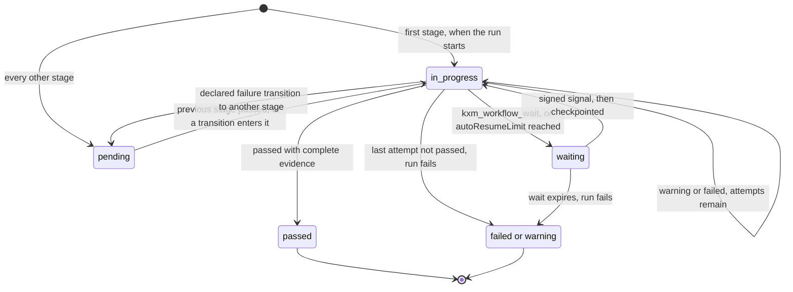

# Workflow definition reference

KXM has two kinds of workflow definition. A **webhook workflow definition** is JSON that the [hub](../glossary.md#hub) loads; a signed webhook starts a run, and one coordinator agent works through its ordered **stages**. A **Runtime workflow** is a `kxm.workflow.v1` YAML file in your project; `kxm run` creates a run, and `kxm runs drive` executes supported **steps**. This page compares the two, documents every field of the JSON format, and summarizes the YAML format with links to its full reference.

## Two workflow systems

| | Webhook workflow definition | Runtime workflow |
|---|---|---|
| Format | JSON array of definitions | YAML file with `schema: kxm.workflow.v1` |
| Location | Any JSON file named by `KXM_WEBHOOK_WORKFLOWS_FILE`, or inline in `KXM_WEBHOOK_WORKFLOWS` | `.kxm/workflows/<id>.yaml`, tracked in Git |
| Loaded by | The hub, once at start | Every project load (`kxm init`, `kxm run`) |
| Units | Stages, in order | Steps, connected by typed transitions |
| Started by | A signed `POST /v1/webhooks/<id>`, or `kxm workflow start` | Create with `kxm run <workflow> [prompt]`, execute with `kxm runs drive <runId> --wait` |
| Who does the work | One coordinator agent, prompted with every stage, using the [workflow tools](tools.md#workflow-tools) | The Runtime: agent steps through a model producer, gate steps by running `.kxm/gates.yaml` commands |
| Evidence | Keyed strings plus verified peer replies | Gate evidence the Runtime records itself |
| External results | `kxm_workflow_wait`, then a signed signal | Recovery signals only; `wait` steps compile but are not matched yet |
| Inspect with | `kxm_workflow_get`, `kxm workflow get`, `kxm dash` | `kxm runs status`, `kxm runs list` |
| Validate with | `kxm gate validate` | `kxm gate validate --file <yaml>` (schema/transitions), `kxm init --dry-run` (project references), `kxm run --dry-run` (run prerequisites) |

Both kinds of run have IDs of the form `run_<32 hex>`. The journal, checkpoints and waits belong to webhook runs only.

## Webhook workflow definitions

### Load definitions

The hub reads its definitions once, at start, from exactly one source:

- `KXM_WEBHOOK_WORKFLOWS_FILE`: a path to a JSON file holding an array of definitions;
- `KXM_WEBHOOK_WORKFLOWS`: the same array, inline.

Setting both, or an invalid definition, stops the hub from starting. Restart the hub to load a change. Check a file first; the command parses the same source the hub loads and never prints secrets:

```bash
export JIRA_WEBHOOK_SECRET="replace-with-a-start-secret"
export WORKFLOW_SIGNAL_SECRET="replace-with-a-signal-secret"
kxm gate validate --file .kxm/assets/webhooks/workflows.json
```

Expected output for the [example](#example) below:

```text
validated 1 workflow(s) from file with 1 warning(s)
```

Keep the file out of `.kxm/config/workflows/`: any JSON there counts as legacy configuration and makes the whole project unloadable (`legacy_state_unsupported`). Do not point the hub at `.kxm/workflows/*.yaml` either; those are Runtime workflows and do not parse as JSON. Unknown fields are ignored, except inside `evidencePolicies`, where they are refused. Errors are plain messages rather than codes.

### Definition fields

| Field | Type and limits | Default | Effect |
|---|---|---|---|
| `id` | String, 64 characters, unique | Required | The URL segment in `/v1/webhooks/<id>` and the name `kxm workflow start` takes |
| `source` | `jira`, `github` or `generic` | `generic` | Recorded on each run. A `jira` or `github` definition also accepts its provider's body-only signature and delivery header; a `generic` one accepts only the KXM sender contract |
| `project` | String, 128 characters | Required | Hub project the run and its coordinator belong to |
| `target` | Agent name or ID, 80 characters | Required | The coordinator. It must have registered at least once before a run starts; it may be offline |
| `secretEnv` | Environment variable name | Use this or `secret` | Variable holding the start secret, read when the definitions are parsed |
| `secret` | String, 16 to 512 characters | Use this or `secretEnv` | The start secret inline. Prefer `secretEnv` |
| `signalSecretEnv`, `signalSecret` | As above | The start secret | Separate secret for result callbacks |
| `event` | String, 128 characters | Any event | Only deliveries with this event start a run; others get 204 |
| `filter.path`, `filter.equals` | Dotted payload path (256), exact string (512) | No filter | Only payloads whose value at the path equals the string start a run; others get 204 |
| `delivery` | `followUp` or `steer` | `followUp` | Delivery mode of the coordinator's prompt |
| `ttlMs` | Integer, 1,000 to 604,800,000 | The hub's `KXM_MESSAGE_TTL_MS` | Lifetime of the coordinator prompt and each resume message |
| `promptTemplate` | String, 20,000 characters | Required | Task text with `{{dotted.path}}` placeholders filled from the payload |
| `maxTransitions` | Integer, 1 to 200 | No global budget | Run-wide budget on declared transitions. Required when any stage has a back-edge |
| `planHash` | `{ "stageId", "evidenceKey" }` | None | See [Plan hash and reproduction oracle](#plan-hash-and-reproduction-oracle) |
| `reproOracle` | `{ "stageId", "evidenceKey" }` | None | As above |
| `requirePlanHash` | Array of stage IDs | None | Stages that cannot checkpoint until the plan hash is captured |
| `stages` | 1 to 32 stages | Required | In execution order |

A placeholder whose value is an object is filled with its JSON; a missing value becomes empty. The hub adds the run ID, every stage with its required evidence and peer policies, and the coordinator's rules to the rendered template. The whole prompt must fit in 32,000 characters, or the start is refused.

### Stage fields

| Field | Type and limits | Default | Effect |
|---|---|---|---|
| `id` | String, 64 characters, unique in the definition | Required | The `stageId` in tool calls |
| `label` | String, 128 characters | The `id` | Display name |
| `instructions` | String, 4,000 characters | Required | What the coordinator does in this stage |
| `requiredEvidence` | Up to 32 unique strings of 128 characters | `[]` | Evidence keys a passing checkpoint must cover |
| `maxAttempts` | Integer, 1 to 20 | `3` | Warning or failed checkpoints allowed before the run fails |
| `autoResumeLimit` | Integer, 1 to 20 | None | Attempts after which the stage escalates to an operator |
| `area` | `harness`, `gates`, `implementation`, `workflow`, `documentation`, `security` or `other` | None | Default area for this stage's journal entries |
| `evidencePolicies` | Map of required key to a policy | None | Keys that only verified peer replies can satisfy |
| `on` | Map of outcome key to a transition | None | Declared transitions; see [Transitions and outcome keys](#transitions-and-outcome-keys) |
| `maxTransitions` | Integer, 1 to 100 | None | Budget on transitions taken out of this stage |

Evidence keys are compared after trimming, collapsing inner whitespace and lowercasing, so `Peer Reviews` and `peer reviews` are the same key; duplicates after normalizing are refused.

### Evidence policy fields

A policy turns one required key into a peer-reply requirement: only replies from eligible peers, requested with the run's exact `workflowContext` and cited in `evidenceRefs`, can satisfy it.

| Field | Type and limits | Default | Effect |
|---|---|---|---|
| `kind` | `peer-reply` | Required | The only kind |
| `minProducers` | Integer, 1 to 8 | Required | Unique eligible agents whose replies are needed; at most the number of eligible agents |
| `eligibleAgents` | 1 to 16 unique agent names or IDs | Required | Who may produce the evidence. Must not include `target` |
| `acceptedStatuses` | Exactly `["replied"]` | `["replied"]` | Only replied messages count |
| `degradation.minProducers` | Integer, at least 1 and lower than `minProducers` | None | The lowest minimum an operator may approve; below 2 validates with a warning |

The policy key must also appear in `requiredEvidence`. When a run starts, the hub resolves the eligible agents to stable agent IDs and snapshots them on the run. The start fails with 409 if an eligible agent never registered (`workflow_target_unavailable`), resolves to the coordinator (`workflow_evidence_policy_invalid`), or leaves fewer unique producers than `minProducers` (`workflow_evidence_policy_unresolvable`).

An operator approves a degraded minimum for the current attempt with `kxm gate degrade`, which needs the admin token. The approval is journaled and does not pass the stage; the coordinator still cites the approved number of replies. [Peer provenance and quorum gates](../guides/provenance-gates.md) explains what quorum does and does not prove.

### How a stage passes

- An ordinary required key is satisfied by any non-empty string under that key, from the checkpoint itself, from earlier `kxm_workflow_wait` calls in this stage, or from the callback.
- A peer-policy key is satisfied only by verified `evidenceRefs` from distinct eligible producers for this run, stage, requirement and attempt. Evidence strings never satisfy it, and replies requested for an earlier attempt do not count.
- Evidence sent with a `warning` or `failed` checkpoint or callback is recorded in the journal but not kept for the next attempt.
- A `passed` checkpoint missing any key is refused with `workflow_evidence_incomplete`, which lists the missing keys; it does not consume an attempt.

The following diagram shows one stage's states.



### Transitions and outcome keys

Without an `on` map, a stage follows default edges: `passed` moves to the next pending stage (or completes the run after the last stage), and `warning` or `failed` retries the same stage until `maxAttempts`.

Each `on` key is an outcome key, and each value is a stage ID, `$terminal`, or `{ "target": "<stage or $terminal>", "maxTransitions": <1 to 100> }`.

- **Outcome keys.** The key is the checkpoint's or signal's status: `passed`, `warning` or `failed`. The checkpoint route also accepts an `outcome` field naming a custom key, but no KXM tool or command sends one.
- **Forward targets.** A transition may target only the next stage, so a gate stage cannot be skipped. Targeting a later stage is refused when the definitions load.
- **Back-edges.** A target at or before the current stage is a back-edge. Any back-edge requires the definition's `maxTransitions`.
- **Budgets.** The per-edge `maxTransitions`, the stage's `maxTransitions` and the definition's `maxTransitions` all count transitions already taken. Exhausting any of them fails the run and journals a `transition_budget_exhausted` error.
- **Entering a stage.** A transition resets the target stage's attempts and evidence. A stage left on a failure transition returns to `pending`.
- **After a back-edge.** The default `passed` edge enters the first `pending` stage in definition order. Stages between the back-edge target and the stage that took it are still `passed` from before, so they are skipped, not re-run. To re-run them, declare `on.passed` on each stage explicitly, naming the next stage.
- **Last attempt.** A failure transition is taken only while attempts remain; a stage's last failing attempt fails the run.
- **`$terminal`.** Completes the run, whichever outcome led there. It takes no terminal status.

Every transition taken is journaled as a `state-change` entry.

### Waits, signals and escalation

`kxm_workflow_wait` parks the active stage in `waiting` under a `signalKey` until a signed callback arrives or the wait expires (1 second to 30 days, default 24 hours; expiry fails the run). The coordinator can then reply to release its turn.

The callback is `POST /v1/webhooks/<id>/runs/<runId>/signals/<signalKey>`, signed under the [KXM sender contract](../guides/webhook-workflows.md#kxm-sender-contract) with the signal secret (or the start secret), bound to its timestamp, delivery ID, run and signal key. Its body carries `status`, `summary` and `evidence`. Evidence keys `workflow.run`, `workflow.stage` and `workflow.signal`, when present, must match the route (`workflow_signal_context_mismatch`). The signal checkpoints the stage with its status; if work remains, the hub sends the coordinator a resume message. See the [HTTP API](http-api.md#webhooks-and-signals) for headers and deduplication.

When `autoResumeLimit` is set and a stage's attempts reach it without passing, the stage escalates instead of retrying: it waits for signal key `audit_escalation` for 24 hours and records a `kxm.terminal-receipt.v1` receipt. A signed `audit_escalation` signal, or `kxm role resume`, resumes it. Anyone holding the signal secret can clear an escalation.

> [!IMPORTANT]
> Inside a KXM project (a Git repository with `.kxm/project.yaml`), `kxm gate signal`, `kxm workflow signal`, `kxm workflow wait` and `kxm role resume` send every `run_…` ID to the local Runtime, and hub run IDs use the same form. To signal a hub run from the CLI, run `kxm gate signal` outside any KXM project. `kxm gate github watch` and the agent tools always reach the hub.

### Plan hash and reproduction oracle

Both take `{ "stageId", "evidenceKey" }`. When `stageId` passes, the hub records the SHA-256 of that stage's values for `evidenceKey`.

- **`planHash`** records the approved plan. Stages listed in `requirePlanHash` refuse checkpoints with `plan_hash_required` until it exists.
- **`reproOracle`** records a confirmed reproduction. A later checkpoint that cites the same key with different values is refused with `weakened_reproduction`, so a reproduction cannot be weakened to make a fix pass.

### What else ends or records a run

- **Early reply.** A coordinator reply while the run is `running` fails it, with an `error` journal entry. Reply only after the last checkpoint, or after `kxm_workflow_wait`.
- **Prompt expiry.** If the coordinator's prompt expires while the run is `running`, the run fails.
- **Retrospective.** When a run completes or fails, the hub writes a proposed retrospective (JSON and Markdown) under `.kxm/assets/retrospectives/`.
- **Retention.** Finished runs and their journal are purged from the hub after 7 days. The retrospective files remain.

### Limits

| Item | Limit |
|---|---|
| Definitions | Unique `id`s; each ID 64 characters |
| Stages per definition | 1 to 32 |
| Required evidence per stage | 32 keys of 128 characters |
| Peer policy | `minProducers` 1 to 8; `eligibleAgents` 1 to 16 |
| Attempts | `maxAttempts` and `autoResumeLimit` 1 to 20 |
| Transition budgets | Edge and stage 1 to 100; definition 1 to 200 |
| Secrets | 16 to 512 characters |
| Prompt | Template 20,000 characters; rendered prompt 32,000 |
| Message lifetime (`ttlMs`) | 1 second to 7 days |
| Signal wait | 1 second to 30 days |

Checkpoint and journal limits are in [Protocol limits](configuration.md#workflows-and-context).

### Example

This definition plans with two independent peer reviews, implements, then waits for CI and loops back to implementation at most twice on a failed CI signal. It validates with one warning, for the degraded minimum of 1.

`.kxm/assets/webhooks/workflows.json`:

```json
[
  {
    "id": "jira-development",
    "source": "jira",
    "project": "payments",
    "target": "coordinator",
    "secretEnv": "JIRA_WEBHOOK_SECRET",
    "signalSecretEnv": "WORKFLOW_SIGNAL_SECRET",
    "event": "jira:issue_updated",
    "filter": { "path": "issue.fields.status.name", "equals": "In Progress" },
    "delivery": "followUp",
    "ttlMs": 86400000,
    "maxTransitions": 6,
    "planHash": { "stageId": "plan", "evidenceKey": "approved plan" },
    "requirePlanHash": ["implement"],
    "promptTemplate": "Deliver {{issue.key}}: {{issue.fields.summary}}",
    "stages": [
      {
        "id": "plan",
        "label": "Plan and review",
        "instructions": "Produce a plan and collect two independent peer reviews.",
        "requiredEvidence": ["approved plan", "peer reviews"],
        "evidencePolicies": {
          "peer reviews": {
            "kind": "peer-reply",
            "minProducers": 2,
            "eligibleAgents": ["reviewer-claude", "reviewer-grok"],
            "acceptedStatuses": ["replied"],
            "degradation": { "minProducers": 1 }
          }
        },
        "maxAttempts": 3,
        "area": "workflow",
        "on": { "passed": "implement" }
      },
      {
        "id": "implement",
        "label": "Implement",
        "instructions": "Implement the approved plan.",
        "requiredEvidence": ["diff"],
        "maxAttempts": 3,
        "autoResumeLimit": 2,
        "area": "implementation",
        "on": { "passed": "ci" }
      },
      {
        "id": "ci",
        "label": "Wait for CI",
        "instructions": "Call kxm_workflow_wait and let kxm gate github watch report the checks.",
        "requiredEvidence": ["github.check:ci"],
        "maxAttempts": 3,
        "area": "gates",
        "on": {
          "passed": "$terminal",
          "failed": { "target": "implement", "maxTransitions": 2 }
        },
        "maxTransitions": 2
      }
    ]
  }
]
```

[Webhook workflows](../guides/webhook-workflows.md) walks through running a definition like this end to end.

## Runtime workflows (`kxm.workflow.v1`)

A Runtime workflow is a YAML file whose name is its ID. The [configuration file reference](config-reference.md#kxmworkflowsidyaml-kxmworkflowv1) documents every field and error code; this table summarizes the parts that differ most from webhook definitions.

| Topic | Summary | Full reference |
|---|---|---|
| Top level | `schema`, `description`, `coordinator`, `limits` (`maxTransitions`, `maxRunDurationMs`, `maxAgentTimeMs`, `maxModelCost`, `currency`), `planHash`, `reproOracle`, `requirePlanHash`, and 1 to 128 `steps` | [Top-level fields](config-reference.md#top-level-fields) |
| Step kinds | `agent`, `moa`, `gate`, `approval`, `wait`; `workflow` is reserved | [Step fields](config-reference.md#step-fields) |
| Parallel work | `assignments` (allowed agents, counts, `distinctBy`) and `join` (`all`, `all-settled`, `quorum`, `first-success`) | [Assignments and join](config-reference.md#assignments-and-join) |
| Evidence | `requiredEvidence` entries with a `kind` and an optional `producerPolicy` | [Evidence requirements](config-reference.md#evidence-requirements) |
| Transitions | `on` is required on every step. `$terminal` needs `terminalStatus` (`completed`, `failed` or `cancelled`). Each back-edge needs its own `maxTransitions`, plus `limits.maxTransitions` | [Transitions and outcomes](config-reference.md#transitions-and-outcomes) |
| Gate outcome keys | An `expect: pass` gate produces `passed` or `implementation-failure`; an `expect: fail` gate produces `passed` or `repro-missing`. Declare both produced outcomes | [Transitions and outcomes](config-reference.md#transitions-and-outcomes) |
| `gate_outcome_impossible` | Refused at load when a gate step declares an outcome it never produces, such as `failed`, and omits one it produces. `gate_outcome_renamed` catches underscore spellings | [Transitions and outcomes](config-reference.md#transitions-and-outcomes) |
| Agent steps | The model returns a JSON `outcome` from the step's declared keys; anything else becomes `failed`, so declare `failed`. `timeoutMs` bounds the one-shot spawn for `agent` and `moa` steps, and must not be wider than the project `limits.agentStepTimeoutMs` | [Step fields](config-reference.md#step-fields) |
| Not executed yet | Some valid fields make the Runtime hand the run off (`step_unsupported`, `gate_unsupported`, `limit_unsupported`) instead of executing | [Steps the Runtime does not execute yet](config-reference.md#steps-the-runtime-does-not-execute-yet) |

`kxm workflow add bug-fix --template implement-and-verify` writes a valid starting file; `dual-critic-review` and `spec-and-plan` are also available. IDs are flat filename-derived slugs, not catalog paths such as `software-engineering/bug-fix`. Installation validates YAML/schema/transitions before writing, including under `--dry-run`. `kxm run <workflow>` creates a run and reports live prerequisites and separate `runs drive/status/receipt` commands. Current live one-shot profiles are read-only, so a writer template can validate but cannot execute live; `task run` refuses incompatible work before creating a run or changing the task. Simulation remains explicitly available and is not proof of implementation. See [`kxm run`](cli-reference.md#kxm-run) and [`kxm runs`](cli-reference.md#kxm-runs).

## Related

- [Webhook workflows](../guides/webhook-workflows.md): start, wait for and resume a webhook run
- [Peer provenance and quorum gates](../guides/provenance-gates.md): evidence policies in practice
- [Agent tools](tools.md#workflow-tools): the coordinator's workflow tools
- [Hub HTTP API](http-api.md#webhooks-and-signals): signed start and signal requests
- [Configuration file reference](config-reference.md#kxmworkflowsidyaml-kxmworkflowv1): every `kxm.workflow.v1` field
- [Workflow catalog](workflow-catalog.md): the area, workflow and role taxonomy
