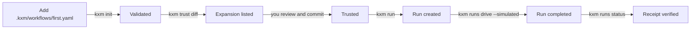
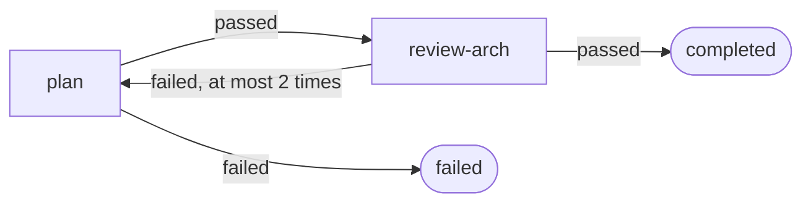

# Run your first workflow

A [workflow](../glossary.md#workflow) is a reviewed YAML file in `.kxm/workflows/` that the local [Runtime](../glossary.md#runtime) runs step by step. In this tutorial you add a workflow from a built-in template, review and commit it, and drive a run to a verified completion without calling any model. Then you learn what each field means, so you can write your own.

## Before you begin

- The `kxm` CLI. See [Install KXM](install.md#install-the-cli).
- A KXM project whose `.kxm/` is committed to Git. Steps [1](quickstart-claude-code.md#1-initialize-the-project) and [2](quickstart-claude-code.md#2-ignore-runtime-state-and-commit-kxm) of the Claude Code quick start create one.
- Nothing else. The drive in this tutorial is simulated, so it needs no model credentials, and runs work without a hub: the Runtime sends run summaries to the bound hub whenever one is running.

## How a first run works

A new workflow reaches a finished run through one human decision: your reviewed commit.



## 1. Add a workflow from a template

From the repository root:

```bash
kxm workflow add first --template spec-and-plan
```

Expected output:

```text
Added workflow 'first' to local (<repo-root>/.kxm/workflows/first.yaml)
```

The file name is the workflow ID, so this workflow is `first`. Add `--dry-run` to see the path without writing it. Three templates are built in:

| Template | Steps | Use it for |
|---|---|---|
| `spec-and-plan` | `plan`, then `review-arch`, both run by the `coordinator` agent with read-only access | A first workflow: it writes nothing and runs no test command |
| `implement-and-verify` | `implement`, then the `test` gate; a failing gate sends the work back to `implement` | Changes checked by your test command |
| `dual-critic-review` | `implement`, two reviews, then the `test` gate | Changes that need two reviews before the tests |

The template writes this file, `.kxm/workflows/first.yaml`:

```yaml
schema: kxm.workflow.v1
description: Plan a change, then review the plan. Both steps run as the
  coordinator agent and only read the repository.
coordinator: coordinator
limits:
  maxTransitions: 8
steps:
  - id: plan
    kind: agent
    agent: coordinator
    maxAttempts: 3
    repositories:
      control: read
    on:
      passed: review-arch
      failed:
        target: $terminal
        terminalStatus: failed
  - id: review-arch
    kind: agent
    agent: coordinator
    maxAttempts: 3
    repositories:
      control: read
    on:
      passed:
        target: $terminal
        terminalStatus: completed
      failed:
        target: plan
        maxTransitions: 2
```

Each step's `on` map routes an outcome to the next step. A failed review sends the work back to `plan` at most twice:



## 2. Validate the workflow

```bash
kxm init
kxm workflow definitions
```

Expected output:

```text
validated KXM project at <repo-root>
WORKFLOW DEFINITIONS:
  default                  [local]          3 steps (roles: coordinator, implementer) Plan, implement, and verify a local change.
  first                    [local]          2 steps (roles: coordinator) Plan a change, then review the plan. Both steps run as the coordinator agent and only read the repository.
```

If a file is invalid, `kxm init` exits 1 and prints one `<file>: <code>: <message>` line per problem.

## 3. Review the change and commit it

```bash
kxm trust diff
kxm trust check
```

Expected output of `kxm trust diff`:

```text
permission diff: sha256:<old-revision>… -> sha256:<new-revision>…
EXPANSION  .kxm/workflows/first.yaml added (expansion)
1 expansion(s) require explicit reviewed trust action
```

`kxm trust check` prints the same lines, adds `trust check failed: review every expansion above before merging`, and exits 1. A new workflow is an [expansion](../glossary.md#expansion) of what agents may do, so read it: which agents run each step, and what access each step has to each repository. When you agree with it, commit it yourself:

```bash
git add .kxm/workflows/first.yaml
git commit -m "Add the first workflow"
kxm trust check
```

Expected output:

```text
permission diff: sha256:<revision>… -> sha256:<revision>…
no authority-bearing or prose changes
```

> [!IMPORTANT]
> Your reviewed commit is the approval. `kxm trust` has only `diff` and `check`, and no command approves an expansion for you.

## 4. Plan the run

```bash
kxm run first "Plan a hello script" --dry-run
```

Expected output:

```text
run plan: workflow first at sha256:<revision>… (no run created)
```

The hash is the project's configuration revision, the same one `kxm trust diff` prints; a run pins it. Keep secrets out of run prompts.

## 5. Create the run

```bash
kxm run first "Plan a hello script"
```

Expected output:

```text
run created: run_<id> (home rtm_<id>…, config sha256:<revision>…)
drive it model-free: kxm runs drive run_<id> --simulated --wait (or cancel: kxm runs cancel run_<id>)
```

`kxm run` starts the Runtime supervisor if it is not running. Check the new run, using the run ID from the output:

```bash
kxm runs status run_<id>
```

Expected output:

```text
run run_<id>: created (workflow first, updated <timestamp>)
```

## 6. Drive the run

```bash
kxm runs drive run_<id> --simulated --wait
```

Expected output, one line:

```text
{"budget":null,"closedAt":"<timestamp>","driveId":"drv_<id>","homeRuntimeId":"rtm_<id>","lastSequence":41,"logHash":"sha256:[redacted]","mode":"simulated","openedAt":"<timestamp>","openedSequence":4,"producer":{"closed":false,"id":"driver-simulated"},"projectId":"prj_<id>","runId":"run_<id>","schema":"kxm.drive-receipt.v1","settlement":{"kind":"terminal","reason":"","status":"completed"}}
```

The simulated producer answers every agent step with `passed` and calls no model or harness, so the run moves from `plan` to `review-arch` to `completed`. `--wait` blocks until the [drive receipt](../glossary.md#drive-receipt) is recorded, for 60 seconds by default (`--timeout-ms`, up to 600000), and exits 0 only for a verified completed run.

## 7. Check the result

```bash
kxm runs status run_<id>
kxm runs receipt run_<id>
kxm runs list
```

Expected output:

```text
run run_<id>: completed (workflow first, updated <timestamp>)
drive drv_<id>: completed (receipt verified)
{"kind":"terminal","reason":"","status":"completed"}
run_<id>  completed  first  <timestamp>
```

`receipt verified` means the Runtime checked the drive receipt against the run's event log.

## 8. Stop the Runtime supervisor

```bash
kxm runtime stop
```

Expected output:

```text
runtime supervisor rtm_<id> stopping
```

You have added, reviewed, run and verified a workflow.

## Write a workflow by hand

Instead of a template, you can write the file yourself. This slim workflow plans with the `coordinator` agent, then implements with the `implementer` agent. Save it as `.kxm/workflows/first.yaml`, or under another name if `first` already exists:

```yaml
schema: kxm.workflow.v1
description: Plan, then implement. A first workflow you can drive end to end.
coordinator: coordinator
limits:
  maxTransitions: 6
steps:
  - id: plan
    kind: agent
    agent: coordinator
    maxAttempts: 2
    repositories:
      control: read
    on:
      passed: implement
      failed:
        target: $terminal
        terminalStatus: failed
  - id: implement
    kind: agent
    agent: implementer
    maxAttempts: 2
    repositories:
      control: write
    on:
      passed:
        target: $terminal
        terminalStatus: completed
      failed:
        target: $terminal
        terminalStatus: failed
```

Then repeat steps 2 to 8. The `implement` step asks for `write` access to the `control` repository, so `kxm trust diff` lists it as an expansion to review.

| Field | Meaning |
|---|---|
| `schema` | Always `kxm.workflow.v1` |
| `description` | Free text that `kxm workflow definitions` shows |
| `coordinator` | The agent that owns the run; an ID from `.kxm/agents/` |
| `limits.maxTransitions` | The most step-to-step moves one run may make; more fails the run |
| `steps` | The ordered steps; the first one is the entry point |
| `id` | A unique step name |
| `kind` | `agent` here; the others are `moa`, `gate`, `approval` and `wait` |
| `agent` | The agent from `.kxm/agents/<id>.yaml` that performs the step |
| `maxAttempts` | How many times the step may run before the run fails |
| `repositories` | Access per repository ID (`none`, `read` or `write`), at most the agent's own limit |
| `on` | Outcome to next step: a step ID, or `$terminal` with a `terminalStatus` |
| `terminalStatus` | How the run ends: `completed`, `failed` or `cancelled` |
| `maxTransitions` on an edge | Required on a transition back to an earlier step; it bounds the loop |

[Workflow files](../reference/config-reference.md#kxmworkflowsidyaml-kxmworkflowv1) lists every field, its limits and its error codes, and the [Workflow definition reference](../reference/workflow-definitions.md) compares the two kinds of workflow KXM runs.

## Why the `default` workflow refuses a direct drive

`kxm init` writes a `default` workflow that plans, implements and runs the test gate. It declares `limits.maxAgentTimeMs`, an agent-time budget the Runtime cannot enforce yet, so the Runtime hands the run off instead of driving it:

```bash
kxm run default "Try the default workflow"
kxm runs drive run_<id> --simulated --wait
```

Expected output of the drive:

```text
run drive failed: /v1/runs/run_<id>/drive?projectRoot=<encoded-repo-root>: run_handoff_required: runtime request failed with HTTP 409 (handoff reason limit_unsupported; field limits.maxAgentTimeMs; detail agent-time budget enforcement is not available in this slice)
```

The run stays `preparing`. Cancel it with `kxm runs cancel run_<id>`, which prints `run run_<id>: cancelled`. [Steps the Runtime does not execute yet](../reference/config-reference.md#steps-the-runtime-does-not-execute-yet) lists every setting that causes a handoff.

## Simulated and live drives

`--simulated` replaces model calls, not your commands. Gate steps run their command from `.kxm/gates.yaml` in both modes, so a failing test fails the gate even in a simulated drive.

| | Simulated (`--simulated`) | Live (no flag) |
|---|---|---|
| Agent steps | Report `passed` without calling a model | Call the agent's harness in a one-shot, read-only mode |
| Gate steps | Run the gate's command | Run the gate's command |
| Needs | Nothing | An admitted route for each agent's model (`kxm routes admit`) |
| Steps with `write` access | Run, but agent steps change no files | Refused: the run is handed off |
| Cost | None | Model usage on your accounts |

> [!WARNING]
> Without `--simulated`, `kxm runs drive` calls live harnesses. An agent whose model is not an admitted route fails with `producer_route_not_admitted`. Read [Harness routing](../reference/harness-routing.md) before your first live drive. A workflow with a `write` step cannot run live; the read-only `spec-and-plan` template avoids that refusal.

## Let Claude do it

With the [Claude Code plugin](quickstart-claude-code.md) installed, you can ask Claude to set up KXM and run a first workflow. The plugin's `kxm-project-setup` skill has Claude run `kxm init`, write a slim `first.yaml`, run `kxm trust diff` and `kxm trust check`, then create a run and drive it with `--simulated`.

In Claude Code:

```text
Set up KXM in this repository and run a first workflow.
```

The skill stops at every `.kxm/` permission change and asks you to review and commit it; Claude never commits `.kxm/` itself. Tokens, starting the hub, and the plugin's configuration also stay with you.

## Two kinds of runs

`kxm run` and `kxm runs` manage Runtime runs like the one in this tutorial. Hub workflow runs are different: a signed webhook or `kxm workflow start` creates them, and `kxm workflow list` and the `kxm_workflow_*` tools show them. `kxm workflow list` never shows a Runtime run; use `kxm runs list`. See [Run webhook workflows](../guides/webhook-workflows.md) for hub runs.

## Troubleshooting

| Message or symptom | Cause | Fix |
|---|---|---|
| `run_handoff_required` naming `limits.maxAgentTimeMs` | You drove the `default` workflow | Cancel the run and use `first` |
| `trust check failed: review every expansion above before merging` | The workflow is not committed | Review it, then commit it |
| `workflow <id> does not exist in this project` | The ID is not a local workflow | Use an ID from `kxm workflow definitions` marked `[local]` |
| `gate_outcome_impossible` from `kxm init` | A gate step routes failure on `failed` | Declare `implementation-failure` on the gate step |
| `--wait` exits 1 with settlement `failed` | A step failed, for example a gate that kept failing (`budget_edge`) | Read the reason with `kxm runs receipt run_<id>`, then fix the step or the command |
| A run stays `preparing` or `running` | The run was handed off or is waiting | Run `kxm runs cancel run_<id>` |

## Next steps

- Learn from runs: `kxm improve report` proposes improvement candidates from live runs. It leaves simulated attempts out, so for now it reports `0 record(s)`. See [Continuous improvement](../guides/continuous-improvement.md).
- Give agents project context: Claude calls `kxm_context` with its role and task before planning. See [Context and memory](../guides/context-and-memory.md).
- Watch agents, workflows and spend live with `kxm dash`: [Monitor KXM](../operations/monitoring.md#watch-live-work-with-kxm-dash).
- Write richer workflows: [Workflow catalog](../reference/workflow-catalog.md) and [Workflow definition reference](../reference/workflow-definitions.md).
