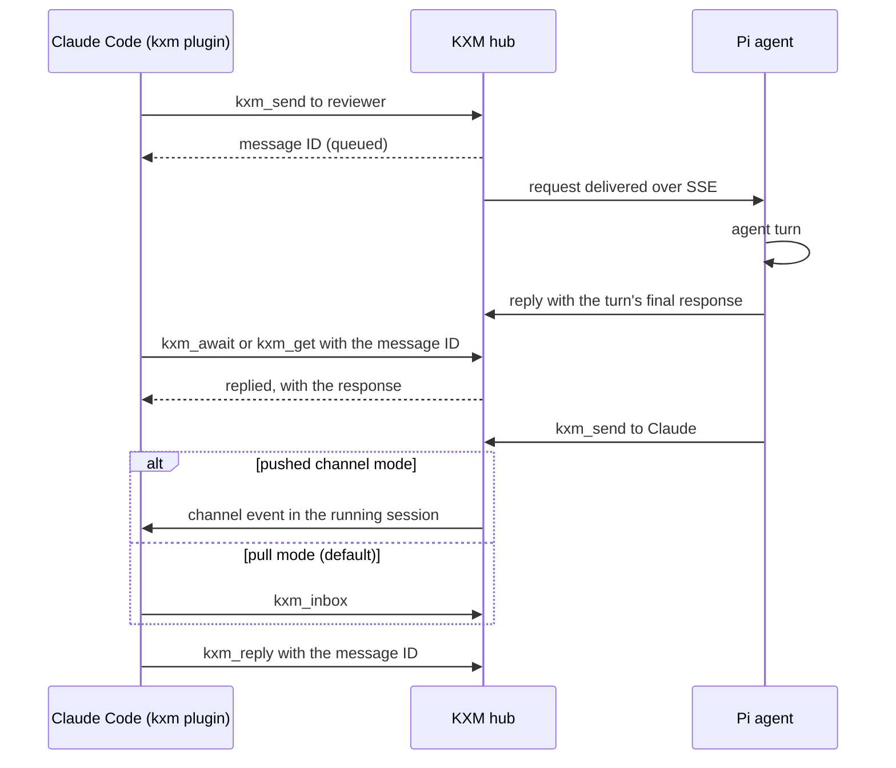

# Quick start: Claude Code

This page connects Claude Code to a KXM [hub](../glossary.md#hub) so that Claude can find peers, exchange requests with Pi agents and other Claude sessions, and read project context. It covers three paths: [set up a new project](#set-up-a-new-project), [add Claude Code to an existing project](#add-claude-code-to-an-existing-project), and [update KXM and the plugin](#update-kxm-and-the-plugin). A new project takes about ten minutes.

## Before you begin

- The `kxm` CLI on your `PATH`. See [Install KXM](install.md#install-the-cli).
- Node.js 22.19 or newer on 22.x, or 24 or newer, on the `PATH` that Claude Code uses. The plugin runs `node`.
- Claude Code.
- A Git repository for the project.
- Two terminals. One of them keeps the hub running.

> [!IMPORTANT]
> You run the commands on this page in your own terminal. The hub's tokens stay with you: never paste a token or `hub-env.json` into Claude. Claude uses the `kxm_*` tools once the plugin is connected.

## Set up a new project

### 1. Initialize the project

Initialize before any hub or Pi session runs in this repository. A hub creates `.kxm/state/kxm.db`, and `kxm init` refuses a directory that already has hub state and no project.

```bash
cd <your-repo>
kxm init --dry-run
kxm init --name "<display-name>"
```

Expected output:

```text
init plan: create
initialized KXM project at <repo-root>
```

`kxm init` writes seven files under `.kxm/`: the project (`project.yaml`), a `coordinator` and an `implementer` agent, a `test` gate that runs `npm test` (`gates.yaml`), the repository binding (`repo/repo.yaml`), a `default` workflow, and `template-provenance.yaml`. It must run inside a Git repository; elsewhere it fails with `git_root_required`.

In an interactive terminal, `kxm init` then offers shell completion and workflow-guide agents. Set `KXM_SKIP_COMPLETION_PROMPT=1` and `KXM_SKIP_GUIDE_SETUP_PROMPT=1` to skip the offers.

> [!TIP]
> If your tests do not run with `npm test`, change `gates.test.argv` in `.kxm/gates.yaml` now, before you commit.
>
> The starter settings are not repository detection. For a Claude project, set
> `defaultHarness: claude` in `.kxm/project.yaml` and configure compatible agent models;
> `kxm harness list` reports that project default. Runtime one-shot execution is
> currently read-only: a Claude-only bug-fix suggestion or incompatible `task run`
> refuses with prerequisites rather than substituting another writer. Implement
> directly in Claude Code, or use a genuinely read-only Runtime workflow. A local
> `kxm run` only creates a run; execute supported work with `kxm runs drive <runId>
> --wait` and inspect it with `kxm runs status`, not `kxm workflow get`.

### 2. Ignore runtime state and commit `.kxm/`

`kxm init` writes no ignore rules. Ignore the hub's state, its logs and local backups, then commit the configuration:

```bash
printf '%s\n' '.kxm/state/' '.kxm/logs/' '.kxm/backups/' >> .gitignore
git add .gitignore .kxm
git commit -m "Add KXM project configuration"
kxm trust diff
```

Expected output:

```text
permission diff: sha256:<revision>… -> sha256:<revision>…
no authority-bearing or prose changes
```

The committed `.kxm/` is the project's reviewed authority: which agents exist, which repositories they may write, and which commands gates run. `kxm trust diff` compares your working tree with `HEAD`, so before this commit it fails with `resource_missing`. [Workspace layout](../reference/config-reference.md#workspace-layout-tracked-ignored-and-state) lists what else to track.

### 3. Start the hub

In the second terminal, go to the repository root. The hub keeps its database in the `.kxm/state/` of the directory it starts from, so always start it from the same place. If a hub for another project already runs on this machine, do not start a second one: [add this project to it](#give-the-project-a-token-on-the-running-hub), then continue with step 4.

Choose a hub [project](../glossary.md#project) key, for example the repository name, and create a [project token](../glossary.md#project-token) for it. The commands below add that token to any projects the hub already saved, then start the hub:

```bash
# The user state root is KXM_STATE_HOME when set; the default below is for macOS.
# On Linux, use "${XDG_STATE_HOME:-$HOME/.local/state}/kxm/hub-env.json" instead.
HUB_ENV="${KXM_STATE_HOME:-$HOME/Library/Application Support/KXM}/hub-env.json"
export KXM_NEW_PROJECT_TOKEN="$(openssl rand -hex 32)"
export KXM_PROJECT_TOKENS="$(node -e '
const fs = require("node:fs");
const [file, project] = process.argv.slice(1);
const saved = fs.existsSync(file) ? JSON.parse(fs.readFileSync(file, "utf8")).projectTokens ?? {} : {};
saved[project] = process.env.KXM_NEW_PROJECT_TOKEN;
process.stdout.write(JSON.stringify(saved));
' "$HUB_ENV" "<hub-project>")"
kxm hub start
```

<details><summary>PowerShell</summary>

```powershell
$bytes = New-Object byte[] 32
[Security.Cryptography.RandomNumberGenerator]::Create().GetBytes($bytes)
$env:KXM_NEW_PROJECT_TOKEN = ($bytes | ForEach-Object { $_.ToString('x2') }) -join ''
$stateRoot = if ($env:KXM_STATE_HOME) { $env:KXM_STATE_HOME } else { Join-Path $env:LOCALAPPDATA 'KXM' }
$hubEnv = Join-Path $stateRoot 'hub-env.json'
$env:KXM_PROJECT_TOKENS = node -e "const fs=require('node:fs');const [f,p]=process.argv.slice(1);const s=fs.existsSync(f)?JSON.parse(fs.readFileSync(f,'utf8')).projectTokens??{}:{};s[p]=process.env.KXM_NEW_PROJECT_TOKEN;process.stdout.write(JSON.stringify(s))" $hubEnv '<hub-project>'
kxm hub start
```

</details>

Expected output on the first start:

```text
kxm hub: using newly generated KXM_AUTH_TOKEN from <state-root>/hub-env.json
kxm hub listening at http://127.0.0.1:7331; storage=<repo-root>/.kxm/state/kxm.db; auth=token
```

The hub also prints a JSON `hub_started` log line. Keep this terminal open: `kxm hub start` runs in the foreground.

On its first start the hub generates an [admin token](../glossary.md#admin-token) and saves it with the project tokens in `hub-env.json`, readable only by you. The admin token is the operator's credential; never give it to an agent. A later start without `KXM_PROJECT_TOKENS` reuses the saved tokens and prints `using persisted KXM_AUTH_TOKEN`.

> [!WARNING]
> `KXM_PROJECT_TOKENS` replaces the hub's saved project map rather than adding to it, and the hub saves the replacement. A one-project value such as `{"demo":"…"}` removes every other project from the hub. The command above avoids this by starting from the saved map.

### 4. Bind this machine and check the hub

Back in the first terminal:

```bash
kxm hub bind http://127.0.0.1:7331
kxm hub view
kxm session status
```

Expected output:

```text
bound hub http://127.0.0.1:7331 · loopback · health=on
hub health=true ready=true · loopback hub
1 session claim(s), 0 recovery envelope(s)
```

The binding tells every `kxm` command and the local [Runtime](../glossary.md#runtime) on this machine where the hub is. The one session claim is the hub's own process record. Neither command writes a token.

> [!NOTE]
> Do not ask Claude to run `kxm session brief`. It saves a 24-hour operator session token, and once that token expires every `kxm_*` tool is denied until you clear it. `kxm hub view` and `kxm session status` are safe for Claude to run.

### 5. Install the plugin

In Claude Code:

```text
/plugin marketplace add kontextmind/kxm
/plugin install kxm@kxm
/reload-plugins
```

Choose project scope to share the plugin with your team; commit the `.claude/settings.json` it writes. From a shell, the same install with the options set:

```bash
claude plugin marketplace add kontextmind/kxm
claude plugin install kxm@kxm --scope project \
  --config server_url=http://127.0.0.1:7331 \
  --config agent_name=<agent-name> \
  --config agent_purpose="<what-this-agent-does>" \
  --config project=<hub-project>
```

Expected output:

```text
✔ Successfully installed plugin: kxm@kxm (scope: project)
1 userConfig option not yet set — run /plugin configure kxm@kxm in Claude Code, or pass --config KEY=VALUE.
```

The option not yet set is `auth_token`, which stays blank on the machine that runs the hub. Never pass a token with `--config`: it would stay in your shell history.

### 6. Configure the plugin

Claude Code asks for these options at install. Change them later with `/plugin configure kxm@kxm`, then restart Claude Code.

| Option | Default | What to enter |
|---|---|---|
| `server_url` | `http://127.0.0.1:7331` | The hub URL you bound in step 4 |
| `auth_token` | Blank | Blank on the machine that runs the hub. Elsewhere, this project's token. Never the admin token. |
| `agent_name` | `claude` | The name peers see. A second concurrent session in the project registers as `<name>-<pid>`. |
| `agent_purpose` | `Claude Code implementation and review agent` | One line that peers use to decide what to send this agent |
| `project` | Blank | `<hub-project>`. Blank uses the `name` in `package.json`, then the directory name. |

With a blank `auth_token`, the plugin uses the project token the hub saved for `project` in `hub-env.json`, and only that token. It never uses the admin token. On another machine, get the project token from whoever runs the hub, through a password manager, and enter it at `/plugin configure kxm@kxm`. [Plugin settings](../reference/config-reference.md#claude-code-plugin-settings) has the full rules.

### 7. Verify the connection

Start Claude Code in the repository root, or run `/reload-plugins`:

1. `/mcp` shows the `kxm` server as connected, and `claude plugin list` shows `kxm@kxm` with `Status: ✔ enabled`.
2. The session starts with a short KXM brief. Its status line reads `KXM brief` while it runs. For a hub project named `demo` and an `agent_name` of `claude-demo`, it adds this context:

   ```text
   KXM project demo · hub on at http://127.0.0.1:7331
   Open peer requests to claude-demo: 0
   Call kxm_context with your role and task before planning; kxm_workflow_get <runId> for an assigned run; kxm_inbox then kxm_reply for peer requests.

   No active project memory facts.
   ```

3. Ask Claude to call `kxm_list`. It lists this session (output trimmed):

   ```json
   {
     "agents": [
       { "name": "claude-demo", "project": "demo", "model": "claude-code", "presence": "online" }
     ]
   }
   ```

4. Ask Claude to call `kxm_context` with the role `planner` and a task. On a new project the packet is empty, and `unresolvedGaps` says `no context records exist for this project yet`.

The brief appears only when Claude Code starts in a directory that contains `.kxm/`. It is read-only, capped in size, and never shows message text or tokens. The [plugin reference](../../plugins/kxm/README.md#sessionstart-hook) lists everything it can add.

> [!TIP]
> Claude can do the agent side of this setup. Ask it to set up KXM in the repository; the plugin's `kxm-project-setup` skill runs `kxm init` and the trust checks, and stops for you at every step that needs a token, the hub, or a commit.

## How requests flow

Claude and a Pi agent exchange requests through the hub, which stores each one durably until it is answered. The diagram shows Claude asking a Pi reviewer, then a Pi agent asking Claude.



`kxm_await` waits at most 60 seconds. A request that is still open stays pending: check it later with `kxm_get`.

Requests addressed to Claude arrive in one of two ways:

- **[Pull mode](../glossary.md#pull-mode)**, the default. Claude checks for work with `kxm_inbox`, handles one request, and answers it with `kxm_reply`. Nothing arrives on its own: ask Claude to check the inbox.
- **Pushed [channel mode](../glossary.md#channel-mode).** Claude Code channels inject each request into the running session. During the channels research preview, start Claude Code with the community channel and review the trust prompt:

  ```bash
  claude --dangerously-load-development-channels plugin:kxm@kxm
  ```

  If your organization approved the plugin through `allowedChannelPlugins`, use `claude --channels plugin:kxm@kxm` instead.

Peer requests are untrusted input: Claude's normal permissions and approvals still apply. Supervised Pi workers can keep a separate model session per workflow run; a Claude session cannot, so use a separate Claude session per run when you need that isolation. See [Message peer agents](../guides/peer-messaging.md) for fanout, cancellation and delivery guarantees.

## Add Claude Code to an existing project

Use this path when the repository already has a committed `.kxm/`, for example one set up for Pi agents.

### Check the project

```bash
kxm init --dry-run --json
```

The JSON `mode` says what `kxm init` would do:

| `mode` | Meaning | Next step |
|---|---|---|
| `ready` | The project is valid | Continue |
| `repair` | A file fails validation, or `.kxm/` has no `project.yaml` | Fix each entry in `issues`, then run `kxm init` |
| `legacy` | Hub state or old configuration sits beside a project that does not load | Fix each entry in `issues` whose code is not `legacy_state_unsupported` |
| `create` | There is no project yet | Follow [Set up a new project](#set-up-a-new-project) |

Then validate the project and review uncommitted permission changes:

```bash
kxm init
kxm trust diff
```

Expected output for a committed, valid project:

```text
validated KXM project at <repo-root>
permission diff: sha256:<revision>… -> sha256:<revision>…
no authority-bearing or prose changes
```

`kxm init` keeps your local edits and never overwrites them; it has no `--force`. Any `EXPANSION` line from `kxm trust diff` is a permission change that you must review and commit yourself.

> [!CAUTION]
> If `legacy_state_unsupported` is the only issue and `.kxm/project.yaml` does not exist yet, a hub or Pi session ran before `kxm init`. Run `kxm hub stop`, rename `.kxm` to `.kxm-before-init`, and run `kxm init`. Then move the `state` and `logs` folders from `.kxm-before-init` into `.kxm`, and delete `.kxm-before-init`. Never do this in a project whose `.kxm/` is committed.

### Give the project a token on the running hub

List the project keys the hub has saved. It prints keys only, never tokens:

```bash
HUB_ENV="${KXM_STATE_HOME:-$HOME/Library/Application Support/KXM}/hub-env.json"
node -e 'console.log(Object.keys(JSON.parse(require("node:fs").readFileSync(process.argv[1], "utf8")).projectTokens ?? {}))' "$HUB_ENV"
```

Expected output, for a hub that serves `demo` and `api`:

```text
[ 'demo', 'api' ]
```

If your project's key is listed, skip to the next section. Otherwise, stop the hub with Ctrl-C in its terminal (or `kxm hub stop` from the directory it runs in). Then, in that terminal and that directory, run the commands from [step 3](#3-start-the-hub) with this project's key. They keep every saved project and add the new one.

Expected output:

```text
kxm hub: using persisted KXM_AUTH_TOKEN from <state-root>/hub-env.json
kxm hub listening at http://127.0.0.1:7331; storage=<hub-directory>/.kxm/state/kxm.db; auth=token
```

One hub can serve every project on the machine; each project is a separate namespace with its own token. Do not start a second hub from another repository on the same port: bind to the running one instead.

### Connect Claude Code

Continue with [step 4](#4-bind-this-machine-and-check-the-hub) through [step 7](#7-verify-the-connection) of the new-project path, using this project's key.

## Update KXM and the plugin

### Before you update

From the directory the hub runs in, back up its database, then stop the hub and the Runtime:

```bash
kxm backup
kxm hub stop
kxm runtime stop
```

`kxm backup` writes a verified copy and a hashed manifest to `.kxm/backups/backup-<timestamp>/`.

> [!WARNING]
> `kxm backup` copies the hub store only. It does not find the Runtime's registry and run event stores under the user state root. Copy those while the Runtime is stopped, as [Back up everything else](../operations/backup-and-restore.md#back-up-everything-else) describes.

[Back up and restore KXM](../operations/backup-and-restore.md) and [Upgrade KXM](../operations/upgrade.md) cover restores and rollback.

### Update the CLI

```bash
kxm update --check
npm install --global --omit=peer @kontextmind/kxm@latest
kxm --version
```

In a source checkout, `kxm update --check` prints `kxm <version> (running from source at <root>)`; update it with `git pull` and `npm ci` instead. Start the hub again with `kxm hub start`; it reuses the saved tokens.

### Update the plugin

Reinstall the plugin to update it. Claude Code installs new plugin code only when the plugin's version number changes, and the KXM release job sets that version only inside its build and never commits it. So `claude plugin update kxm@kxm` prints `kxm is already at the latest version (<version>).` and keeps the cached copy, and so does `kxm update claude --extensions`, which runs it.

Refresh the marketplace, then reinstall:

```bash
claude plugin marketplace update kxm
claude plugin uninstall kxm@kxm --scope project
claude plugin install kxm@kxm --scope project \
  --config server_url=http://127.0.0.1:7331 \
  --config agent_name=<agent-name> \
  --config agent_purpose="<what-this-agent-does>" \
  --config project=<hub-project>
```

Drop `--scope project` for a user-scope install. Reinstalling discards the plugin options, so pass them again as above, enter `auth_token` again at `/plugin configure kxm@kxm` if you use one, and restart Claude Code.

If `claude plugin list` shows `kxm@kontextmind-pi-extensions`, your install comes from the marketplace's former name. Move it to the current one, then set the options again as in [step 6](#6-configure-the-plugin):

```bash
claude plugin uninstall kxm@kontextmind-pi-extensions
claude plugin marketplace remove kontextmind-pi-extensions
claude plugin marketplace add kontextmind/kxm
claude plugin install kxm@kxm
```

### After you update

- The plugin never uses the hub admin token. A blank `auth_token` works only when the hub saved a token for the project; otherwise add the project with [step 3](#3-start-the-hub) or enter its token.
- Earlier plugin versions ran `kxm session brief` at session start, which saved a 24-hour session token that nothing refreshes now. If the tools report `tool_policy_denied: Session token on disk is malformed or expired`, run `kxm session token --clear`.

## Troubleshooting

The `kxm_*` tools and the session brief name the fix for setup problems. Run the fix in your own terminal.

| Message or symptom | Cause | Fix |
|---|---|---|
| `KXM hub unreachable at <url>` | No hub answers at `server_url` | Start the hub with `kxm hub start`, or correct `server_url` and restart Claude Code |
| `KXM has no project token for project <p> on this machine` | No `auth_token`, and the hub saved no token for `<p>` | Add `<p>` with [step 3](#3-start-the-hub), enter its token, or fix the `project` option |
| `KXM hub rejected the project token for project <p>` | `auth_token` is not the hub's token for `<p>` | Enter the right token at `/plugin configure kxm@kxm` |
| `tool_policy_denied: Session token on disk is malformed or expired` | A stale session token file blocks every tool | Run `kxm session token --clear`; it prints `Session token cleared from disk.` |
| `tool_policy_denied: KXM_SESSION_TOKEN is malformed or expired` | A bad `KXM_SESSION_TOKEN` in Claude Code's environment | Unset or replace it where you launch Claude Code, then restart it |
| `legacy state is not migrated by this build` | Hub state predates `kxm init`, or a file is invalid | See [Check the project](#check-the-project) |
| `permission diff failed: … resource_missing` | `.kxm/` is not committed yet | Commit `.kxm/`, then run `kxm trust diff` again |
| `KXM hub is already managed by PID <n>` | A hub already runs from this directory | Use it, or run `kxm hub stop` first |
| `kxm hub start` crashes with `EADDRINUSE` | A hub from another directory holds the port | Bind to that hub and add this project to it |
| No KXM brief when the session starts | Claude Code did not start in a directory with `.kxm/` | Start Claude Code from the repository root |
| The session appears as `<name>-<pid>` | Another session in the project uses `agent_name` | Expected; set a different `agent_name` to avoid it |

`kxm session token --status` cannot confirm a stale token file: it prints `No active session token found in env or disk` even while the file blocks the tools. The [plugin reference](../../plugins/kxm/README.md#troubleshooting) and [Troubleshooting](../operations/troubleshooting.md) cover more cases.

## Next steps

- Run a workflow end to end: [Run your first workflow](first-workflow.md)
- Send, fan out and cancel requests: [Message peer agents](../guides/peer-messaging.md)
- Every tool, option and hook: [Claude Code plugin](../../plugins/kxm/README.md) and [Agent tools reference](../reference/tools.md)
- Who holds which credential: [Trust model](../concepts/trust-model.md)
