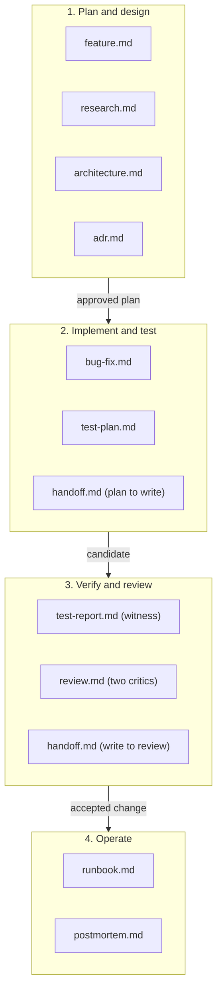

# Artifact templates

These templates give the artifacts a KXM workflow produces a common shape:
feature specifications, research briefs, bug reports, architecture designs,
decision records, test plans and reports, reviews, handoffs, runbooks and
postmortems. Agents and people fill them in during a run. For a human-facing
docs page, use the page template in
[Write KXM documentation](../contributing/writing-docs.md) instead.

## Principles

1. **Markdown, YAML frontmatter and Mermaid.** The frontmatter carries metadata
   for indexing, the body stays readable, and diagrams are plain Mermaid.
2. **Keep plans, decisions and outcomes apart.** What should happen (feature,
   architecture, test plan), what was decided (ADR), and what actually happened
   (test report, witness receipt, postmortem) are separate artifacts.
3. **Pin every piece of evidence.** A test or review report cites an exact
   commit (`git rev-parse HEAD`), a branch such as
   `kxm/run-<run-id>-<description>`, and content-addressed artifacts written as
   `artifact:<path>@sha256:<digest>`.
4. **Use the context vocabulary.** The `authority`, `confidence`, `summary` and
   `tags` fields use the same values as KXM context items, so an indexer can
   weigh an artifact. No KXM code reads this frontmatter today, and no JSON
   Schema validates `kxm.doc.v1` yet.

## Templates

| Template | Use it for | Stage | Key outputs |
|---|---|---|---|
| [Feature specification](feature.md) | A new capability | Requirements and scope | Observable behavior, acceptance criteria, user flow |
| [Research brief](research.md) | A spike or evaluation | Discovery | Falsifiable hypotheses, evidence register, option comparison |
| [Bug investigation and fix](bug-fix.md) | A defect | Reproduce, fix, verify | Failing reproduction first, exact test command, before and after evidence |
| [Architecture design](architecture.md) | A system or subsystem | Design | Trust boundaries, component ownership, failure modes |
| [Architecture decision record](adr.md) | A technical decision | Any | Drivers, options with trade-offs, consequences, revisit triggers |
| [Test plan](test-plan.md) | Verification design | Before implementation | Risk-to-coverage matrix, test cases, entry and exit criteria |
| [Test execution report](test-report.md) | A witness run | Verification | Exact commit, case outcomes, coverage |
| [Dual-critic review](review.md) | Independent review | Review | Findings by severity, `PASS` or `BLOCK` per critic |
| [Handoff manifest](handoff.md) | A stage transition | Between stages | `kxm.handoff-manifest.v1` fields, base commit, deliverables |
| [Operational runbook](runbook.md) | Diagnosis and mitigation | Operations | Triage steps, safe commands, rollback, escalation |
| [Incident postmortem](postmortem.md) | A blameless retrospective | After an incident | Timeline, root cause, corrective actions |

## How the templates fit a workflow

Planning artifacts feed implementation and testing, which feed verification and
review; runbooks and postmortems cover operations.

## Templates by workflow

The slugs below come from the [workflow catalog](../reference/workflow-catalog.md).
They are documentation identifiers only; they imply no runtime configuration.

| Area | Workflow | Templates |
|---|---|---|
| Software engineering | `build-feature` | `feature.md`, then `architecture.md`, `test-plan.md`, `review.md` |
| Software engineering | `refactor-repair-regressions` | `architecture.md`, `adr.md`, `test-report.md` |
| Software engineering | `stabilize-flaky-tests` | `bug-fix.md` with a failing reproduction first, then `test-report.md` |
| Software engineering | `design-software-system` | `architecture.md`, `adr.md` |
| Software engineering | `maintain-documentation` | `review.md` for the accuracy audit |
| Design and experience | `build-design-system`, `audit-visual-accessibility` | `feature.md` for user flows, `review.md` for accessibility findings |
| Data and analytics | `analyze-dataset`, `query-business-intelligence` | `research.md` for the evidence register, `architecture.md` for data flows |
| Research and strategy | `prepare-decision-brief` | `research.md`, then `adr.md` for the decision |
| Security and reliability | `patch-vulnerability` | `review.md` for the threat model, `bug-fix.md` for the fix |
| Security and reliability | `investigate-incident` | `runbook.md` for triage, then `postmortem.md` |

## Related

- [Write KXM documentation](../contributing/writing-docs.md): the docs page template and style rules
- [Workflow catalog](../reference/workflow-catalog.md): workflow and role slugs
- [Assignment runner](../contributing/assignment-runner.md): witness, critics and acceptance in the KXM repository
