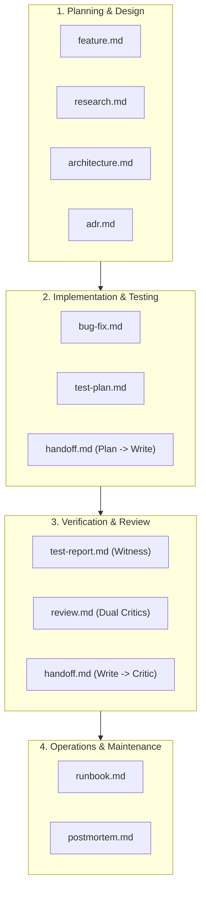

# KXM Documentation Templates & Workflow Integration Guide

This directory contains standardized Markdown documentation templates adapted for KXM multi-agent orchestration, the 5-layer memory architecture, and the workflow taxonomy defined in [`docs/workflow-guide.md`](../workflow-guide.md).

## Core Principles

1. **Markdown + YAML Frontmatter + Mermaid:** Standardized metadata for automated indexing by the Context Arbiter, paired with human-readable text and conservative Mermaid diagrams.

2. **Separation of Concerns:** Keep **what should happen** (Feature / Architecture / Test Plan), **what was decided** (ADR), and **what actually happened** (Test Report / Witness Receipt / Postmortem) distinct.

3. **Immutable Evidence Chains:** Every test or review report must reference an exact commit pin (`git rev-parse HEAD`), deterministic branch (`kxm/run-<id>-<description>`), and content-addressed artifact reference (`artifact:<path>@sha256:<digest>`).

4. **Context Arbiter Integration:** Frontmatter fields (`authority`, `confidence`, `summary`, `tags`) directly inform token budgeting and relevance pruning in `kxm.context-packet.v2`.

---

## Template Directory

| Template | File | Primary Workflow Stage | Key Outputs |

|---|---|---|---|
| **Feature Specification** | [`feature.md`](feature.md) | Stage 1: Requirements & Scope | Observable behavior, acceptance criteria table, user flow diagram. |

| **Research Brief** | [`research.md`](research.md) | Stage 1: Discovery & Spike | Falsifiable hypotheses, evidence register, option comparison matrix. |
| **Bug Investigation & Fix** | [`bug-fix.md`](bug-fix.md) | Stages 1–3: Repro, Fix, Verify | Repro before oracle, sequenceDiagram, exact test command, before/after evidence. |

| **Architecture Design** | [`architecture.md`](architecture.md) | Stage 1: Architecture & System Design | Trust boundaries, component ownership, runtime scenarios, failure modes. |
| **Architecture Decision Record (ADR)** | [`adr.md`](adr.md) | Ongoing: Technical Decisions | Decision drivers, considered options with pros/cons, consequences, revisit triggers. |

| **Test Plan** | [`test-plan.md`](test-plan.md) | Stage 2: Verification Design | Risk-to-coverage matrix, test cases, environment prerequisites, entry/exit criteria. |
| **Test Execution Report** | [`test-report.md`](test-report.md) | Stage 3: Witness Verification | Exact build/commit, execution timestamps, case outcomes, coverage diff. |

| **Dual-Critic Review Report** | [`review.md`](review.md) | Stage 4: Critic Quorum | Independent Fable (arch) and Astra/Sol (CLI) findings, severity, quorum verdict. |
| **Structured Handoff Manifest** | [`handoff.md`](handoff.md) | Inter-stage transitions | `kxm.handoff-manifest.v1` mapping, baseCommit, candidateTreeHash, deliverables. |

| **Operational Runbook** | [`runbook.md`](runbook.md) | Reliability & Ops | Diagnosis steps, safe mitigation commands, rollback triggers, escalation paths. |
| **Incident Postmortem** | [`postmortem.md`](postmortem.md) | Post-incident Retrospective | Timeline of events, root cause analysis, preventive action items. |

---

## Workflow Guide Integration Matrix

The 11 templates map directly across the 7 Areas and 22 Workflows in [`docs/workflow-guide.md`](../workflow-guide.md):

### Mapping by Area

1. **Software Engineering (`software-engineering`)**
   - `feature-delivery`: [`feature.md`](feature.md) $\rightarrow$ [`architecture.md`](architecture.md) $\rightarrow$ [`test-plan.md`](test-plan.md) $\rightarrow$ [`review.md`](review.md).
   - `bug-investigation`: [`bug-fix.md`](bug-fix.md) with mandatory reproduction test before oracle.
   - `refactoring-migration`: [`architecture.md`](architecture.md) + [`adr.md`](adr.md) + [`test-report.md`](test-report.md).

2. **Design & Experience (`design-experience`)**
   - `ui-ux-design-system`: [`feature.md`](feature.md) (user flows) + [`review.md`](review.md) (a11y audits).

3. **Data & Analytics (`data-analytics`)**
   - `data-pipeline-etl`: [`architecture.md`](architecture.md) (data flows, contracts) + [`runbook.md`](runbook.md).

4. **Research & Strategy (`research-strategy`)**
   - `technology-evaluation` / `market-research`: [`research.md`](research.md) with evidence registers and confidence bounds.

5. **Security & Reliability (`security-reliability`)**
   - `vulnerability-audit`: [`review.md`](review.md) (threat model) + [`bug-fix.md`](bug-fix.md).
   - `incident-response`: [`runbook.md`](runbook.md) (triage/mitigation) $\rightarrow$ [`postmortem.md`](postmortem.md) (blameless retrospective).
