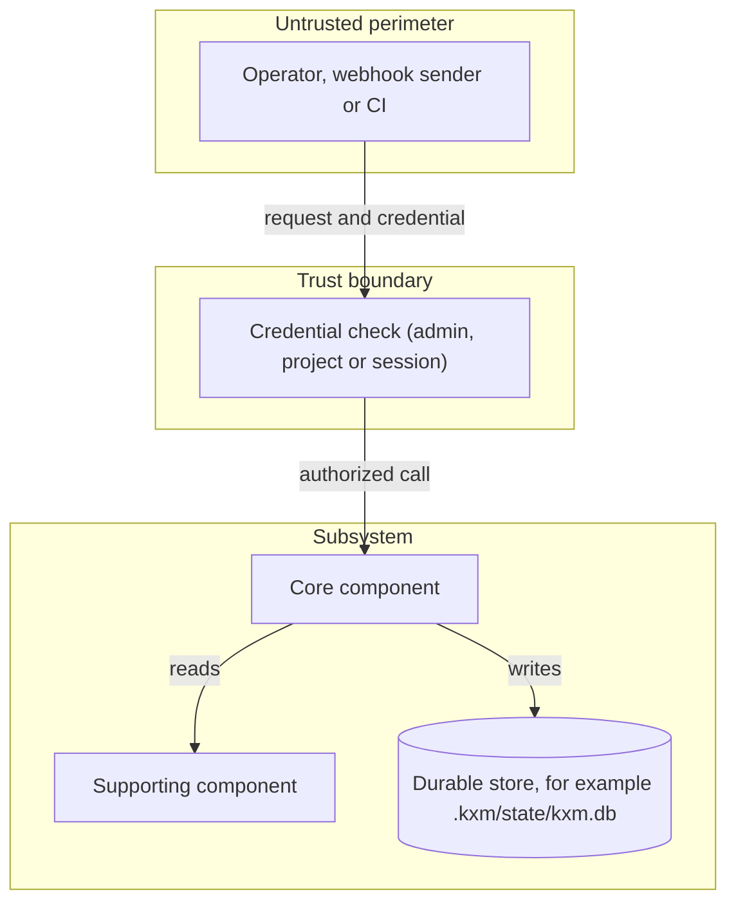

# Architecture: <system or subsystem name>

## Purpose and scope

- **Mission:** <What capability does this subsystem deliver?>
- **Callers:** <Who interacts with it: operators, agents, workers, external webhooks?>
- **State of this document:** <Current, proposed, or target architecture. Say which.>

## Goals, quality attributes and constraints

| Goal or constraint | Driver | Measure or hard boundary |
|---|---|---|
| Fail-closed security | Prevent privilege escalation | Missing or wrong credentials are refused; no loopback bypass |
| Deterministic replay | Forensic debugging and audit | Folding the event log reproduces the same state |
| <Latency or throughput goal> | <Operator responsiveness> | <For example, p50 dispatch under 200 ms> |

## Context and trust boundaries

External requests pass a credential check before they reach the subsystem, which
owns its durable state.

## Component responsibilities

| Component | Responsibility | Public interface | Owned state |
|---|---|---|---|
| <Runtime engine> | <Schedules steps, attempts and transitions> | <`KxmRunScheduler`> | <`events`, `runs`, `run_state` in the Runtime event store> |
| <Context arbiter> | <Assembles role-aware packets within a budget> | <`arbitrate()`> | <None; reads context items and Git memory> |
| <Hub store> | <Messages, workflow runs and leases> | <HTTP API> | <`messages`, `workflow_runs`, `leases` in `kxm.db`> |

## Runtime scenarios

### Happy path

1. <Step dispatch builds a context packet for the target role.>
2. <The worker runs on its own branch, for example `kxm/run-<run-id>-<description>`.>
3. <The worker returns a structured result with its witness evidence.>
4. <The engine records the transition and hands off to the critics.>

### Failure and rework

1. <How a failed attempt or a critic block is recorded.>
2. <Which transition, retry budget, or human action decides what runs next.>
3. <What stops the loop: a budget, a terminal status, or an operator.>

## Data contracts, storage and invariants

- **Source of truth:** <store and schema, for example SQLite through `node:sqlite`>
- **Durability settings:** <for example WAL, a 5-second busy timeout, `synchronous = NORMAL`>
- **Naming invariants:** <branch, ID, or path conventions the subsystem relies on>
- **Pinning:** <which revisions are pinned per run, and what is never read from a mutable `HEAD`>

## Security and isolation

- **Credentials:** <which credentials the subsystem accepts and what each may do>
- **Process isolation:** <how child processes are bounded: stdio frames, output caps, process groups>
- **Concurrency control:** <locks or leases that serialize shared mutations>
- **Not guaranteed:** <for example exactly-once external effects, or sandboxing>

## Architectural decisions

- `ADR-<nnnn>: <title>`: link each record in [`docs/adr/`](../adr/README.md).
