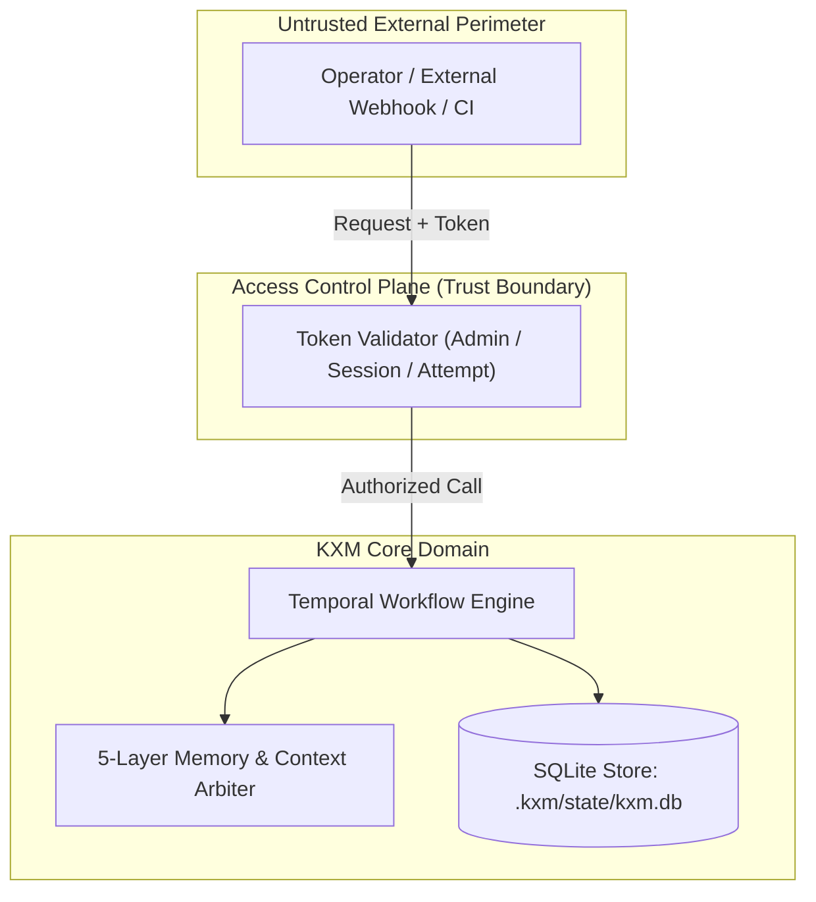

# Architecture: <System / Subsystem Name>

## Purpose & Scope

- **Core Mission:** <What capability does this subsystem deliver?>

- **Audience & Callers:** <Who interacts with this system (interactive operators, workers, external webhooks)?>

- **Architecture State:** <Explicitly state whether this document reflects current, proposed, or target architecture>

## Goals, Quality Attributes & Constraints

| Goal / Constraint | Business or Technical Driver | Measurement Metric / Hard Boundary |

|---|---|---|
| Fail-Closed Security | Prevent privilege escalation | Reject missing tokens; zero loopback bypasses |

| Deterministic Replay | Forensic debugging & auditability | Folded event stream produces identical state |
| Low Latency Dispatch | Operator responsiveness | Sub-200ms dispatch P50 |

## Context & Trust Boundaries

*Context flow: External requests enter through the Access Control Plane. Authorized calls interact with the Temporal Engine and Context Arbiter, backed by durable SQLite storage.*

## Component Responsibilities & Ownership

| Component | Responsibility | Public Interface / Contract | Owned State / Tables | Team / Role Owner |

|---|---|---|---|---|
| Workflow Engine | DAG scheduling & loop transitions | `VnextEngine.drive()` | `run_events`, `workflow_runs` | Engine Lead |

| Context Arbiter | Token budgeting & context compilation | `arbitrate()` | In-memory pool + Git memory | Memory Lead |
| External Effects Ledger | CAS leasing & idempotency | `ExternalEffectsLedger` | `external_effects` | Platform Lead |

## Runtime Execution Scenarios

### 1. Happy Path Dispatch & Settlement

1. Step dispatch compiles `FormalContextPacket` (`kxm.context-packet.v2`).

2. Worker executes in isolated branch `kxm/run-<id>-<description>`.

3. Worker submits `kxm.handoff-manifest.v1` with witness receipt.

4. Engine commits transition and notifies critics.

### 2. Failure & Rework Path

1. Critic issues structured rejection findings with blocker severity.

2. Engine transitions step to `rejected_rework_required`.

3. Attempts counter increments; router dispatches to next eligible writer.

## Data Contracts, Storage & Invariants

- **Source of Truth:** Local-first SQLite (`.kxm/state/kxm.db`) using native `DatabaseSync` (`node:sqlite`).

- **Journal Mode:** WAL mode with `busy_timeout = 5000ms` and `synchronous = NORMAL`.

- **Branch Naming Invariant:** `kxm/run-<cleanId>-<slug>` generated deterministically.

- **Commit Pinning:** Never fall back to mutable `HEAD`; strictly pin `reviewedCommit`.

## Security & Isolation

- **Token Model:** 3-tier model (AdminToken, SessionToken, AttemptToken).

- **Process Isolation:** Worker processes run as detached children with bounded stdio frames.

- **Git Worktree Lock:** Concurrent worktree mutations acquire `.git/kxm-worktree.lock`.

## Architectural Decisions (ADR Index)

- [`ADR-0001: SQLite Native node:sqlite Engine`](../decisions/ADR-0001.md)

- [`ADR-0002: Deterministic Run Branching`](../decisions/ADR-0002.md)
