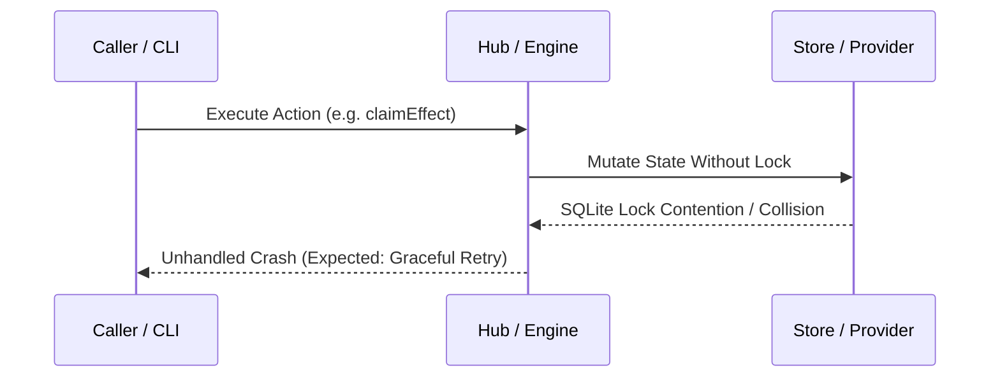

# Bug: <Observable Failure / Defect Summary>

## Impact & Affected Scope

- **User / Operator Impact:** <What fails, crashes, or produces incorrect outputs?>

- **Affected Commands / APIs:** <Specific CLI commands, endpoints, or workflows>

- **Workaround:** <Temporary safe mitigation if available>

## Expected vs. Actual Behavior

- **Expected:** <Precise, observable contract expectation>

- **Actual:** <Exact error message, stack trace, or wrong output>

## Environment & Baseline State

- **Baseline Commit:** `<git-sha-before-fix>`

- **Node / Runtime Version:** `Node 22.19.0 / Node 24.15.0`

- **Active Harness / Model:** `<Harness and model if relevant>`

- **OS:** `macOS / Linux`

## Mandatory Repro Before Fix (Oracle Invariant)

To prevent phantom fixes, a failing reproduction test MUST be established before modifying production code:

- **Failing Test File:** `test/core/<bug-name>.test.ts`

- **Reproduction Command:** `node --test test/core/<bug-name>.test.ts`

- **Baseline Observed Result:** `FAIL` (exit code 1)

- **Repro Failure Receipt:** `artifact:.kxm/assets/repro-fail.log@sha256:...`

## Failure Path Sequence

*Failure sequence: Unhandled contention leads to ungraceful crash instead of deterministic retry or clean fail-closed error.*

## Root Cause Analysis

- **Immediate Cause:** <What line or condition directly triggered the symptom?>

- **Systemic Cause:** <Why did earlier tests, linters, or reviews miss this bug?>

- **Rejected Hypotheses:** <What initial assumptions were investigated and ruled out?>

## Proposed Fix & Contract Changes

- **Code Changes:** 

- **Compatibility Impact:** <Does this break existing state or require a database migration?>

- **Security / Isolation:** <Does the fix maintain fail-closed invariants?>

## Verification Witness Matrix

| Verification Check | Target Commit / Tree | Expected Result | Actual Result | Witness Artifact |

|---|---|---|---|---|
| Repro Test (Before Fix) | `<baseline-commit>` | FAIL | FAIL | `artifact:...@sha256` |

| Repro Test (After Fix) | `<candidate-commit>` | PASS | PASS | `artifact:...@sha256` |
| Full Core Test Suite | `<candidate-commit>` | 100% PASS | 100% PASS | `npm run test:core` |

| Full Verify Gate | `<candidate-commit>` | PASS | PASS | `npm run verify` |

## Regression Prevention

- **Automated Gate Added:** <New unit test or lint check preventing recurrence>

- **Documentation Updated:** <Link to updated architecture or runbook doc>
