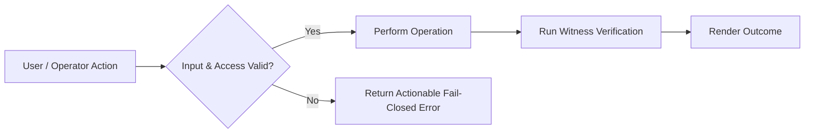

# Feature: <Feature name>

## Problem and users

- **Who needs this:** <Describe primary user persona or operator role>

- **Current Behavior:** <What happens today without this feature>

- **Evidence / Driver:** <User friction, issue link, or performance data demonstrating the need>

## Goals and non-goals

- **Goals:**
  - <Measurable outcome 1>
  - <Measurable outcome 2>

- **Non-Goals:**
  - <Explicitly excluded behavior or deferred capability>

## Requirements and acceptance criteria

| ID | Requirement | Acceptance Criterion (Given / When / Then) | Verification Kind |
|---|---|---|---|
| REQ-01 | <Observable behavior> | Given ..., when ..., then ... | gate / witness |
| REQ-02 | <Error or permission boundary> | Given invalid input, when submitted, then fail closed with ... | gate / witness |

## User and execution flow

*Flow description: The request is validated against permissions and schema before execution. Invalid calls fail closed with actionable errors.*

## Behavior and interface contracts

- **Inputs & CLI Flags:** <Specify syntax and types>

- **Outputs & Schema:** <JSON schema or return contract>

- **Error Modes:** <List specific error codes and exit status>

- **Concurrency & Idempotency:** <Timeout limits, lock keys, and duplicate dispatch protection>

## Quality and resource budgets

| Dimension | Target Budget | Measurement Condition | Verification Method |
|---|---|---|---|
| Latency P50 | < e.g., 200ms | Local CLI dispatch | Benchmark test |
| Token Budget | < e.g., 8,000 tokens | Context packet compilation | Context Arbiter log |
| Test Coverage | >= 91% lines, >= 80% branches, >= 92% functions | `npm run test:coverage` | Node test runner (`node:test`) |

## Dependencies and risks

| Dependency / Risk | Potential Impact | Mitigation Strategy | Owner |
|---|---|---|---|
| <Dependency> | <Failure mode> | <Fallback or isolation> | <Role> |

## Validation and verification gates

- **Unit / Core Suite:** `npm run test:core`

- **Lint & Docs Gate:** `npm run check`

- **Combined Commit Gate:** `npm run verify`

## Rollout and rollback

- **Rollout Strategy:** <Staged feature flag, CLI release, or workflow gate>

- **Rollback Triggers:** <Observed error spikes, broken witnesses, or test regressions>

- **Rollback Action:** <Git revert or toggle flag>

## Open questions

1. <Unresolved design question, assigned owner, and target decision milestone>
