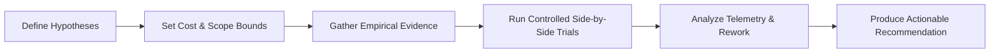

# Research: <Research topic / spike question>

## Decision to enable

- **Pending Decision:** <What exact architectural, model routing, or product decision depends on this investigation?>

- **Decision Owner:** <Who has authority to accept or reject the findings?>

- **Constraints & Guardrails:** <Budget limits, latency thresholds, security boundaries>

## Questions and falsifiable hypotheses

- **Primary Question:** <What are we trying to discover or prove?>

- **Hypothesis 1:** <Clear assertion that can be empirically verified or falsified>

- **Falsification Condition:** <What exact result or metric will prove this hypothesis wrong?>

## Methodology and verification setup

*Methodology flow: Establish bounds, execute reproducible trials, analyze telemetry metrics, and recommend concrete next actions.*

- **Harness & Model Arms:** <List evaluated routes, for example native `grok` versus `pi` with an OpenRouter model>

- **Test Fixture / Workload:** <Exact repository task or test suite executed>

- **Budget Ceiling:** <Maximum dollar or token limit for this spike>

## Evidence register

| Evidence ID | Claim / Finding | Source Artifact / Telemetry Run | Version / Date | Confidence |
|---|---|---|---|---|
| EV-01 | <Empirical claim> | `artifact:.kxm/logs/telemetry.jsonl@sha256:...` | 2026-09-08 | verified |
| EV-02 | <Model behavior observation> | `<run-id>` transcript | 2026-09-08 | probable |

## Option comparison matrix

| Evaluation Criterion (example values) | Weight | Option A (e.g., Native) | Option B (e.g., Wrapper) | Measured Evidence |
|---|---|---|---|---|
| Verification Pass Rate | High | 84.0% | 40.0% | EV-01 |
| Latency P50 | Medium | 187s | 284s | EV-01 |
| Cost per Successful Run | High | $0.20 | $1.03 | EV-01 |
| Rework Rate | High | 68% | 100% | EV-01 |

## Findings and distinctions

### Verified observations (backed by evidence IDs)

- <Direct observation referencing EV-xx>

### Inferences and working hypotheses

- <Reasoning or extrapolation; clearly separated from hard evidence>

### Unresolved unknowns

- <Gaps that remain uncertain or could not be measured>

## Recommendation and revisit conditions

- **Recommended Course of Action:** <Specific choice or architectural pattern>

- **Rationale:** <Direct connection between evidence and decision>

- **Revisit When:** <Trigger conditions, such as new vendor model release, 20% price drop, or quota exhaustion>
