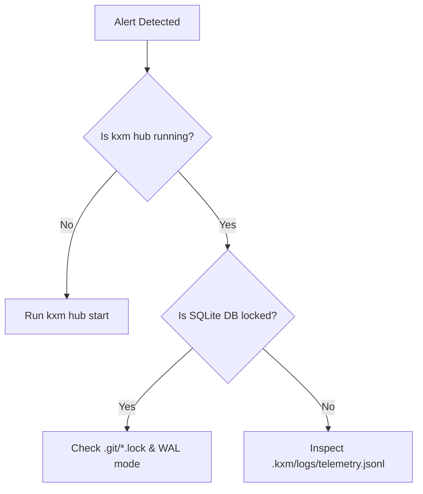

# Operational Runbook: <Incident / Procedure Name>

## Symptoms & Alerts

- **Alert / Observable Signal:** <Describe alert, log error code, or metric spike>

- **Impact:** <Worker starvation, stuck approval, or failed signal dispatch>

## Triage & Diagnostic Steps



*Triage decision tree: Verify hub daemon health, inspect database locks, and triage worker logs.*

1. **Verify Hub Daemon Status:**

   ```bash
   kxm hub view
   ```

2. **Inspect Active Worker Processes:**

   ```bash
   kxm procs --json
   ```

3. **Check SQLite Integrity:**

   ```bash
   sqlite3 .kxm/state/kxm.db "PRAGMA integrity_check;"
   ```

## Safe Mitigation Commands

| Issue | Remediation Command | Expected Outcome |
|---|---|---|
| Orphaned Worktree Lock | `rm -f .git/kxm-worktree.lock` | Restores concurrent worktree creation |
| Stale Dispatched Effect | `kxm routing unquarantine <routeId>` | Restores model route to roster |
| Stuck Active Run | `kxm workflow signal <runId> cancel` | Safely aborts and cleans up attempt token |

## Rollback & Escalation

- **Rollback Procedure:** <Exact command to restore previous database backup: `kxm restore <backup>`>

- **Escalation Path:** <Primary on-call or human operator contact>
