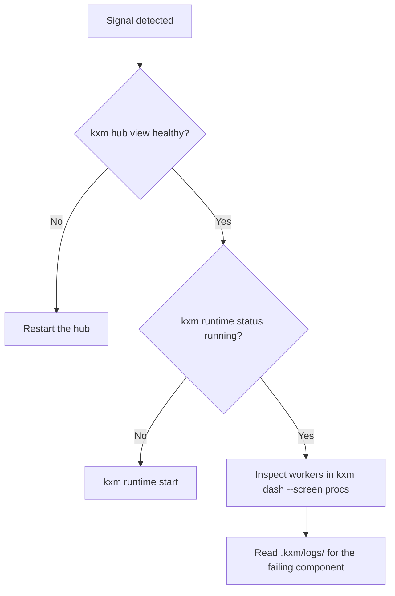

# Operational runbook: <incident or procedure name>

## Symptoms and alerts

- **Observable signal:** <alert, log event, error code, or metric>
- **Impact:** <stuck workflow run, idle worker, refused sync, or failed signal>

## Triage

Check the hub first, then the Runtime, then the workers.



1. Check hub health and readiness:

   ```bash
   kxm hub view
   ```

2. Check the Runtime supervisor:

   ```bash
   kxm runtime status
   ```

3. Inspect supervised worker processes:

   ```bash
   kxm dash --screen procs
   ```

4. Check SQLite integrity, read-only, after taking a backup:

   ```bash
   kxm backup --out <backup-dir>
   sqlite3 -readonly .kxm/state/kxm.db "PRAGMA integrity_check;"
   ```

## Safe mitigation commands

| Issue | Command | Expected outcome |
|---|---|---|
| Hub unhealthy or wedged | `kxm hub stop`, then `kxm hub start` | Hub restarts; queued messages are pushed again until acknowledged, and delivered messages are not replayed |
| Runtime run stuck | `kxm runs cancel <run-id>` | A durable cancellation request is recorded for the run |
| Model route misbehaving | `kxm routes disable --model <provider/model>` | The route moves to the disabled list in `.kxm/routes.yaml`; commit it |
| Sync rows refused by the hub | Fix the hub-side cause, then `kxm runtime sync-retry` | Refused outbox rows are queued again |
| Hub workflow waiting on a lost callback | `kxm gate signal <run-id> <signal-key> failed "<summary>"` | The wait settles with a `failed` result; needs the callback secret |

## Rollback and escalation

- **Rollback:** restore the last verified backup with
  `kxm restore <manifest>` while the hub is stopped.
- **Escalation:** <primary on-call or human operator contact>
