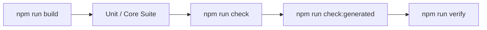

# Test Plan: <Feature / Refactor Name>

## Objective & Scope

- **Feature / Change Under Test:** <Link to FEAT-xx, BUG-xx, or ARCH-xx>

- **Included Behavior:** <Explicitly list capabilities tested>

- **Excluded Behavior:** <Explicitly list deferred or out-of-scope scenarios>

## Risks & Coverage Strategy

| Risk / Failure Mode | Test Tier | Rationale for Selected Coverage | Target File |

|---|---|---|---|
| Race condition on git index | Unit (Concurrency) | Immediate lock failure detection | `test/core/external-effects.test.ts` |

| Context packet token overflow | Unit (Arbiter) | Verifies token pruning order | `test/core/context-packet.test.ts` |
| Multi-agent peer deadlock | Simulation | Replays multi-turn timeout | `test/simulations/deadlock.test.ts` |

## Test Environment & Preconditions

- **Runtime:** Node 22.19.0 / Node 24.15.0

- **Database Fixture:** In-memory `:memory:` SQLite or isolated `.kxm/tmp/test.db`

- **Harness Preflight:** `kxm harness list` verifying mock or native CLI status

## Detailed Test Cases

| Case ID | Requirement | Precondition | Test Action | Expected Result |

|---|---|---|---|---|
| TC-01 | REQ-01 | Clean database | Call `claimEffect()` twice concurrently | One succeeds, one returns `ok: false, conflict: true` |

| TC-02 | REQ-02 | Valid lease | Call `commitEffect()` with effect key | Status transitions to `confirmed` |

## Test Execution Workflow

*Verification flow: Build runtime artifacts, run core tests, enforce types and linting, and verify generated dist files match staged index.*

## Execution Commands

| Suite | Command | Expected Output |

|---|---|---|
| Core Tests | `npm run test:core` | `tests >= 1008, fail 0` |

| Typecheck | `npm run typecheck` | Clean exit code 0 |
| Docs Lint | `npm run lint:docs` | `0 issues in 0 files` |

| Generated Dist | `npm run check:generated` | `generated artifacts are tracked and current` |

## Entry & Exit Criteria

- **Entry Criteria:** Clean git working tree; `npm run build` succeeds without warnings.

- **Exit Criteria:** All test cases pass with zero failures; coverage thresholds met (lines >= 92%, branches >= 80%).
