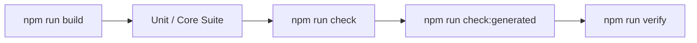

# Test plan: <Feature / refactor name>

## Objective and scope

- **Feature / Change Under Test:** <Link to FEAT-xx, BUG-xx, or ARCH-xx>

- **Included Behavior:** <Explicitly list capabilities tested>

- **Excluded Behavior:** <Explicitly list deferred or out-of-scope scenarios>

## Risks and coverage strategy

| Risk / Failure Mode | Test Tier | Rationale for Selected Coverage | Target File |
|---|---|---|---|
| Race condition on git index | Unit (Concurrency) | Immediate lock failure detection | `test/core/external-effects.test.ts` |
| Context packet token overflow | Unit (Arbiter) | Verifies token pruning order | `test/core/context-packet.test.ts` |
| Multi-agent peer deadlock | Simulation | Replays multi-turn timeout | `test/simulations/<scenario>.test.ts` |

## Test environment and preconditions

- **Runtime:** Node 22.19 or newer on the 22 line, and Node 24

- **Database Fixture:** In-memory `:memory:` SQLite, or a database under a `mkdtemp` directory

- **Harness Preflight:** `kxm harness list` verifying mock or native CLI status

## Detailed test cases

| Case ID | Requirement | Precondition | Test Action | Expected Result |
|---|---|---|---|---|
| TC-01 | REQ-01 | Clean database | Call `claimEffect()` twice for one effect key | The first claim succeeds; the second is refused |
| TC-02 | REQ-02 | Valid lease | Call `commitEffect()` with effect key | Status transitions to `confirmed` |

## Test execution workflow

*Verification flow: Build runtime artifacts, run core tests, enforce types and linting, and verify generated dist files match staged index.*

## Execution commands

| Suite | Command | Expected Output |
|---|---|---|
| Core Tests | `npm run test:core` | `# fail 0` |
| Typecheck | `npm run typecheck` | Clean exit code 0 |
| Docs Lint | `npm run lint:docs` | `Summary: 0 issues` |
| Generated Dist | `npm run check:generated` | `generated artifacts are tracked and current` |

## Entry and exit criteria

- **Entry Criteria:** Clean git working tree; `npm run build` succeeds without warnings.

- **Exit Criteria:** All test cases pass with zero failures; coverage floors met (91% lines, 80% branches, 92% functions for `npm run test:coverage`).
