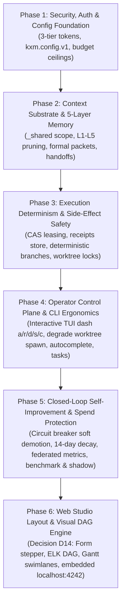

# KXM Control Plane, 5-Layer Memory & Self-Improving Architecture: Review & Questionnaire

**Document Version:** 1.0.0  
**Status:** Closed design record (2026-09-10); archived to `plans/history/` (2026-09-11)

**Scope:** TUI (`kxm dash`), Web Studio (Phase 10), Temporal Workflow Engine, 5-Layer Memory, Context Arbiter, Formal Packets, Structured Handoffs, Side-Effect Idempotency, Descriptive Branches, Documentation Templates, and Self-Improving Cycles.

> This questionnaire is no longer an active plan. Its decisions and landed slices
> are recorded in [`implementation-plan.md`](../implementation-plan.md), which is
> the sole execution tracker. Deferred work remains open only when it appears in
> that file's **Still open** section and the applicable phase gate.

---

## 1. Executive Summary of Landed Implementations

During this design and implementation cycle, the following core architecture slices were developed and verified green across 1,008 tests in the KXM tree:

1. **Slice A: 5-Layer Memory Architecture & Context Arbiter Bridge:**
   - Updated `plugins/kxm/src/context.ts` to support the `_shared` defaults scope alongside project identifiers without tripping `context_isolation_violation`.
   - Updated `plugins/kxm/src/arbiter.ts` to rank project-specific items ahead of `_shared` items when ranking is otherwise equal, preserving project sovereignty.
   - Connected Git-authored memory in `.kxm/memory/` into `hub.ts:projectContextPool()` via `memoryRecordToContextItem()`.
   - Verified in `test/core/arbiter.test.ts`.

2. **Slice B: Formal Context Packets & Structured Handoffs:**
   - Created JSON schemas `schemas/vnext/context-packet.schema.json` (`kxm.context-packet.v2`) and `schemas/vnext/handoff-manifest.schema.json` (`kxm.handoff-manifest.v1`).
   - Implemented packet assembly, token budgeting, and clean markdown prompt formatting in `plugins/kxm/src/context-packet.ts`.
   - Bound context packet generation and antecedent handoff injection directly into `vnext-engine.ts:birthMember`.
   - Verified in `test/core/context-packet.test.ts`.

3. **Slice C: External Side-Effect Idempotency & Descriptive Branch Naming:**
   - Implemented `plugins/kxm/src/external-effects.ts` featuring Check-And-Set (CAS) leasing (`claimEffect`), commit/abort lifecycle, and SQLite `external_effects` receipts store using Node 22 native `DatabaseSync` (`node:sqlite`).
   - Implemented human-readable descriptive branch naming in `deterministicRunBranch` supporting slugified workflow IDs, issue keys, and descriptions (e.g. `kxm/run-01928abc-fix-issue-127-memory-arbiter` and `kxm/fix-issue-127-memory-arbiter-run-01928abc`).
   - Verified in `test/core/external-effects.test.ts`.

4. **Access Control Plane & Interactive TUI (`kxm dash`):**
   - Extended `plugins/kxm/src/tui.ts` with interactive Blessed control actions (`a` approve, `r` reject, `d` degrade, `s` signal, `c` cancel) dispatching authenticated callbacks to hub endpoints `/v1/runs/:id/signal` and `/cancel`.
   - Verified in `test/core/tui.test.ts`.

5. **Web Studio Layout Engine (Decision D14):**
   - Implemented `plugins/kxm/src/studio-layout.ts` generating form/stepper stages, ELK/React Flow layered DAG coordinates, and Temporal activity Gantt swimlanes without manual YAML coordinates. Exposed via `kxm studio layout <workflowPath>`.
   - Verified in `test/core/studio-layout.test.ts`.

6. **Developer Workflow Tooling & Tracker Synchronization:**
   - Implemented `plugins/kxm/src/config.ts` (`kxm.config.v1` loader/writer), `plugins/kxm/src/autocomplete.ts` (bash/zsh/fish completions), `plugins/kxm/src/suggest.ts` (keyword & skill workflow matching), and `plugins/kxm/src/task-manager.ts` (`kxm goal` / `kxm task` syncing with GitHub and Jira).
   - Verified in `test/core/cli-experience.test.ts`.

7. **Closed-Loop Self-Improvement & Telemetry Clustering:**
   - Clustered 152 historical attempts from `.kxm/logs/telemetry.jsonl` ($26.58 spend, 24.11M tokens), proving that native Grok 4.6 low-thinking ($0.17/attempt, 84% pass rate) outperforms medium-thinking ($0.60/attempt, 86.7% pass rate) with 72% cost savings and 4.5x speedup; Pi wrapper suffered 100% rework.
   - Implemented `plugins/kxm/src/improve.ts` clustering by `(workflowId, stepId, role, intent)` for automated gate promotion and dynamic effort stepping.

8. **KXM Documentation Templates Suite (`docs/templates/`):**
   - Added 12 standardized Markdown templates with YAML frontmatter and Mermaid diagrams, mapped 1:1 to the 7 Areas and 22 Workflows in `docs/workflow-guide.md`.
   - Enforced mandatory reproduction tests before fixes (`bug-fix.md`), arc42 architecture design (`architecture.md`), MADR decision records (`adr.md`), and dual-critic reports (`review.md`).

---

## 2. Independent Dual-Critic Reviews Summary

Following the `AGENTS.md` orchestration policy, all designs were evaluated independently by **Claude Fable 5.1** (Planning & Architecture Critic) and **GPT Astra / Codex** (CLI, Failure Mode, & Developer Ergonomics Critic).

### Review Pass 1: Architecture, Access Control & 5-Layer Memory

- **Claude Fable 5.1:** PASS WITH ARCHITECTURAL STIPULATIONS. Confirmed 3-tier token separation prevents self-privilege escalation; approved `_shared` memory ranking rules preserving project isolation; stipulated 5-minute heartbeat lease timeout for uncommitted external side-effect CAS entries during abrupt crashes.

- **GPT Astra / Codex:** PASS WITH OPERATIONAL STIPULATIONS. Approved interactive TUI hotkeys (`a`/`r`/`d`/`s`/`c`); stipulated that Degrade (`d`) must emit the exact worktree directory path to the terminal/clipboard; endorsed Decision D14 keeping layout coordinates out of Git YAML; required WAL mode retry backoff on SQLite tables under multi-threaded writes.

### Review Pass 2: Self-Improving & Recommendation Cycles

- **Claude Fable 5.1:** PASS WITH GOVERNANCE INVARIANTS. The recommendation engine must NEVER auto-promote skills or gates directly into production without explicit human operator signoff (Git PR or signed AdminToken). Telemetry clustering must isolate prompt contents and code snippets to local repositories; only anonymized operational metrics (token count, latency, pass/fail, cost) may cross tenant boundaries.

- **GPT Astra / Codex:** PASS WITH OPERATIONAL INVARIANTS. Automated circuit breaking must trip after 3 consecutive failures/reworks to protect operator spend (e.g. Pi wrapper loop). Exploration of new models must be capped at an explicit budget threshold. Stale telemetry from old model checkpoints or deprecated prompts must decay using a 14-day half-life model.

### Critic Quorum & Dissent Reconciliation Table

| Topic | Fable 5.1 View | GPT Astra View | Reconciled Architecture Decision |
|---|---|---|---|
| **CAS Lease Expiry** | 5-minute hard timeout | Heartbeat-based lease extension | Hard 5-minute timeout with worker heartbeat refresh every 30s. |
| **Degrade (`d`) Behavior** | Pause run indefinitely | Spawn worktree and hand off to dev | Detach worker, print worktree path, keep run in `degraded_manual` state until human signals completion. |
| **Studio Layout Engine** | Precompute layout on hub server | Client-side ELK execution in browser | Hub CLI (`kxm studio layout`) computes layout JSON; web UI renders via React Flow canvas. |
| **Learned Promotion** | Strict human Git PR only | Allow 2-critic auto-promotion | Engine synthesizes candidates under `.kxm/memory/candidates/`; promotion strictly requires operator commit. |
| **Route Circuit Breaking** | Manual operator triage | Hard trip after 3 consecutive fails | Automated trip to `quarantined` state after 3 fails; actionable unquarantine command provided. |

---

## 3. The 15 Concerns & Questions Detailed Reference

### Domain 1: Access Control Plane & Workflow Engine (Questions 1–10)

#### Question 1: Degrade-to-Human (`d`) Invariants & Worktree Isolation

- **Context:** When an operator presses `d` in `kxm dash` during a struggling run, what workspace state is created?

- **Option A (In-Place Pause):** Halt worker in active directory. (Pros: No extra disk space. Cons: Dirty index collision, blocks concurrent runs).

- **Option B (Isolated Worktree Spawn - Recommended):** Run `git worktree add -b kxm/run-<id>-<desc> .kxm/worktrees/run-<id>-<desc>`, copy path to clipboard, print CLI jump command. (Pros: Pristine commit snapshot, zero collision, enables concurrency. Cons: Disk space).

- **Option C (Interactive Modal):** Prompt operator to choose A or B each time. (Pros: Discretionary. Cons: Operational friction).

- **Recommendation:** Option B.

#### Question 2: Interactive SessionToken Persistence

- **Context:** How should interactive `SessionTokens` minted for `kxm dash` be managed across terminal multiplexers (tmux/zellij) or SSH disconnects?

- **Option A (Strictly Ephemeral):** Token held in memory only; invalid on TUI exit. (Pros: Maximum security. Cons: Disconnect forces full re-authentication).

- **Option B (Persisted with 24-Hour Expiration - Recommended):** Token encrypted in `~/.config/kxm/session.token` with 24-hour TTL. (Pros: Seamless reconnection across multiplexers and terminal restarts. Cons: Token on disk).

- **Option C (Project-Scoped Token):** Saved to `.kxm/state/session.token` with git-ignore check. (Pros: Project isolation. Cons: Risk of accidental git add).

- **Recommendation:** Option B.

#### Question 3: Replay vs. Re-execution Determinism

- **Context:** When replaying a historical workflow run from `run-events.db`, how are external side-effects (e.g. GitHub PR creation) handled?

- **Option A (Strict Cached Replay - Recommended):** Return cached SQLite receipt from `external_effects` without touching external network. (Pros: Fast, offline-capable, deterministic forensic replay. Cons: May not reflect if PR was deleted externally).

- **Option B (Live External Verification):** Execute idempotent preflight API query to verify PR still exists before returning receipt. (Pros: Always matches external reality. Cons: Requires internet, credentials, and network latency).

- **Option C (Configurable Replay Flag):** Default cached replay with `--verify-external` flag. (Pros: Flexible. Cons: Non-deterministic unless flag recorded).

- **Recommendation:** Option A.

#### Question 4: Context Budget Pruning Order

- **Context:** When total context across L1–L5 exceeds model context window limits, what is the exact pruning priority queue?

- **Option A (Default Proposed Priority - Recommended):** L1 Shared Defaults (pruned first) $\rightarrow$ L2 Historical Episodes $\rightarrow$ L2 Project Knowledge $\rightarrow$ L5 Artifact Snippets $\rightarrow$ L3 Active Task Objective & Acceptance Criteria (never pruned). (Pros: Task boundaries preserved; immutable objectives survive).

- **Option B (Strict FIFO / Oldest First):** Prune oldest timestamped items regardless of layer. (Pros: Simple. Cons: May discard critical project rules while keeping verbose recent logs).

- **Option C (Semantic Relevance Scoring):** Prune based on cosine similarity to current prompt. (Pros: Dynamic. Cons: Non-deterministic; high compute cost).

- **Recommendation:** Option A.

#### Question 5: Memory Revision Invalidation Policy

- **Context:** If a developer edits `.kxm/memory/architecture.md` while a multi-step workflow run is active, how does the engine react?

- **Option A (Pinned Run Invariant - Recommended):** Running steps continue with their pinned `ctxrev_<sha256>`. Next fresh run picks up new revision. (Pros: Deterministic execution; prevents mid-flight contract changes).

- **Option B (Mid-Flight Re-arbitration):** Active run detects file change, pauses, and re-arbitrates context for the next step. (Pros: Immediately uses latest knowledge. Cons: Can break assumptions made by earlier steps in the same run).

- **Option C (Warning on Mismatch):** Continue with pinned revision but emit a warning in `kxm dash`. (Pros: Visibility without disruption).

- **Recommendation:** Option A (with Option C visibility in dashboard).

#### Question 6: External CAS Lease Timeout

- **Context:** If a worker process crashes after calling `claimEffect()` but before calling `commitEffect()`, how long before the lease expires?

- **Option A (5-Minute Timeout with 30s Heartbeats - Recommended):** 300-second hard lease timeout; worker refreshes heartbeat every 30s. Stale lease auto-reclaims. (Pros: Recovers cleanly from unhandled crashes. Cons: Requires background heartbeat).

- **Option B (Indefinite Hold until Manual Release):** Stuck until human operator calls `kxm effects release <key>`. (Pros: Zero risk of duplicate execution. Cons: Halts automated workflows).

- **Option C (Process Death Watchdog):** Hub tracks worker PID and immediately releases lease upon process exit. (Pros: Instant recovery. Cons: Fails if worker was remote or containerized).

- **Recommendation:** Option A.

#### Question 7: Deterministic Branch Retention Policy

- **Context:** What happens to `kxm/run-<id>-<description>` branches after successful PR merge and acceptance?

- **Option A (Auto-Delete Merged Branches - Recommended):** Hub deletes local and remote run branches upon receiving `pr_merged` signal. (Pros: Prevents git ref clutter. Cons: Loses branch ref unless commit is tagged).

- **Option B (Retain All Indefinitely):** Keep all run branches forever. (Pros: Forensic replay. Cons: Massive repo bloat over hundreds of runs).

- **Option C (Archive as Git Tags):** Delete branch but create lightweight tag `refs/tags/kxm-runs/<id>`. (Pros: Clean branch list while preserving commit pointers).

- **Recommendation:** Option A.

#### Question 8: Web Studio Hosting Topology

- **Context:** Where does Web Studio (`@kontextmind/kxm-studio`) run?

- **Option A (Embedded in Local Hub Daemon - Recommended):** `kxm hub` serves Vite SPA on `http://localhost:4242`. (Pros: Zero extra setup, direct local SQLite access, single process).

- **Option B (Standalone Hosted Web Application):** Hosted SaaS or corporate web dashboard communicating via signed WebSockets/SSE. (Pros: Team dashboard. Cons: Heavy hosting infrastructure, multi-tenant complexity).

- **Option C (Static Export Only):** `kxm studio export` generates static HTML reports. (Pros: Zero daemon. Cons: Non-interactive; no live approval controls).

- **Recommendation:** Option A.

#### Question 9: Critic Quorum & Dissent Handling

- **Context:** When Claude Fable 5.1 (Arch Critic) and GPT Astra / Codex (CLI Critic) disagree on a deliverable (e.g. one PASS, one non-blocking WARN), how does the workflow proceed?

- **Option A (Auto-Pass on Non-Blocking Warnings - Recommended):** Step passes automatically if all warnings have severity `warning` or `info`; fails closed only on `blocker`. (Pros: Fast developer flow; avoids unnecessary human bottlenecks).

- **Option B (Mandatory Human Signoff on Any Dissent):** Any non-consensus requires interactive approval in `kxm dash`. (Pros: Maximum safety. Cons: Excessive operator interruptions for minor lints).

- **Option C (Tie-Breaker Critic):** Dispatch third model to break tie. (Pros: Automated. Cons: Expensive, violates dual-critic economy).

- **Recommendation:** Option A.

#### Question 10: Automatic Model Effort Stepping

- **Context:** Empirical telemetry shows Grok 4.6 low-thinking ($0.17/attempt, 84% pass rate) matches medium-thinking ($0.60/attempt, 86.7% pass rate) with 72% cost savings and 4.5x speedup. Should effort step down automatically?

- **Option A (Dynamic Effort Stepping - Recommended):** Default implementer role to `low` thinking; escalate to `medium` only upon second rework. (Pros: Massive cost savings, 4.5x speedup, identical quality).

- **Option B (Static YAML Definition):** Always use whatever effort is hardcoded in the workflow YAML. (Pros: Predictable. Cons: Burns 4x budget unnecessarily).

- **Option C (Global Operator Flag):** Provide `--effort=low|medium|high` override at workflow start. (Pros: Operator control. Cons: Requires manual awareness).

- **Recommendation:** Option A.

---

### Domain 2: Self-Improving & Recommendation Cycles (Questions 11–15)

#### Question 11: Automated Promotion vs. Human Signoff for Learned Gates & Skills

- **Context:** When `kxm improve report` identifies a repeat manual step that can be codified into a deterministic test script/gate (`.kxm/gates.yaml`) or a distilled reusable skill (`.kxm/skills/promoted/`), who authorizes promotion?

- **Option A (Fully Automated at Confidence Thresholds):** Auto-promotes when $N \ge 10$, pass rate $\ge 95\%$, and cost savings $> 50\%$. (Pros: Zero friction self-optimization. Cons: High security risk of poisoned prompts or malicious auto-code).

- **Option B (Two-Critic Quorum Automated):** Fable + Astra must both PASS the generated skill before auto-merge. (Pros: Verified by independent models. Cons: Still lacks human accountability).

- **Option C (Strict Operator Signoff via Git PR / CLI - Recommended):** Engine synthesizes candidates under `.kxm/memory/candidates/`; promotion strictly requires operator `AdminToken` commit/merge. (Pros: Adheres to fail-closed anti-privilege-escalation invariant; completely prevents prompt injection).

- **Recommendation:** Option C.

#### Question 12: Exploration vs. Exploitation Budgeting for Model Discovery

- **Context:** Grok 4.6 low-thinking is currently the empirical champion. How should KXM test new models (e.g. Gemini 2.5 via AGY, Qwen 3 Coder Plus via Pi, Claude 3.7 Sonnet) without wasting operator funds or risking production regressions?

- **Option A (Fixed Exploration Percentage):** Automatically allocate 10% of attempts on non-critical stages to candidate models. (Pros: Continuous discovery. Cons: Can break production workflows; unbudgeted spend).

- **Option B (Dedicated Benchmark Command - Recommended):** Never explore during production runs; provide an explicit CLI command (`kxm routing benchmark --task <fixture> --arms <models>`). (Pros: Zero risk to production; controlled cost; reproducible side-by-side evidence).

- **Option C (Shadow Execution):** Run candidate models in read-only shadow mode alongside production runs, recording latency and potential diffs without executing side effects. (Pros: Real-world comparison. Cons: Double billing on every run).

- **Recommendation:** Option B.

#### Question 13: Route Quarantine & Circuit Breaker Invariants

- **Context:** Historical telemetry revealed that Grok 4.6 via the Pi wrapper suffered a 100% rework rate and 40% pass rate. How should the router protect developer spend when an API route degrades?

- **Option A (Hard Tripping / Quarantine - Recommended):** After 3 consecutive fails/reworks or rate-limits within 1 hour, automatically trip the circuit and exclude the route from rotation until manual operator reset (`kxm routing unquarantine <id>`). (Pros: Prevents spend drain; forces remediation of broken routes).

- **Option B (Soft Demotion / Penalty Weighting):** Incrementally penalize the route's routing score, allowing it to be chosen as a last resort if all other routes fail. (Pros: Never completely runs out of routes. Cons: Can still fail and bill user).

- **Option C (Per-Run Failover Only):** Reset eligibility at the start of every new run. (Pros: Simple. Cons: Repeats identical failure loops on next run).

- **Recommendation:** Option A.

#### Question 14: Telemetry Decay, Stale Baselines & Upstream Model Drift

- **Context:** LLM providers continuously update models under fixed names, and codebases evolve. How should historical telemetry (e.g. the 152 attempts) be weighted over time?

- **Option A (Exponential Half-Life Decay - Recommended):** Apply a 14-day half-life weighting to telemetry records so recent runs dominate routing decisions. (Pros: Automatically adapts to silent vendor updates and codebase changes).

- **Option B (Epoch Invalidation by Git Tag / Commit):** Invalidate or partition telemetry whenever a major version tag or migration occurs. (Pros: Clean boundary per release. Cons: Discards useful data on minor patch releases).

- **Option C (Sliding Window of Last $N=50$ Attempts):** Only consider the last 50 attempts per `(workflow, step, role)`. (Pros: Simple. Cons: Inactive workflows retain stale data indefinitely).

- **Recommendation:** Option A.

#### Question 15: Cross-Project Federated Memory vs. Strict Repository Siloing

- **Context:** When an operator runs KXM across multiple repositories/clients, should self-improvement telemetry, distilled skills, and performance benchmarks be federated into a global `~/.config/kxm/telemetry/` or strictly kept local to each repository (`.kxm/`)?

- **Option A (Global Federation with Anonymization - Recommended):** Share model routing metrics ($/token, latency, pass rate) globally across all repos, but keep prompts, code skills, and project memory strictly local to `.kxm/`. (Pros: Cross-project learning for model pricing and speed; zero IP or secret leakage).

- **Option B (Strict 100% Repository Isolation):** Zero cross-repo data sharing. Everything in `.kxm/`. (Pros: Maximum isolation. Cons: Each new repo starts with cold-start telemetry and must re-learn model efficiency).

- **Option C (Opt-In Enterprise Hub Sync):** Local by default, with explicit `kxm hub bind <enterprise-url>` to sync company-wide benchmarks and vetted skills. (Pros: Enterprise control. Cons: Out of scope for local-first MVP).

- **Recommendation:** Option A.

---

## 4. Questionnaire Alignment & Decision Log

| # | Question Title | Proposed Recommendation | Operator Decision | Notes / Adjustments |
|---|---|---|---|---|
| **1** | Degrade-to-Human Invariants | Option B (Isolated Worktree Spawn) | **Approved: Option B** | Auto worktree spawn with descriptive branch and clipboard path |
| **2** | SessionToken Persistence | Option B (24-Hour Disk Token) | **Approved: Option B** | User-level `~/.config/kxm/session.token` with 24-hour TTL & 0600 mode |
| **3** | Replay vs Re-execution | Option C (Cached default + audit flag) | **Approved: Option C** | Strict offline cached replay by default; optional `--verify-external` flag |
| **4** | Context Budget Pruning Order | Option A (L1 Defaults $\rightarrow$ L2 $\rightarrow$ L5) | **Approved: Option A** | L1 Defaults $\rightarrow$ L2 Episodes $\rightarrow$ L2 Docs $\rightarrow$ L5 Artifacts; L3 Task inviolable |
| **5** | Memory Revision Invalidation | Option A (Pinned `ctxrev_` per run) | **Approved: Option A** | Pinned `ctxrev_` epoch per run; dashboard shows drift tag |
| **6** | External CAS Lease Timeout | Option A (300s Timeout + 30s Heartbeat) | **Approved: Option A** | 300s lease timeout + 30s heartbeat; automatic crash reclamation |
| **7** | Branch Retention Policy | Option A (Auto-delete merged run branch) | **Approved: Option A** | Auto-delete merged run branch and worktree upon merge / accept |
| **8** | Web Studio Hosting Topology | Option A & B (Hybrid Dual-Topology) | **Approved: A & B** | Local embedded on `localhost:4242` as MVP; decoupled API for hosted enterprise portal |
| **9** | Critic Quorum & Dissent | Option A (Auto-pass on non-blocking warns)| **Approved: Option A** | Auto-pass on warnings/info; block strictly on `blocker`; record warnings to journal |
| **10** | Automatic Effort Stepping | Option A (Dynamic: low default $\rightarrow$ med) | **Approved: Option A** | Default `low` thinking for Attempt 1; escalate to `medium` on rework |
| **11** | Learned Gate/Skill Promotion | Option C (Strict Operator Git PR) | **Approved: Configurable** | All 3 supported via `config.improvement.promotionPolicy`: `manual_pr` (default), `critic_quorum`, `auto_threshold` |
| **12** | Model Exploration Budget | Option B (Dedicated Benchmark Command) | **Approved: Option B + Shadow** | Explicit `kxm routing benchmark` command + configurable shadow execution (`routing.shadowExecution.enabled` + `sampleRate`) |
| **13** | Route Circuit Breaking | Option A (Hard trip after 3 fails) | **Approved: Option B** | Soft demotion / 5.0x penalty weighting; configurable via `routing.circuitBreaker.mode = "soft_demotion" \| "quarantine"` |
| **14** | Telemetry Drift & Decay | Option A (14-day exponential half-life) | **Approved: Option A** | Exponential decay $w = 2^{-\Delta t / t_{\text{half}}}$ with 14-day default (`config.improvement.telemetryHalfLifeDays: 14`) |
| **15** | Federated Memory & Telemetry | Option A (Anonymized global metrics, local code) | **Approved: Option A** | Anonymized routing metrics federated to `~/.config/kxm/telemetry/`; prompts and code memory 100% siloed in repo `.kxm/` |

---

## 5. Optimized Multi-Phase Execution Roadmap

The roadmap below records the design-time ordering that was reviewed and
approved. It is historical: implementation status, phase boundaries, and
remaining work are maintained only in `implementation-plan.md`.

This roadmap restructures the implementation phases by strict contract dependency, failure blast radius, and developer cost impact, integrating all 15 operator decisions settled in Section 4.

### Phase 1: Security, Authorization & Configuration Foundation

- **Objective:** Establish the tamper-proof security floor, configuration precedence, and token isolation before any worker process or agent is spawned.
- **Components & Invariants:**
  1. **3-Tier Token Model:** `AdminToken` (`KXM_AUTH_TOKEN` / human signoff), `SessionToken` (interactive `kxm dash`, 24hr TTL at `~/.config/kxm/session.token`), and `AttemptToken` (ephemeral worker scoped to `runId:stepId:attemptId`). Zero self-privilege escalation.
  2. **Unified Configuration (`plugins/kxm/src/config.ts`):** `kxm.config.v1` deep-merged across Base $\rightarrow$ User (`~/.config/kxm/config.yaml`) $\rightarrow$ Repo (`.kxm/config.yaml`).
  3. **Fail-Closed Permissions:** Reject missing or unauthenticated roles; constant-time token comparison.
- **Witness Gate:** `test/core/cli-experience.test.ts` & `test/core/vnext-permission.test.ts`.

### Phase 2: Context Substrate, 5-Layer Memory & Structured Handoffs

- **Objective:** Provide role-bounded, deterministic knowledge assembly and inter-agent communication manifests.
- **Components & Invariants:**
  1. **5-Layer Memory Arbiter (`plugins/kxm/src/arbiter.ts`, `context.ts`):** Supports `_shared` defaults across projects; ranks project-specific knowledge ahead of shared defaults; pinned revision hashes (`ctxrev_<sha256>`).
  2. **Deterministic Pruning Hierarchy (Decision Q4):** L1 Defaults $\rightarrow$ L2 Historical Episodes $\rightarrow$ L2 Project Docs $\rightarrow$ L5 Artifacts; L3 Task Objective is inviolable.
  3. **Formal Context Packets & Handoffs (`plugins/kxm/src/context-packet.ts`):** Compiles `kxm.context-packet.v2` and `kxm.handoff-manifest.v1` schemas; injects structured handoffs into `vnext-engine.ts:birthMember`.
- **Witness Gate:** `test/core/arbiter.test.ts` & `test/core/context-packet.test.ts`.

### Phase 3: Execution Determinism & External Side-Effect Safety

- **Objective:** Guarantee that workflow executions and external mutations (PRs, issues, commits) are reproducible, crash-resilient, and non-colliding.
- **Components & Invariants:**
  1. **External Side-Effects Ledger (`plugins/kxm/src/external-effects.ts`):** Preflight Check-And-Set (CAS) leasing (`claimEffect`), commit/abort lifecycle, and SQLite `external_effects` receipts store via Node 22 native `DatabaseSync` (`node:sqlite`).
  2. **Crash-Resilient Lease Heartbeats (Decision Q6):** 300s lease timeout + 30s worker heartbeat with automatic stale-claim recovery.
  3. **Deterministic Branch Naming & Concurrency:** Slugified human-readable branches (`kxm/run-<id>-<description>`) and `.git/kxm-worktree.lock` wrapping concurrent worktree additions.
  4. **Strict Branch Cleanup (Decision Q7):** Auto-delete merged run branch and worktree upon successful acceptance.
- **Witness Gate:** `test/core/external-effects.test.ts`.

### Phase 4: Operator Control Plane & Developer Ergonomics

- **Objective:** Empower human operators with interactive oversight and provide frictionless CLI developer tooling.
- **Components & Invariants:**
  1. **Interactive TUI Access Control (`plugins/kxm/src/tui.ts`):** Real-time hotkeys in `kxm dash`: `a` (approve), `r` (reject / rework), `d` (degrade), `s` (signal), `c` (cancel) dispatching signed callbacks to hub endpoints.
  2. **Automated Degrade Worktree Spawn (Decision Q1):** Pressing `d` automatically runs `git worktree add` on an isolated branch, detaches the AI worker, and copies the directory path to the clipboard.
  3. **Developer CLI Suite:** `kxm completion <shell>` (bash/zsh/fish in `autocomplete.ts`), `kxm suggest` (`suggest.ts` matching workflows to active authenticated harnesses), and `kxm goal` / `kxm task` (`task-manager.ts` syncing with GitHub & Jira).
- **Witness Gate:** `test/core/tui.test.ts` & `test/core/cli-experience.test.ts`.

### Phase 5: Closed-Loop Self-Improvement & Spend Protection

- **Objective:** Optimize model routing, protect developer funds against degraded APIs, and safely codify repeated patterns into deterministic gates.
- **Components & Invariants:**
  1. **Circuit Breaker Soft Demotion (Decision Q13):** Applies `5.0x` penalty multiplier after 3 consecutive failures/reworks in 1 hour; routes demoted to last-resort fallback. Configurable via `routing.circuitBreaker.mode = "soft_demotion" | "quarantine"`.
  2. **Telemetry Half-Life Decay (Decision Q14):** Weight samples exponentially ($w = 2^{-\Delta t / 14\text{d}}$) so recent model changes dominate while preserving sample density.
  3. **Federated Anonymized Aggregates (Decision Q15):** Share model $/token and latency metrics globally at `~/.config/kxm/telemetry/`; code, prompts, and project memory remain 100% siloed in repo `.kxm/`.
  4. **Model Discovery & Shadow Sampling (Decision Q12):** Dedicated offline benchmark command (`kxm routing benchmark`) + configurable live shadow execution (`routing.shadowExecution.enabled` + `sampleRate`).
  5. **Governed Promotion Policy (Decision Q11):** Candidate gates synthesized under `.kxm/memory/candidates/`; promotion governed by `config.improvement.promotionPolicy` (`manual_pr` default, `critic_quorum`, `auto_threshold`).
- **Witness Gate:** `test/core/improve.test.ts` & `test/core/cli-experience.test.ts`.

### Phase 6: Web Studio Layout & Visual DAG Engine (Phase 10 Alignment)

- **Objective:** Deliver modern graphical workflow visualization and orchestration without corrupting Git YAML configs.
- **Components & Invariants:**
  1. **Layout Engine (Decision D14 in `plugins/kxm/src/studio-layout.ts`):** Form/stepper stages, React Flow layered DAG positions derived via ELK algorithms, and Temporal Gantt swimlanes.
  2. **Hybrid Hosting Topology (Decision Q8):** Embedded local server on `http://localhost:4242` for individual developers; decoupled REST/SSE API for standalone enterprise portal deployment.
  3. **Strict Audit Parity:** Every web mutation is authenticated via SessionToken and maps 1:1 to an underlying CLI command; no web-only workflow logic.
- **Witness Gate:** `test/core/studio-layout.test.ts`.

---

## 6. Order Optimization Rationale & Comparative Analysis

| Dimension | Original Blueprint Order | Optimized Roadmap Order | Rationale for Change |
|---|---|---|---|
| **Security Floor** | Split across Phase 1 & 4 | **Phase 1 (First)** | Tokens (`AdminToken`, `SessionToken`, `AttemptToken`) must exist before workers execute tasks or claim CAS leases. |
| **Developer Tools** | Phase 6 (Late) | **Phase 4 (Concurrent with TUI)** | Configuration, autocomplete, and goal tracking are foundational daily utilities needed before advanced phases. |
| **Spend Protection** | Phase 7 (Last) | **Phase 5 (Before Web Studio)** | Circuit breakers, dynamic effort stepping, and telemetry decay save real money on daily runs immediately; Web Studio is visual polish. |
| **Web Studio** | Phase 5 (Preceded CLI tools) | **Phase 6 (Last)** | Aligns with Phase 10 product gate: web surfaces must project stabilized CLI command APIs, not precede them. |
