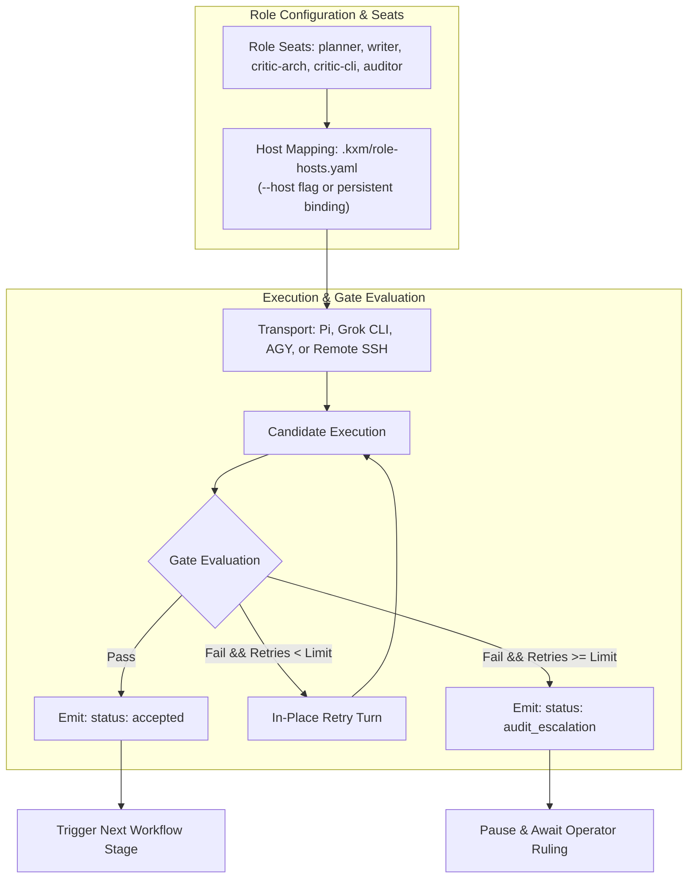

# Plan: Role Configuration, Host Decoupling, and Typed Governance

Task Reference: [`task_d3e634858295`](../../.kxm/tasks/task_d3e634858295.yaml)  
Status: Archived 2026-09-12 (Eddie); #192 implemented role hosts,
TerminalReceipt, autoResumeLimit / audit escalation, `kxm role resume` /
`kxm role hosts`. Task remains `in_progress`; no committed
`.kxm/role-hosts.yaml` on main.  
Tracking: [`plans/implementation-plan.md`](../implementation-plan.md)

**Related plans:** [`implementation-plan.md`](../implementation-plan.md) (execution tracker);
[`plan-agent-communication-steering.md`](../plan-agent-communication-steering.md)
(supervisory control);
[`plan-workflow-modes-selective-loading.md`](../plan-workflow-modes-selective-loading.md)
(tool / context scoping);
[`plan-ssh-remote-execution.md`](../plan-ssh-remote-execution.md)
(`--host` / remote workers).

## 1. Objective

Establish an institutional role governance layer in KXM inspired by `ak-pi-workflow-roles`: decouple role seats from runtime execution hosts (`--host`), replace conversational markdown parsing with strictly typed machine-readable receipts, and introduce bounded in-place retries (`autoResumeLimit`) with clean escalation checkpoints.

---

## 2. Background and Architectural Gap

In KXM today:

- Roles are declared primarily as static agent configurations in `AGENTS.md` (rotation: writer `grok`, planner/architecture critic `fable`, CLI critic `sol`).
- Role execution is bound tightly to specific CLI commands or runner scripts (`scripts/harness-run.mjs` and `just assign|witness|accept`).
- **The Gap:**
  1. **Coupled Transport:** Changing a role's execution backend (e.g. running a review on a remote worker or alternate model) requires changing invocation scripts or modifying low-level harness files.
  2. **Prose Parsing:** Stage completion and quality validation frequently rely on checking markdown formatting, conversational affirmations, or unvalidated text output from the LLM.
  3. **Unbounded Repair Loops:** When an agent produces a non-conforming result, automated repair scripts can spin in unbounded cycles without a deterministically enforced retry ceiling.

---

## 3. Reference Architecture: `ak-pi-workflow-roles` (<https://github.com/kontextmind/ak-pi-workflow-roles>)

`ak-pi-workflow-roles` provides a proven governance pattern for AI coding workflows:

- **Gated Institutional Roles:** 7+ distinct roles (`judge`, `countersign`, `gleaner-left`, `coder`, `reviewer`, `doctor`, `merger`, `notary`, `inspector`) with explicit validation mandates.
- **The Host Axis (`--host`):**
  - Completely separates the **seat** (institutional role, prompts, gate criteria) from the **host** (execution transport: `pi`, `grok-build`, `hermes`, etc.).
  - Configurable machine-wide or per-project via `role-hosts.json` (`ak-role config set-host <seat> <host>`).
  - Callers run the exact same role command regardless of whether the agent executes locally in Pi, in a headless Grok CLI, or on an SSH node.
- **Typed Terminal Receipts:**
  - Every run emits a typed JSON receipt on stdout (`Terminal` record: `accepted`, `audit_escalation`, `no_receipt`, `error`).
  - Callers compose workflows by inspecting typed fields rather than parsing chat prose.
- **Bounded Auto-Resume (`autoResumeLimit`):**
  - Non-lawful or malformed turns retry in-place up to `autoResumeLimit` (default 2). Once exhausted, execution pauses and emits an `audit_escalation` receipt for human or supervisor resolution (`ak-role resume <runId> "<ruling>"`).

---

## 4. Proposed Changes in KXM



### 1. Decoupled Role Seats & Configuration (`plugins/kxm/src/role.ts`)

Define formal role seats with explicit tool, permission, and validation requirements:

```typescript
export interface RoleSeatDefinition {
  seatId: "planner" | "writer" | "critic-arch" | "critic-cli" | "doctor" | "fixer" | string;
  description?: string;
  defaultModel?: string;
  defaultHost?: "pi" | "grok" | "agy" | "claude" | "codex" | "ssh" | string;
  allowedTools?: readonly string[];
  requiredEvidenceKind?: "test_run" | "git_diff" | "architecture_review" | "cli_review" | string;
}
```

Store persistent host and provider bindings in `.kxm/role-hosts.yaml` (with backward-compatible fallback for `.json`):

```yaml
schema: kxm.role-hosts.v1
seats:
  planner:
    model: anthropic/claude-fable-5.1
    host: pi
  writer:
    model: x-ai/grok-4.6
    host: grok
  critic-arch:
    model: anthropic/claude-fable-5.1
    host: pi
  critic-cli:
    model: openai/gpt-5.6-sol
    host: pi
hostProviders:
  hermes: openrouter
  remote-worker: pi
```

### 2. Typed Terminal Receipts (`plugins/kxm/src/protocol.ts`)

Define the standard receipt envelope emitted by every role stage:

```typescript
export interface TerminalReceipt {
  status: "accepted" | "audit_escalation" | "rejected" | "error";
  seat: string;
  runId: string;
  stageId: string;
  timestamp: string;
  host: string;
  model: string;
  evidence: {
    verifiedFiles: string[];
    gitHash?: string;
    testSummary?: { passed: number; failed: number; skipped: number };
    findings?: Array<{ rule: string; severity: "info" | "warning" | "error"; message: string }>;
  };
  metrics: {
    durationMs: number;
    tokensIn: number;
    tokensOut: number;
    cacheReadTokens: number;
    costUsd: number;
  };
}
```

### 3. Bounded Retries with In-Place Escalation (`plugins/kxm/src/engine.ts`)

- Add `autoResumeLimit` (configurable in workflow, default 2) to stage execution loops.
- When an agent generates a malformed or failing result, re-invoke within the same session context with the specific gate error message.
- If the retry limit is exceeded, transition the run state to `waiting_for_signal` and emit an `audit_escalation` receipt.
- Support resuming with an operator directive via:

  ```bash
  kxm role resume <runId> "Waive lint error on line 42; proceed with build"
  ```

---

## 5. Execution Stages and Milestones

| Stage | Action | Target Files | Verification Gate |
| :--- | :--- | :--- | :--- |
| **Stage 1** | Implement `RoleSeatDefinition` and host configuration parser | [`plugins/kxm/src/role.ts`](../../plugins/kxm/src/role.ts) | Unit tests verify seat resolution and `--host` override precedence |
| **Stage 2** | Implement `TerminalReceipt` schema and validation | [`plugins/kxm/src/protocol.ts`](../../plugins/kxm/src/protocol.ts) | Schemas validate against sample pass and escalation payloads |
| **Stage 3** | Implement `autoResumeLimit` loop in workflow runner | [`plugins/kxm/src/engine.ts`](../../plugins/kxm/src/engine.ts) | Test verifies run halts at 2 retries and transitions to `audit_escalation` |
| **Stage 4** | Implement `kxm role resume <runId> [message]` command | [`plugins/kxm/src/commands.ts`](../../plugins/kxm/src/commands.ts) | Test confirms run reopens and continues to completion after ruling |

---

## 6. Acceptance Criteria

- Any role seat can be assigned to a different host (`--host grok` vs `--host pi`) without modifying the caller's pipeline scripts.
- Workflow stage transitions evaluate typed `TerminalReceipt` fields with 0% reliance on conversational regex matching.
- Infinite rework loops are prevented by deterministic `autoResumeLimit` halts.
- `npm run verify` passes completely.
