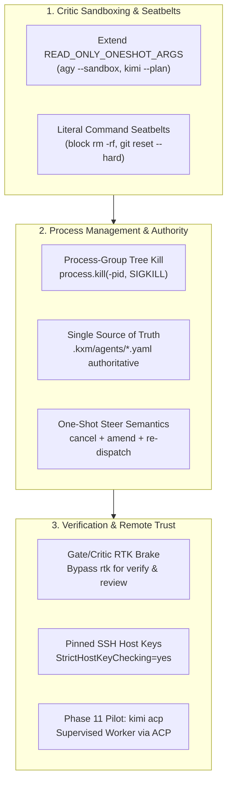

# Plan: Safety, Security, Process Integrity, and Authority Architecture

Task Reference: [`task_90e568b3fd18`](../../.kxm/tasks/task_90e568b3fd18.yaml)  
Status: Complete (Stages 1–6 Implemented); archived 2026-09-11  
Tracking: [`plans/implementation-plan.md`](../implementation-plan.md)

**Related plans:** [`implementation-plan.md`](../implementation-plan.md) (execution tracker);
[`plan-token-reduction-rtk-ai.md`](../plan-token-reduction-rtk-ai.md)
(must honor the gate / critic RTK brake);
[`plan-ssh-remote-execution.md`](../plan-ssh-remote-execution.md)
(pinned host-key policy).

## 1. Objective

Address critical security, safety, process integrity, and governance gaps identified during the multi-repository architectural audit (`doompi`, `pix-mono`, `ak-pi-workflow-roles`, `omp-hooks-plus`, and `pi-antigravity`). This plan closes critic read-only sandboxing holes, introduces literal destructive command seatbelts, enforces process-group tree termination on timeouts, establishes a single source of truth for agent authority, formalizes one-shot steer semantics, mandates byte-fidelity guardrails around lossy compression, pilots ACP for supervised workers, and pins headless SSH host keys.

---

## 2. Background and Discovered Vulnerabilities

During the critical review of KXM against the reference repositories, eight high-impact gaps were identified:

1. **Critic Read-Only Sandbox Gap:** In [`plugins/kxm/src/harness.ts`](../../plugins/kxm/src/harness.ts), `READ_ONLY_ONESHOT_ARGS` defines sandboxed flags for `claude`, `codex`, and `grok`, but omits `agy` and `kimi`. When an audit or critic role is dispatched through `agy` or `kimi`, the critic runs without `--mode plan`, `--sandbox`, or `--plan`, leaving it with unintended write and mutation permissions.
2. **Missing Destructive Command Seatbelts:** Autonomous coding agents (the writer role) can inadvertently wipe unstaged progress or corrupt repository state by executing destructive commands (`rm -rf`, `git reset --hard`, `git clean`) during hallucinated recovery loops.
3. **Orphaned Zombie Processes:** When subagents, test runners, or compilation jobs time out or are cancelled, standard process signaling (`kill(pid)`) terminates only the parent shell, leaking subshells, test workers, and background daemons.
4. **Implementer Authority Drift:** Three separate configuration files declare who the implementer is (`.kxm/agents/implementer.yaml`, `.kxm/producers.yaml`, and `.kxm/roles/writer.yaml`), creating conflicting sources of truth.
5. **Undefined Steer Semantics for One-Shots:** Issuing `kxm peer send --delivery steer` to a one-shot CLI producer (`grok`, `agy`, `claude -p`) is undefined because one-shots lack an interactive session loop.
6. **Lossy Compression Risks for Gates and Critics:** Running deterministic verification gates (`npm run verify`) or critic evaluations through `rtk-ai` output compression risks stripping subtle assertion errors or compiler warnings.
7. **Single-Worker Bottleneck:** KXM currently treats Pi as the sole supervised long-lived worker, even though standard protocols like ACP (Agent Control Protocol) exist and are supported by runtimes like `kimi acp`.
8. **TOFU Security Vulnerability in Headless SSH:** Trust-On-First-Use (`StrictHostKeyChecking=accept-new`) exposes headless CI/automated executors to machine-in-the-middle attacks.

---

## 3. Reference Architecture from Evaluated Repositories

- **`ak-pi-workflow-roles` (ADR 0008 & ADR 0071):**
  - Enforces literal, heuristic-free seatbelts intercepting `rm -rf`, `git reset --hard`, `git clean`, and `git checkout --`.
  - Implements a generic `RoleTurnHost` over ACP (Agent Control Protocol) stdio JSON-RPC.
- **`omp-hooks-plus`:**
  - Enforces process-group signaling (`process.kill(-pid, "SIGKILL")`) to guarantee complete process tree pruning on cancellation and timeouts.
  - Intercepts tool calls via `PreToolUse` hooks with `deny`, `ask`, and `updatedInput` responses.
- **`pix-mono` & `doompi`:**
  - Decouple tool availability strictly by role preset to prevent unauthorized capabilities.

---

## 4. Technical Specifications and Action Items



### 1. Close Critic Read-Only Sandboxing in `harness.ts`

Extend `READ_ONLY_ONESHOT_ARGS` to include explicit sandboxing arguments for `agy` and `kimi`:

```typescript
const READ_ONLY_ONESHOT_ARGS = Object.freeze({
  claude: Object.freeze(["--tools", "Read,Glob,Grep", "--restricted", "--safe-mode", "--strict-mcp-config", "--mcp-config", '{"mcpServers":{}}', "--disable-slash-commands", "--no-session-persistence"]),
  codex: Object.freeze(["--sandbox", "read-only", "--ignore-user-config", "-c", 'approval_policy="never"']),
  grok: Object.freeze(["--sandbox", "read-only", "--permission-mode", "plan", "--tools", "Read,Glob,Grep", "--no-subagents", "--disable-web-search"]),
  agy: Object.freeze(["--mode", "plan", "--sandbox", "--disable-slash-commands"]),
  kimi: Object.freeze(["--plan"]),
});
```

Add a deterministic unit test asserting that dispatching any critic or auditor role to `agy` or `kimi` without these read-only arguments fails closed.

### 2. Implement Literal Command Seatbelts in `engine.ts`

In KXM's tool execution layer, enforce a literal blocklist on destructive commands:

```typescript
const DESTRUCTIVE_COMMAND_PATTERNS = [
  /^\s*rm\s+-[a-zA-Z]*r[a-zA-Z]*f\s+/i,
  /^\s*rm\s+-[a-zA-Z]*f[a-zA-Z]*r\s+/i,
  /^\s*git\s+reset\s+--hard/i,
  /^\s*git\s+clean\s+-[a-zA-Z]*f/i,
  /^\s*git\s+checkout\s+--\s+/i,
  /^\s*git\s+restore\s+(\.|\*|--staged\s+(\.|\*))/i,
];

export function assertCommandSeatbelt(command: string): void {
  for (const pattern of DESTRUCTIVE_COMMAND_PATTERNS) {
    if (pattern.test(command)) {
      throw new Error(`Command blocked by KXM safety seatbelt: "${command}". Destructive workspace mutations require explicit operator override.`);
    }
  }
}
```

### 3. POSIX Process-Group Termination in `oneshot-process.ts`

When spawning shell commands, child processes, or test suites, set `detached: true` on POSIX systems:

```typescript
const child = spawn(command, args, {
  detached: process.platform !== "win32",
  stdio: ["pipe", "pipe", "pipe"],
});

export function killProcessTree(child: ChildProcess, signal: NodeJS.Signals = "SIGKILL"): void {
  if (process.platform !== "win32" && child.pid) {
    try {
      process.kill(-child.pid, signal);
      return;
    } catch {
      // Fall through to standard kill if group is unavailable
    }
  }
  child.kill(signal);
}
```

### 4. Single Source of Truth for Implementer Authority

- Establish `.kxm/agents/*.yaml` as the **sole authority** for agent identity, harness, and model.
- Treat `.kxm/producers.yaml` strictly as an execution history ledger.
- In `plugins/kxm/src/project-config.ts`, add a startup validator that fails closed (`role_roster_conflicts_with_agent`) if `.kxm/roles/writer.yaml` conflicts with `.kxm/agents/implementer.yaml`.

### 5. Producer-Kind Steer Semantics

In `plugins/kxm/src/commands.ts` and `plugins/kxm/src/hub.ts`:

- **Pi RPC Worker:** Deliver message directly to the live session turn (`steer`).
- **One-Shot CLI Producer:** Terminate the active child process via `killProcessTree`, append the steering instruction to the prompt envelope, increment attempt counters, and re-dispatch with a `steer_redispatch` journal record.

### 6. Verification Gate & Critic RTK Brake

Hardcode an unbypassable brake ensuring that `rtk proxy` command rewriting is **strictly prohibited** for:

- Any step where `kind === "gate"` (e.g. `npm run verify`, `npm test`).
- Any agent operating under a critic preset (`critic-arch`, `critic-cli`, `auditor`).
This guarantees 100% byte fidelity for verification and auditing.

### 7. ACP Supervised Worker Pilot (Phase 11)

- Model a secondary supervised worker interface on `kimi acp` using stdio JSON-RPC.
- Implement session lifecycle (`session/open`, `session/turn`, `session/close`) with structured error mapping (`activation | provider | session | timeout`).
- Run controlled side-by-side experiments against Pi before considering any revision to `AGENTS.md`'s long-lived worker policy.

### 8. Pinned Host Key Verification for Headless SSH

In KXM's remote SSH transport:

- Prohibit `StrictHostKeyChecking=accept-new`.
- Require pinned host keys loaded from `.kxm/repo/env.yaml` or a dedicated `.kxm/known_hosts` file with `StrictHostKeyChecking=yes` and `BatchMode=yes`.
- Fail closed immediately on host key mismatch without prompting interactively.

---

## 5. Execution Stages and Milestones

| Stage | Action | Target Files | Verification Gate |
| :--- | :--- | :--- | :--- |
| **Stage 1** | Extend `READ_ONLY_ONESHOT_ARGS` for `agy` and `kimi` | [`plugins/kxm/src/harness.ts`](../../plugins/kxm/src/harness.ts) | Unit tests verify critic dispatch adds sandboxed flags |
| **Stage 2** | Implement command seatbelts | [`plugins/kxm/src/engine.ts`](../../plugins/kxm/src/engine.ts) | Test verifies `rm -rf` and `git reset --hard` throw seatbelt error |
| **Stage 3** | Implement process-group tree termination | [`plugins/kxm/src/oneshot-process.ts`](../../plugins/kxm/src/oneshot-process.ts) | Test verifies timed-out test command terminates all child subshells |
| **Stage 4** | Implement authority validation brake | [`plugins/kxm/src/project-config.ts`](../../plugins/kxm/src/project-config.ts) | Startup test fails closed on conflicting writer configurations |
| **Stage 5** | Enforce RTK gate/critic bypass | Shell runner / `rtk.ts` | Test confirms verification gate output is never proxied through `rtk` |
| **Stage 6** | Pinned SSH host key enforcement | `plugins/kxm/src/tools/ssh-run.ts` | Test verifies rejection of unpinned host keys |

---

## 6. Acceptance Criteria

- All critic roles dispatched to `agy` or `kimi` execute in plan/sandbox mode without write permissions.
- Autonomous writer agents are prevented from running `rm -rf` or destructive git mutations.
- Child processes are cleanly killed on timeout with zero leaked zombie processes.
- Verification gates and critic runs receive 100% raw uncompressed command streams.
- `npm run verify` passes completely.
