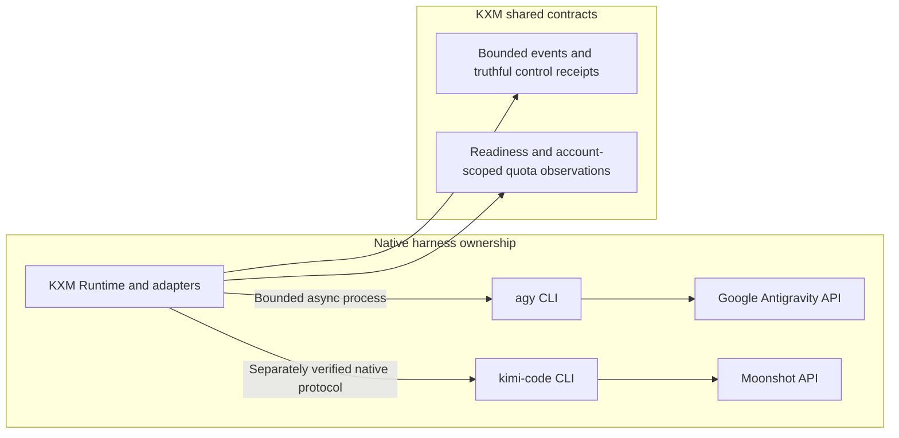

# Design Reference: AGY and Kimi Integration

Task Reference: `task_providers_agy_kimi`  
Status: Draft / Historical migration objective superseded
Tracking: [`plans/implementation-plan.md`](implementation-plan.md)

**Partially superseded design.** Replacing native AGY/Kimi routes with Pi providers is not the current architecture. The [implementation plan](implementation-plan.md) owns decisions, status, owners and phase gates; the [unified plan](plan-unified-kxm-milestones.md) supplies proposed M2/M3/M8 scope and order. Native authentication and admission decisions control. This document retains integration research, not an independent migration backlog or permission to admit providers.

**Related plans:** [`implementation-plan.md`](implementation-plan.md) (execution tracker);
[`plan-usage-cost-quota-tracking.md`](plan-usage-cost-quota-tracking.md)
(Antigravity / Kimi quota surfaces);
[`research-agent-producer-architecture.md`](research-agent-producer-architecture.md)
(producer / Pi worker boundaries).

## 1. Objective

Identify reusable streaming, schema handling, diagnostics and quota contracts while preserving native harness sessions and credentials. *(Superseded by the 2026-09-15 decision: Google's admitted route is the `antigravity` **Pi provider**; `agy` is catalog/helper capability, not the admission path. Original text:)* Google remained on authenticated `agy`; Kimi controls require separate installed-version, authentication and lifecycle evidence. Only Pi is currently admitted as a supervised long-lived RPC worker. Direct Pi-provider integration was an earlier alternative, not the selected route for replacing these native harnesses.

---

## 2. Background and Architectural Gap

Rechecked in KXM `02aaed31` (`harness.ts`):

- `harness.ts` defines `agy` as an external binary (`commands: ["agy"]`) executed via `agy --output-format json -p`. The output is parsed post-hoc via JSON/regex heuristics in `parseAgyOneShotUsage`.
- The catalog resolves `kimi` as an external one-shot CLI and requests `--output-format stream-json -p`; a particular user installation path is not a universal product contract.
- `AGENTS.md` and `implementation-plan.md` state that only Pi is a supervised long-lived RPC worker (`kxm agent worker` / `pi --mode rpc`), while `agy` is strictly one-shot headless.

### Deficiencies of the Current Setup

1. **Startup measurement:** Native process startup may contribute latency; no general 500–2000 ms penalty has been established for current KXM.
2. **Buffered observation:** The current one-shot supervisor uses asynchronous `spawn`, supports abort and bounded termination, and retains accepted A1 settlement/evidence protections. Incremental native events and exact-session controls remain M2/M3 work; buffered output does not mean cancellation is absent.
3. **Shared health, native credentials:** Separate native credential stores are intentional. Shared readiness should report detected, authenticated, protocol-verified and admitted states without copying subscription credentials into Pi.
4. **Schema compatibility:** Deduplication and size accounting are useful candidates. Any Kimi schema-size limit must be verified against the exact provider route and version; 15 KB is not a universal KXM acceptance limit.

---

## 3. Reference Architecture from Evaluated Repositories

These are historical reference patterns, not current model catalogs or adopted packages. Consult the pinned fork reviews before reuse; endpoint, license, model and credential assumptions require version-specific evidence.

### A. `pi-antigravity` (<https://github.com/kontextmind/pi-antigravity>)

- **Direct Provider Registration:** Registers `antigravity` into Pi via `pi.registerProvider("antigravity", ...)`.
- **In-Process OAuth 2.0 PKCE:** Authenticates directly with Google Cloud Code Assist / Antigravity endpoints using a loopback listener (`http://localhost:51121/oauth-callback`). Credentials and refresh tokens are stored in `~/.pi/agent/auth.json`.
- **SSE Streaming Pattern:** Direct provider event handling is relevant to decoder design; it does not establish native AGY control or instant cancellation guarantees.
- **Quota & Diagnostics Commands:** Exposes `/antigravity.doctor` and `/antigravity.usage` to inspect Google's server-side shared quota groups, consumed percentages, and reset timestamps.

### B. `pi-provider-kimi-code` (npm: `pi-provider-kimi-code`)

- **Direct Provider Registration:** A Pi registration pattern for `kimi-coding`; available model IDs must come from observed native/provider discovery.
- **Credential Sync Pattern:** The reference's synchronization with Kimi credentials and API-key fallback is not authorization to copy credentials or alter native billing routes in KXM.
- **Tool Schema Deduplication:** Deduplicating repeated JSON Schema definitions may reduce payload size; preserve semantics and verify actual route limits.
- **Kimi Files API Integration:** Offloads large image payloads to the Kimi Files API (`ms://` URIs) instead of sending multi-megabyte base64 strings inline.

---

## 4. Retained Integration Design

### 1. Distribution Boundary

Useful components belong behind one `@kontextmind/kxm` installation and thin adapters. Do not require separate Pi extension registration. Optional dependencies need explicit KXM-managed setup, license review and platform evidence under M1/M9.

### 2. Harness Contracts (`plugins/kxm/src/harness.ts`)

Preserve native-provider boundaries and fail-closed eligibility. Presence of a provider package does not permit an allowlist expansion. Extend capability observations and event/control adapters only through M2/M3 and current Phase 11 admission, including workspace/session identity and cancellation settlement.

### 3. Inventory (`plugins/kxm/src/model-inventory.ts`)

Retain source/version/account provenance for observed model IDs, context capacity and capabilities. Unknown fields stay unknown; inventory discovery does not admit a route or establish a long-lived worker.

### 4. Update Diagnostics & Quota Reporting

- Use each native harness's supported health surface. Account-scoped quota observations need freshness, invalidation and backoff under M8; do not substitute Pi authentication for native authentication.

---

## 5. Delivery Mapping

The former package-install/allowlist/migration stages are superseded. Candidate decoder work belongs to unified M2, session/control evidence to M3, and native health/quota contracts to M8. The implementation plan alone records selected slices, owners, status and phase gates.

---

## 6. Design Invariants for the Owning Milestones

- Native authentication and billing routes remain explicit; package discovery cannot admit execution.
- Bounded streaming preserves terminal outcomes, cancellation, redaction and usage accounting.
- Schema transformations retain tool semantics and are checked against an observed route/version.
- Shared diagnostics distinguish unknown, unauthenticated and unsupported states. These invariants do not mark any existing phase gate passed.
