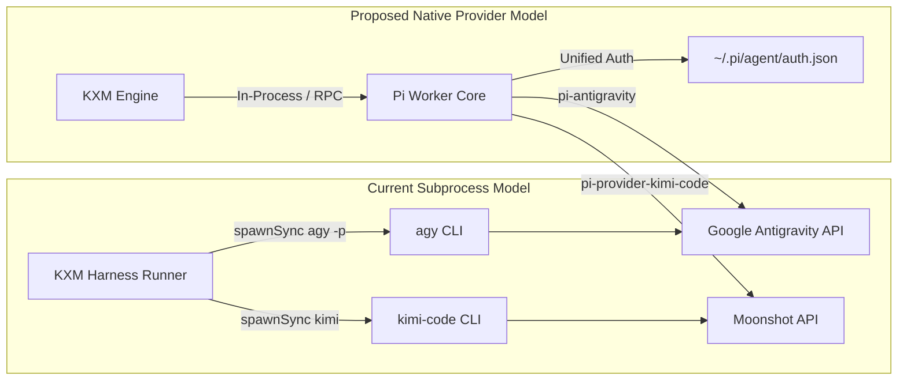

# Plan: Native Pi Providers for AGY and Kimi

Task Reference: `task_providers_agy_kimi`  
Status: Draft / Proposed  
Tracking: [`plans/implementation-plan.md`](implementation-plan.md)

## 1. Objective

Transition Google Antigravity (`agy`) and Moonshot Kimi (`kimi`) from external one-shot CLI subprocess wrappers in [`plugins/kxm/src/vnext-harness.ts`](../plugins/kxm/src/vnext-harness.ts) into first-class, streaming-capable native Pi provider extensions. This eliminates process-spawn overhead, provides real-time token streaming, unifies credential management under `~/.pi/agent/auth.json`, and allows Gemini and Kimi models to operate as supervised long-lived Pi workers.

---

## 2. Background and Architectural Gap

In KXM's current architecture:

- `vnext-harness.ts` defines `agy` as an external binary (`commands: ["agy"]`) executed via `agy --output-format json -p`. The output is parsed post-hoc via JSON/regex heuristics in `parseAgyOneShotUsage`.
- `kimi` is similarly executed as an external one-shot CLI binary located under `~/.kimi-code/bin`.
- `AGENTS.md` and `implementation-plan.md` state that only Pi is a supervised long-lived RPC worker (`kxm agent worker` / `pi --mode rpc`), while `agy` is strictly one-shot headless.

### Deficiencies of the Current Setup

1. **Cold-Start Latency:** Spawning standalone CLI processes on every turn adds 500ms–2000ms of process initialization overhead.
2. **Missing Token Streaming & Cancellation:** Subprocess execution buffers output until exit. If a model enters a runaway generation or hallucinatory loop, KXM cannot stream intermediate tokens or abort the turn early.
3. **Authentication Drift:** The `agy` and `kimi` CLIs maintain separate credential caches from Pi's native store (`~/.pi/agent/auth.json`), preventing unified health checks and credential audits.
4. **Moonshot 15 KB Tool Schema Limit:** When calling Kimi models through generic interfaces, Moonshot's API rejects requests when total tool schemas exceed 15 KB, frequently breaking multi-tool agents.

---

## 3. Reference Architecture from Evaluated Repositories

### A. `pi-antigravity` (<https://github.com/kontextmind/pi-antigravity>)

- **Direct Provider Registration:** Registers `antigravity` into Pi via `pi.registerProvider("antigravity", ...)`.
- **In-Process OAuth 2.0 PKCE:** Authenticates directly with Google Cloud Code Assist / Antigravity endpoints using a loopback listener (`http://localhost:51121/oauth-callback`). Credentials and refresh tokens are stored in `~/.pi/agent/auth.json`.
- **Native SSE Streaming:** Directly processes Server-Sent Events from Antigravity's inference API, delivering real-time tokens and enabling instant turn cancellation.
- **Quota & Diagnostics Commands:** Exposes `/antigravity.doctor` and `/antigravity.usage` to inspect Google's server-side shared quota groups, consumed percentages, and reset timestamps.

### B. `pi-provider-kimi-code` (npm: `pi-provider-kimi-code`)

- **Direct Provider Registration:** Registers `kimi-coding` in Pi, supporting K3, K2.7 Code, and HighSpeed models.
- **Shared Credential Sync:** Reuses and bidirectionally synchronizes OAuth tokens with `~/.kimi-code/credentials/kimi-code.json` while honoring fallback `KIMI_API_KEY`.
- **Tool Schema Deduplication:** Automatically collapses repetitive JSON Schema `$defs` and `$ref` constructs to keep total tool definitions well under Moonshot's 15 KB ceiling.
- **Kimi Files API Integration:** Offloads large image payloads to the Kimi Files API (`ms://` URIs) instead of sending multi-megabyte base64 strings inline.

---

## 4. Proposed Changes in KXM

### 1. Package Dependency Declaration

Update KXM's peer package configuration and installation manifests:

- Ensure `@tian.zuo/pi-antigravity` (or `pi-antigravity`) and `pi-provider-kimi-code` are registered in Pi's package registry (`~/.pi/agent/settings.json`).

### 2. Update `plugins/kxm/src/vnext-harness.ts`

- Update `NATIVE_HARNESS_PROVIDERS`:
  - Retain `claude`, `codex`, `grok` as CLI harnesses where appropriate.
  - Update `agy` and `kimi` entries to allow routing through `harness: "pi"` when the native provider packages are present.
- Adjust `PI_ALLOWED_PROVIDERS` to include `antigravity` and `kimi-coding`.
- Update `isKnownHarnessId` and validation rules so that models specified as `antigravity/<model-id>` or `kimi-coding/<model-id>` are recognized as native Pi models rather than unhosted external models.

### 3. Update `plugins/kxm/src/model-inventory.ts`

- Add native discovery for Antigravity models (`gemini-3.8-flash`, `gemini-3.8-pro`, `claude-fable-5-1`, etc.) and Kimi models (`k3`, `k2.7-code`) directly from Pi's registered provider inventory.
- Map context window sizes, max output tokens, and reasoning capabilities reported by the native providers.

### 4. Update Diagnostics & Quota Reporting

- Update `kxm harness list` to inspect Pi's auth state for `antigravity` and `kimi-coding` in addition to checking CLI binaries on `$PATH`.

---

## 5. Execution Stages and Milestones

| Stage | Action | Target Files | Verification Gate |
| :--- | :--- | :--- | :--- |
| **Stage 1** | Verify provider package installation in Pi runtime | `~/.pi/agent/settings.json`, `npm` packages | `pi list` reports `pi-antigravity` and `pi-provider-kimi-code` active |
| **Stage 2** | Update `vnext-harness.ts` provider allowlists | [`plugins/kxm/src/vnext-harness.ts`](../plugins/kxm/src/vnext-harness.ts) | Unit tests in `test/core/harness.test.ts` pass |
| **Stage 3** | Update model inventory & dispatch resolution | [`plugins/kxm/src/model-inventory.ts`](../plugins/kxm/src/model-inventory.ts) | Model resolution for `antigravity/gemini-3.8-flash` resolves to Pi harness |
| **Stage 4** | End-to-end one-shot execution check | `scripts/harness-run.mjs` | Test one-shot completion returns streaming tokens with exit code 0 |

---

## 6. Acceptance Criteria

- `kxm harness list` correctly identifies `antigravity` and `kimi-coding` as detected and authenticated.
- A workflow step assigning `antigravity/gemini-3.8-flash` executes natively inside Pi without shelling out to `agy -p`.
- Multi-tool agents assigned to `kimi-coding/k3` succeed without failing Moonshot's 15 KB schema ceiling.
- `npm run verify` passes with 100% clean check, build, and test runs.
