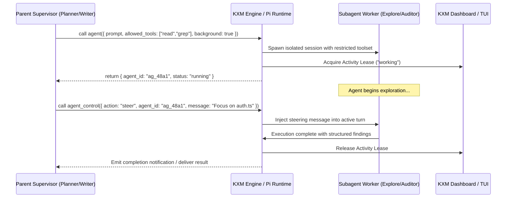

# Plan: Supervisory Agent Control, Real-Time Steering, and Work-Splitting

Task Reference: `task_agent_communication_steering`  
Status: Draft / Proposed  
Tracking: [`plans/implementation-plan.md`](implementation-plan.md)

## 1. Objective

Complement KXM's existing peer-to-peer messaging (`kxm peer`) with an in-process supervisory control plane inspired by `pix-subagent`: provide dual-tool subagent lifecycle management (`agent` and `agent_control`), enforce explicit work-splitting via `allowed_tools` allowlists, support real-time mid-flight steering, and manage agent activity leases in the live dashboard.

---

## 2. Background and Architectural Gap

In KXM today:

- The `kxm peer` subsystem ([`plugins/kxm/src/commands.ts`](../plugins/kxm/src/commands.ts)) handles peer-to-peer collaboration: `kxm peer send`, `kxm peer await`, `kxm peer reply`, `kxm peer fanout`.
- This works well for independent, asynchronous peer agents collaborating across a shared hub.
- **The Gap:** KXM lacks tight **parent-to-child supervisory delegation**:
  1. **Unconstrained Tool Surface:** When an agent invokes a subagent, the child typically inherits the full tool environment. An exploratory research agent gets dangerous file-editing and bash capabilities, dramatically inflating context tokens and risking accidental edits.
  2. **Lack of Mid-Flight Steering:** Once a child agent starts generating, the parent cannot inject course-correcting steering instructions without aborting or waiting for the entire turn to finish.
  3. **No Centralized Agent Leases:** Child processes lack unified activity state leases (`working`, `blocked`, `idle`), making live TUI monitoring noisy with redundant notifications.

---

## 3. Reference Architecture: `pix-subagent` ([pix-mono/packages/pix-subagent](https://github.com/kontextmind/pix-mono/tree/main/packages/pix-subagent))

`pix-subagent` provides an ergonomic pattern for subagent orchestration:

- **Dual-Tool Control Plane:**
  - `agent`: Spawns self-contained background workers with explicit prompt, model, thinking level, and tool allowlists.
  - `agent_control`: Manages running agents with actions `info` (discover active IDs and types), `result` (poll output), `steer` (inject mid-flight guidance), and `stop` (immediate cancellation).
- **Explicit Work-Splitting via `allowed_tools[]`:**
  - The parent strictly scopes child capabilities. Passing `allowed_tools: ["read", "grep", "find"]` constrains the child to read-only ops.
  - The allowlist can only intersect and narrow, never expand.
- **Activity Leases & Attention Management:**
  - Running background agents acquire an `agent-state` activity lease (`working`).
  - Terminal notifications are suppressed during normal progress and fire only on `blocked` states (e.g. operator confirmation required) or upon terminal completion.
  - Live TUI widgets display worker status: `● Agents ├─ ⠹ Explore [haiku] ···`.

---

## 4. Proposed Changes in KXM



### 1. Dual-Tool Specification (`plugins/kxm/src/subagent-control.ts`)

#### Tool: `agent` (Spawn)

```typescript
export interface AgentSpawnParams {
  prompt: string;           // Self-contained task description
  description: string;      // Short label for TUI status line
  type?: "general" | "Explore" | "Plan" | "Reviewer";
  model?: string;           // e.g. "anthropic/claude-haiku-4.5" (defaults to parent or cheap tier)
  thinking?: "off" | "minimal" | "low" | "medium" | "high";
  allowed_tools?: string[]; // Strict allowlist (e.g. ["read", "grep", "find"])
  turns?: number;           // Max turns ceiling
  background?: boolean;     // Default true (non-blocking)
}
```

#### Tool: `agent_control` (Manage)

```typescript
export interface AgentControlParams {
  action: "info" | "result" | "steer" | "stop";
  kind?: "types" | "models" | "active";
  agent_id?: string;
  message?: string;         // Required when action === "steer"
  turns?: number;           // Number of recent turns to fetch
  verbose?: boolean;
}
```

### 2. Tool Surface Scoping & Sandbox Enforcement

In `plugins/kxm/src/vnext-engine.ts`, when a child agent starts:

- Filter the global tool registry against `params.allowed_tools`.
- Default presets:
  - `Explore`: `["read", "grep", "find", "ls"]` (strictly read-only).
  - `Plan`: `["read", "grep", "find"]` (strictly read-only).
  - `Fixer`: `["read", "edit", "write", "bash"]`.
- The child tool definitions omit forbidden schemas completely, reducing prompt token overhead by 1,000–3,000 tokens per turn.

### 3. Dashboard Activity Lease Integration (`plugins/kxm/src/tui.ts`)

- Maintain an active registry of child agent leases:

  ```typescript
  export interface AgentLease {
    agentId: string;
    description: string;
    model: string;
    startedAt: number;
    state: "working" | "blocked" | "completed";
  }
  ```

- Render a live tree widget in `kxm dash` showing all in-flight subagents, active tool executions, and elapsed time.

---

## 5. Execution Stages and Milestones

| Stage | Action | Target Files | Verification Gate |
| :--- | :--- | :--- | :--- |
| **Stage 1** | Implement `agent` and `agent_control` tool schemas | `plugins/kxm/src/subagent-control.ts` | Schemas compile and pass typecheck |
| **Stage 2** | Implement tool allowlist scoping logic | [`plugins/kxm/src/vnext-engine.ts`](../plugins/kxm/src/vnext-engine.ts) | Unit test confirms `allowed_tools` excludes forbidden tools from child prompt |
| **Stage 3** | Implement mid-flight `steer` message delivery | `plugins/kxm/src/subagent-control.ts` | Test verifies child receives injected steering message before next turn |
| **Stage 4** | Wire activity leases into `tui.ts` and `kxm dash` | [`plugins/kxm/src/tui.ts`](../plugins/kxm/src/tui.ts) | UI test confirms subagent status line updates during execution |

---

## 6. Acceptance Criteria

- A parent agent can launch an `Explore` subagent restricted to `["read", "grep"]` that cannot execute `bash` or `edit`.
- Calling `agent_control({ action: "steer" })` redirects child execution mid-turn without killing the session.
- Subagent status is visible in real-time on `kxm dash`.
- `npm run verify` passes completely.
