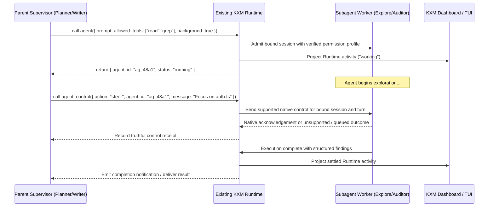

# Plan: Supervisory Agent Control, Real-Time Steering, and Work-Splitting

Task Reference: `task_agent_communication_steering`  
Status: Draft / Proposed  
Tracking: [`plans/implementation-plan.md`](implementation-plan.md)

**Design reference.** This document retains supervisory interaction and control-contract design. The [implementation plan](implementation-plan.md) owns decisions, status, owners and phase gates; the [unified plan](plan-unified-kxm-milestones.md) supplies proposed M3 scope/order, supported by M1/M2/M6/M7. This is not a second supervisor or active backlog. Historical task references do not admit a capability.

**Related plans:** [`implementation-plan.md`](implementation-plan.md) (execution tracker);
archived [`plan-role-configuration-governance.md`](history/plan-role-configuration-governance.md)
(role seats, tool allowlists, typed receipts);
[`research-harness-streaming-capabilities.md`](research-harness-streaming-capabilities.md)
(native harness streaming and live control).

## 1. Objective

Extend KXM's existing Runtime and peer commands with a coherent supervisory interaction inspired by `pix-subagent`: lifecycle and control operations, explicit work-splitting through narrowed tool permissions, capability-specific steering, and dashboard activity views. Proposed `agent` and `agent_control` names describe an interaction pattern, not a requirement for a second tool registry, scheduler or supervisor.

---

## 2. Background and Architectural Gap

In KXM today:

- The `kxm peer` subsystem ([`plugins/kxm/src/commands.ts`](../plugins/kxm/src/commands.ts)) handles peer-to-peer collaboration: `kxm peer send`, `kxm peer await`, `kxm peer reply`, `kxm peer fanout`.
- This works well for independent, asynchronous peer agents collaborating across a shared hub.
- Existing Pi producer sessions are bound to run, agent, instance and scope epoch, with abort propagation. Peer/workflow commands already use attempt/session tokens and authenticated control paths.
- **Remaining gaps:** actual tool restrictions must be demonstrated per host; M3 must bind native control to exact project/host/workspace/session/attempt identity and distinguish queued input from acknowledged active steering. M7 activity views must project existing Runtime state, not create another lease authority.

---

## 3. Reference Architecture: `pix-subagent` ([pix-mono/packages/pix-subagent](https://github.com/kontextmind/pix-mono/tree/main/packages/pix-subagent))

`pix-subagent` provides an ergonomic pattern for subagent orchestration:

- **Dual-Tool Control Plane:**
  - `agent`: Spawns self-contained background workers with explicit prompt, model, thinking level, and tool allowlists.
  - `agent_control`: Illustrates `info`, `result`, `steer` and `stop`; KXM must separately verify native delivery and bounded cancellation rather than promise immediate effects.
- **Explicit Work-Splitting via `allowed_tools[]`:**
  - The parent narrows child capabilities. `allowed_tools: ["read", "grep", "find"]` illustrates a read-oriented surface; native/OS enforcement and host tool-name mapping must prove the restriction.
  - The allowlist can only intersect and narrow, never expand.
- **Activity Leases & Attention Management:**
  - Running background agents acquire an `agent-state` activity lease (`working`).
  - Terminal notifications are suppressed during normal progress and fire only on `blocked` states (e.g. operator confirmation required) or upon terminal completion.
  - Live TUI widgets display worker status: `● Agents ├─ ⠹ Explore [haiku] ···`.

---

## 4. Proposed Changes in KXM



### 1. Dual-Tool Specification (`plugins/kxm/src/subagent-control.ts`)

Illustrative interfaces and candidate module name only. Reuse existing Runtime command owners and generated registrations; extend their schemas rather than introducing a parallel dispatcher.

#### Tool: `agent` (Spawn)

```typescript
export interface AgentSpawnParams {
  prompt: string;           // Self-contained task description
  description: string;      // Short label for TUI status line
  type?: "general" | "Explore" | "Plan" | "Reviewer";
  model?: string;           // Resolved through existing role, native-route and admission policy
  thinking?: "off" | "minimal" | "low" | "medium" | "high";
  allowed_tools?: string[]; // Strict allowlist (e.g. ["read", "grep", "find"])
  turns?: number;           // Max turns ceiling
  background?: boolean;     // Default true (non-blocking)
}
```

#### Tool: `agent_control` (Manage)

```typescript
export interface AgentControlParams {
  action: "info" | "result" | "steer" | "stop";
  kind?: "types" | "models" | "active";
  agent_id?: string;
  message?: string;         // Required when action === "steer"
  turns?: number;           // Number of recent turns to fetch
  verbose?: boolean;
}
```

Both operations need authoritative actor/project/host/workspace/run/attempt/native-session binding, plus a turn or revision where relevant. A native transport write is not delivery. Receipts distinguish `accepted`, `queued`, `delivered`, `rejected` and `unsupported`; stale-turn or wrong-workspace requests fail explicitly.

### 2. Tool Surface Scoping & Sandbox Enforcement

In `plugins/kxm/src/engine.ts`, when a child agent starts:

- Intersect requested tools with the inherited permission floor, role policy and verified host capabilities; expose only admitted definitions.
- Default presets:
  - `Explore`: `["read", "grep", "find", "ls"]` (read-oriented intent, requiring host mapping and enforcement).
  - `Plan`: `["read", "grep", "find"]` (same requirement).
  - `Fixer`: `["read", "edit", "write", "bash"]`.
- Omit forbidden schemas, but do not equate prompt omission with isolation of native tools, shell commands or descendants. Measure any token saving; no fixed 1,000–3,000 token improvement is established.

### 3. Dashboard Activity Lease Integration (`plugins/kxm/src/tui.ts`)

- Project existing Runtime activity into the UI; this sketch is a read model, not a new lease registry:

  ```typescript
  export interface AgentActivityView {
    agentId: string;
    description: string;
    model: string;
    startedAt: number;
    state: "working" | "blocked" | "completed";
  }
  ```

- Join the view to authoritative run/attempt/session identities and cursor/revision data. Ownership, lease expiry and fencing remain in the existing Runtime. Render a live tree in `kxm dash` showing in-flight subagents, active tools and elapsed time.

---

## 5. Delivery Mapping

M3 owns proposed exact-session controls after M2 observation contracts. M1/M6 cover real tool activation and restrictions; M7 projects activity into the dashboard. The former stage table is replaced by this mapping; only the implementation plan tracks selected slices, owners, status and phase gates.

---

## 6. Design Invariants for the Owning Milestones

- A restricted child cannot execute excluded effects through native tools or alternate shell paths; testing only its prompt is insufficient.
- Active steering requires a native acknowledgement for the bound session/turn, including a witness during a running tool. Queued input is labeled queued; unsupported control fails explicitly.
- Cancellation, reconnect, stale-turn rejection and activity views preserve Runtime identity and truthful settlement. These design invariants do not pass a phase gate or admit another long-lived worker.
