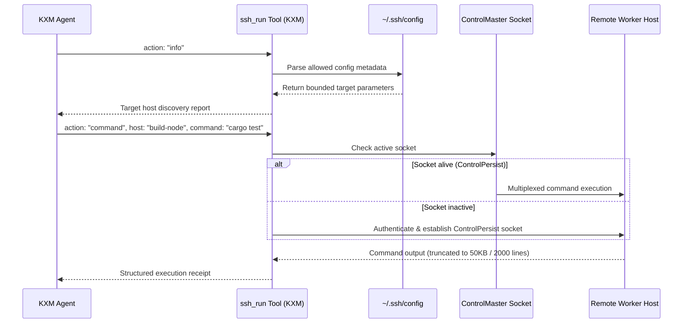

# Plan: Multiplexed Remote SSH Execution and Worker Orchestration

Task Reference: `task_ssh_remote_execution`  
Status: Draft / Proposed  
Tracking: [`plans/implementation-plan.md`](implementation-plan.md)

**Design reference.** This document retains remote transport and lifecycle design. The [implementation plan](implementation-plan.md) owns decisions, status, owners and phase gates, including Phase 6; the [unified plan](plan-unified-kxm-milestones.md) supplies proposed M2/M3 scope/order, with M8 credential and M9 platform work. Existing SSH helpers do not establish remote workflow recovery, and this document is not an independent backlog.

**Related plans:** [`implementation-plan.md`](implementation-plan.md) (execution tracker);
archived [`plan-safety-security-process-integrity.md`](history/plan-safety-security-process-integrity.md)
(pinned SSH host keys);
[`research-agent-producer-architecture.md`](research-agent-producer-architecture.md)
(multi-host / SSH agents);
archived [`plan-role-configuration-governance.md`](history/plan-role-configuration-governance.md)
(host axis);
[`research-harness-streaming-capabilities.md`](research-harness-streaming-capabilities.md)
(native harness streaming and remote sessions);
[`plan-per-tenant-hosting.md`](plan-per-tenant-hosting.md)
(per-tenant hosted hub beside kxmd-portal);
[`research-a2a-cross-host.md`](research-a2a-cross-host.md)
(cross-host / A2A research).

## 1. Objective

Extend existing SSH helpers toward the canonical remote workflow contract: verified workspace transfer, versioned remote helper, event cursors, reattachment, scoped secret grants, cleanup and uncertain-effect recovery. Retain connection reuse and bounded receipts inspired by `pix-ssh`, using the existing Runtime as execution authority.

---

## 2. Background and Architectural Gap

In KXM today:

- `plugins/kxm/src/ssh-remote.ts` and `plugins/kxm/src/cli/system.ts` already provide SSH discovery, command/file execution helpers, multiplexing and pinned-host-key checks, exposed through `kxm ssh`.
- These helpers do not prove durable remote worker orchestration. Phase 6 still requires equivalent local/remote workflow contracts and connection-loss recovery.
- **The Security & Performance Hazards of Ad-Hoc SSH:**
  1. Repeated SSH handshakes can add latency; the former 500ms–2000ms estimate is unmeasured for this environment.
  2. SSH config can expose topology and key-file paths. Discovery should return only necessary metadata and must not read private key contents.
  3. Hardcoding passwords or keys into command arguments exposes credentials in process tables (`ps aux`), shell histories, and session logs.

---

## 3. Reference Architecture: `pix-ssh` ([pix-mono/packages/pix-ssh](https://github.com/kontextmind/pix-mono/tree/main/packages/pix-ssh))

`pix-ssh` supplies reference patterns; reuse and platform behavior require pinned-source and installed-version checks:

- **`ssh_run` Tool:**
  - `action: "info"`: Separates config parsing from native `ssh -G` resolution. Native config evaluation must not be assumed side-effect-free; executable directives and effective configuration need a defined inspection boundary.
  - `action: "command"`: Executes commands through the remote host's configured shell.
  - `action: "file"`: Transfers files over the encrypted channel.
- **OpenSSH ControlMaster Multiplexing:**
  - Maintains persistent master sockets (`ControlMaster auto`, `ControlPersist 10m`) to avoid repeated handshakes; remote command duration remains workload-dependent.
- **Masked Credential Security:**
  - SSH password authentication can use `sshpass -e`, avoiding password argv fields; process environment access remains a separate exposure to control.
  - Remote `sudo` commands pipe passwords to `sudo -S -p ''` over stdin.
  - KXM must redact credentials before logs/prompts and keep scoped secret references. Dropping a JavaScript reference is not proof of memory zeroization.
- **Approval Windows:**
  - A host connection lease is distinct from permission. Any reusable approval must remain bound to actor, project, target and effect; connection reuse never authorizes arbitrary commands.

---

## 4. Proposed Changes in KXM



### 1. Existing Helper Contract (`plugins/kxm/src/ssh-remote.ts`)

The following is an abbreviated interface illustration, not a new `tools/ssh-run.ts` implementation target. Existing CLI handlers live in `plugins/kxm/src/cli/system.ts`.

```typescript
export interface SshRunParams {
  action: "command" | "file" | "info";
  host?: string;             // [user@]host[:port] or alias from ~/.ssh/config
  command?: string;          // Command to run (when action === "command")
  sudo?: boolean;            // Run through remote POSIX sudo
  file_path?: string;        // Remote path (when action === "file")
  file_content?: string;     // Content to write (when action === "file")
  reason?: string;           // Rationale displayed in confirmation prompt
}
```

### 2. Safe Config Discovery (`action: "info"`)

- Keep literal config parsing separate from native resolution:
  - List host aliases and their configured `ProxyJump` routes.
  - Existing `ssh -G <host>` resolution yields effective fields, but inspection safety must cover config directives such as `Match exec` and must not be certified from the `-G` flag alone. Use fixtures to define supported resolution and refuse unsafe inspection cases.
- Omit private keys, passphrase fields, and sensitive metadata from model output.

### 3. Connection Multiplexing Engine

- Existing sockets use `.kxm/run/ssh-sockets/%C`; retain bounded lifecycle ownership and verify directory access and Windows support before treating that layout as portable.
- Arguments for master connection:

  ```bash
  ssh -o ControlMaster=auto -o ControlPath=.kxm/run/ssh-sockets/%C -o ControlPersist=10m -o BatchMode=yes -o StrictHostKeyChecking=yes <host>
  ```

### 4. Credential Security & In-Memory Masking

- A failed key login reports an explicit auth outcome. Password setup is an explicit scoped flow, not an automatic fallback or permission increase.
- If password authentication is supported, avoid argv secrets, bound environment exposure, and redact before persistence; `sshpass` is an optional platform dependency.
- `sudo` requires its own admitted effect and scoped secret handling; stdin transport does not supply authorization.
- Release secret references and grants at session termination without claiming guaranteed memory erasure.

---

## 5. Delivery Mapping

Parser, multiplexing and credential transport already have helper implementations. Their hardening and remote workflow integration belong to Phase 6, using M2 event/reconnect contracts and M3 exact-session controls, M8 secret setup and M9 platform evidence. The former stage table is replaced by this mapping; selected slices, owners and acceptance status remain exclusively in the implementation plan.

---

## 6. Design Invariants for the Owning Milestones

- Discovery exposes necessary host metadata without reading private keys; native config evaluation has separately demonstrated restrictions.
- Connection reuse is measured against cold-handshake overhead in a named environment; no blanket sub-100 ms command guarantee applies.
- Credentials do not enter argv, logs or prompts; environment/stdin handling and platform dependencies are explicitly checked.
- Remote workspace identity, reconnect cursors, cancellation and uncertain effects preserve Runtime contracts. Existing helper tests or successful commands alone do not pass Phase 6.
