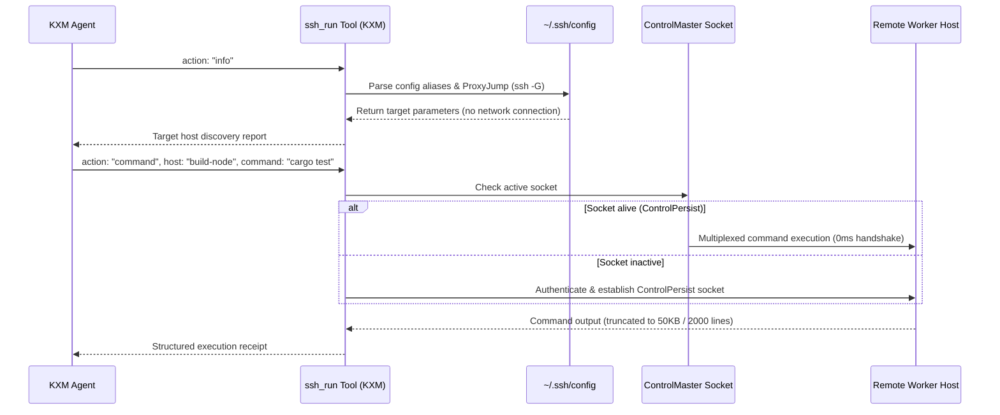

# Plan: Multiplexed Remote SSH Execution and Worker Orchestration

Task Reference: `task_ssh_remote_execution`  
Status: Draft / Proposed  
Tracking: [`plans/implementation-plan.md`](implementation-plan.md)

## 1. Objective

Enable secure, low-latency remote command execution, file synchronization, and remote worker orchestration over SSH inspired by `pix-ssh`: provide the `ssh_run` tool, reuse connections via OpenSSH `ControlMaster` multiplexing, support safe read-only `~/.ssh/config` discovery, and protect credentials using in-memory masking.

---

## 2. Background and Architectural Gap

In KXM today:

- Agent execution is strictly host-local.
- Distributed verification, remote build environments (e.g. Linux test clusters, GPU nodes, high-memory compile servers), and cloud host management are not natively supported.
- **The Security & Performance Hazards of Ad-Hoc SSH:**
  1. Spawning raw `ssh user@host command` on every turn incurs repetitive TCP, SSH handshake, and key exchange latency (500ms–2000ms per call).
  2. Agents often attempt to read `~/.ssh/config` directly, exposing private server topologies and keys to the LLM context.
  3. Hardcoding passwords or keys into command arguments exposes credentials in process tables (`ps aux`), shell histories, and session logs.

---

## 3. Reference Architecture: `pix-ssh` ([pix-mono/packages/pix-ssh](https://github.com/kontextmind/pix-mono/tree/main/packages/pix-ssh))

`pix-ssh` provides a battle-tested architecture for AI agent SSH access:

- **`ssh_run` Tool:**
  - `action: "info"`: Read-only parse of `~/.ssh/config` (handling `Include`, `ProxyJump`, and wildcards) and resolves aliases via `ssh -G <host>` without opening network sockets or prompting for credentials.
  - `action: "command"`: Executes commands through the remote host's configured shell.
  - `action: "file"`: Transfers files over the encrypted channel.
- **OpenSSH ControlMaster Multiplexing:**
  - Maintains persistent master sockets (`ControlMaster auto`, `ControlPersist 10m`), allowing subsequent calls to execute with near-zero latency.
- **Masked Credential Security:**
  - SSH password authentication passes tokens via `sshpass -e` (environment variable, avoiding `ps` leaks).
  - Remote `sudo` commands pipe passwords to `sudo -S -p ''` over stdin.
  - Credentials remain strictly in-memory per session and are never written to disk or echoed in LLM responses.
- **Approval Windows:**
  - Operator approval grants a 15-minute lease per host for non-destructive operations, avoiding repetitive confirmation prompts.

---

## 4. Proposed Changes in KXM



### 1. The `ssh_run` Tool Specification (`plugins/kxm/src/tools/ssh-run.ts`)

```typescript
export interface SshRunParams {
  action: "command" | "file" | "info";
  host?: string;             // [user@]host[:port] or alias from ~/.ssh/config
  command?: string;          // Command to run (when action === "command")
  sudo?: boolean;            // Run through remote POSIX sudo
  file_path?: string;        // Remote path (when action === "file")
  file_content?: string;     // Content to write (when action === "file")
  reason?: string;           // Rationale displayed in confirmation prompt
}
```

### 2. Safe Config Discovery (`action: "info"`)

- Inspect `~/.ssh/config` without opening network connections:
  - List host aliases and their configured `ProxyJump` routes.
  - Run `ssh -G <host>` to resolve effective `HostName`, `User`, `Port`, and `IdentityFile`.
- Omit private keys, passphrase fields, and sensitive metadata from model output.

### 3. Connection Multiplexing Engine

- Store control sockets in `.kxm/run/ssh-sockets/%C`.
- Arguments for master connection:

  ```bash
  ssh -o ControlMaster=auto -o ControlPath=.kxm/run/ssh-sockets/%C -o ControlPersist=10m -o BatchMode=yes
  ```

### 4. Credential Security & In-Memory Masking

- If SSH key authentication fails, prompt the operator using a masked TUI dialog.
- Pass the collected password via `SSHPASS` env variable to `sshpass -e`.
- For `sudo: true`, collect the remote sudo password and pipe directly to `sudo -S -p ''` via stdin.
- Drop passwords from memory when the session terminates.

---

## 5. Execution Stages and Milestones

| Stage | Action | Target Files | Verification Gate |
| :--- | :--- | :--- | :--- |
| **Stage 1** | Implement `action: "info"` safe config parser | `plugins/kxm/src/tools/ssh-run.ts` | Unit tests verify host resolution without opening sockets |
| **Stage 2** | Implement OpenSSH `ControlMaster` lifecycle | `plugins/kxm/src/tools/ssh-run.ts` | Test confirms second command executes over existing master socket |
| **Stage 3** | Implement credential masking for SSH & sudo | `plugins/kxm/src/tools/ssh-run.ts` | Security test confirms passwords do not appear in child argv or logs |
| **Stage 4** | Integrate with KXM role runner for remote worker offloading | [`plugins/kxm/src/vnext-engine.ts`](../plugins/kxm/src/vnext-engine.ts) | Test confirms remote stage execution completes with valid receipt |

---

## 6. Acceptance Criteria

- `ssh_run({ action: "info" })` allows agents to discover SSH hosts without reading private files directly.
- Repeated commands against the same remote host execute in <100ms via `ControlMaster` socket reuse.
- Passwords never appear in `ps`, disk logs, or prompt history.
- `npm run verify` passes completely.
