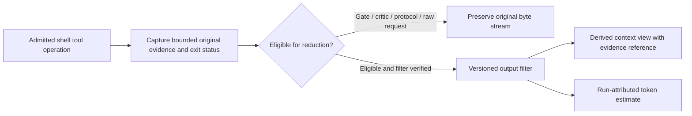

# Plan: Shell Output Token Compression via `rtk-ai` (Rust Token Killer)

Task Reference: `task_token_reduction_rtk`  
Status: Draft / Proposed  
Tracking: [`plans/implementation-plan.md`](implementation-plan.md)

**Design reference.** This document retains an output-reduction experiment and its evidence contracts. The [implementation plan](implementation-plan.md) owns decisions, status, owners and phase gates; the [unified plan](plan-unified-kxm-milestones.md) supplies proposed M5 scope/order with M0 truth, M1 optional setup and M9 distribution constraints. No mechanism or saving is accepted here, and this is not an independent backlog.

**Related plans:** [`implementation-plan.md`](implementation-plan.md) (execution tracker);
archived [`plan-safety-security-process-integrity.md`](history/plan-safety-security-process-integrity.md)
(RTK gate / critic bypass — honor that brake);
[`plan-workflow-modes-selective-loading.md`](plan-workflow-modes-selective-loading.md)
(prompt token scoping).

## 1. Objective

Evaluate optional RTK-backed reduction of eligible shell output before model-context ingestion, preserving diagnostic meaning and access to original evidence. Verification gates, critics and native machine protocols retain raw byte fidelity. The former 60–90% target is an unmeasured hypothesis, not a performance or cost guarantee.

---

## 2. Background and Architectural Gap

In AI coding agent workflows:

- Terminal command output can consume substantial context; the earlier 60–80% estimate has not been measured for current KXM. Candidate sources include:
  - Repetitive `git diff` chunks containing dozens of unchanged context lines.
  - Multi-page `npm test` or `pytest` suites repeating identical boilerplate headers and passing test confirmations.
  - Verbose compiler, linter, and package manager output.
- **The Problem:**
  - Large output can increase context pressure and obscure useful diagnostics. Measure these effects on bounded tasks before selecting a reduction mechanism.
  - Reduction can itself hide failures, so evidence fidelity and diagnostic retention are part of the experiment, not assumed benefits.

---

## 3. Reference Architecture: `rtk-ai` & `omp-hooks-plus`

### A. `rtk-ai` (Rust Token Killer, <https://github.com/rtk-ai/rtk>)

- **Command-specific output filters:** Select documented filters from a pinned RTK version and verify their behavior on representative output. Banner removal, repeated-line reduction and diagnostic extraction are useful candidate behaviors, not universal semantic/AST guarantees.
- **Raw proxy distinction:** Installed `rtk proxy --help` describes execution without filtering while tracking usage. `rtk proxy -- command` therefore does not establish compression and replaces the earlier incorrect mechanism in this draft.
- **Savings reports:** `rtk gain` may supply aggregate estimates; KXM still needs run/attempt attribution and must distinguish estimated token/list-cost savings from billed savings.

### B. `omp-hooks-plus` (<https://github.com/kontextmind/omp-hooks-plus>)

- Implements `PreToolUse` hooks that can inspect, modify, or rewrite tool inputs before execution.
- Demonstrates how shell commands can be transparently rewritten without requiring prompt alterations from the model itself.

---

## 4. Proposed Changes in KXM



### 1. Candidate Integration Boundary

Use a verified shell-tool output boundary in a host adapter or shared context service. `plugins/kxm/src/vnext-oneshot-process.ts` supervises native harness processes; it is not a generic hook for their internal shell tools. Its native JSONL/protocol streams must remain intact for M2 decoding. The previous regex-based command-string rewriter is withdrawn: it neither established shell semantics nor selected a filtering RTK command.

For an admitted experiment, preserve command identity, stdout/stderr distinction, original exit status and bounded evidence references. A reduced view records the filter/version and any truncation or omissions. Optional filter absence or failure cannot hide a command failure or trigger dependency installation. M1/M5 select the concrete component and host boundary; this reference does not add another runtime wrapper.

### 2. Explicit Bypass Support

Verification gates, critics, native machine protocols and byte-sensitive patch/artifact streams bypass reduction automatically under code-owned policy. An optional structured `raw: true` request may additionally preserve output; mandatory fidelity never depends on the model remembering a flag. Workspace instructions to prefix audit shell calls with RTK are separate from this proposed product integration.

### 3. Telemetry and Savings Accounting (`plugins/kxm/src/telemetry.ts`)

- Treat aggregate RTK metrics as inputs to a proposed attributed record, not a ready-made task cost ledger:

  ```typescript
  export interface RtkGainMetrics {
    runId: string;
    attemptId: string;
    filterVersion: string;
    estimator: string;
    originalTokensEstimated: number;
    reducedTokensEstimated: number;
    equivalentListCostSavedUsd: number | null;
  }
  ```

- Existing telemetry/read models may expose attributed estimates. Record negative or zero savings honestly; reduced output size is not evidence of improved correctness, model latency or actual billed savings.

### 4. Setup and Installation Helper

Use M1's explicit optional-component setup: detect version/capabilities and report readiness through KXM. Any installation needs pinned provenance, platform support, upgrade/removal behavior and M9 distribution evidence. Ordinary `kxm init`, package import or task execution must not silently install via brew/cargo or alter host extensions.

---

## 5. Delivery Mapping

The former rewrite stages are replaced by the M5 experiment boundary above, with M0 evidence truth, M1 optional setup and M9 release checks. The implementation plan alone selects and tracks slices, owners and gates. RTK adoption is not required merely because this design reference exists.

---

## 6. Design Invariants for the Owning Milestones

- Mandatory raw classes preserve original bytes and failure status without a model-provided bypass flag.
- Eligible derived views retain critical diagnostics and retrievable evidence under bounded/redacted storage policy.
- A named filter/version and estimator support reproducible before/after measurements on representative tasks; no percentage improvement is assumed.
- Missing components, malformed output and filter failures remain explicit. These invariants do not pass an existing phase gate.
