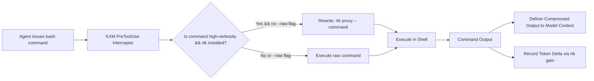

# Plan: Shell Output Token Compression via `rtk-ai` (Rust Token Killer)

Task Reference: `task_token_reduction_rtk`  
Status: Draft / Proposed  
Tracking: [`plans/implementation-plan.md`](implementation-plan.md)

**Related plans:** [`implementation-plan.md`](implementation-plan.md) (execution tracker);
archived [`plan-safety-security-process-integrity.md`](history/plan-safety-security-process-integrity.md)
(RTK gate / critic bypass — honor that brake);
[`plan-workflow-modes-selective-loading.md`](plan-workflow-modes-selective-loading.md)
(prompt token scoping).

## 1. Objective

Integrate `rtk-ai` (Rust Token Killer) into KXM's shell execution pipeline to compress verbose developer command output (`git diff`, `git status`, `npm test`, `cargo build`, linter logs) by 60–90% before context ingestion, dramatically reducing prompt bloat, latency, and operational token costs.

---

## 2. Background and Architectural Gap

In AI coding agent workflows:

- Up to **60–80% of context window tokens** in active development sessions are consumed by terminal command output:
  - Repetitive `git diff` chunks containing dozens of unchanged context lines.
  - Multi-page `npm test` or `pytest` suites repeating identical boilerplate headers and passing test confirmations.
  - Verbose compiler, linter, and package manager output.
- **The Problem:**
  - Pushing raw terminal text into the model forces premature session compaction, increases turn latency, and drives up token expenses.
  - LLMs frequently miss critical compiler errors or failing assertions buried within thousands of lines of terminal noise.

---

## 3. Reference Architecture: `rtk-ai` & `omp-hooks-plus`

### A. `rtk-ai` (Rust Token Killer, <https://github.com/rtk-ai/rtk>)

- **High-Performance Terminal Proxy:** An open-source Rust CLI tool engineered specifically to compress terminal streams for AI agents.
- **Compression Techniques:**
  - **AST & Semantic Filtering:** Strips decorative banners, boilerplate headers, and trailing whitespace.
  - **Repetition Deduplication:** Collapses repeating log lines and progress indicators into single counts (e.g. `[x12 identical warning lines collapsed]`).
  - **Stack Extraction:** Retains exact stack traces, failure diffs, and compiler diagnostics while stripping passing noise.
  - **Measurable Token Gains:** Offers `rtk gain` to report cumulative tokens saved, compression ratios, and daily financial savings.

### B. `omp-hooks-plus` (<https://github.com/kontextmind/omp-hooks-plus>)

- Implements `PreToolUse` hooks that can inspect, modify, or rewrite tool inputs before execution.
- Demonstrates how shell commands can be transparently rewritten without requiring prompt alterations from the model itself.

---

## 4. Proposed Changes in KXM



### 1. Transparent Command Proxying (`plugins/kxm/src/vnext-oneshot-process.ts`)

Implement a command wrapper that intercepts shell tool calls:

```typescript
const VERBOSE_CLI_PATTERNS = [
  /^\s*git\s+(diff|status|log|show)/i,
  /^\s*(npm|pnpm|yarn|bun)\s+(test|run\s+test|build|install)/i,
  /^\s*(cargo|go)\s+(test|build)/i,
  /^\s*pytest/i,
  /^\s*tsc/i,
];

export function wrapCommandWithRtk(command: string, options?: { raw?: boolean }): string {
  if (options?.raw) return command;
  if (!isRtkAvailable()) return command;

  const matchesVerbose = VERBOSE_CLI_PATTERNS.some((pattern) => pattern.test(command));
  if (matchesVerbose) {
    return `rtk proxy -- ${command}`;
  }
  return command;
}
```

### 2. Explicit Bypass Support

Support explicit raw execution when exact byte streams or unformatted patch data are strictly required:

- If the model passes `raw: true` in tool parameters, or prefixes the command with `NO_RTK=1` or `--raw`, bypass the proxy completely.

### 3. Telemetry and Savings Accounting (`plugins/kxm/src/telemetry.ts`)

- Integrate with `rtk gain --json`:

  ```typescript
  export interface RtkGainMetrics {
    totalTokensSaved: number;
    compressionRatioPercent: number; // e.g. 74.2%
    commandsIntercepted: number;
    estimatedCostSavedUsd: number;
  }
  ```

- Expose token compression metrics in `just change-report` and `kxm dash` spend screen.

### 4. Setup and Installation Helper

Add installation detection and automatic onboarding in `kxm init`:

- Check for `rtk` on `$PATH`.
- If missing, offer automated installation via `brew install rtk` (macOS) or `cargo install rtk` (Linux).

---

## 5. Execution Stages and Milestones

| Stage | Action | Target Files | Verification Gate |
| :--- | :--- | :--- | :--- |
| **Stage 1** | Implement `isRtkAvailable` detection and binary probe | `plugins/kxm/src/rtk.ts` | Unit test detects presence of `rtk` binary |
| **Stage 2** | Implement command rewriting logic | [`plugins/kxm/src/vnext-oneshot-process.ts`](../plugins/kxm/src/vnext-oneshot-process.ts) | Test verifies `git diff` becomes `rtk proxy -- git diff` when enabled |
| **Stage 3** | Implement `--raw` and `NO_RTK=1` bypass handling | `plugins/kxm/src/rtk.ts` | Test confirms raw bypass executes without proxying |
| **Stage 4** | Feed `rtk gain` metrics into cost telemetry | [`plugins/kxm/src/telemetry.ts`](../plugins/kxm/src/telemetry.ts) | Verify token savings appear in cost reporting |

---

## 6. Acceptance Criteria

- High-verbosity commands (`git diff`, `npm test`) are automatically compressed through `rtk proxy` when `rtk` is installed.
- Token consumption for a standard `npm test` turn decreases by $\ge 60\%$.
- Passing `--raw` or `raw: true` delivers the exact uncompressed terminal stream.
- `npm run verify` passes completely.
